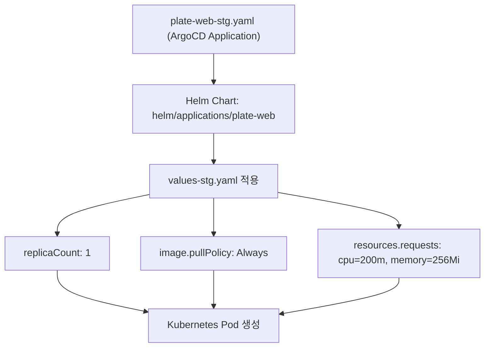
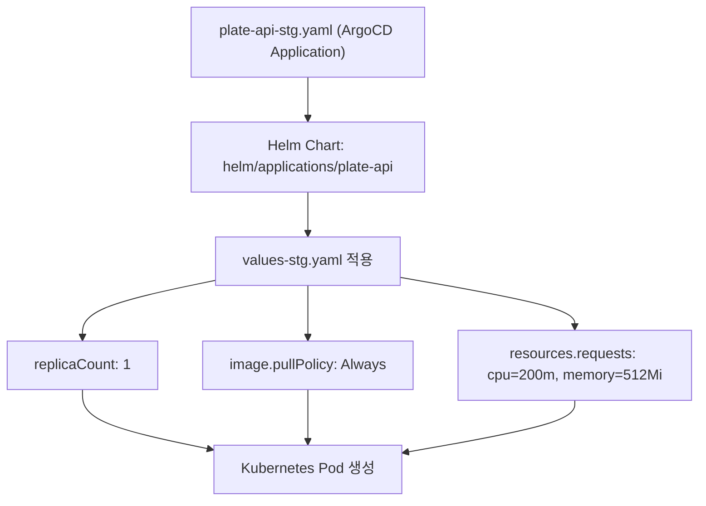
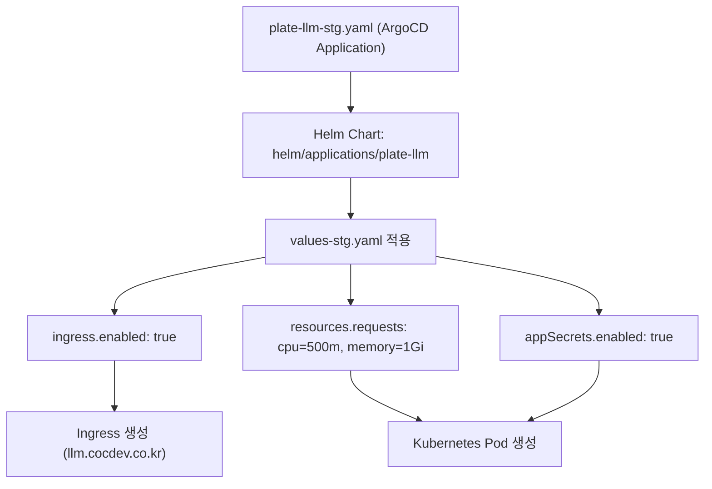
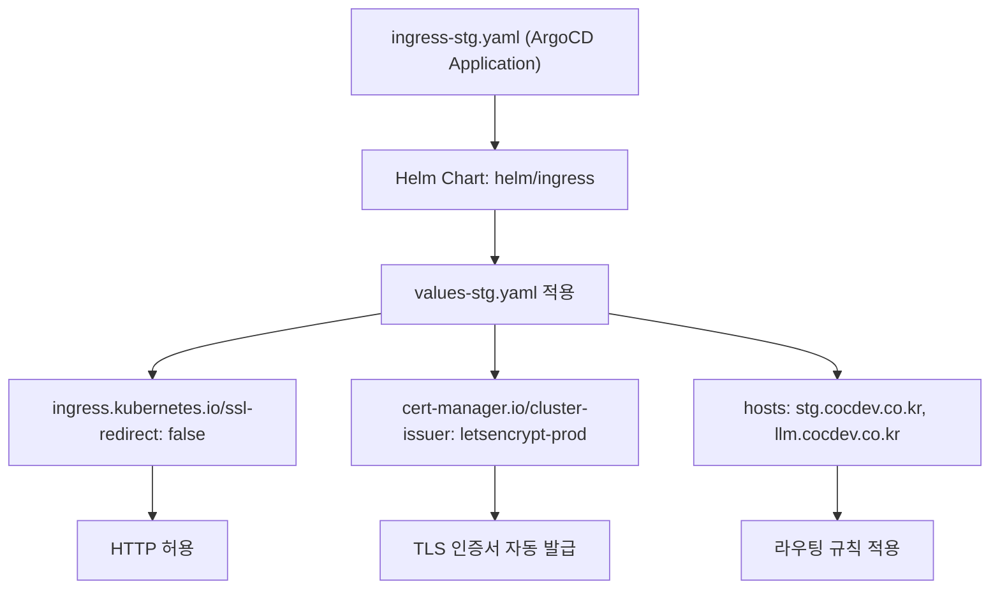
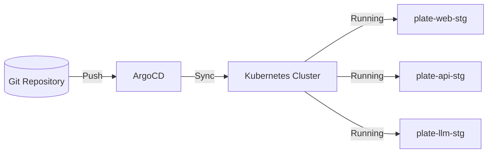
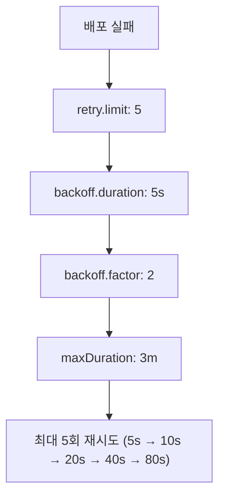

# 스테이징 환경 배포 (deploy-stg.sh)

<cite>
**이 문서에서 참조한 파일**
- [deploy-stg.sh](file://scripts/deploy-stg.sh)
- [plate-web-stg.yaml](file://environments/argocd/apps/plate-web-stg.yaml)
- [plate-api-stg.yaml](file://environments/argocd/apps/plate-api-stg.yaml)
- [plate-llm-stg.yaml](file://environments/argocd/apps/plate-llm-stg.yaml)
- [ingress-stg.yaml](file://environments/argocd/apps/ingress-stg.yaml)
- [values-stg.yaml](file://helm/applications/plate-web/values-stg.yaml)
- [values-stg.yaml](file://helm/applications/plate-api/values-stg.yaml)
- [values-stg.yaml](file://helm/applications/plate-llm/values-stg.yaml)
- [values-stg.yaml](file://helm/ingress/values-stg.yaml)
</cite>

## 목차
1. [소개](#소개)
2. [스크립트 개요](#스크립트-개요)
3. [주요 구성 요소](#주요-구성-요소)
4. [환경 설정 및 연동](#환경-설정-및-연동)
5. [리소스 제한 및 성능 설정](#리소스-제한-및-성능-설정)
6. [로깅 및 모니터링](#로깅-및-모니터링)
7. [배포 후 상태 확인 및 접근 방법](#배포-후-상태-확인-및-접근-방법)
8. [결론](#결론)

## 소개

이 문서는 `deploy-stg.sh` 스크립트를 통해 스테이징 환경에 `plate-web`, `plate-api`, `plate-llm`, `plate-cache` 등의 애플리케이션 서비스를 배포하는 프로세스를 상세히 설명합니다. 스크립트는 ArgoCD 기반의 GitOps 워크플로우와 연동되며, 각 애플리케이션의 환경별 설정 파일(`values-stg.yaml`)을 기반으로 리소스, 로깅, 모니터링 등을 구성합니다. 스테이징 환경은 개발 및 테스트 목적에 맞게 낮은 리소스 요청, 개발자 접근 허용, 자동 동기화 정책 등을 적용하여 운영 환경과 구분됩니다.

## 스크립트 개요

`deploy-stg.sh` 스크립트는 스테이징 환경에 애플리케이션을 배포하기 위한 Bash 스크립트입니다. 스크립트는 Helm을 사용하여 Kubernetes 클러스터에 애플리케이션을 설치하고, 사전 검사, 네임스페이스 생성, 배포, 상태 확인 등의 단계를 수행합니다. 또한, ArgoCD의 `Application` 리소스를 통해 Git 저장소의 변경 사항을 자동으로 클러스터에 반영하는 방식으로 동작합니다.

**Section sources**
- [deploy-stg.sh](file://scripts/deploy-stg.sh#L1-L173)

## 주요 구성 요소

### plate-web (프론트엔드 웹 애플리케이션)

`plate-web`은 Nginx 리버스 프록시를 기반으로 한 프론트엔드 서비스로, 스테이징 환경에서 사용자 인터페이스를 제공합니다. `values-stg.yaml` 파일을 통해 복제본 수, 이미지 풀 정책, 리소스 제한 등을 설정합니다.



**Diagram sources**
- [plate-web-stg.yaml](file://environments/argocd/apps/plate-web-stg.yaml#L1-L62)
- [values-stg.yaml](file://helm/applications/plate-web/values-stg.yaml#L1-L23)

### plate-api (백엔드 API 서버)

`plate-api`는 백엔드 서버로, Harbor 레지스트리에서 이미지를 가져와 배포됩니다. 스테이징 환경에서는 `pullPolicy: Always`를 사용하여 최신 빌드를 항상 가져오도록 설정합니다.



**Diagram sources**
- [plate-api-stg.yaml](file://environments/argocd/apps/plate-api-stg.yaml#L1-L62)
- [values-stg.yaml](file://helm/applications/plate-api/values-stg.yaml#L1-L19)

### plate-llm (LLM 서비스)

`plate-llm`은 LangChain 기반의 LLM 서비스로, 외부 도메인 `llm.cocdev.co.kr`을 통해 접근 가능합니다. Ingress를 통해 TLS 설정이 적용되며, 클러스터 레벨 시크릿에서 환경변수를 주입받습니다.



**Diagram sources**
- [plate-llm-stg.yaml](file://environments/argocd/apps/plate-llm-stg.yaml#L1-L64)
- [values-stg.yaml](file://helm/applications/plate-llm/values-stg.yaml#L1-L54)

### ingress-stg (인그레스 컨트롤러)

`ingress-stg`는 스테이징 환경의 인그레스 컨트롤러로, `stg.cocdev.co.kr` 및 `llm.cocdev.co.kr` 도메인을 통해 `plate-web`과 `plate-api` 서비스로 트래픽을 라우팅합니다. HTTP 리디렉션을 비활성화하여 테스트 편의성을 제공합니다.



**Diagram sources**
- [ingress-stg.yaml](file://environments/argocd/apps/ingress-stg.yaml#L1-L70)
- [values-stg.yaml](file://helm/ingress/values-stg.yaml#L1-L59)

## 환경 설정 및 연동

### ArgoCD Application 연동

각 애플리케이션은 ArgoCD의 `Application` 리소스를 통해 Git 저장소의 변경 사항을 자동으로 클러스터에 반영합니다. `targetRevision: main`을 통해 `main` 브랜치를 추적하며, `syncPolicy.automated`를 통해 자동 동기화를 수행합니다.



**Diagram sources**
- [plate-web-stg.yaml](file://environments/argocd/apps/plate-web-stg.yaml#L1-L62)
- [plate-api-stg.yaml](file://environments/argocd/apps/plate-api-stg.yaml#L1-L62)
- [plate-llm-stg.yaml](file://environments/argocd/apps/plate-llm-stg.yaml#L1-L64)

### values-stg.yaml 설정

환경별 설정 파일 `values-stg.yaml`은 각 Helm 차트의 기본값을 오버라이드하여 스테이징 환경에 맞는 구성으로 변경합니다. 주요 설정으로는 `pullPolicy: Always`, 낮은 리소스 요청, 개발자 접근 허용 등이 있습니다.

**Section sources**
- [values-stg.yaml](file://helm/applications/plate-web/values-stg.yaml#L1-L23)
- [values-stg.yaml](file://helm/applications/plate-api/values-stg.yaml#L1-L19)
- [values-stg.yaml](file://helm/applications/plate-llm/values-stg.yaml#L1-L54)
- [values-stg.yaml](file://helm/ingress/values-stg.yaml#L1-L59)

## 리소스 제한 및 성능 설정

스테이징 환경은 운영 환경보다 낮은 리소스를 요청하도록 설정되어 있습니다. 이는 비용 절감과 테스트 환경의 유연성을 제공합니다.

| 애플리케이션 | CPU 요청 | 메모리 요청 | CPU 제한 | 메모리 제한 |
|------------|---------|------------|---------|------------|
| plate-web | 200m | 256Mi | 500m | 512Mi |
| plate-api | 200m | 512Mi | 500m | 1Gi |
| plate-llm | 500m | 1Gi | 1000m | 2Gi |

**Section sources**
- [values-stg.yaml](file://helm/applications/plate-web/values-stg.yaml#L16-L21)
- [values-stg.yaml](file://helm/applications/plate-api/values-stg.yaml#L13-L19)
- [values-stg.yaml](file://helm/applications/plate-llm/values-stg.yaml#L36-L42)

## 로깅 및 모니터링

스테이징 환경은 개발 및 디버깅을 위해 상세한 로깅을 활성화합니다. `pullPolicy: Always`를 통해 최신 로그를 반영하며, ArgoCD의 `syncPolicy.retry`를 통해 배포 실패 시 재시도 정책을 적용합니다.



**Diagram sources**
- [plate-web-stg.yaml](file://environments/argocd/apps/plate-web-stg.yaml#L44-L49)
- [plate-api-stg.yaml](file://environments/argocd/apps/plate-api-stg.yaml#L44-L49)
- [plate-llm-stg.yaml](file://environments/argocd/apps/plate-llm-stg.yaml#L46-L51)

## 배포 후 상태 확인 및 접속 방법

배포 후에는 `deploy-stg.sh` 스크립트의 `status` 명령어를 사용하여 배포 상태를 확인할 수 있습니다. 또한, `show_access_info` 함수를 통해 접근 가능한 도메인 정보를 출력합니다.

```bash
./scripts/deploy-stg.sh status
```

접근 가능한 도메인:
- **웹 애플리케이션**: https://stg.cocdev.co.kr
- **관리자 인터페이스**: https://admin.stg.cocdev.co.kr
- **LLM 서비스**: https://llm.cocdev.co.kr

**Section sources**
- [deploy-stg.sh](file://scripts/deploy-stg.sh#L91-L131)

## 결론

`deploy-stg.sh` 스크립트는 스테이징 환경에 애플리케이션을 배포하는 핵심 도구로, ArgoCD와 Helm을 통해 GitOps 기반의 자동화된 배포 프로세스를 제공합니다. 환경별 설정 파일을 통해 리소스, 로깅, 모니터링 등을 유연하게 구성할 수 있으며, 개발 및 테스트에 최적화된 환경을 제공합니다. 배포 후 상태 확인 및 접근 방법을 통해 팀원들이 쉽게 서비스에 접근하고 검증할 수 있습니다.