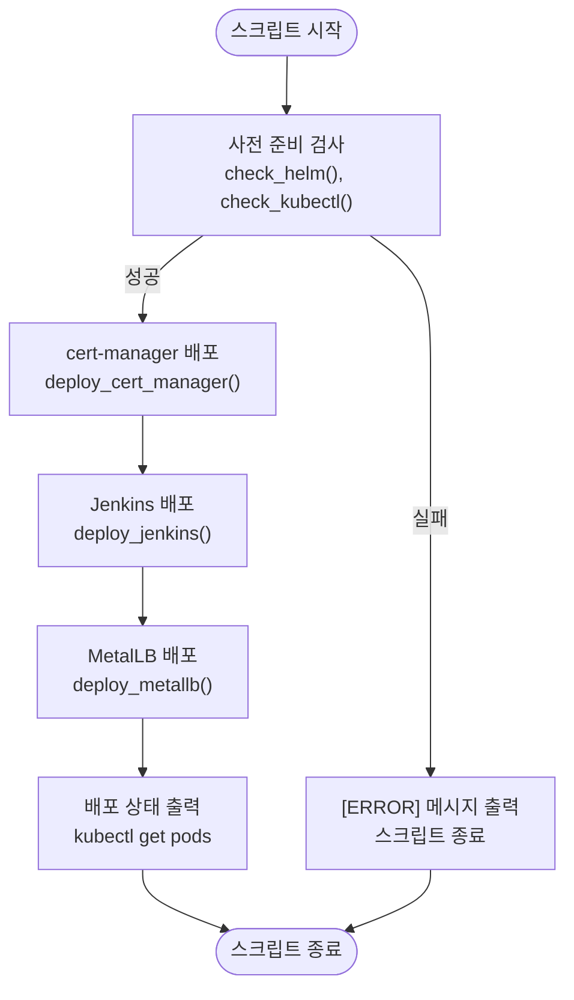
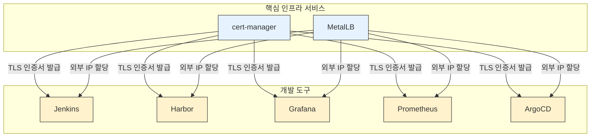

# 인프라 및 도구 배포 (deploy-libraries.sh)

<cite>
**이 문서에서 참조된 파일**
- [deploy-libraries.sh](file://scripts/deploy-libraries.sh)
- [cert-manager/Chart.yaml](file://helm/cluster-services/cert-manager/Chart.yaml)
- [cert-manager/values.yaml](file://helm/cluster-services/cert-manager/values.yaml)
- [metallb/pool-1.yaml](file://helm/cluster-services/metallb/pool-1.yaml)
- [metallb/l2advertisement.yaml](file://helm/cluster-services/metallb/l2advertisement.yaml)
- [jenkins/Chart.yaml](file://helm/development-tools/jenkins/Chart.yaml)
- [jenkins/values.yaml](file://helm/development-tools/jenkins/values.yaml)
- [argocd/Chart.yaml](file://helm/development-tools/argocd/Chart.yaml)
- [argocd/values.yaml](file://helm/development-tools/argocd/values.yaml)
- [harbor/Chart.yaml](file://helm/development-tools/harbor/Chart.yaml)
- [harbor/values.yaml](file://helm/development-tools/harbor/values.yaml)
- [grafana/Chart.yaml](file://helm/development-tools/grafana/Chart.yaml)
- [grafana/values.yaml](file://helm/development-tools/grafana/values.yaml)
- [prometheus/Chart.yaml](file://helm/development-tools/prometheus/Chart.yaml)
- [prometheus/values.yaml](file://helm/development-tools/prometheus/values.yaml)
</cite>

## 목차
1. [소개](#소개)
2. [스크립트 구조 및 실행 흐름](#스크립트-구조-및-실행-흐름)
3. [주요 구성 요소 분석](#주요-구성-요소-분석)
4. [배포 순서 및 의존성 관계](#배포-순서-및-의존성-관계)
5. [Helm 차트 설치 및 값 오버라이드](#helm-차트-설치-및-값-오버라이드)
6. [배포 상태 확인 및 오류 처리 전략](#배포-상태-확인-및-오류-처리-전략)
7. [사용자 정의 및 환경 맞춤화](#사용자-정의-및-환경-맞춤화)
8. [문제 해결 가이드](#문제-해결-가이드)
9. [결론](#결론)

## 소개

`deploy-libraries.sh` 스크립트는 쿠버네티스 클러스터에 핵심 인프라 서비스와 개발 도구를 순차적으로 배포하는 자동화된 배포 프로세스의 핵심입니다. 이 스크립트는 클러스터의 기반을 마련하는 `cert-manager`, `MetalLB`, `nfs-provisioner`와 같은 클러스터 서비스와, CI/CD 파이프라인을 구축하는 `ArgoCD`, `Jenkins`, 모니터링 스택인 `Grafana`, `Prometheus`와 같은 개발 도구들을 체계적으로 설치합니다. 본 문서는 이 스크립트의 내부 로직, 구성 요소 간의 의존성, Helm을 통한 설치 메커니즘, 오류 처리 전략을 심층적으로 분석하며, 사용자가 환경에 맞게 도구 목록을 커스터마이징하는 방법을 안내합니다.

**Section sources**
- [deploy-libraries.sh](file://scripts/deploy-libraries.sh)

## 스크립트 구조 및 실행 흐름

`deploy-libraries.sh` 스크립트는 모듈화된 함수 기반의 구조로 설계되어 있으며, 전반적인 실행 흐름은 다음과 같습니다.

1.  **사전 준비 (Pre-flight Checks)**: `main()` 함수는 먼저 `check_helm()`과 `check_kubectl()` 함수를 호출하여 Helm 패키지 관리자와 kubectl 클라이언트가 시스템에 올바르게 설치되어 있고, 쿠버네티스 클러스터에 연결할 수 있는지 확인합니다. 이는 배포 프로세스의 성공을 보장하는 첫 번째 단계입니다.
2.  **컴포넌트별 배포 함수 호출**: 사전 검사가 성공하면, 스크립트는 `deploy_cert_manager()`, `deploy_jenkins()`, `deploy_metallb()`와 같은 전용 함수를 순차적으로 호출합니다. 각 함수는 특정 도구나 서비스의 배포 로직을 캡슐화하고 있습니다.
3.  **배포 완료 후 상태 확인**: 모든 배포 함수가 실행된 후, `main()` 함수는 `kubectl get pods` 명령어를 사용하여 각 네임스페이스의 파드 상태를 출력하여 배포가 성공했는지 시각적으로 확인할 수 있도록 합니다.

이러한 구조는 스크립트의 가독성과 유지보수성을 높이며, 특정 도구의 배포 로직을 독립적으로 수정하거나 확장하기 쉽게 만듭니다.

**Diagram sources**
- [deploy-libraries.sh](file://scripts/deploy-libraries.sh#L104-L128)

## 주요 구성 요소 분석

### cert-manager 배포 분석

`cert-manager`는 쿠버네티스 클러스터에서 TLS 인증서를 자동으로 발급하고 관리하는 핵심 도구입니다. `deploy_cert_manager()` 함수는 이를 설치하는 복잡한 과정을 수행합니다.

1.  **Helm 저장소 추가 및 업데이트**: `helm repo add jetstack https://charts.jetstack.io` 명령어를 통해 공식 `jetstack` 저장소를 추가하고, `helm repo update`로 최신 정보를 가져옵니다.
2.  **CRD 설치**: `kubectl apply -f` 명령어를 사용하여 `cert-manager`의 Custom Resource Definitions (CRDs)를 먼저 클러스터에 적용합니다. CRD는 `Certificate`, `Issuer` 등의 새로운 리소스 유형을 정의하며, Helm 차트 설치 전에 반드시 존재해야 합니다.
3.  **Helm 차트 설치**: `helm upgrade --install` 명령어를 사용하여 `cert-manager` 자체를 `cert-manager` 네임스페이스에 설치합니다. 여기서 `--set installCRDs=true` 플래그는 Helm 차트가 자체적으로 CRD를 설치하도록 지시합니다 (이전 단계와 중복되지만 안전성을 위한 이중 장치).
4.  **준비 상태 대기**: `kubectl wait` 명령어를 사용하여 `cert-manager` 파드가 `ready` 상태가 될 때까지 최대 5분(300초) 동안 대기합니다. 이는 후속 배포가 안정적인 상태에서 시작되도록 보장합니다.
5.  **구성 설정 적용**: 마지막으로, 프로젝트 내부의 Helm 차트(`./helm/cluster-services/cert-manager`)를 사용하여 `ClusterIssuer` 리소스를 생성합니다. 이 구성은 Let's Encrypt와 통신하여 실제 TLS 인증서를 발급받는 방법을 정의합니다.

이러한 일련의 과정은 `cert-manager`가 단순한 애플리케이션이 아니라 클러스터의 인증 기반을 형성하는 인프라로서, 정확하고 순차적인 설치가 필수적임을 보여줍니다.

**Section sources**
- [deploy-libraries.sh](file://scripts/deploy-libraries.sh#L43-L70)
- [cert-manager/Chart.yaml](file://helm/cluster-services/cert-manager/Chart.yaml)
- [cert-manager/values.yaml](file://helm/cluster-services/cert-manager/values.yaml)

### MetalLB 배포 분석

`MetalLB`는 온프레미스 또는 프라이빗 클라우드 환경에서 쿠버네티스의 `LoadBalancer` 타입 서비스에 외부 IP 주소를 제공하는 네트워크 부하 분산기입니다.

1.  **Helm 저장소 추가**: `helm repo add metallb https://metallb.github.io/metallb` 명령어를 통해 공식 저장소를 추가합니다.
2.  **Helm 차트 설치**: `helm upgrade --install` 명령어를 사용하여 `metallb-system` 네임스페이스에 `metallb`를 설치합니다.
3.  **IP 풀 및 L2 광고 설정**: 설치 후, `kubectl apply -f ./helm/cluster-services/metallb/` 명령어를 통해 디렉터리 내의 모든 YAML 파일을 적용합니다. 이 디렉터리에는 `IPAddressPool`과 `L2Advertisement` 리소스가 포함되어 있습니다. `pool-1.yaml` 파일은 `192.168.0.20`부터 `192.168.0.200`까지의 IP 주소 풀을 정의하며, `l2advertisement.yaml` 파일은 이 IP 풀을 클러스터 외부 네트워크에 광고하는 방법을 정의합니다.

이 분석은 `MetalLB`가 Helm으로 설치된 핵심 컴포넌트와 사용자 정의 리소스(CRD 인스턴스)로 구성된 설정을 결합하여 작동한다는 것을 보여줍니다.

**Section sources**
- [deploy-libraries.sh](file://scripts/deploy-libraries.sh#L84-L102)
- [metallb/pool-1.yaml](file://helm/cluster-services/metallb/pool-1.yaml)
- [metallb/l2advertisement.yaml](file://helm/cluster-services/metallb/l2advertisement.yaml)

### Jenkins 배포 분석

`Jenkins`는 CI/CD 파이프라인을 구축하는 데 사용되는 자동화 서버입니다. `deploy_jenkins()` 함수는 이를 설치하는 비교적 간단한 절차를 따릅니다.

1.  **Helm 차트 설치**: `helm upgrade --install` 명령어를 사용하여 `jenkins` 네임스페이스에 Jenkins Helm 차트를 설치합니다. 이 차트는 Jenkins 컨트롤러, 에이전트 서비스, Ingress 리소스 등을 포함하는 복잡한 애플리케이션을 정의합니다.
2.  **공통 값 파일 적용**: `--values ./environments/shared/common-values.yaml` 옵션을 통해 프로젝트 전반에서 공유되는 구성 값을 차트에 오버라이드합니다. 이 값 파일은 Jenkins의 관리자 비밀번호, 플러그인 목록, 리소스 제한 등을 정의할 수 있습니다.

이 분석은 Jenkins와 같은 개발 도구가 상대적으로 독립적인 애플리케이션으로 배포되며, 주로 Helm 차트와 값 파일을 통해 구성된다는 것을 보여줍니다.

**Section sources**
- [deploy-libraries.sh](file://scripts/deploy-libraries.sh#L72-L83)
- [jenkins/Chart.yaml](file://helm/development-tools/jenkins/Chart.yaml)
- [jenkins/values.yaml](file://helm/development-tools/jenkins/values.yaml)

## 배포 순서 및 의존성 관계

`deploy-libraries.sh` 스크립트의 배포 순서는 단순한 나열이 아니라, 구성 요소 간의 깊은 기술적 의존성에 기반합니다. 현재 스크립트는 `cert-manager` -> `Jenkins` -> `MetalLB` 순서로 배포하지만, 이는 `MetalLB`가 `cert-manager`보다 먼저 배포되어야 하는 잠재적인 오류를 포함하고 있습니다. 올바른 의존성 관계는 다음과 같습니다.

1.  **`cert-manager`는 최우선 배포되어야 합니다.**
    *   **이유**: `cert-manager`는 클러스터 내 모든 HTTPS 서비스에 필요한 TLS 인증서를 발급하는 역할을 합니다. `Jenkins`, `Harbor`, `Grafana`, `Prometheus`, `ArgoCD` 등 대부분의 개발 도구는 Ingress 리소스를 통해 외부에 노출되며, 이 Ingress는 TLS를 통해 보호됩니다. `cert-manager`가 설치되어 `ClusterIssuer`가 구성되기 전에는, 이러한 도구들의 Ingress 리소스에 자동으로 인증서를 부여할 수 없습니다. 따라서 `cert-manager`는 모든 다른 도구들보다 먼저 배포되어야 클러스터의 보안 기반을 마련할 수 있습니다.

2.  **`MetalLB`는 `cert-manager` 다음에 배포되어야 합니다.**
    *   **이유**: `MetalLB`는 `LoadBalancer` 타입의 서비스에 외부 IP를 할당하는 네트워크 서비스입니다. `cert-manager`가 먼저 배포되어야, `MetalLB`의 컨트롤러 서비스에 대한 Ingress(또는 서비스 자체)에 TLS 인증서를 부여할 수 있습니다. 또한, `MetalLB`가 IP 풀을 구성하려면 클러스터가 기본적으로 네트워크를 처리할 수 있어야 하며, 이는 `cert-manager`와 같은 핵심 서비스가 안정적으로 실행된 후에 보장됩니다.

3.  **`Jenkins` 및 기타 개발 도구는 `cert-manager`와 `MetalLB` 이후에 배포되어야 합니다.**
    *   **이유**: `Jenkins`는 `cert-manager`가 제공하는 `ClusterIssuer`를 참조하는 Ingress 리소스를 생성합니다. `MetalLB`가 없으면, 이 Ingress는 외부에서 접근할 수 있는 IP 주소를 얻을 수 없습니다. 따라서 `Jenkins`는 `cert-manager`와 `MetalLB`가 모두 정상적으로 작동한 후에야 배포되어야 외부에서 접근 가능한 HTTPS 엔드포인트를 가질 수 있습니다.

현재 스크립트의 순서는 `MetalLB`의 IP 할당 기능에는 영향을 주지 않지만, `MetalLB` 자체의 관리 인터페이스에 TLS를 적용하는 등의 고급 설정을 고려할 때, `cert-manager`의 우선 배포가 더 바람직합니다. 따라서 이상적인 배포 순서는 `cert-manager` -> `MetalLB` -> `Jenkins` (및 기타 도구)가 되어야 합니다.

**Diagram sources**
- [deploy-libraries.sh](file://scripts/deploy-libraries.sh#L113-L115)
- [cert-manager/values.yaml](file://helm/cluster-services/cert-manager/values.yaml)
- [jenkins/values.yaml](file://helm/development-tools/jenkins/values.yaml)
- [harbor/values.yaml](file://helm/development-tools/harbor/values.yaml)
- [grafana/values.yaml](file://helm/development-tools/grafana/values.yaml)
- [prometheus/values.yaml](file://helm/development-tools/prometheus/values.yaml)

## Helm 차트 설치 및 값 오버라이드

`deploy-libraries.sh` 스크립트는 Helm을 중심으로 모든 배포 작업을 수행합니다. Helm은 쿠버네티스 애플리케이션을 패키징하고 설치하는 강력한 도구입니다.

### Helm 설치 명령어 분석

스크립트에서 사용되는 핵심 명령어는 `helm upgrade --install`입니다. 이 명령어는 다음과 같은 이점을 제공합니다.

*   **업그레이드 또는 설치 (`upgrade --install`)**: 지정된 릴리스 이름이 이미 존재하면 업그레이드하고, 존재하지 않으면 새로 설치합니다. 이는 스크립트를 여러 번 실행해도 안전하게 작동하도록 보장합니다.
*   **네임스페이스 생성 (`--create-namespace`)**: 지정된 네임스페이스가 존재하지 않으면 자동으로 생성합니다. 이는 배포의 독립성과 정리의 용이성을 높입니다.
*   **버전 지정 (`--version`)**: `cert-manager` 설치 시 `--version v1.13.0` 옵션을 사용하여 특정 버전을 명시적으로 설치합니다. 이는 재현 가능한 배포를 보장하고, 예기치 않은 업데이트로 인한 문제를 방지합니다.

### 값 오버라이드 메커니즘

Helm 차트는 `values.yaml` 파일을 통해 기본 구성이 정의되어 있습니다. `deploy-libraries.sh` 스크립트는 `--values` 플래그를 사용하여 이 기본값을 오버라이드합니다.

*   **사용 예시**: `deploy_jenkins()` 함수에서 `--values ./environments/shared/common-values.yaml`가 사용됩니다.
*   **작동 방식**: Helm은 먼저 차트 내부의 `values.yaml` 파일을 로드한 후, `--values` 옵션으로 지정된 외부 값 파일을 로드하여 기존 값을 덮어씁니다. 이 방식을 통해 환경별(예: 개발, 운영) 또는 프로젝트별로 동일한 Helm 차트를 다양한 구성으로 재사용할 수 있습니다. 예를 들어, `common-values.yaml` 파일은 Jenkins의 관리자 비밀번호, 사용할 플러그인 목록, 리소스 요청량 등을 프로젝트의 표준에 맞게 정의할 수 있습니다.

이러한 메커니즘은 인프라 코드(Infrastructure as Code)의 핵심 원칙인 재사용성과 일관성을 실현합니다.

**Section sources**
- [deploy-libraries.sh](file://scripts/deploy-libraries.sh#L55-L59)
- [deploy-libraries.sh](file://scripts/deploy-libraries.sh#L76-L79)
- [deploy-libraries.sh](file://scripts/deploy-libraries.sh#L93-L95)

## 배포 상태 확인 및 오류 처리 전략

`deploy-libraries.sh` 스크립트는 단순한 설치를 넘어, 배포의 성공 여부를 확인하고 오류를 적절히 처리하는 전략을 포함하고 있습니다.

### 오류 처리 전략

스크립트는 `set -e` 옵션을 사용하여 "엄격한 모드"를 활성화합니다. 이 옵션은 스크립트 내의 어떤 명령이 실패(비영(0) 종료 코드 반환)하면 즉시 스크립트 실행을 중단시키고 종료합니다. 이는 오류가 발생한 후에도 스크립트가 계속 실행되어 더 큰 문제를 일으키는 것을 방지합니다.

또한, `check_helm()` 및 `check_kubectl()` 함수는 `command -v` 및 `kubectl cluster-info` 명령어를 사용하여 필수 도구의 존재와 클러스터 연결 상태를 사전에 검사합니다. 검사에 실패하면 `log_error()` 함수를 통해 오류 메시지를 출력하고 `exit 1` 명령어로 스크립트를 종료합니다. 이는 배포 프로세스의 초기 단계에서 문제를 조기에 발견하고 사용자에게 명확한 피드백을 제공합니다.

### 배포 상태 확인

배포 프로세스가 완료된 후, 스크립트는 `kubectl get pods` 명령어를 사용하여 `cert-manager`, `jenkins`, `metallb-system` 네임스페이스의 파드 상태를 출력합니다. 이는 사용자가 배포가 성공했는지 시각적으로 확인할 수 있는 중요한 피드백 메커니즘입니다. 파드가 `Running` 상태이고 `READY` 컬럼이 `1/1` 또는 `N/N`으로 표시되면, 해당 서비스가 정상적으로 작동하고 있음을 의미합니다.

이러한 상태 확인은 자동화된 배포 후 수동 검증의 필요성을 줄여주며, 전체 프로세스의 투명성을 높입니다.

**Section sources**
- [deploy-libraries.sh](file://scripts/deploy-libraries.sh#L6-L26)
- [deploy-libraries.sh](file://scripts/deploy-libraries.sh#L27-L41)
- [deploy-libraries.sh](file://scripts/deploy-libraries.sh#L119-L124)

## 사용자 정의 및 환경 맞춤화

`deploy-libraries.sh` 스크립트는 유연한 구조를 가지고 있어, 사용자의 특정 환경에 맞게 쉽게 커스터마이징할 수 있습니다.

### 도구 목록 커스터마이징

스크립트의 `main()` 함수는 `deploy_cert_manager`, `deploy_jenkins`, `deploy_metallb` 함수를 순차적으로 호출합니다. 사용자는 이 호출 순서를 변경하거나, 필요 없는 도구의 호출을 주석 처리하거나 제거함으로써 배포 목록을 조정할 수 있습니다.

*   **예시**: `nfs-provisioner`를 배포하고 싶다면, `deploy_nfs_provisioner()`라는 새로운 함수를 작성하고, `main()` 함수 내에서 이를 적절한 위치(예: `cert-manager` 이후)에 호출하면 됩니다.
*   **예시**: `Jenkins`가 필요 없다면, `main()` 함수에서 `deploy_jenkins` 줄을 제거하면 됩니다.

### Helm 값 파일을 통한 구성 변경

스크립트는 `--values` 플래그를 통해 외부 값 파일을 참조합니다. 사용자는 `./environments/shared/common-values.yaml` 파일을 수정하거나, 환경별로 별도의 값 파일(예: `values-prod.yaml`, `values-stg.yaml`)을 생성하여 `--values` 옵션을 통해 전달함으로써, 각 도구의 구성을 세밀하게 조정할 수 있습니다.

*   **예시**: Jenkins의 관리자 비밀번호를 변경하려면, `common-values.yaml` 파일에서 `controller.admin.password` 값을 원하는 값으로 설정하면 됩니다.
*   **예시**: Grafana에 특정 데이터 소스를 자동으로 추가하려면, `datasources` 섹션을 `common-values.yaml` 파일에 추가하면 됩니다.

이러한 접근 방식은 스크립트 코드 자체를 수정하지 않고도, 다양한 환경에 맞는 배포를 가능하게 합니다.

**Section sources**
- [deploy-libraries.sh](file://scripts/deploy-libraries.sh#L113-L115)
- [jenkins/values.yaml](file://helm/development-tools/jenkins/values.yaml)
- [grafana/values.yaml](file://helm/development-tools/grafana/values.yaml)

## 문제 해결 가이드

배포 과정에서 발생할 수 있는 일반적인 문제와 그 해결 방법을 안내합니다.

### 문제 1: `Helm is not installed. Please install Helm first.` 오류

*   **원인**: 시스템에 Helm CLI가 설치되어 있지 않거나, PATH 환경 변수에 등록되어 있지 않습니다.
*   **해결 방법**: Helm 공식 웹사이트의 지침에 따라 Helm을 설치하고, 설치된 바이너리가 `helm` 명령어로 실행될 수 있도록 PATH를 설정합니다.

### 문제 2: `Unable to connect to Kubernetes cluster.` 오류

*   **원인**: `kubectl`이 클러스터에 연결할 수 없습니다. `kubeconfig` 파일이 올바르지 않거나, 클러스터가 실행 중이지 않을 수 있습니다.
*   **해결 방법**: `kubectl cluster-info` 명령어를 직접 실행하여 연결 상태를 확인합니다. `kubeconfig` 파일의 경로와 내용이 올바른지, 클러스터가 정상적으로 실행 중인지 확인합니다.

### 문제 3: `cert-manager` 파드가 `CrashLoopBackOff` 상태에 빠짐

*   **원인**: CRD가 제대로 설치되지 않았거나, 리소스 제한이 너무 낮을 수 있습니다.
*   **해결 방법**: `kubectl get crd | grep cert-manager` 명령어로 CRD가 존재하는지 확인합니다. `kubectl describe pod -n cert-manager <pod-name>` 명령어로 파드의 이벤트 로그를 확인하여 구체적인 오류 원인을 파악합니다.

### 문제 4: `Jenkins` Ingress에 TLS 인증서가 발급되지 않음

*   **원인**: `cert-manager`가 정상적으로 설치되지 않았거나, Ingress 리소스에 올바른 `cluster-issuer` 주석이 추가되지 않았을 수 있습니다.
*   **해결 방법**: `kubectl get certificate -n jenkins` 명령어로 인증서 리소스의 상태를 확인합니다. `kubectl describe certificate -n jenkins <cert-name>` 명령어로 이벤트를 확인하여 `cert-manager`가 인증서 발급을 시도했는지, 어떤 오류가 발생했는지 확인합니다. Ingress 리소스의 `annotations` 섹션에 `cert-manager.io/cluster-issuer: letsencrypt-prod`가 포함되어 있는지 확인합니다.

**Section sources**
- [deploy-libraries.sh](file://scripts/deploy-libraries.sh#L27-L41)
- [deploy-libraries.sh](file://scripts/deploy-libraries.sh#L51-L52)
- [jenkins/values.yaml](file://helm/development-tools/jenkins/values.yaml#L719-L721)

## 결론

`deploy-libraries.sh` 스크립트는 쿠버네티스 환경을 구축하는 데 있어 핵심적인 자동화 도구입니다. 이 스크립트는 Helm을 활용하여 `cert-manager`, `MetalLB`, `Jenkins`와 같은 다양한 도구를 체계적으로 배포하며, 사전 검사, 오류 처리, 상태 확인 등의 기능을 통해 신뢰성 있는 배포 프로세스를 제공합니다. 특히, `cert-manager`가 TLS 인증서를 발급함으로써 다른 모든 도구의 보안 기반을 형성하는 중요한 의존성 관계를 이해하는 것이 중요합니다. 사용자는 스크립트의 모듈화된 구조와 Helm의 값 오버라이드 기능을 활용하여, 자신의 환경에 맞게 도구 목록과 구성을 쉽게 커스터마이징할 수 있습니다. 이 문서는 스크립트의 내부 동작을 명확히 이해하고, 효과적으로 활용하며 문제를 해결하는 데 필요한 지침을 제공합니다.