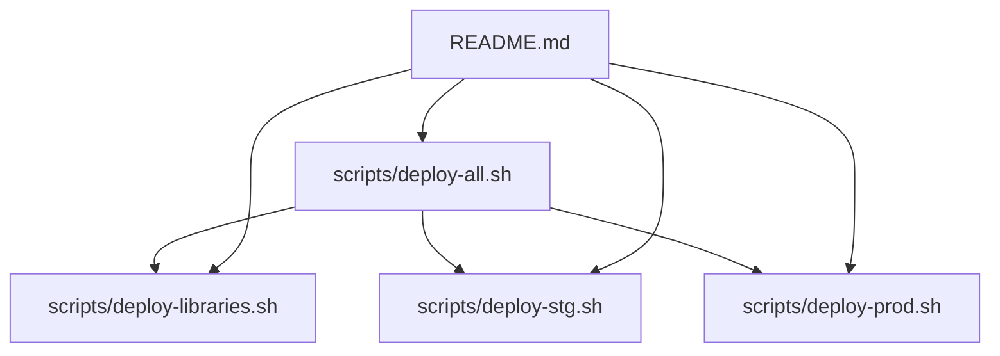
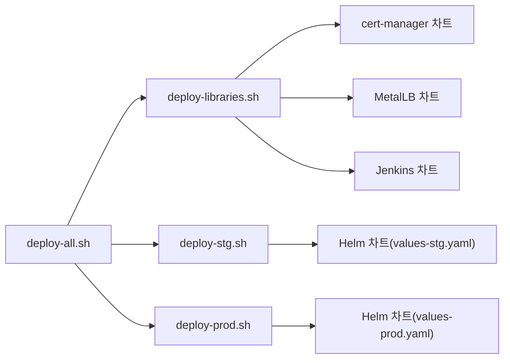

# 전체 배포 오케스트레이션 (deploy-all.sh)

<cite>
**문서에서 참조하는 파일 목록**
- [deploy-all.sh](file://scripts/deploy-all.sh)
- [deploy-libraries.sh](file://scripts/deploy-libraries.sh)
- [deploy-stg.sh](file://scripts/deploy-stg.sh)
- [deploy-prod.sh](file://scripts/deploy-prod.sh)
- [README.md](file://README.md)
</cite>

## 목차
1. [소개](#소개)
2. [프로젝트 구조](#프로젝트-구조)
3. [핵심 컴포넌트](#핵심-컴포넌트)
4. [아키텍처 개요](#아키텍처-개요)
5. [상세 컴포넌트 분석](#상세-컴포넌트-분석)
6. [의존성 분석](#의존성-분석)
7. [성능 고려사항](#성능-고려사항)
8. [장애 대응 가이드](#장애-대응-가이드)
9. [결론](#결론)
10. [부록](#부록)

## 소개
이 문서는 deploy-all.sh 스크립트가 전체 배포 오케스트레이션을 수행하는 방식을 체계적으로 설명합니다. 이 스크립트는 라이브러리(인프라/도구) 배포와 애플리케이션 배포를 조율하며, 환경(스테이징/프로덕션)에 따라 다른 배포 스크립트(deploy-libraries.sh, deploy-stg.sh, deploy-prod.sh)를 호출합니다. 또한, 사용자 입력 검증, 건너뛰기/전용 옵션, 건강 상태 점검, 프로덕션 롤백 지원 등의 오류 처리 및 상태 확인 메커니즘을 포함합니다.

## 프로젝트 구조
- 배포 스크립트는 scripts/ 디렉터리에 위치하며, deploy-all.sh가 메인 오케스트레이터입니다.
- deploy-all.sh는 deploy-libraries.sh, deploy-stg.sh, deploy-prod.sh를 조율합니다.
- README.md는 배포 흐름, 환경별 설정, 안전 장치 등을 상세히 설명합니다.



**도표 소스**
- [deploy-all.sh](file://scripts/deploy-all.sh#L1-L279)
- [deploy-libraries.sh](file://scripts/deploy-libraries.sh#L1-L128)
- [deploy-stg.sh](file://scripts/deploy-stg.sh#L1-L173)
- [deploy-prod.sh](file://scripts/deploy-prod.sh#L1-L299)
- [README.md](file://README.md#L111-L154)

**섹션 소스**
- [deploy-all.sh](file://scripts/deploy-all.sh#L1-L279)
- [README.md](file://README.md#L111-L154)

## 핵심 컴포넌트
- deploy-all.sh: 메인 오케스트레이터. 환경 검증, 옵션 파싱, 라이브러리/애플리케이션 배포, 건강 상태 점검, 최종 요약을 담당합니다.
- deploy-libraries.sh: 인프라(예: cert-manager, MetalLB)와 개발 도구(예: Jenkins) 배포를 담당합니다.
- deploy-stg.sh: 스테이징 환경에 애플리케이션 배포를 담당하며, 검증, 상태 표시, 접근 정보 표시 기능이 있습니다.
- deploy-prod.sh: 프로덕션 환경 배포를 담당하며, 사용자 확인, 백업, 롤백, 건강 검증, 접근 정보 표시 기능이 있습니다.

**섹션 소스**
- [deploy-all.sh](file://scripts/deploy-all.sh#L118-L154)
- [deploy-libraries.sh](file://scripts/deploy-libraries.sh#L43-L102)
- [deploy-stg.sh](file://scripts/deploy-stg.sh#L55-L113)
- [deploy-prod.sh](file://scripts/deploy-prod.sh#L43-L173)

## 아키텍처 개요
deploy-all.sh는 다음과 같은 흐름으로 작동합니다:
- 인자 파싱: 환경(staging/production), 옵션(--skip-libraries, --libraries-only, --dry-run, --help)을 처리합니다.
- 환경 검증: 입력된 환경을 정규화하고, 잘못된 경우 즉시 종료합니다.
- 배포 계획 표시: 현재 실행될 계획(라이브러리 배포 여부, 애플리케이션 배포 여부, 드라이런 여부)을 출력합니다.
- 프로덕션 배포 시 확인: 사용자에게 프로덕션 배포를 다시 한 번 확인하도록 요청합니다.
- 라이브러리 배포: deploy-libraries.sh를 실행하고, 라이브러리 전용 배포 시에는 이후 단계를 건너뜁니다.
- 애플리케이션 배포: 환경에 따라 deploy-stg.sh 또는 deploy-prod.sh를 실행합니다.
- 건강 상태 점검: kubectl 연결 상태, cert-manager, 애플리케이션 Pod 상태를 점검합니다.
- 최종 요약: 성공 여부, 환경, 모드(DRY RUN) 등을 요약합니다.

```mermaid
sequenceDiagram
participant U as "사용자"
participant All as "deploy-all.sh"
participant Lib as "deploy-libraries.sh"
participant Stg as "deploy-stg.sh"
participant Prod as "deploy-prod.sh"
U->>All : "./scripts/deploy-all.sh [environment] [options]"
All->>All : parse_arguments()
All->>All : validate_environment()
All->>All : show_deployment_plan()
alt production and not dry-run
All->>U : confirm_production_deploy()
U-->>All : "yes" or cancel
end
opt libraries_only
All->>Lib : 실행
Lib-->>All : 완료
All->>All : show_final_status()
else skip_libraries
All->>All : deploy_application()
else deploy_libraries
All->>Lib : 실행
Lib-->>All : 완료
All->>All : sleep(30)
All->>All : deploy_application()
end
opt not dry_run
All->>All : perform_health_check()
end
All->>All : show_final_status()
```

**도표 소스**
- [deploy-all.sh](file://scripts/deploy-all.sh#L217-L279)
- [deploy-libraries.sh](file://scripts/deploy-libraries.sh#L104-L128)
- [deploy-stg.sh](file://scripts/deploy-stg.sh#L133-L151)
- [deploy-prod.sh](file://scripts/deploy-prod.sh#L242-L267)

**섹션 소스**
- [deploy-all.sh](file://scripts/deploy-all.sh#L217-L279)

## 상세 컴포넌트 분석

### deploy-all.sh 분석
- 주요 함수들:
  - parse_arguments(): 옵션 파싱(--skip-libraries, --libraries-only, --dry-run, --help)을 처리하고, 알 수 없는 옵션은 오류로 종료합니다.
  - validate_environment(): 환경을 staging/stg/stage 또는 production/prod로 정규화하고, 잘못된 경우 오류로 종료합니다.
  - deploy_libraries(): deploy-libraries.sh 존재 여부를 검사하고 실행합니다.
  - deploy_application(): 환경에 따라 deploy-stg.sh 또는 deploy-prod.sh를 실행합니다.
  - perform_health_check(): kubectl 연결 상태 확인, cert-manager 상태 확인, 애플리케이션 Pod 상태 확인을 수행합니다.
  - show_final_status(): 배포 요약(환경, 라이브러리/애플리케이션 배포 여부, DRY RUN 여부)을 출력합니다.
  - main(): 전체 배포 흐름을 제어합니다.

- 오류 처리 및 상태 확인:
  - set -e를 사용하여 명령 실패 시 즉시 종료합니다.
  - 각 하위 스크립트 존재 여부 검사 후 실행합니다.
  - 프로덕션 배포 시 사용자 확인 프롬프트를 통한 안전 장치를 제공합니다.
  - 건강 상태 점검에서는 cert-manager 및 애플리케이션 Pod 상태를 점검합니다.

- 고급 패턴:
  - --dry-run: 프로덕션 배포 시 dry-run 모드를 활성화하여 실제 변경 없이 배포 계획을 검증합니다.
  - --skip-libraries: 라이브러리 배포를 건너뛰고 애플리케이션만 배포합니다.
  - --libraries-only: 라이브러리만 배포하고 이후 단계를 건너뜁니다.

**섹션 소스**
- [deploy-all.sh](file://scripts/deploy-all.sh#L45-L97)
- [deploy-all.sh](file://scripts/deploy-all.sh#L100-L116)
- [deploy-all.sh](file://scripts/deploy-all.sh#L118-L154)
- [deploy-all.sh](file://scripts/deploy-all.sh#L183-L215)
- [deploy-all.sh](file://scripts/deploy-all.sh#L217-L279)

### deploy-libraries.sh 분석
- 주요 함수들:
  - check_helm(), check_kubectl(): 사전 검증(헬름 설치 여부, kubectl 연결 상태)을 수행합니다.
  - deploy_cert_manager(): Jetstack 저장소 추가, CRDs 설치, cert-manager 설치 및 준비 대기, 설정 적용을 수행합니다.
  - deploy_jenkins(): Jenkins 차트를 설치합니다.
  - deploy_metallb(): MetalLB 저장소 추가, 설치, 설정 적용을 수행합니다.
  - main(): 사전 검증 후 라이브러리 배포를 순차적으로 실행하고, 배포 상태를 표시합니다.

- 오류 처리:
  - 사전 검증 실패 시 오류로 종료합니다.
  - cert-manager 설치 시 준비 대기를 포함하여 안정적인 배포를 보장합니다.

**섹션 소스**
- [deploy-libraries.sh](file://scripts/deploy-libraries.sh#L27-L41)
- [deploy-libraries.sh](file://scripts/deploy-libraries.sh#L43-L70)
- [deploy-libraries.sh](file://scripts/deploy-libraries.sh#L72-L82)
- [deploy-libraries.sh](file://scripts/deploy-libraries.sh#L84-L102)
- [deploy-libraries.sh](file://scripts/deploy-libraries.sh#L104-L128)

### deploy-stg.sh 분석
- 주요 함수들:
  - validate_chart(): Chart.yaml 존재 여부 검사와 helm lint를 수행합니다.
  - create_namespace(): 네임스페이스 생성 및 라벨 설정을 수행합니다.
  - deploy_app(): Helm 차트를 설치하고, wait/timeout 설정을 통해 안정적인 배포를 보장합니다.
  - show_status(): Helm 상태, Pod, Service, Ingress 정보를 표시합니다.
  - show_access_info(): Ingress 호스트를 기반으로 접근 URL을 표시합니다.

- 고급 패턴:
  - deploy-stg.sh는 deploy 명령 외에도 status, delete 명령을 지원합니다.

**섹션 소스**
- [deploy-stg.sh](file://scripts/deploy-stg.sh#L55-L67)
- [deploy-stg.sh](file://scripts/deploy-stg.sh#L69-L75)
- [deploy-stg.sh](file://scripts/deploy-stg.sh#L77-L89)
- [deploy-stg.sh](file://scripts/deploy-stg.sh#L91-L114)
- [deploy-stg.sh](file://scripts/deploy-stg.sh#L115-L132)
- [deploy-stg.sh](file://scripts/deploy-stg.sh#L133-L151)

### deploy-prod.sh 분석
- 주요 함수들:
  - confirm_production_deploy(): 프로덕션 배포 전 사용자 확인 프롬프트를 표시합니다. DRY RUN 모드일 경우 건너뜁니다.
  - check_kubectl(): 클러스터 연결 상태 검사 및 현재 컨텍스트(cluster name) 검증을 수행합니다.
  - validate_chart(): Chart.yaml 존재 여부 검사, helm lint, helm template 검증을 수행합니다.
  - backup_deployment(): 현재 배포 상태를 백업 디렉터리에 저장합니다.
  - deploy_app(): atomic 옵션을 사용하여 실패 시 자동 롤백되도록 합니다. DRY RUN 모드일 경우 dry-run만 실행합니다.
  - verify_deployment(): Pod 준비 상태와 롤아웃 상태를 검증합니다.
  - show_status(), show_access_info(): 배포 상태와 접근 정보를 표시합니다.

- 고급 패턴:
  - DRY_RUN 환경 변수를 통해 dry-run 모드를 활성화할 수 있습니다.
  - SKIP_BACKUP 환경 변수를 통해 백업을 건너뛸 수 있습니다.
  - rollback 명령을 통해 이전 버전으로 롤백할 수 있습니다.

**섹션 소스**
- [deploy-prod.sh](file://scripts/deploy-prod.sh#L43-L67)
- [deploy-prod.sh](file://scripts/deploy-prod.sh#L69-L95)
- [deploy-prod.sh](file://scripts/deploy-prod.sh#L97-L116)
- [deploy-prod.sh](file://scripts/deploy-prod.sh#L118-L137)
- [deploy-prod.sh](file://scripts/deploy-prod.sh#L139-L145)
- [deploy-prod.sh](file://scripts/deploy-prod.sh#L147-L173)
- [deploy-prod.sh](file://scripts/deploy-prod.sh#L175-L190)
- [deploy-prod.sh](file://scripts/deploy-prod.sh#L192-L241)
- [deploy-prod.sh](file://scripts/deploy-prod.sh#L242-L299)

## 의존성 분석
- deploy-all.sh는 deploy-libraries.sh, deploy-stg.sh, deploy-prod.sh에 직접 의존합니다.
- deploy-all.sh는 kubectl, helm 명령어에 대한 의존성을 가지고 있으며, 이들의 설치 여부는 사전 검증을 통해 보장됩니다.
- deploy-stg.sh는 Helm 차트(values-stg.yaml)에 의존합니다.
- deploy-prod.sh는 Helm 차트(values-prod.yaml)에 의존합니다.
- deploy-libraries.sh는 cert-manager, MetalLB, Jenkins 차트에 의존합니다.



**도표 소스**
- [deploy-all.sh](file://scripts/deploy-all.sh#L118-L154)
- [deploy-stg.sh](file://scripts/deploy-stg.sh#L15-L21)
- [deploy-prod.sh](file://scripts/deploy-prod.sh#L15-L21)
- [deploy-libraries.sh](file://scripts/deploy-libraries.sh#L43-L102)

**섹션 소스**
- [deploy-all.sh](file://scripts/deploy-all.sh#L118-L154)
- [deploy-stg.sh](file://scripts/deploy-stg.sh#L15-L21)
- [deploy-prod.sh](file://scripts/deploy-prod.sh#L15-L21)
- [deploy-libraries.sh](file://scripts/deploy-libraries.sh#L43-L102)

## 성능 고려사항
- deploy-all.sh는 라이브러리 배포 후 짧은 대기 시간을 두고 애플리케이션 배포를 진행합니다. 이는 라이브러리(예: cert-manager)가 준비되는 시간을 고려한 것입니다.
- 건강 상태 점검은 kubectl 명령을 사용하므로, 클러스터 응답 속도에 따라 지연이 발생할 수 있습니다.
- 프로덕션 배포 시 atomic 옵션을 사용하여 롤백을 자동화함으로써 배포 지속 시간을 최소화합니다.

[이 섹션은 일반적인 성능 논의를 포함하므로 구체적인 파일 분석 없음]

## 장애 대응 가이드
- 프로덕션 배포 실패 시 롤백:
  - deploy-prod.sh는 atomic 옵션을 사용하여 실패 시 자동 롤백됩니다.
  - 수동 롤백은 rollback 명령을 사용하여 이전 버전으로 되돌릴 수 있습니다.
- 건강 상태 점검 실패:
  - deploy-all.sh는 perform_health_check를 통해 cert-manager 및 애플리케이션 Pod 상태를 점검합니다. 문제가 있는 경우 오류 메시지를 출력하고 배포를 중단합니다.
- 사전 검증 실패:
  - deploy-libraries.sh는 check_helm, check_kubectl을 통해 사전 검증을 수행하고, 실패 시 즉시 종료합니다.
- 스테이징 환경 정리:
  - deploy-stg.sh는 delete 명령을 통해 배포된 애플리케이션을 쉽게 제거할 수 있습니다.

**섹션 소스**
- [deploy-prod.sh](file://scripts/deploy-prod.sh#L147-L173)
- [deploy-prod.sh](file://scripts/deploy-prod.sh#L277-L287)
- [deploy-all.sh](file://scripts/deploy-all.sh#L183-L215)
- [deploy-libraries.sh](file://scripts/deploy-libraries.sh#L27-L41)
- [deploy-stg.sh](file://scripts/deploy-stg.sh#L162-L165)

## 결론
deploy-all.sh는 라이브러리와 애플리케이션 배포를 체계적으로 오케스트레이션하며, 환경에 따라 다른 배포 스크립트를 조율합니다. 사용자 입력 검증, 건너뛰기/전용 옵션, 건강 상태 점검, 프로덕션 롤백 지원 등의 안전 장치를 통해 신뢰성 있는 배포를 보장합니다. 스테이징/프로덕션 환경별로 적절한 검증과 안전 장치를 갖춘 배포 파이프라인을 제공합니다.

[이 섹션은 요약을 포함하므로 구체적인 파일 분석 없음]

## 부록

### 사용 예시
- 스테이징 전체 배포:
  - ./scripts/deploy-all.sh
  - ./scripts/deploy-all.sh staging
- 라이브러리만 배포:
  - ./scripts/deploy-all.sh staging --libraries-only
- 라이브러리 건너뛰고 애플리케이션만 배포:
  - ./scripts/deploy-all.sh staging --skip-libraries
- 프로덕션 드라이런:
  - ./scripts/deploy-all.sh production --dry-run

**섹션 소스**
- [README.md](file://README.md#L177-L193)
- [deploy-all.sh](file://scripts/deploy-all.sh#L45-L63)

### 단계별 가이드 (beginners)
1. 사전 준비:
   - Helm, kubectl 설치 및 클러스터 연결 확인
2. 라이브러리 배포:
   - ./scripts/deploy-libraries.sh 또는 ./scripts/deploy-all.sh staging --libraries-only
3. 스테이징 배포 검증:
   - ./scripts/deploy-all.sh staging --skip-libraries
   - ./scripts/deploy-stg.sh status
4. 프로덕션 배포:
   - ./scripts/deploy-all.sh production --dry-run
   - ./scripts/deploy-all.sh production

**섹션 소스**
- [README.md](file://README.md#L119-L154)
- [deploy-all.sh](file://scripts/deploy-all.sh#L217-L279)
- [deploy-stg.sh](file://scripts/deploy-stg.sh#L133-L151)

### 고급 패턴 (experienced users)
- DRY RUN:
  - 프로덕션 배포 전에 DRY RUN으로 배포 계획 검증
  - 환경 변수 DRY_RUN=true를 사용하여 deploy-prod.sh의 dry-run 모드 활성화
- 백업 건너뛰기:
  - SKIP_BACKUP=true로 백업을 생략하고 배포 진행
- 롤백:
  - ./scripts/deploy-prod.sh rollback [revision]으로 이전 버전으로 롤백
- 스테이징/프로덕션 상태 확인:
  - ./scripts/deploy-stg.sh status
  - ./scripts/deploy-prod.sh status

**섹션 소스**
- [deploy-prod.sh](file://scripts/deploy-prod.sh#L242-L299)
- [deploy-stg.sh](file://scripts/deploy-stg.sh#L133-L151)