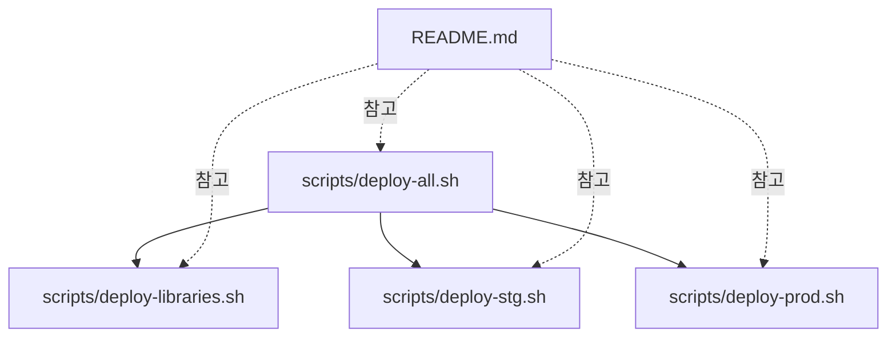
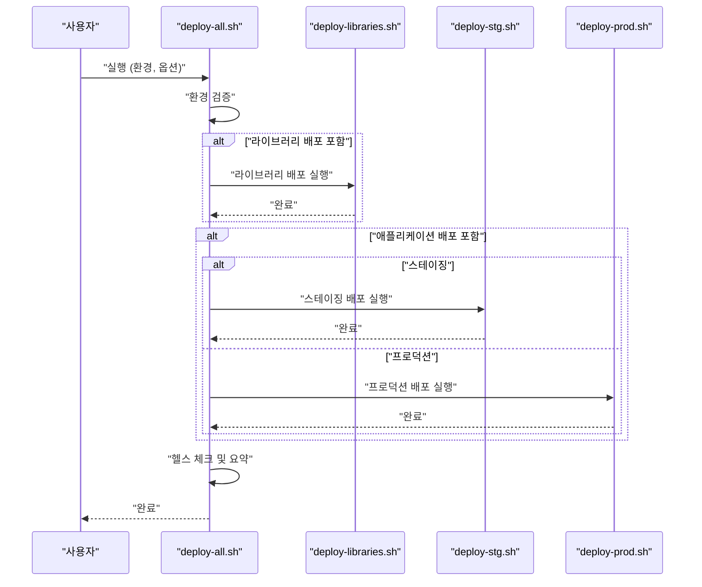
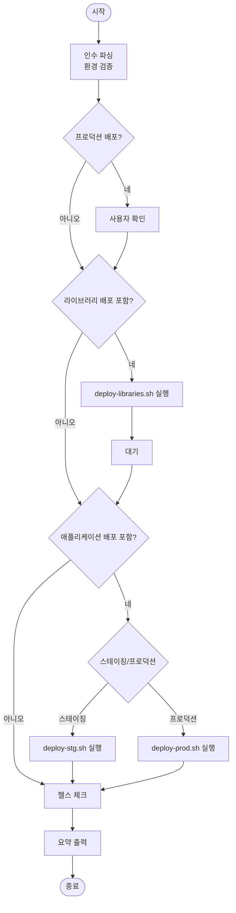
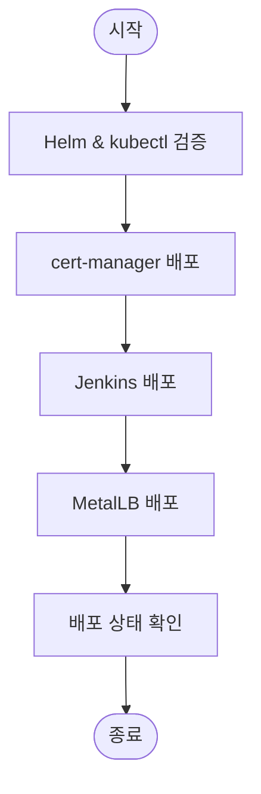
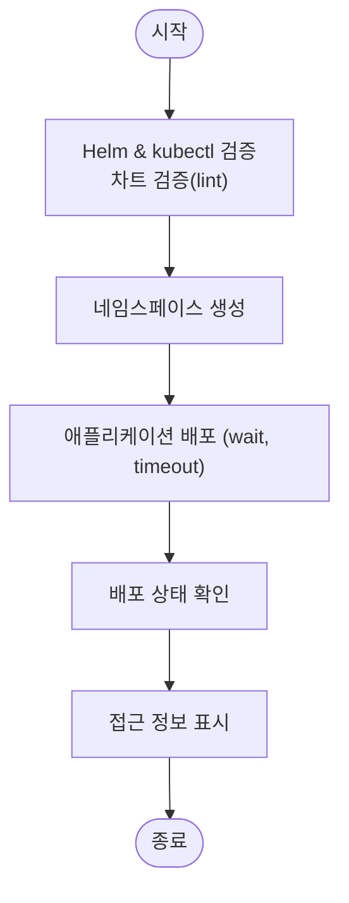
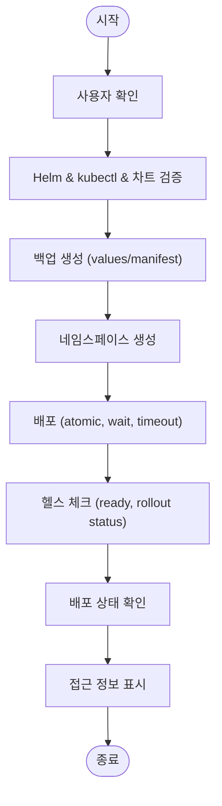
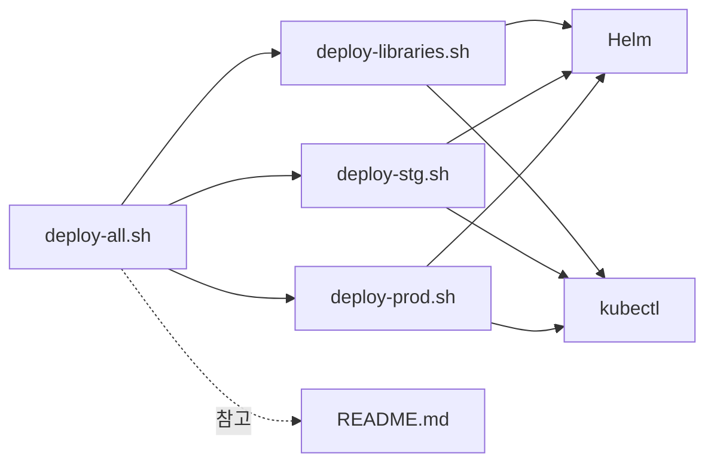

# 주요 진입점

<cite>
**문서에서 참조하는 파일**
- [scripts/deploy-all.sh](file://scripts/deploy-all.sh)
- [scripts/deploy-libraries.sh](file://scripts/deploy-libraries.sh)
- [scripts/deploy-stg.sh](file://scripts/deploy-stg.sh)
- [scripts/deploy-prod.sh](file://scripts/deploy-prod.sh)
- [README.md](file://README.md)
</cite>

## 목차
1. [소개](#소개)
2. [프로젝트 구조](#프로젝트-구조)
3. [핵심 컴포넌트](#핵심-컴포넌트)
4. [아키텍처 개요](#아키텍처-개요)
5. [상세 컴포넌트 분석](#상세-컴포넌트-분석)
6. [의존성 분석](#의존성-분석)
7. [성능 고려사항](#성능-고려사항)
8. [고장 대응 가이드](#고장-대응-가이드)
9. [결론](#결론)
10. [부록](#부록)

## 소개
이 문서는 prj-devops의 주요 배포 진입점인 deploy-all.sh, deploy-libraries.sh, deploy-stg.sh, deploy-prod.sh 스크립트의 목적과 역할, 사용 사례, 실행 순서, 상호 관계를 중심으로 설명합니다. 각 스크립트가 전체 배포 워크플로우에서 수행하는 단계를 명확히 하고, 초보자를 위한 간단한 실행 예시와 경험 많은 사용자를 위한 고급 옵션을 모두 제공합니다.

## 프로젝트 구조
- 배포 자동화 스크립트는 scripts/ 디렉토리에 위치하며, deploy-all.sh이 메인 오케스트레이터입니다.
- deploy-libraries.sh는 클러스터 서비스와 개발 도구를 배포합니다.
- deploy-stg.sh는 스테이징 환경에 애플리케이션을 배포합니다.
- deploy-prod.sh는 프로덕션 환경에 안전 검사와 함께 배포하며, 롤백 기능을 제공합니다.
- README.md는 전체 배포 워크플로우, 환경별 구성, CLI 사용법을 상세히 안내합니다.

**도표 소스**
- [scripts/deploy-all.sh](file://scripts/deploy-all.sh#L1-L279)
- [scripts/deploy-libraries.sh](file://scripts/deploy-libraries.sh#L1-L128)
- [scripts/deploy-stg.sh](file://scripts/deploy-stg.sh#L1-L173)
- [scripts/deploy-prod.sh](file://scripts/deploy-prod.sh#L1-L299)
- [README.md](file://README.md#L111-L154)

**섹션 소스**
- [README.md](file://README.md#L111-L154)

## 핵심 컴포넌트
- deploy-all.sh: 환경(스테이징/프로덕션)을 관리하고, 라이브러리 배포와 애플리케이션 배포를 조율하는 메인 오케스트레이터입니다. 선택적 옵션으로 라이브러리 건너뛰기, 라이브러리만 배포, 드라이런(검증) 모드를 지원합니다.
- deploy-libraries.sh: 클러스터 레벨 서비스(cert-manager, MetalLB 등)와 개발 도구(ArgoCD, Harbor, Jenkins 등)를 배포합니다. 사전 검증(Helm, kubectl)과 배포 후 상태 확인이 포함됩니다.
- deploy-stg.sh: 스테이징 환경에 애플리케이션을 배포합니다. 차트 검증, 네임스페이스 생성, 배포, 상태 확인, 접근 정보 표시를 수행합니다.
- deploy-prod.sh: 프로덕션 환경에 배포하며, 사용자 확인, 클러스터 검증, 차트 검증, 자동 백업, 배포, 헬스 체크, 상태 확인, 접근 정보 표시를 포함합니다. 롤백 기능도 제공됩니다.

**섹션 소스**
- [scripts/deploy-all.sh](file://scripts/deploy-all.sh#L1-L279)
- [scripts/deploy-libraries.sh](file://scripts/deploy-libraries.sh#L1-L128)
- [scripts/deploy-stg.sh](file://scripts/deploy-stg.sh#L1-L173)
- [scripts/deploy-prod.sh](file://scripts/deploy-prod.sh#L1-L299)

## 아키텍처 개요
전체 배포 워크플로우는 다음과 같습니다:
- deploy-all.sh이 환경을 판단하고, 라이브러리 배포를 선택적으로 실행한 뒤, 애플리케이션 배포를 진행합니다.
- deploy-libraries.sh은 클러스터 서비스와 개발 도구를 배포합니다.
- deploy-stg.sh는 스테이징 환경에 애플리케이션을 배포합니다.
- deploy-prod.sh는 프로덕션 환경에 배포하며, 안전 검사(사용자 확인, 클러스터 검증, 차트 검증, 백업), 헬스 체크, 롤백 기능을 포함합니다.

**도표 소스**
- [scripts/deploy-all.sh](file://scripts/deploy-all.sh#L118-L154)
- [scripts/deploy-libraries.sh](file://scripts/deploy-libraries.sh#L105-L128)
- [scripts/deploy-stg.sh](file://scripts/deploy-stg.sh#L134-L151)
- [scripts/deploy-prod.sh](file://scripts/deploy-prod.sh#L243-L267)

## 상세 컴포넌트 분석

### deploy-all.sh 분석
- 목적: 환경(스테이징/프로덕션) 관리, 라이브러리 배포, 애플리케이션 배포, 드라이런, 헬스 체크, 요약 보고.
- 주요 기능:
  - 환경 파싱(staging/prod) 및 별칭(stg/stage, prod/production) 지원.
  - 선택적 옵션: --skip-libraries, --libraries-only, --dry-run, --help.
  - 프로덕션 배포 시 사용자 확인 프롬프트.
  - 라이브러리 배포 후 짧은 대기 시간 제공.
  - 헬스 체크: kubectl 클러스터 연결 확인, cert-manager 상태 확인, 애플리케이션 상태 확인.
  - 요약 보고: 환경, 라이브러리 배포 여부, 애플리케이션 배포 여부, 드라이런 모드 표시.
- 실행 순서:
  1) 인수 파싱 및 환경 검증.
  2) 프로덕션 배포 시 사용자 확인.
  3) 라이브러리 배포(선택).
  4) 애플리케이션 배포(선택).
  5) 헬스 체크(드라이런 제외).
  6) 요약 출력.

**도표 소스**
- [scripts/deploy-all.sh](file://scripts/deploy-all.sh#L118-L154)
- [scripts/deploy-all.sh](file://scripts/deploy-all.sh#L183-L215)
- [scripts/deploy-all.sh](file://scripts/deploy-all.sh#L217-L279)

**섹션 소스**
- [scripts/deploy-all.sh](file://scripts/deploy-all.sh#L45-L97)
- [scripts/deploy-all.sh](file://scripts/deploy-all.sh#L100-L116)
- [scripts/deploy-all.sh](file://scripts/deploy-all.sh#L118-L154)
- [scripts/deploy-all.sh](file://scripts/deploy-all.sh#L183-L215)
- [scripts/deploy-all.sh](file://scripts/deploy-all.sh#L217-L279)

### deploy-libraries.sh 분석
- 목적: 클러스터 레벨 서비스와 개발 도구를 배포합니다.
- 주요 기능:
  - 사전 검증: Helm 설치 여부, kubectl 클러스터 연결 상태.
  - cert-manager 배포: Jetstack 저장소 추가, CRDs 설치, cert-manager 설치 및 준비 대기, 설정 적용.
  - Jenkins 배포: values.yaml 기반 설치.
  - MetalLB 배포: 저장소 추가, 설치, 설정 적용.
  - 배포 후 상태 확인: cert-manager, Jenkins, MetalLB 네임스페이스의 Pod 상태 출력.
- 실행 순서:
  1) 사전 검증.
  2) cert-manager 배포.
  3) Jenkins 배포.
  4) MetalLB 배포.
  5) 배포 상태 확인.

**도표 소스**
- [scripts/deploy-libraries.sh](file://scripts/deploy-libraries.sh#L27-L41)
- [scripts/deploy-libraries.sh](file://scripts/deploy-libraries.sh#L43-L70)
- [scripts/deploy-libraries.sh](file://scripts/deploy-libraries.sh#L72-L82)
- [scripts/deploy-libraries.sh](file://scripts/deploy-libraries.sh#L84-L102)
- [scripts/deploy-libraries.sh](file://scripts/deploy-libraries.sh#L104-L128)

**섹션 소스**
- [scripts/deploy-libraries.sh](file://scripts/deploy-libraries.sh#L27-L41)
- [scripts/deploy-libraries.sh](file://scripts/deploy-libraries.sh#L43-L70)
- [scripts/deploy-libraries.sh](file://scripts/deploy-libraries.sh#L72-L82)
- [scripts/deploy-libraries.sh](file://scripts/deploy-libraries.sh#L84-L102)
- [scripts/deploy-libraries.sh](file://scripts/deploy-libraries.sh#L104-L128)

### deploy-stg.sh 분석
- 목적: 스테이징 환경에 애플리케이션을 배포합니다.
- 주요 기능:
  - 사전 검증: Helm 설치 여부, kubectl 클러스터 연결 상태, 차트 검증(lint).
  - 네임스페이스 생성(존재하지 않으면).
  - 애플리케이션 배포(helm upgrade --install, wait, timeout).
  - 배포 상태 확인: release 상태, Pod/Service/Ingress 목록.
  - 접근 정보 표시: Ingress 호스트 기반 URL 표시.
  - 하위 명령어: deploy(기본), status, delete.
- 실행 순서:
  1) 사전 검증.
  2) 네임스페이스 생성.
  3) 애플리케이션 배포.
  4) 상태 확인.
  5) 접근 정보 표시.

**도표 소스**
- [scripts/deploy-stg.sh](file://scripts/deploy-stg.sh#L39-L67)
- [scripts/deploy-stg.sh](file://scripts/deploy-stg.sh#L69-L75)
- [scripts/deploy-stg.sh](file://scripts/deploy-stg.sh#L77-L89)
- [scripts/deploy-stg.sh](file://scripts/deploy-stg.sh#L91-L114)
- [scripts/deploy-stg.sh](file://scripts/deploy-stg.sh#L115-L132)
- [scripts/deploy-stg.sh](file://scripts/deploy-stg.sh#L133-L151)

**섹션 소스**
- [scripts/deploy-stg.sh](file://scripts/deploy-stg.sh#L39-L67)
- [scripts/deploy-stg.sh](file://scripts/deploy-stg.sh#L69-L75)
- [scripts/deploy-stg.sh](file://scripts/deploy-stg.sh#L77-L89)
- [scripts/deploy-stg.sh](file://scripts/deploy-stg.sh#L91-L114)
- [scripts/deploy-stg.sh](file://scripts/deploy-stg.sh#L115-L132)
- [scripts/deploy-stg.sh](file://scripts/deploy-stg.sh#L133-L151)

### deploy-prod.sh 분석
- 목적: 프로덕션 환경에 안전 검사를 포함한 배포를 수행하고, 롤백 기능을 제공합니다.
- 주요 기능:
  - 사용자 확인 프롬프트(오작동 예방).
  - 클러스터 검증: 현재 컨텍스트(cluster 이름) 확인, prod/production 포함 여부 검증.
  - 차트 검증: lint, template 검증.
  - 자동 백업: 기존 values/manifest 백업 디렉터리 생성 및 저장.
  - 네임스페이스 생성(존재하지 않으면).
  - 배포: atomic 옵션(실패 시 롤백), wait, timeout.
  - 헬스 체크: Pod 준비 상태, 롤아웃 상태 확인.
  - 배포 상태 확인: release 상태, Pod/Service/Ingress/HAP 목록.
  - 접근 정보 표시: Ingress 호스트 기반 URL 표시.
  - 하위 명령어: deploy(기본), status, rollback [revision], delete(안전장치).
- 실행 순서:
  1) 사용자 확인.
  2) 사전 검증(Helm, kubectl, 차트).
  3) 백업 생성.
  4) 네임스페이스 생성.
  5) 배포(atomic, wait, timeout).
  6) 헬스 체크.
  7) 상태 확인.
  8) 접근 정보 표시.

**도표 소스**
- [scripts/deploy-prod.sh](file://scripts/deploy-prod.sh#L43-L67)
- [scripts/deploy-prod.sh](file://scripts/deploy-prod.sh#L69-L95)
- [scripts/deploy-prod.sh](file://scripts/deploy-prod.sh#L97-L116)
- [scripts/deploy-prod.sh](file://scripts/deploy-prod.sh#L118-L137)
- [scripts/deploy-prod.sh](file://scripts/deploy-prod.sh#L139-L145)
- [scripts/deploy-prod.sh](file://scripts/deploy-prod.sh#L147-L173)
- [scripts/deploy-prod.sh](file://scripts/deploy-prod.sh#L175-L190)
- [scripts/deploy-prod.sh](file://scripts/deploy-prod.sh#L192-L219)
- [scripts/deploy-prod.sh](file://scripts/deploy-prod.sh#L220-L241)

**섹션 소스**
- [scripts/deploy-prod.sh](file://scripts/deploy-prod.sh#L43-L67)
- [scripts/deploy-prod.sh](file://scripts/deploy-prod.sh#L69-L95)
- [scripts/deploy-prod.sh](file://scripts/deploy-prod.sh#L97-L116)
- [scripts/deploy-prod.sh](file://scripts/deploy-prod.sh#L118-L137)
- [scripts/deploy-prod.sh](file://scripts/deploy-prod.sh#L139-L145)
- [scripts/deploy-prod.sh](file://scripts/deploy-prod.sh#L147-L173)
- [scripts/deploy-prod.sh](file://scripts/deploy-prod.sh#L175-L190)
- [scripts/deploy-prod.sh](file://scripts/deploy-prod.sh#L192-L219)
- [scripts/deploy-prod.sh](file://scripts/deploy-prod.sh#L220-L241)

## 의존성 분석
- deploy-all.sh는 deploy-libraries.sh, deploy-stg.sh, deploy-prod.sh를 호출합니다.
- deploy-libraries.sh는 Helm, kubectl, cert-manager, Jenkins, MetalLB에 의존합니다.
- deploy-stg.sh는 Helm, kubectl, 차트(values), 네임스페이스에 의존합니다.
- deploy-prod.sh는 Helm, kubectl, 차트(values), 백업 디렉터리, 롤백 기능에 의존합니다.
- README.md는 각 스크립트의 사용법과 배포 워크플로우를 문서화하고 있습니다.

**도표 소스**
- [scripts/deploy-all.sh](file://scripts/deploy-all.sh#L118-L154)
- [scripts/deploy-libraries.sh](file://scripts/deploy-libraries.sh#L27-L41)
- [scripts/deploy-stg.sh](file://scripts/deploy-stg.sh#L39-L53)
- [scripts/deploy-prod.sh](file://scripts/deploy-prod.sh#L69-L95)
- [README.md](file://README.md#L111-L154)

**섹션 소스**
- [scripts/deploy-all.sh](file://scripts/deploy-all.sh#L118-L154)
- [scripts/deploy-libraries.sh](file://scripts/deploy-libraries.sh#L27-L41)
- [scripts/deploy-stg.sh](file://scripts/deploy-stg.sh#L39-L53)
- [scripts/deploy-prod.sh](file://scripts/deploy-prod.sh#L69-L95)
- [README.md](file://README.md#L111-L154)

## 성능 고려사항
- 배포 속도: deploy-stg.sh는 wait/timeout을 사용하여 배포 완료까지 대기하므로, 테스트 반복 시 빠른 피드백이 중요합니다.
- 프로덕션 배포: deploy-prod.sh는 atomic 옵션과 롤백 기능을 통해 안정성을 확보하지만, 롤백 시에도 시간이 소요될 수 있으므로 배포 시기를 신중히 계획해야 합니다.
- 헬스 체크: deploy-all.sh의 헬스 체크는 cert-manager와 애플리케이션 상태를 확인하므로, 네트워크나 클러스터 상태에 따라 응답 시간이 달라질 수 있습니다.

[이 섹션은 일반적인 성능 논의를 포함하므로 특정 파일 분석 없음]

## 고장 대응 가이드
- 인증서 문제: cert-manager Pod 로그 확인, Certificate/Order/Challenge 리소스 상태 점검.
- Ingress 문제: DNS 레코드(A/CNAME) 확인, Ingress Controller LB IP 매칭 여부 점검.
- Pod 문제: 리소스 부족(OOMKilled/CrashLoopBackOff), 이미지 Pull 오류 확인.
- 배포 실패 시 롤백: deploy-prod.sh의 rollback 명령어 사용.
- 배포 직후 모니터링: 배포 완료 후 상태 확인 및 로그 확인.

**섹션 소스**
- [README.md](file://README.md#L335-L355)
- [scripts/deploy-prod.sh](file://scripts/deploy-prod.sh#L270-L299)

## 결론
deploy-all.sh은 전체 배포 워크플로우를 통합적으로 관리하고, deploy-libraries.sh은 인프라와 개발 도구를 배포하며, deploy-stg.sh과 deploy-prod.sh은 각 환경에 맞춘 애플리케이션 배포를 담당합니다. 프로덕션 배포에는 안전 검사와 롤백 기능이 포함되어 있어 신뢰성 있는 배포를 가능하게 합니다. 초보자는 deploy-all.sh을 사용해 기본 배포를, 경험 많은 사용자는 deploy-prod.sh의 DRY_RUN, 롤백, 백업 기능 등을 활용해 고급 배포 전략을 구사할 수 있습니다.

[이 섹션은 요약 내용을 포함하므로 특정 파일 분석 없음]

## 부록

### CLI 인터페이스 및 사용 예시
- deploy-all.sh
  - 기본 스테이징 배포: scripts/deploy-all.sh
  - 라이브러리만 배포: scripts/deploy-all.sh staging --libraries-only
  - 라이브러리 건너뛰고 애플리케이션만 배포: scripts/deploy-all.sh staging --skip-libraries
  - 프로덕션 드라이런: scripts/deploy-all.sh production --dry-run
- deploy-libraries.sh
  - 인프라 및 도구 배포: scripts/deploy-libraries.sh
- deploy-stg.sh
  - 스테이징 배포: scripts/deploy-stg.sh
  - 상태 확인: scripts/deploy-stg.sh status
  - 삭제: scripts/deploy-stg.sh delete
- deploy-prod.sh
  - 프로덕션 배포: scripts/deploy-prod.sh
  - 상태 확인: scripts/deploy-prod.sh status
  - 롤백: scripts/deploy-prod.sh rollback [revision]

**섹션 소스**
- [README.md](file://README.md#L111-L154)
- [scripts/deploy-all.sh](file://scripts/deploy-all.sh#L45-L63)
- [scripts/deploy-stg.sh](file://scripts/deploy-stg.sh#L154-L173)
- [scripts/deploy-prod.sh](file://scripts/deploy-prod.sh#L269-L299)