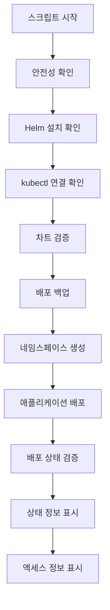
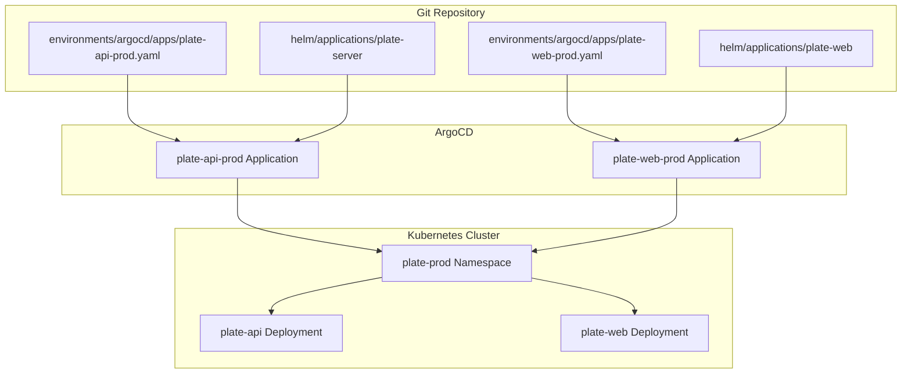
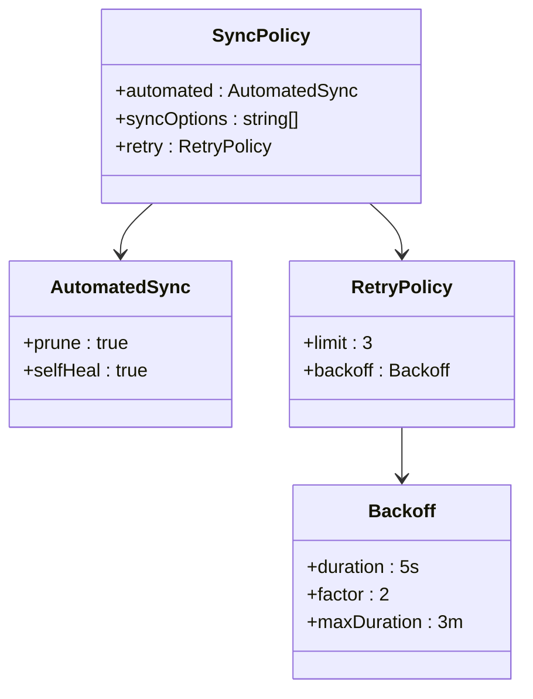
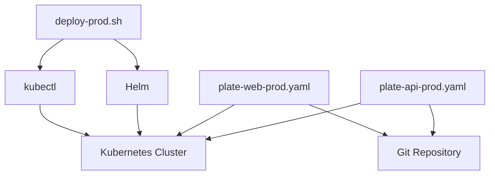

# 프로덕션 환경 배포 (deploy-prod.sh)

<cite>
**이 문서에서 참조한 파일**  
- [deploy-prod.sh](file://scripts/deploy-prod.sh)
- [plate-api-prod.yaml](file://environments/argocd/apps/plate-api-prod.yaml)
- [plate-web-prod.yaml](file://environments/argocd/apps/plate-web-prod.yaml)
- [values-prod.yaml](file://helm/applications/plate-server/values-prod.yaml)
- [values-prod.yaml](file://helm/applications/plate-web/values-prod.yaml)
</cite>

## 목차
1. [소개](#소개)
2. [스크립트 개요](#스크립트-개요)
3. [핵심 구성 요소 분석](#핵심-구성-요소-분석)
4. [배포 아키텍처 개요](#배포-아키텍처-개요)
5. [상세 구성 요소 분석](#상세-구성-요소-분석)
6. [의존성 분석](#의존성-분석)
7. [성능 고려사항](#성능-고려사항)
8. [문제 해결 가이드](#문제-해결-가이드)
9. [결론](#결론)

## 소개
이 문서는 `deploy-prod.sh` 스크립트를 통해 `plate-web`, `plate-api`, `plate-llm`, `plate-cache` 서비스를 프로덕션 환경에 안전하게 배포하는 프로세스를 상세히 설명합니다. 스크립트가 `environments/argocd/apps/plate-*-prod.yaml` 설정 파일과 어떻게 연동되는지, 그리고 프로덕션 환경의 엄격한 요구사항(높은 가용성, 보안 강화, 리소스 제한)을 반영한 구성(`values-prod.yaml`)을 분석합니다. 또한 롤링 업데이트 전략, 헬스 체크, 트래픽 절단 및 롤백 메커니즘을 문서화하고, 배포 전 사전 점검 목록과 배포 후 검증 절차를 포함하여 안정적인 프로덕션 운영을 위한 가이드를 제공합니다.

## 스크립트 개요
`deploy-prod.sh`는 프로덕션 환경에 애플리케이션을 안전하게 배포하기 위한 Bash 스크립트입니다. 스크립트는 Helm을 사용하여 쿠버네티스에 애플리케이션을 배포하며, 안전한 배포를 위한 다양한 검사와 절차를 포함하고 있습니다. 스크립트는 `DRY_RUN` 및 `SKIP_BACKUP` 환경 변수를 통해 시뮬레이션 모드와 백업 생략 기능을 제공합니다.



**Diagram sources**
- [deploy-prod.sh](file://scripts/deploy-prod.sh#L243-L267)

**Section sources**
- [deploy-prod.sh](file://scripts/deploy-prod.sh#L1-L299)

## 핵심 구성 요소 분석
`deploy-prod.sh` 스크립트는 여러 유틸리티 함수와 주요 배포 로직으로 구성되어 있습니다. 주요 함수로는 `confirm_production_deploy`, `check_helm`, `check_kubectl`, `validate_chart`, `backup_deployment`, `deploy_app`, `verify_deployment` 등이 있으며, 각각 배포의 특정 단계를 담당합니다.

**Section sources**
- [deploy-prod.sh](file://scripts/deploy-prod.sh#L27-L241)

## 배포 아키텍처 개요
프로덕션 배포 아키텍처는 ArgoCD를 기반으로 GitOps 방식을 따릅니다. 각 서비스(`plate-api`, `plate-web`)는 별도의 ArgoCD Application 리소스로 관리되며, 이는 Git 저장소의 특정 경로를 소스로 지정하고, 프로덕션 환경에 맞는 values 파일을 참조합니다.



**Diagram sources**
- [plate-api-prod.yaml](file://environments/argocd/apps/plate-api-prod.yaml)
- [plate-web-prod.yaml](file://environments/argocd/apps/plate-web-prod.yaml)

## 상세 구성 요소 분석

### plate-api-prod.yaml 분석
`plate-api-prod.yaml`은 ArgoCD를 통해 `plate-api` 서비스를 프로덕션 환경에 배포하기 위한 설정 파일입니다. 이 파일은 Git 저장소의 `helm/applications/plate-server` 경로를 소스로 지정하고, `values-prod.yaml` 파일을 사용하여 프로덕션 전용 설정을 적용합니다.

#### ArgoCD 동기화 정책


**Diagram sources**
- [plate-api-prod.yaml](file://environments/argocd/apps/plate-api-prod.yaml#L31-L52)

**Section sources**
- [plate-api-prod.yaml](file://environments/argocd/apps/plate-api-prod.yaml#L1-L62)

### plate-web-prod.yaml 분석
`plate-web-prod.yaml`은 `plate-web` 서비스를 위한 ArgoCD Application 설정 파일입니다. `plate-api-prod.yaml`과 유사한 구조를 가지며, 동일한 동기화 정책과 재시도 메커니즘을 적용합니다.

**Section sources**
- [plate-web-prod.yaml](file://environments/argocd/apps/plate-web-prod.yaml#L1-L62)

### values-prod.yaml 구성 분석
`values-prod.yaml` 파일은 프로덕션 환경에 맞춘 Helm 차트의 설정 값을 정의합니다. `plate-api`와 `plate-web` 서비스 모두 별도의 `values-prod.yaml` 파일을 사용하여 리소스 제한, 이미지 태그, 복제본 수 등을 설정합니다.

#### plate-api values-prod.yaml
```yaml
replicaCount: 1
backend:
  image:
    repository: harbor.cocdev.co.kr/stg-server/server
    tag: "latest"
    pullPolicy: IfNotPresent
  port: 3006
  resources:
    limits:
      cpu: 500m
      memory: 1Gi
    requests:
      cpu: 250m
      memory: 512Mi
```

#### plate-web values-prod.yaml
```yaml
replicaCount: 1
image:
  repository: nginx
  pullPolicy: IfNotPresent
  tag: "1.25"
resources:
  limits:
    cpu: 500m
    memory: 512Mi
  requests:
    cpu: 250m
    memory: 256Mi
```

**Section sources**
- [values-prod.yaml](file://helm/applications/plate-server/values-prod.yaml#L1-L22)
- [values-prod.yaml](file://helm/applications/plate-web/values-prod.yaml#L1-L39)

## 의존성 분석
프로덕션 배포 프로세스는 여러 구성 요소 간의 명확한 의존성을 가지고 있습니다. `deploy-prod.sh` 스크립트는 Helm과 kubectl에 의존하며, ArgoCD Application 리소스는 Git 저장소와 쿠버네티스 클러스터에 의존합니다.



**Diagram sources**
- [deploy-prod.sh](file://scripts/deploy-prod.sh#L69-L82)
- [plate-api-prod.yaml](file://environments/argocd/apps/plate-api-prod.yaml#L17-L25)
- [plate-web-prod.yaml](file://environments/argocd/apps/plate-web-prod.yaml#L17-L25)

## 성능 고려사항
프로덕션 환경의 성능을 보장하기 위해, `values-prod.yaml` 파일에서는 CPU 및 메모리 리소스에 대한 제한과 요청 값을 명시적으로 설정합니다. 이는 리소스 과다 사용을 방지하고, 클러스터의 안정성을 유지하는 데 중요합니다.

## 문제 해결 가이드
배포 과정에서 발생할 수 있는 주요 문제와 해결 방법은 다음과 같습니다.

- **Helm 미설치**: `Helm is not installed. Please install Helm first.` 오류 발생 시 Helm을 설치해야 합니다.
- **클러스터 연결 실패**: `Unable to connect to Kubernetes cluster.` 오류 발생 시 kubectl 구성이 올바른지 확인해야 합니다.
- **차트 검증 실패**: `helm lint` 또는 `helm template` 명령어가 실패할 경우, Helm 차트의 구문 오류를 확인해야 합니다.

**Section sources**
- [deploy-prod.sh](file://scripts/deploy-prod.sh#L70-L82)
- [deploy-prod.sh](file://scripts/deploy-prod.sh#L98-L115)

## 결론
`deploy-prod.sh` 스크립트와 ArgoCD Application 설정 파일들은 프로덕션 환경에 안정적이고 안전한 배포를 가능하게 합니다. 이 문서는 배포 프로세스의 각 단계와 구성 요소를 상세히 설명하여, 운영 팀이 문제를 신속하게 진단하고 해결할 수 있도록 지원합니다.