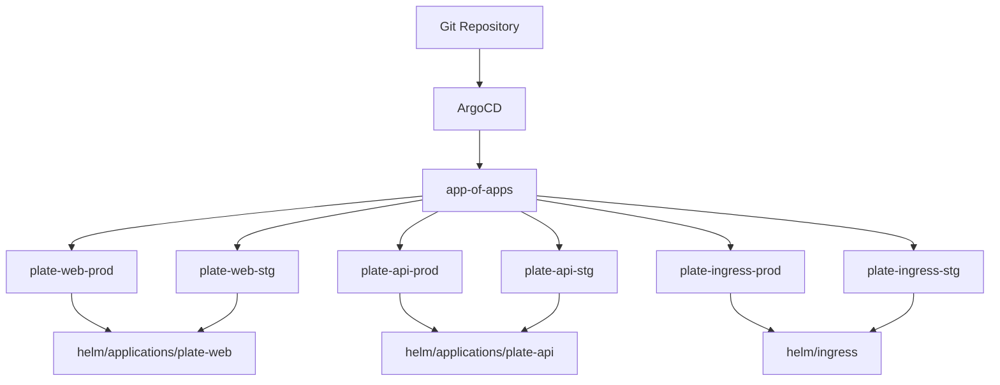
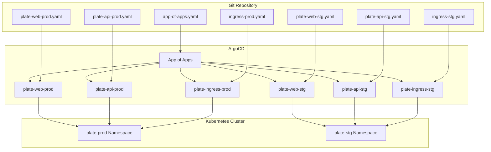
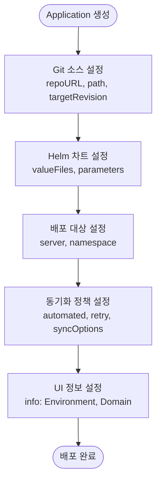
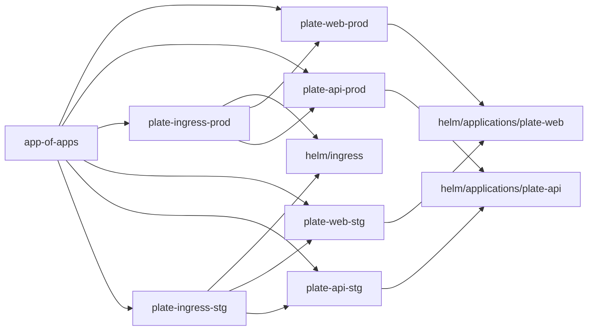

# GitOps 배포 통합

<cite>
**이 문서에서 참조한 파일**  
- [app-of-apps.yaml](file://environments/argocd/app-of-apps.yaml)
- [plate-web-prod.yaml](file://environments/argocd/apps/plate-web-prod.yaml)
- [plate-api-prod.yaml](file://environments/argocd/apps/plate-api-prod.yaml)
- [ingress-prod.yaml](file://environments/argocd/apps/ingress-prod.yaml)
- [plate-web-stg.yaml](file://environments/argocd/apps/plate-web-stg.yaml)
- [plate-api-stg.yaml](file://environments/argocd/apps/plate-api-stg.yaml)
- [ingress-stg.yaml](file://environments/argocd/apps/ingress-stg.yaml)
- [values-prod.yaml](file://helm/applications/plate-web/values-prod.yaml)
- [values-stg.yaml](file://helm/applications/plate-web/values-stg.yaml)
- [values.yaml](file://helm/applications/plate-web/values.yaml)
- [values-prod.yaml](file://helm/applications/plate-api/values-prod.yaml)
- [values-stg.yaml](file://helm/applications/plate-api/values-stg.yaml)
- [values.yaml](file://helm/applications/plate-api/values.yaml)
- [values.yaml](file://helm/ingress/values.yaml)
- [values-stg.yaml](file://helm/ingress/values-stg.yaml)
</cite>

## 목차
1. [소개](#소개)
2. [프로젝트 구조](#프로젝트-구조)
3. [핵심 구성 요소](#핵심-구성-요소)
4. [아키텍처 개요](#아키텍처-개요)
5. [상세 구성 요소 분석](#상세-구성-요소-분석)
6. [의존성 분석](#의존성-분석)
7. [성능 고려사항](#성능-고려사항)
8. [문제 해결 가이드](#문제-해결-가이드)
9. [결론](#결론)

## 소개
이 문서는 ArgoCD를 활용한 GitOps 기반 배포 통합 전략을 설명합니다. Application CRD를 통한 선언적 배포 정의, 환경별 valueFiles 오버라이드, 동기화 정책 구성 방법을 상세히 다룹니다. 또한 sync-wave를 활용한 배포 순서 제어, 자동 동기화 및 자체 치유 기능, 재시도 정책 설정 방법을 안내하며, Ingress와 애플리케이션의 배포 의존성 관리 전략을 실제 예제를 통해 설명합니다.

## 프로젝트 구조

이 프로젝트는 GitOps 원칙에 따라 ArgoCD를 중심으로 구성되어 있으며, Helm 차트 기반의 애플리케이션 배포를 지원합니다. 주요 디렉터리 구조는 다음과 같습니다:

- `environments/argocd/`: ArgoCD Application 리소스 정의
  - `apps/`: 각 애플리케이션별 ArgoCD Application 매니페스트
  - `app-of-apps.yaml`: 전체 애플리케이션을 관리하는 최상위 Application
- `helm/`: Helm 차트 저장소
  - `applications/`: 애플리케이션별 Helm 차트 (plate-web, plate-api 등)
  - `ingress/`: 공용 Ingress Helm 차트
  - `cluster-services/`: 클러스터 공통 서비스 (cert-manager, metallb 등)
- `scripts/`: 배포 및 운영 스크립트



**다이어그램 출처**
- [app-of-apps.yaml](file://environments/argocd/app-of-apps.yaml)
- [plate-web-prod.yaml](file://environments/argocd/apps/plate-web-prod.yaml)
- [plate-api-prod.yaml](file://environments/argocd/apps/plate-api-prod.yaml)
- [ingress-prod.yaml](file://environments/argocd/apps/ingress-prod.yaml)
- [helm/applications/plate-web](file://helm/applications/plate-web/Chart.yaml)
- [helm/applications/plate-api](file://helm/applications/plate-api/Chart.yaml)
- [helm/ingress](file://helm/ingress/Chart.yaml)

**섹션 출처**
- [app-of-apps.yaml](file://environments/argocd/app-of-apps.yaml)
- [environments/argocd/apps](file://environments/argocd/apps)

## 핵심 구성 요소

ArgoCD Application CRD를 통해 선언적으로 애플리케이션 배포를 정의하며, 각 환경(production, staging)에 대해 별도의 values 파일을 사용하여 구성 차이를 관리합니다. 자동 동기화 및 자체 치유 기능을 활성화하여 클러스터 상태가 항상 Git과 일치하도록 보장합니다.

**섹션 출처**
- [plate-web-prod.yaml](file://environments/argocd/apps/plate-web-prod.yaml)
- [plate-api-prod.yaml](file://environments/argocd/apps/plate-api-prod.yaml)
- [ingress-prod.yaml](file://environments/argocd/apps/ingress-prod.yaml)

## 아키텍처 개요

이 시스템은 App of Apps 패턴을 사용하여 중앙 집중식으로 모든 애플리케이션을 관리합니다. 최상위 `app-of-apps` Application이 각 환경별 애플리케이션(Application)을 동기화하며, 각 Application은 지정된 Helm 차트와 환경별 values 파일을 기반으로 배포됩니다.



**다이어그램 출처**
- [app-of-apps.yaml](file://environments/argocd/app-of-apps.yaml)
- [plate-web-prod.yaml](file://environments/argocd/apps/plate-web-prod.yaml)
- [plate-api-prod.yaml](file://environments/argocd/apps/plate-api-prod.yaml)
- [ingress-prod.yaml](file://environments/argocd/apps/ingress-prod.yaml)
- [plate-web-stg.yaml](file://environments/argocd/apps/plate-web-stg.yaml)
- [plate-api-stg.yaml](file://environments/argocd/apps/plate-api-stg.yaml)
- [ingress-stg.yaml](file://environments/argocd/apps/ingress-stg.yaml)

## 상세 구성 요소 분석

### Application CRD를 통한 선언적 배포 정의

ArgoCD Application 리소스는 Git 저장소의 Helm 차트를 기반으로 애플리케이션을 배포합니다. `source.repoURL`, `source.path`, `destination.namespace` 등을 통해 배포 소스와 대상을 명시적으로 정의합니다.



**다이어그램 출처**
- [plate-web-prod.yaml](file://environments/argocd/apps/plate-web-prod.yaml)
- [plate-api-prod.yaml](file://environments/argocd/apps/plate-api-prod.yaml)

**섹션 출처**
- [plate-web-prod.yaml](file://environments/argocd/apps/plate-web-prod.yaml)
- [plate-api-prod.yaml](file://environments/argocd/apps/plate-api-prod.yaml)

### 환경별 valueFiles 오버라이드

각 환경(production, staging)은 공통 Helm 차트를 공유하지만, 환경별 `values-prod.yaml`, `values-stg.yaml` 파일을 통해 구성 차이를 관리합니다. Application 리소스의 `spec.source.helm.valueFiles` 필드에서 해당 환경의 values 파일을 지정합니다.

예:
- `plate-web-prod.yaml`: `valueFiles: [values-prod.yaml]`
- `plate-web-stg.yaml`: `valueFiles: [values-stg.yaml]`

이를 통해 이미지 태그, 리소스 제한, 환경 변수 등이 환경에 따라 다르게 적용됩니다.

**섹션 출처**
- [plate-web-prod.yaml](file://environments/argocd/apps/plate-web-prod.yaml#L23-L24)
- [plate-web-stg.yaml](file://environments/argocd/apps/plate-web-stg.yaml#L23-L24)
- [values-prod.yaml](file://helm/applications/plate-web/values-prod.yaml)
- [values-stg.yaml](file://helm/applications/plate-web/values-stg.yaml)

### 동기화 정책 구성

ArgoCD Application은 다양한 동기화 정책을 통해 배포 동작을 제어합니다.

#### 자동 동기화 및 자체 치유
```yaml
syncPolicy:
  automated:
    prune: true
    selfHeal: true
```
- `prune: true`: Git에서 제거된 리소스를 클러스터에서도 자동 삭제
- `selfHeal: true`: 클러스터에서 수동으로 변경된 상태를 Git의 선언적 상태로 자동 복구

#### 재시도 정책
Production과 Staging 환경별로 재시도 정책이 다릅니다.

**Production 예시:**
```yaml
retry:
  limit: 3
  backoff:
    duration: 5s
    factor: 2
    maxDuration: 3m
```

**Staging 예시:**
```yaml
retry:
  limit: 5
  backoff:
    duration: 5s
    factor: 2
    maxDuration: 3m
```
Staging 환경은 더 많은 재시도를 허용하여 개발/테스트 환경의 유연성을 제공합니다.

**섹션 출처**
- [plate-web-prod.yaml](file://environments/argocd/apps/plate-web-prod.yaml#L32-L50)
- [plate-web-stg.yaml](file://environments/argocd/apps/plate-web-stg.yaml#L32-L50)
- [plate-api-prod.yaml](file://environments/argocd/apps/plate-api-prod.yaml#L32-L50)
- [plate-api-stg.yaml](file://environments/argocd/apps/plate-api-stg.yaml#L32-L50)

### sync-wave를 활용한 배포 순서 제어

현재 설정에서는 명시적인 sync-wave가 사용되지 않았지만, App of Apps 패턴 자체가 자연스러운 배포 순서를 제공합니다. 최상위 `app-of-apps` Application이 먼저 배포되고, 그 후에 참조된 각 Application들이 순차적으로 동기화됩니다.

향후에는 `syncWave` 필드를 사용하여 명시적인 배포 순서를 정의할 수 있습니다:
```yaml
metadata:
  annotations:
    argocd.argoproj.io/sync-wave: "1"
```

**섹션 출처**
- [app-of-apps.yaml](file://environments/argocd/app-of-apps.yaml)

### Ingress와 애플리케이션의 배포 의존성 관리

Ingress 리소스는 `plate-web` 및 `plate-api` 서비스에 대한 라우팅을 처리하며, 별도의 Application으로 관리됩니다. 이는 서비스가 먼저 배포된 후 Ingress가 이를 참조할 수 있도록 의존성 순서를 보장합니다.

#### Production Ingress 설정
- `destination.namespace: plate-prod`
- `valueFiles: [values.yaml]`
- 도메인: `cocdev.co.kr`

#### Staging Ingress 설정
- `destination.namespace: plate-stg`
- `valueFiles: [values-stg.yaml]`
- 도메인: `stg.cocdev.co.kr`

`ignoreDifferences` 설정을 통해 Ingress 리소스의 annotations 변경을 무시함으로써, cert-manager가 자동으로 추가하는 annotation으로 인한 불필요한 동기화 문제를 방지합니다.

```yaml
ignoreDifferences:
  - group: networking.k8s.io
    kind: Ingress
    jqPathExpressions:
      - .metadata.annotations
```

**섹션 출처**
- [ingress-prod.yaml](file://environments/argocd/apps/ingress-prod.yaml)
- [ingress-stg.yaml](file://environments/argocd/apps/ingress-stg.yaml)
- [values.yaml](file://helm/ingress/values.yaml)
- [values-stg.yaml](file://helm/ingress/values-stg.yaml)

## 의존성 분석

이 시스템의 주요 의존성은 다음과 같습니다:



- `app-of-apps`는 모든 환경별 Application에 의존
- 각 Ingress Application은 해당 환경의 웹 및 API Application 이후에 배포되어야 함
- Helm 차트는 values 파일에 의해 환경별로 오버라이드됨

**다이어그램 출처**
- [app-of-apps.yaml](file://environments/argocd/app-of-apps.yaml)
- [ingress-prod.yaml](file://environments/argocd/apps/ingress-prod.yaml)
- [ingress-stg.yaml](file://environments/argocd/apps/ingress-stg.yaml)

**섹션 출처**
- [app-of-apps.yaml](file://environments/argocd/app-of-apps.yaml)
- [ingress-prod.yaml](file://environments/argocd/apps/ingress-prod.yaml)
- [ingress-stg.yaml](file://environments/argocd/apps/ingress-stg.yaml)

## 성능 고려사항

- `ApplyOutOfSyncOnly=true` 옵션을 사용하여 변경된 리소스만 적용함으로써 동기화 성능을 최적화
- `revisionHistoryLimit: 10`으로 설정하여 과도한 이력 저장을 방지
- 각 Application에 `CreateNamespace=true`를 설정하여 네임스페이스 생성 의존성을 제거

## 문제 해결 가이드

- **동기화 실패 시**: 재시도 정책에 따라 자동 재시도 발생. 로그에서 실패 원인 확인
- **Ingress 동기화 문제**: `ignoreDifferences` 설정으로 annotations 변경 무시
- **이미지 풀 실패**: `imagePullSecrets`가 정의되어 있는지 확인
- **자체 치유가 작동하지 않을 경우**: `selfHeal: true`가 설정되어 있는지 확인

**섹션 출처**
- [plate-web-prod.yaml](file://environments/argocd/apps/plate-web-prod.yaml)
- [ingress-prod.yaml](file://environments/argocd/apps/ingress-prod.yaml)

## 결론

이 문서는 ArgoCD를 통한 GitOps 기반 배포 통합 전략을 체계적으로 설명하였습니다. Application CRD를 통한 선언적 배포, 환경별 values 오버라이드, 자동 동기화 및 자체 치유 기능, 재시도 정책, Ingress와의 배포 의존성 관리 전략을 통해 안정적이고 예측 가능한 배포 파이프라인을 구축할 수 있습니다. App of Apps 패턴을 활용하면 전체 시스템의 가시성을 높이고 중앙 집중식으로 관리할 수 있습니다.