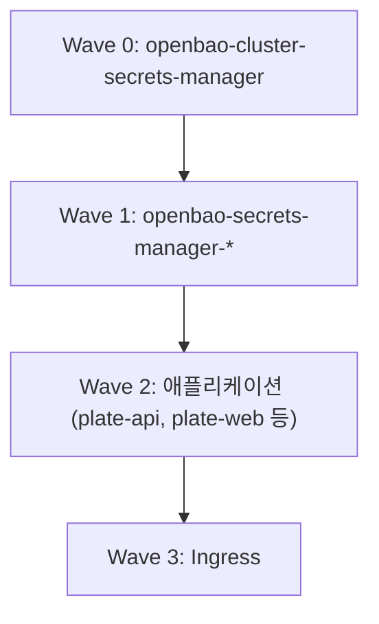

# 동기화 전략

<cite>
**이 문서에서 참조한 파일**  
- [app-of-apps.yaml](file://environments/argocd/app-of-apps.yaml)
- [ingress-prod.yaml](file://environments/argocd/apps/ingress-prod.yaml)
- [ingress-stg.yaml](file://environments/argocd/apps/ingress-stg.yaml)
- [openbao-cluster-secrets-manager.yaml](file://environments/argocd/apps/openbao-cluster-secrets-manager.yaml)
- [openbao-secrets-manager-prod.yaml](file://environments/argocd/apps/openbao-secrets-manager-prod.yaml)
- [openbao-secrets-manager-stg.yaml](file://environments/argocd/apps/openbao-secrets-manager-stg.yaml)
- [README.md](file://README.md)
</cite>

## 목차
1. [소개](#소개)
2. [자동 동기화 정책](#자동-동기화-정책)
3. [동기화 옵션](#동기화-옵션)
4. [재시도 정책](#재시도-정책)
5. [배포 순서 제어: Sync Wave](#배포-순서-제어-sync-wave)
6. [결론](#결론)

## 소개
ArgoCD는 GitOps 기반의 선언적 지속적 배포 도구로, 클러스터 상태를 Git 저장소의 선언된 상태와 일치시키는 데 중점을 둡니다. 이 문서는 ArgoCD의 핵심 기능 중 하나인 `syncPolicy`를 심층적으로 분석합니다. 특히 `automated`, `syncOptions`, `retry` 구성 요소와 `sync-wave`를 활용한 배포 순서 제어 전략을 설명합니다. 제공된 코드베이스를 기반으로 실제 운영 환경에서의 적용 사례를 제시합니다.

## 자동 동기화 정책
자동 동기화(`automated`)는 Git 저장소의 변경 사항을 감지하고 클러스터를 자동으로 동기화하는 기능입니다. 이는 GitOps의 핵심 원칙인 "단일 진실 원천(Single Source of Truth)"을 실현합니다.

### 활성화 조건
자동 동기화는 `syncPolicy.automated.enabled`를 `true`로 설정하거나, 단순히 `automated` 블록을 포함함으로써 활성화됩니다. 예를 들어, `app-of-apps.yaml` 파일은 모든 하위 애플리케이션을 관리하는 최상위 애플리케이션으로, 자동 동기화를 활성화하여 인프라 변경 사항을 즉시 반영합니다.

```yaml
# environments/argocd/app-of-apps.yaml
syncPolicy:
  automated:
    prune: true
    selfHeal: true
```

### Self-Healing 기능
`selfHeal: true`는 클러스터에서 수동으로 발생한 변경 사항을 Git 저장소의 선언된 상태로 자동 복구하는 기능입니다. 이는 운영자의 실수로 인한 상태 불일치를 방지하고, 시스템의 무결성을 유지합니다. 예를 들어, `ingress-prod.yaml`과 `ingress-stg.yaml` 모두 이 기능을 활성화하여, 인그레스 리소스에 대한 임의의 수정이 자동으로 되돌려지도록 합니다.

**구성 예시**
- **활성화**: `automated` 블록을 포함하고 `prune` 및 `selfHeal`을 `true`로 설정합니다.
- **비활성화**: `automated` 블록을 생략하거나, `enabled: false`로 설정합니다.

**Section sources**
- [app-of-apps.yaml](file://environments/argocd/app-of-apps.yaml#L20-L25)
- [ingress-prod.yaml](file://environments/argocd/apps/ingress-prod.yaml#L37-L42)
- [ingress-stg.yaml](file://environments/argocd/apps/ingress-stg.yaml#L37-L42)

## 동기화 옵션
`syncOptions`는 동기화 프로세스의 세부 동작을 제어하는 다양한 플래그를 제공합니다. 각 옵션은 특정한 운영 요구사항을 해결합니다.

### 주요 옵션 및 사용 사례

| 옵션 | 설명 | 사용 사례 |
| :--- | :--- | :--- |
| **CreateNamespace=true** | 대상 네임스페이스가 존재하지 않을 경우 자동으로 생성합니다. | `app-of-apps.yaml`에서 사용되며, 새로운 애플리케이션이 추가될 때마다 네임스페이스를 자동으로 생성합니다. |
| **Prune=true** | Git 저장소에서 삭제된 리소스를 클러스터에서도 자동으로 제거합니다. | `ingress-prod.yaml`과 `ingress-stg.yaml`에서 사용되며, 불필요한 리소스 누적을 방지합니다. |
| **PrunePropagationPolicy=foreground** | 리소스 삭제 시, 종속된 하위 리소스를 먼저 삭제한 후 부모 리소스를 삭제합니다. | `openbao-secrets-manager-prod.yaml`에서 사용되며, 안전한 삭제를 보장합니다. |
| **PruneLast=true** | 동기화 중에 먼저 리소스를 생성/업데이트하고, 마지막 단계에서 `prune` 작업을 수행합니다. | `openbao-secrets-manager-prod.yaml`에서 사용되며, 서비스 중단을 방지합니다. |
| **Validate=true** | 리소스를 적용하기 전에 Kubernetes API 서버의 유효성 검사를 수행합니다. | `openbao-secrets-manager-prod.yaml`에서 사용되며, 프로덕션 환경의 안정성을 높입니다. |
| **ApplyOutOfSyncOnly=true** | 동기화되지 않은 리소스만 적용하여, 동기화 성능을 최적화합니다. | `ingress-prod.yaml`에서 사용되며, 대규모 클러스터에서의 동기화 시간을 단축합니다. |

**Section sources**
- [app-of-apps.yaml](file://environments/argocd/app-of-apps.yaml#L25-L27)
- [ingress-prod.yaml](file://environments/argocd/apps/ingress-prod.yaml#L44-L48)
- [openbao-secrets-manager-prod.yaml](file://environments/argocd/apps/openbao-secrets-manager-prod.yaml#L47-L51)

## 재시도 정책
`retry` 정책은 동기화가 실패했을 때 재시도를 수행하는 메커니즘을 정의합니다. 이는 일시적인 네트워크 문제나 리소스 경합과 같은 트랜지언트 에러에 대응하기 위해 필수적입니다.

### 구성 방법
- **`limit`**: 최대 재시도 횟수를 지정합니다. 예를 들어, `ingress-prod.yaml`은 3회로 설정하여 무한 루프를 방지합니다.
- **`backoff`**: 재시도 간의 대기 시간을 제어합니다.
  - **`duration`**: 첫 번째 재시도까지의 초기 대기 시간입니다.
  - **`factor`**: 재시도할 때마다 대기 시간을 배수로 증가시키는 비율입니다. 지수 백오프(exponential backoff) 전략을 구현합니다.
  - **`maxDuration`**: 재시도 대기 시간의 최대값을 설정합니다.

**환경별 차이점**
- **스테이징**: `openbao-secrets-manager-stg.yaml`은 실패 시 더 많은 기회를 주기 위해 `limit: 5`로 설정되어 있습니다.
- **프로덕션**: `openbao-secrets-manager-prod.yaml`은 안정성을 우선시하여 `duration: 10s` 및 `maxDuration: 5m`으로 더 긴 대기 시간을 설정합니다.

```yaml
# openbao-secrets-manager-prod.yaml
retry:
  limit: 3
  backoff:
    duration: 10s
    factor: 2
    maxDuration: 5m
```

**Section sources**
- [ingress-prod.yaml](file://environments/argocd/apps/ingress-prod.yaml#L50-L56)
- [openbao-secrets-manager-prod.yaml](file://environments/argocd/apps/openbao-secrets-manager-prod.yaml#L53-L59)
- [openbao-secrets-manager-stg.yaml](file://environments/argocd/apps/openbao-secrets-manager-stg.yaml#L51-L57)

## 배포 순서 제어: Sync Wave
`sync-wave`는 여러 애플리케이션 간의 의존성 관계를 정의하여, 정확한 순서로 배포를 수행하는 기능입니다. 이는 `annotations`을 통해 `argocd.argoproj.io/sync-wave` 값으로 설정됩니다. 숫자가 낮을수록 먼저 배포됩니다.

### 계층화된 배포 흐름
제공된 코드베이스는 `sync-wave`를 활용하여 다음과 같은 계층화된 배포 전략을 구현합니다.



**Diagram sources**
- [openbao-cluster-secrets-manager.yaml](file://environments/argocd/apps/openbao-cluster-secrets-manager.yaml#L15)
- [openbao-secrets-manager-prod.yaml](file://environments/argocd/apps/openbao-secrets-manager-prod.yaml#L14)
- [openbao-secrets-manager-stg.yaml](file://environments/argocd/apps/openbao-secrets-manager-stg.yaml#L14)

#### 구체적인 예시
1.  **Wave 0 (`sync-wave: "0"`)**: `openbao-cluster-secrets-manager.yaml`은 클러스터 전역 시크릿 저장소(ClusterSecretStore)를 설정합니다. 이는 가장 먼저 배포되어야 하며, 이후 모든 애플리케이션이 이를 참조할 수 있습니다.
2.  **Wave 1 (`sync-wave: "1"`)**: `openbao-secrets-manager-prod.yaml` 및 `openbao-secrets-manager-stg.yaml`은 네임스페이스별 시크릿을 관리하는 `ExternalSecret` 리소스를 생성합니다. 이들은 Wave 0에서 생성된 저장소를 사용하므로, 그 다음에 배포됩니다.
3.  **Wave 2 (기본값)**: `plate-api`, `plate-web` 등의 애플리케이션은 시크릿을 필요로 하므로, Wave 1이 완료된 후에 배포됩니다.
4.  **Wave 3 (명시적 설정)**: `ingress-prod.yaml` 및 `ingress-stg.yaml`은 애플리케이션이 정상적으로 실행된 후에 라우팅을 설정해야 하므로, 가장 마지막에 배포됩니다.

이러한 전략은 시스템의 안정성을 크게 향상시키며, 시크릿이 준비되지 않은 상태에서 애플리케이션이 시작되는 등의 오류를 방지합니다.

**Section sources**
- [openbao-cluster-secrets-manager.yaml](file://environments/argocd/apps/openbao-cluster-secrets-manager.yaml#L15)
- [openbao-secrets-manager-prod.yaml](file://environments/argocd/apps/openbao-secrets-manager-prod.yaml#L14)
- [openbao-secrets-manager-stg.yaml](file://environments/argocd/apps/openbao-secrets-manager-stg.yaml#L14)

## 결론
ArgoCD의 `syncPolicy`는 GitOps 파이프라인의 신뢰성과 안정성을 보장하는 핵심 구성 요소입니다. 본 문서는 `automated`, `syncOptions`, `retry` 및 `sync-wave`의 심층적인 활용 방법을 설명하였습니다. 실제 코드베이스를 분석한 결과, 다음과 같은 모범 사례를 도출할 수 있습니다:
- **프로덕션 환경**: `prune: false` 및 `Validate=true`를 통해 안정성을 우선시합니다.
- **스테이징 환경**: `prune: true` 및 더 높은 `retry.limit`을 통해 빠른 반복을 지원합니다.
- **의존성 관리**: `sync-wave`를 사용하여 시크릿 관리자 → 애플리케이션 → 인그레스의 순차적 배포를 보장합니다.
이러한 전략을 적절히 조합하면, 복잡한 멀티-애플리케이션 환경에서도 안정적이고 예측 가능한 배포를 구현할 수 있습니다.