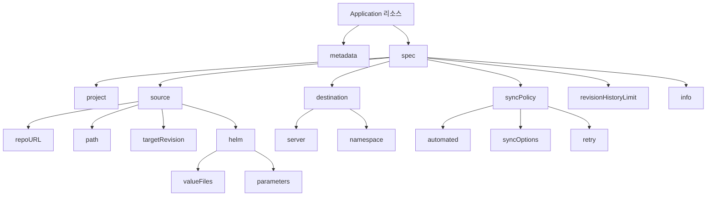
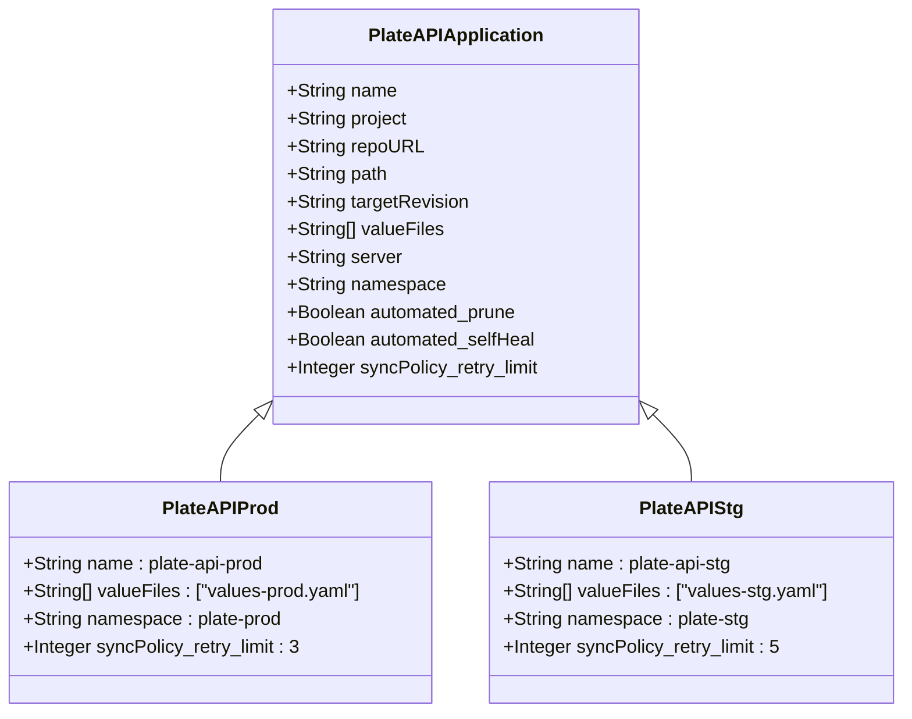
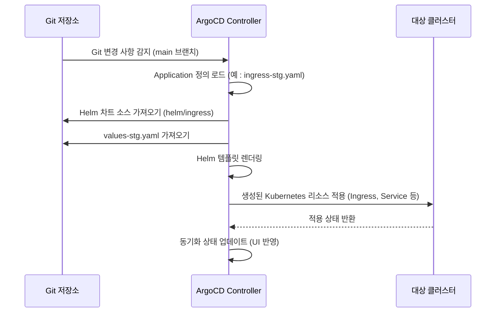

# 배포 정의

<cite>
**이 문서에서 참조한 파일**  
- [plate-api-prod.yaml](file://environments/argocd/apps/plate-api-prod.yaml)
- [plate-api-stg.yaml](file://environments/argocd/apps/plate-api-stg.yaml)
- [ingress-prod.yaml](file://environments/argocd/apps/ingress-prod.yaml)
- [ingress-stg.yaml](file://environments/argocd/apps/ingress-stg.yaml)
- [app-of-apps.yaml](file://environments/argocd/app-of-apps.yaml)
- [values-prod.yaml](file://helm/applications/plate-server/values-prod.yaml)
- [values-stg.yaml](file://helm/applications/plate-server/values-stg.yaml)
- [values.yaml](file://helm/applications/plate-server/values.yaml)
- [Chart.yaml](file://helm/applications/plate-server/Chart.yaml)
- [ingress-values.yaml](file://helm/ingress/values.yaml)
- [ingress-values-stg.yaml](file://helm/ingress/values-stg.yaml)
</cite>

## 목차
1. [소개](#소개)
2. [Application CRD 구조 분석](#application-crd-구조-분석)
3. [주요 구성 요소 설명](#주요-구성-요소-설명)
4. [환경별 배포 정의 비교](#환경별-배포-정의-비교)
5. [App of Apps 패턴](#app-of-apps-패턴)
6. [결론](#결론)

## 소개
이 문서는 GitOps 기반의 애플리케이션 배포를 정의하는 ArgoCD Application CRD(Application Custom Resource Definition)의 구조와 사용법을 상세히 설명합니다. 특히 `spec` 필드 내부의 핵심 구성 요소인 `project`, `source`, `destination`, `syncPolicy` 등을 분석하고, 실제 운영(production) 및 스테이징(staging) 환경의 배포 예제를 통해 환경별 구성 오버라이드 전략과 다양한 애플리케이션의 배포 차이점을 비교 분석합니다.

## Application CRD 구조 분석

ArgoCD Application 리소스는 Git 저장소에 정의된 선언적 구성에 따라 쿠버네티스 클러스터에 애플리케이션을 배포하고 동기화하는 데 사용됩니다. 아래는 `plate-api-prod.yaml` 파일의 구조를 기반으로 한 핵심 필드 분석입니다.

**Diagram sources**
- [plate-api-prod.yaml](file://environments/argocd/apps/plate-api-prod.yaml#L1-L62)

**Section sources**
- [plate-api-prod.yaml](file://environments/argocd/apps/plate-api-prod.yaml#L1-L62)

## 주요 구성 요소 설명

### project
`spec.project` 필드는 ArgoCD 프로젝트를 지정합니다. 이 프로젝트는 애플리케이션이 접근할 수 있는 클러스터, 네임스페이스, 리소스 유형 등을 제어하는 보안 및 접근 제어 정책을 정의합니다. 본 예제에서는 모든 리소스에 접근 가능한 `default` 프로젝트를 사용합니다.

### source
`spec.source` 필드는 애플리케이션의 구성 소스를 정의합니다.

- **repoURL**: Helm 차트가 위치한 Git 저장소의 URL입니다. 예: `https://github.com/kimjoongwon/prj-devops.git`
- **path**: 저장소 내에서 Helm 차트가 위치한 상대 경로입니다. 예: `helm/applications/plate-server`
- **targetRevision**: 추적할 Git 브랜치, 태그 또는 커밋입니다. 예: `main`
- **helm.valueFiles**: Helm 차트의 기본 `values.yaml`을 오버라이드할 환경별 values 파일 목록입니다. 예: `values-prod.yaml`, `values-stg.yaml`
- **helm.parameters**: Helm 템플릿에 전달할 동적 파라미터입니다. 예: `appName=plate`

### destination
`spec.destination` 필드는 애플리케이션을 배포할 대상 쿠버네티스 클러스터와 네임스페이스를 지정합니다.

- **server**: 대상 클러스터의 API 서버 주소입니다. ArgoCD가 동일한 클러스터에 설치된 경우 `https://kubernetes.default.svc`를 사용합니다.
- **namespace**: 애플리케이션 리소스가 생성될 네임스페이스입니다. 예: `plate-prod`, `plate-stg`

### syncPolicy
`spec.syncPolicy` 필드는 애플리케이션의 동기화 동작을 제어합니다.

- **automated**: Git 저장소의 변경 사항을 자동으로 클러스터에 반영합니다.
  - `prune: true`: Git 저장소에서 삭제된 리소스를 클러스터에서도 자동으로 삭제합니다.
  - `selfHeal: true`: 클러스터에서 수동으로 변경된 리소스를 Git 저장소의 상태로 자동 복구합니다.
- **syncOptions**: 동기화 옵션을 정의합니다.
  - `CreateNamespace=true`: 대상 네임스페이스가 존재하지 않으면 자동으로 생성합니다.
  - `ApplyOutOfSyncOnly=true`: 동기화되지 않은 리소스만 적용하여 성능을 최적화합니다.
  - `RespectIgnoreDifferences=true`: `ignoreDifferences` 설정을 준수합니다.
- **retry**: 동기화 실패 시 재시도 정책을 정의합니다. `limit`, `backoff.duration`, `backoff.factor`, `maxDuration` 등을 설정하여 운영 환경의 안정성을 보장합니다.

### ignoreDifferences
`spec.ignoreDifferences` 필드는 특정 필드의 변경 사항을 무시하도록 ArgoCD에 지시합니다. 예를 들어, `ingress-prod.yaml`에서는 Ingress 리소스의 `.metadata.annotations` 필드를 무시하도록 설정하여, 인그레스 컨트롤러가 자동으로 추가하는 어노테이션으로 인한 지속적인 동기화 불일치를 방지합니다.

### info
`spec.info` 필드는 ArgoCD UI에 표시될 사용자 정의 정보입니다. 환경, 도메인, 설명 등을 추가하여 운영 편의성을 높일 수 있습니다.

**Section sources**
- [plate-api-prod.yaml](file://environments/argocd/apps/plate-api-prod.yaml#L13-L52)
- [ingress-prod.yaml](file://environments/argocd/apps/ingress-prod.yaml#L14-L70)

## 환경별 배포 정의 비교

다양한 애플리케이션의 배포 정의를 비교 분석합니다.

### plate-api (API 서버)
`plate-api` 애플리케이션은 운영과 스테이징 환경에서 주로 `valueFiles`와 `retry` 정책에서 차이를 보입니다.

- **valueFiles**: 운영 환경은 `values-prod.yaml`, 스테이징 환경은 `values-stg.yaml`을 참조합니다. 이 파일들은 리소스 요청/제한, 이미지 풀 정책(`pullPolicy`) 등 환경별로 다른 설정을 포함합니다.
- **retry**: 운영 환경은 보수적인 `limit: 3` 재시도 정책을 사용하는 반면, 스테이징 환경은 `limit: 5`로 더 많은 재시도를 허용합니다.

**Diagram sources**
- [plate-api-prod.yaml](file://environments/argocd/apps/plate-api-prod.yaml#L2-L62)
- [plate-api-stg.yaml](file://environments/argocd/apps/plate-api-stg.yaml#L2-L62)
- [values-prod.yaml](file://helm/applications/plate-server/values-prod.yaml#L1-L22)
- [values-stg.yaml](file://helm/applications/plate-server/values-stg.yaml#L1-L19)

**Section sources**
- [plate-api-prod.yaml](file://environments/argocd/apps/plate-api-prod.yaml#L1-L62)
- [plate-api-stg.yaml](file://environments/argocd/apps/plate-api-stg.yaml#L1-L62)

### ingress (인그레스 컨트롤러)
`ingress` 애플리케이션은 운영과 스테이징 환경에서 `valueFiles`, `destination.namespace`, `hosts`, `tls` 설정에서 차이를 보입니다.

- **valueFiles**: 운영 환경은 `values.yaml`, 스테이징 환경은 `values-stg.yaml`을 사용합니다.
- **destination.namespace**: 운영은 `plate-prod`, 스테이징은 `plate-stg` 네임스페이스에 배포됩니다.
- **hosts & tls**: 운영은 `cocdev.co.kr` 도메인과 `web-prod-tls` 시크릿을 사용하고, 스테이징은 `stg.cocdev.co.kr`, `llm.cocdev.co.kr` 도메인과 `plate-stg-tls` 시크릿을 사용합니다.
- **ssl-redirect**: 두 환경 모두 `false`로 설정되어 HTTP를 허용합니다.

**Diagram sources**
- [ingress-prod.yaml](file://environments/argocd/apps/ingress-prod.yaml#L1-L81)
- [ingress-stg.yaml](file://environments/argocd/apps/ingress-stg.yaml#L1-L70)
- [values.yaml](file://helm/ingress/values.yaml#L1-L49)
- [values-stg.yaml](file://helm/ingress/values-stg.yaml#L1-L59)

**Section sources**
- [ingress-prod.yaml](file://environments/argocd/apps/ingress-prod.yaml#L1-L81)
- [ingress-stg.yaml](file://environments/argocd/apps/ingress-stg.yaml#L1-L70)

## App of Apps 패턴

`app-of-apps.yaml` 파일은 "App of Apps" 패턴을 구현합니다. 이 패턴은 하나의 상위 Application 리소스가 여러 하위 Application 리소스들을 관리하는 구조입니다.

- **source.path**: `environments/argocd/apps` 디렉터리로 설정되어, 이 디렉터리 내의 모든 Application YAML 파일(`plate-api-prod.yaml`, `ingress-stg.yaml` 등)을 자동으로 동기화합니다.
- **destination**: `argocd` 네임스페이스에 배포되며, 이는 ArgoCD 자체가 관리하는 리소스임을 의미합니다.
- **syncPolicy**: 자동 동기화(`automated`)가 활성화되어, `environments/argocd/apps` 디렉터리에 새로운 Application 파일이 추가되거나 변경되면 자동으로 클러스터에 반영됩니다.

이 패턴을 통해 전체 플랫폼의 애플리케이션을 하나의 진입점에서 관리할 수 있어, 배포의 일관성과 운영 효율성을 크게 향상시킵니다.

**Section sources**
- [app-of-apps.yaml](file://environments/argocd/app-of-apps.yaml#L1-L35)

## 결론

ArgoCD Application CRD를 통한 GitOps 배포는 선언적이고 일관성 있는 애플리케이션 관리를 가능하게 합니다. `spec` 필드의 `project`, `source`, `destination`, `syncPolicy` 등의 구성 요소를 정교하게 설정함으로써, 운영과 스테이징 환경의 요구사항을 충족시키는 안정적인 배포 파이프라인을 구축할 수 있습니다. 특히 `helm.valueFiles`를 활용한 환경별 구성 오버라이드 전략과 "App of Apps" 패턴은 복잡한 멀티-애플리케이션 환경을 효과적으로 관리하는 데 핵심적인 역할을 합니다. 각 애플리케이션의 배포 정의를 비교 분석함으로써, 공통 패턴을 추출하고 표준화된 배포 프로세스를 수립할 수 있습니다.