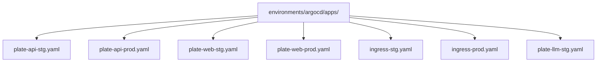
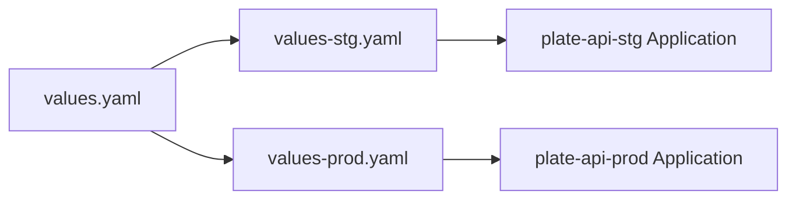
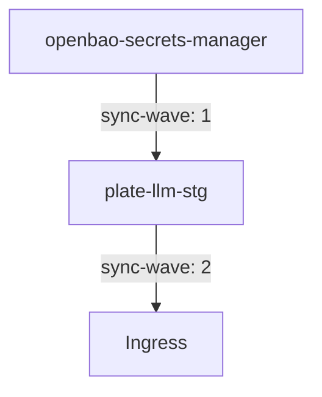
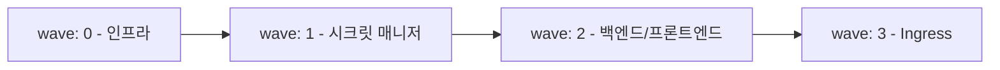

# 환경 관리

<cite>
**이 문서에서 참조한 파일**  
- [app-of-apps.yaml](file://environments/argocd/app-of-apps.yaml)
- [plate-api-stg.yaml](file://environments/argocd/apps/plate-api-stg.yaml)
- [plate-api-prod.yaml](file://environments/argocd/apps/plate-api-prod.yaml)
- [plate-web-stg.yaml](file://environments/argocd/apps/plate-web-stg.yaml)
- [plate-web-prod.yaml](file://environments/argocd/apps/plate-web-prod.yaml)
- [plate-llm-stg.yaml](file://environments/argocd/apps/plate-llm-stg.yaml)
- [ingress-stg.yaml](file://environments/argocd/apps/ingress-stg.yaml)
- [ingress-prod.yaml](file://environments/argocd/apps/ingress-prod.yaml)
- [values-stg.yaml](file://helm/applications/plate-api/values-stg.yaml)
- [values-prod.yaml](file://helm/applications/plate-api/values-prod.yaml)
- [values-stg.yaml](file://helm/applications/plate-web/values-stg.yaml)
- [values-prod.yaml](file://helm/applications/plate-web/values-prod.yaml)
- [values-stg.yaml](file://helm/applications/plate-llm/values-stg.yaml)
- [values.yaml](file://helm/applications/plate-llm/values.yaml)
- [values-stg.yaml](file://helm/ingress/values-stg.yaml)
- [values.yaml](file://helm/ingress/values.yaml)
</cite>

## 목차
1. [소개](#소개)
2. [환경별 애플리케이션 정의 구조](#환경별-애플리케이션-정의-구조)
3. [환경별 values 파일 관리 전략](#환경별-values-파일-관리-전략)
4. [환경별 구성 차이점 분석](#환경별-구성-차이점-분석)
5. [Ingress와 백엔드 애플리케이션의 배포 의존성 관리](#ingress와-백엔드-애플리케이션의-배포-의존성-관리)
6. [sync-wave를 활용한 배포 순서 제어](#sync-wave를-활용한-배포-순서-제어)
7. [환경 간 구성 일관성 유지 및 변경 사항 전파 전략](#환경-간-구성-일관성-유지-및-변경-사항-전파-전략)

## 소개
이 문서는 ArgoCD를 활용한 다중 환경(스테이징 및 프로덕션) 관리 전략을 설명합니다. 스테이징(stg)과 프로덕션(prod) 환경을 위한 별도의 Application 정의 파일 구조를 분석하고, 각 환경별로 다른 valueFiles를 적용하는 방법을 안내합니다. 또한, 환경별 리소스 요청/제한, 복제본 수, 보안 설정 등의 차이점을 실제 예제를 통해 설명합니다. Ingress 리소스와 백엔드 애플리케이션 간의 배포 의존성 관리 전략을 제시하고, sync-wave를 사용하여 Ingress가 애플리케이션 이후에 배포되도록 보장하는 방법을 설명합니다. 마지막으로, 환경 간 구성 일관성 유지 및 변경 사항 전파 전략을 포함합니다.

## 환경별 애플리케이션 정의 구조
ArgoCD는 Application 리소스를 통해 Kubernetes 애플리케이션의 배포를 관리합니다. 이 프로젝트에서는 스테이징과 프로덕션 환경을 위해 각각 별도의 Application 정의 파일을 사용합니다. 이러한 파일들은 `environments/argocd/apps/` 디렉터리에 위치하며, 각 애플리케이션 이름 뒤에 환경 접미사(`-stg`, `-prod`)를 붙여 구분합니다.

예를 들어, `plate-api` 애플리케이션의 경우 `plate-api-stg.yaml`과 `plate-api-prod.yaml` 두 개의 파일이 존재하며, 각각 스테이징 및 프로덕션 환경에 배포됩니다. 이러한 구조는 환경 간 구성 분리를 가능하게 하며, 각 환경에 맞는 맞춤형 설정을 적용할 수 있도록 합니다.

**Diagram sources**
- [plate-api-stg.yaml](file://environments/argocd/apps/plate-api-stg.yaml)
- [plate-api-prod.yaml](file://environments/argocd/apps/plate-api-prod.yaml)
- [plate-web-stg.yaml](file://environments/argocd/apps/plate-web-stg.yaml)
- [plate-web-prod.yaml](file://environments/argocd/apps/plate-web-prod.yaml)
- [ingress-stg.yaml](file://environments/argocd/apps/ingress-stg.yaml)
- [ingress-prod.yaml](file://environments/argocd/apps/ingress-prod.yaml)
- [plate-llm-stg.yaml](file://environments/argocd/apps/plate-llm-stg.yaml)

**Section sources**
- [plate-api-stg.yaml](file://environments/argocd/apps/plate-api-stg.yaml)
- [plate-api-prod.yaml](file://environments/argocd/apps/plate-api-prod.yaml)
- [plate-web-stg.yaml](file://environments/argocd/apps/plate-web-stg.yaml)
- [plate-web-prod.yaml](file://environments/argocd/apps/plate-web-prod.yaml)
- [ingress-stg.yaml](file://environments/argocd/apps/ingress-stg.yaml)
- [ingress-prod.yaml](file://environments/argocd/apps/ingress-prod.yaml)
- [plate-llm-stg.yaml](file://environments/argocd/apps/plate-llm-stg.yaml)

## 환경별 values 파일 관리 전략
Helm 차트는 `values.yaml` 파일을 통해 구성 값을 관리합니다. 이 프로젝트에서는 기본값을 정의한 `values.yaml` 외에도, 환경별로 오버라이드할 값을 정의한 `values-stg.yaml` 및 `values-prod.yaml` 파일을 사용합니다.

ArgoCD Application 정의에서 `source.helm.valueFiles` 필드를 통해 환경에 맞는 values 파일을 지정합니다. 예를 들어, `plate-api-stg.yaml`에서는 `values-stg.yaml`을, `plate-api-prod.yaml`에서는 `values-prod.yaml`을 참조하도록 설정되어 있습니다. 이를 통해 동일한 Helm 차트를 다양한 환경에 맞게 유연하게 배포할 수 있습니다.

**Diagram sources**
- [values-stg.yaml](file://helm/applications/plate-api/values-stg.yaml)
- [values-prod.yaml](file://helm/applications/plate-api/values-prod.yaml)
- [plate-api-stg.yaml](file://environments/argocd/apps/plate-api-stg.yaml)
- [plate-api-prod.yaml](file://environments/argocd/apps/plate-api-prod.yaml)

**Section sources**
- [values-stg.yaml](file://helm/applications/plate-api/values-stg.yaml)
- [values-prod.yaml](file://helm/applications/plate-api/values-prod.yaml)
- [plate-api-stg.yaml](file://environments/argocd/apps/plate-api-stg.yaml)
- [plate-api-prod.yaml](file://environments/argocd/apps/plate-api-prod.yaml)

## 환경별 구성 차이점 분석
스테이징과 프로덕션 환경은 목적과 요구사항이 다르기 때문에, 다양한 구성 요소에서 차이점을 보입니다. 아래는 주요 구성 항목별 차이점입니다.

### 복제본 수 (replicaCount)
- **스테이징**: `replicaCount: 1` (리소스 절약 및 테스트 목적)
- **프로덕션**: `replicaCount: 1` (현재는 동일하지만, 장애 대비를 위해 증가 가능)

### 이미지 태그 및 풀 정책
- **스테이징**: `tag: "latest"`, `pullPolicy: Always` (최신 빌드를 항상 가져와 테스트)
- **프로덕션**: `tag: "latest"`, `pullPolicy: IfNotPresent` (안정성 확보 및 네트워크 부하 감소)

### 리소스 요청 및 제한
- **스테이징**: CPU 200m 요청, 메모리 512Mi 제한
- **프로덕션**: CPU 250m 요청, 메모리 512Mi 제한 (안정성 향상을 위한 약간의 증가)

### Ingress 및 보안 설정
- **스테이징**: HTTP 허용 (`ssl-redirect: "false"`), 테스트 편의성 중심
- **프로덕션**: HTTPS 강제, 실서명 인증서 사용, 보안 중심 구성

이러한 차이점은 각 환경의 values 파일에 명시되어 있으며, ArgoCD를 통해 일관되게 적용됩니다.

**Section sources**
- [values-stg.yaml](file://helm/applications/plate-api/values-stg.yaml)
- [values-prod.yaml](file://helm/applications/plate-api/values-prod.yaml)
- [values-stg.yaml](file://helm/applications/plate-web/values-stg.yaml)
- [values-prod.yaml](file://helm/applications/plate-web/values-prod.yaml)
- [values-stg.yaml](file://helm/ingress/values-stg.yaml)
- [values.yaml](file://helm/ingress/values.yaml)

## Ingress와 백엔드 애플리케이션의 배포 의존성 관리
Ingress 리소스는 백엔드 애플리케이션의 서비스를 외부에 노출하는 역할을 합니다. 따라서 Ingress가 백엔드 애플리케이션보다 먼저 배포되면, 트래픽이 존재하지 않는 서비스로 라우팅되어 오류가 발생할 수 있습니다. 이를 방지하기 위해, Ingress 애플리케이션은 백엔드 애플리케이션 이후에 배포되어야 합니다.

이 프로젝트에서는 `plate-llm-stg` 애플리케이션이 `openbao-secrets-manager`에 의존하는 경우를 예로 들 수 있습니다. `plate-llm-stg.yaml` 파일의 메타데이터에 `argocd.argoproj.io/sync-wave: "2"` 어노테이션이 설정되어 있으며, 이는 `wave: 1`인 `openbao-secrets-manager` 이후에 배포되도록 지정합니다.

**Diagram sources**
- [plate-llm-stg.yaml](file://environments/argocd/apps/plate-llm-stg.yaml)

**Section sources**
- [plate-llm-stg.yaml](file://environments/argocd/apps/plate-llm-stg.yaml)

## sync-wave를 활용한 배포 순서 제어
ArgoCD의 `sync-wave` 기능은 애플리케이션 간의 배포 순서를 정의하는 데 사용됩니다. `sync-wave` 값이 낮은 애플리케이션이 먼저 동기화되고, 값이 높은 애플리케이션이 이후에 동기화됩니다. 동일한 `sync-wave` 값을 가진 애플리케이션은 동시에 동기화됩니다.

이 프로젝트에서는 다음과 같은 전략을 사용할 수 있습니다:
- `wave: 0`: 공통 인프라 (cert-manager, metallb 등)
- `wave: 1`: 시크릿 매니저 및 데이터베이스
- `wave: 2`: 백엔드 및 프론트엔드 애플리케이션
- `wave: 3`: Ingress 컨트롤러 및 Ingress 리소스

이를 통해 Ingress가 애플리케이션 이후에 안전하게 배포되도록 보장할 수 있습니다.

**Diagram sources**
- [plate-llm-stg.yaml](file://environments/argocd/apps/plate-llm-stg.yaml)

**Section sources**
- [plate-llm-stg.yaml](file://environments/argocd/apps/plate-llm-stg.yaml)

## 환경 간 구성 일관성 유지 및 변경 사항 전파 전략
환경 간 구성 일관성을 유지하기 위해, 공통된 기본값은 `values.yaml`에 정의하고, 환경별로 필요한 오버라이드만 `values-stg.yaml` 및 `values-prod.yaml`에 작성합니다. 또한, 모든 변경 사항은 Git 저장소를 통해 관리되며, ArgoCD가 GitOps 원칙에 따라 클러스터 상태를 자동으로 동기화합니다.

변경 사항 전파 전략으로는 다음과 같은 절차를 따릅니다:
1. 변경 사항을 `values.yaml` 또는 환경별 values 파일에 커밋합니다.
2. ArgoCD가 변경을 감지하고, 자동으로 클러스터에 동기화합니다.
3. 스테이징 환경에서 변경 사항을 검증합니다.
4. 문제가 없으면 프로덕션 환경에 동일한 변경 사항을 적용합니다.

이러한 절차를 통해 안정적이고 예측 가능한 배포를 보장할 수 있습니다.

**Section sources**
- [values.yaml](file://helm/applications/plate-llm/values.yaml)
- [values-stg.yaml](file://helm/applications/plate-llm/values-stg.yaml)
- [app-of-apps.yaml](file://environments/argocd/app-of-apps.yaml)