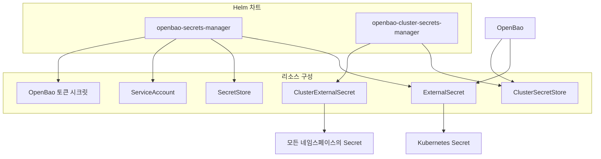
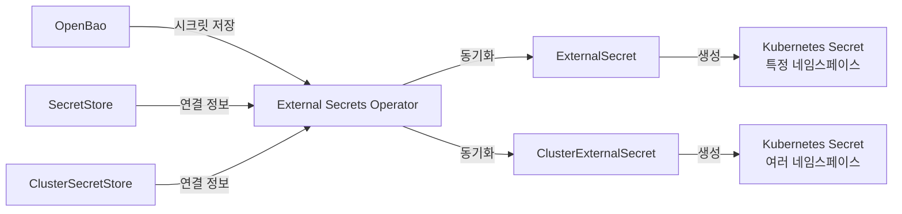
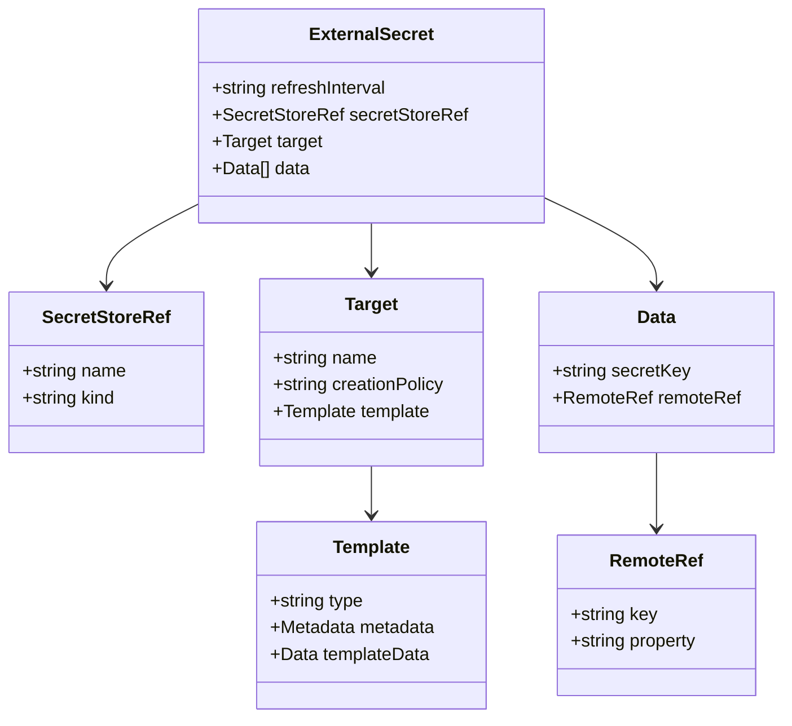
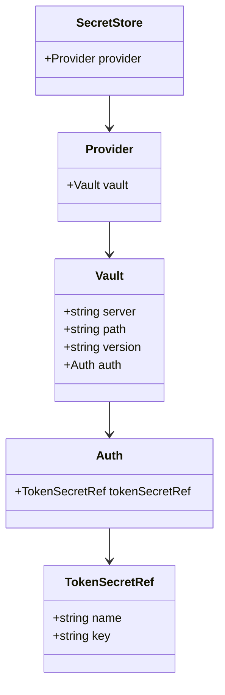
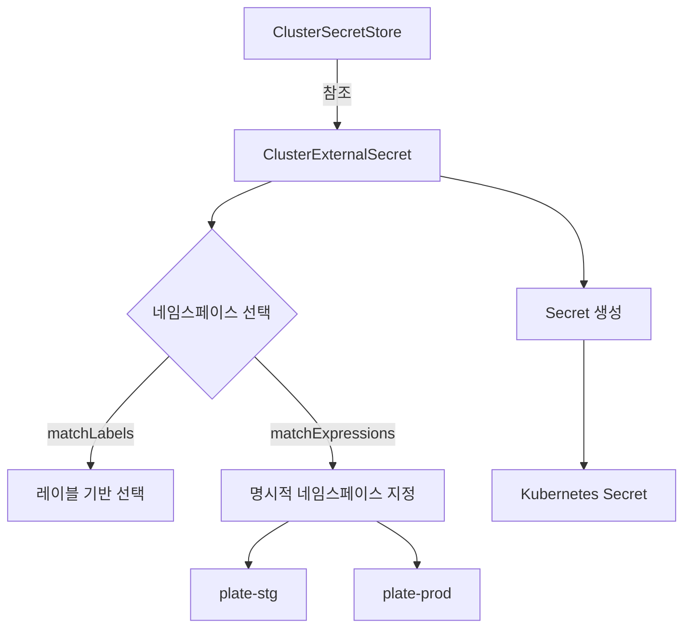
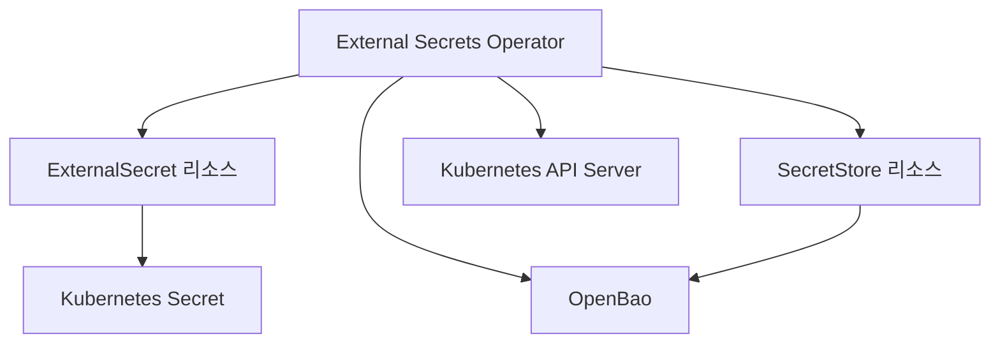

# ExternalSecret 구성

<cite>
**이 문서에서 참조한 파일**
- [external-secret.yaml](file://helm/shared-configs/openbao-secrets-manager/templates/external-secret.yaml)
- [secret-store.yaml](file://helm/shared-configs/openbao-secrets-manager/templates/secret-store.yaml)
- [values.yaml](file://helm/shared-configs/openbao-secrets-manager/values.yaml)
- [openbao-token-secret.yaml](file://helm/shared-configs/openbao-secrets-manager/templates/openbao-token-secret.yaml)
- [service-account.yaml](file://helm/shared-configs/openbao-secrets-manager/templates/service-account.yaml)
- [cluster-secret-store.yaml](file://helm/shared-configs/openbao-cluster-secrets-manager/templates/cluster-secret-store.yaml)
- [cluster-external-secret.yaml](file://helm/shared-configs/openbao-cluster-secrets-manager/templates/cluster-external-secret.yaml)
- [openbao-cluster-secrets-manager/values.yaml](file://helm/shared-configs/openbao-cluster-secrets-manager/values.yaml)
</cite>

## 목차
1. [소개](#소개)
2. [프로젝트 구조](#프로젝트-구조)
3. [핵심 구성 요소](#핵심-구성-요소)
4. [아키텍처 개요](#아키텍처-개요)
5. [상세 구성 요소 분석](#상세-구성-요소-분석)
6. [의존성 분석](#의존성-분석)
7. [성능 고려사항](#성능-고려사항)
8. [문제 해결 가이드](#문제-해결-가이드)
9. [결론](#결론)

## 소개
이 문서는 OpenBao에서 관리되는 시크릿이 Kubernetes 클러스터 내에서 어떻게 ExternalSecret 리소스를 통해 자동 동기화되는지에 대해 상세히 설명합니다. OpenBao는 중앙 집중식 시크릿 관리 솔루션으로, 외부 시스템에서 민감한 정보를 안전하게 저장하고 관리합니다. External Secrets Operator는 이러한 외부 시크릿을 Kubernetes Secret으로 동기화하는 역할을 하며, 이 과정에서 ExternalSecret CRD(Custom Resource Definition)가 핵심적인 구성 요소로 작동합니다.

본 문서는 ExternalSecret 리소스의 필드별 의미와 사용 방법을 설명하고, 동기화 주기, 필터링 전략, 데이터 변환 방식 등의 구현 세부 사항을 포함합니다. 또한 다수의 시크릿을 효율적으로 관리하는 패턴과 동기화 실패 시 문제 해결 방법, 모니터링 포인트도 안내합니다.

## 프로젝트 구조

이 프로젝트는 Helm 차트 기반으로 구성되어 있으며, `helm/shared-configs/openbao-secrets-manager` 디렉터리에 ExternalSecret 관련 리소스들이 정의되어 있습니다. 주요 구성 요소는 다음과 같습니다:

- `templates/` 디렉터리: ExternalSecret, SecretStore, ServiceAccount, 토큰 시크릿 등의 Kubernetes 리소스 템플릿
- `values.yaml`: 환경별로 공통으로 사용되는 기본 설정 값들
- `values-staging.yaml`, `values-production.yaml`: 각 환경별 오버라이드 설정

또한 클러스터 전역에서 사용되는 시크릿은 `openbao-cluster-secrets-manager` 차트를 통해 관리되며, ClusterSecretStore와 ClusterExternalSecret 리소스를 사용합니다.

**다이어그램 출처**
- [external-secret.yaml](file://helm/shared-configs/openbao-secrets-manager/templates/external-secret.yaml)
- [secret-store.yaml](file://helm/shared-configs/openbao-secrets-manager/templates/secret-store.yaml)
- [cluster-secret-store.yaml](file://helm/shared-configs/openbao-cluster-secrets-manager/templates/cluster-secret-store.yaml)

**섹션 출처**
- [external-secret.yaml](file://helm/shared-configs/openbao-secrets-manager/templates/external-secret.yaml)
- [secret-store.yaml](file://helm/shared-configs/openbao-secrets-manager/templates/secret-store.yaml)

## 핵심 구성 요소

ExternalSecret 리소스는 OpenBao에 저장된 시크릿을 특정 네임스페이스의 Kubernetes Secret으로 동기화하는 데 사용됩니다. 이 리소스는 `.Values.global.namespaces`에 정의된 각 네임스페이스별로 생성되며, 환경에 따라 `staging`, `production`으로 레이블이 지정됩니다.

SecretStore 리소스는 OpenBao 서버에 대한 연결 정보와 인증 방법을 정의합니다. 이 리소스는 각 네임스페이스에 생성되며, ExternalSecret이 OpenBao에 접근할 수 있도록 합니다.

ServiceAccount는 External Secrets Operator가 리소스에 접근할 수 있도록 하며, 토큰 시크릿은 OpenBao 인증에 사용되는 토큰을 저장합니다.

**섹션 출처**
- [external-secret.yaml](file://helm/shared-configs/openbao-secrets-manager/templates/external-secret.yaml)
- [secret-store.yaml](file://helm/shared-configs/openbao-secrets-manager/templates/secret-store.yaml)
- [service-account.yaml](file://helm/shared-configs/openbao-secrets-manager/templates/service-account.yaml)
- [openbao-token-secret.yaml](file://helm/shared-configs/openbao-secrets-manager/templates/openbao-token-secret.yaml)

## 아키텍처 개요

시스템 아키텍처는 OpenBao를 중앙 시크릿 저장소로 사용하고, External Secrets Operator를 통해 Kubernetes 클러스터 내의 시크릿을 자동 동기화하는 구조입니다. Operator는 Custom Resource인 ExternalSecret과 SecretStore를 감시하며, 정의된 주기에 따라 외부 시크릿을 가져와 Kubernetes Secret으로 생성하거나 업데이트합니다.

클러스터 전역에서 공유되어야 하는 시크릿의 경우, ClusterSecretStore와 ClusterExternalSecret을 사용하여 모든 지정된 네임스페이스에 동일한 Secret을 생성할 수 있습니다.

**다이어그램 출처**
- [external-secret.yaml](file://helm/shared-configs/openbao-secrets-manager/templates/external-secret.yaml)
- [cluster-external-secret.yaml](file://helm/shared-configs/openbao-cluster-secrets-manager/templates/cluster-external-secret.yaml)
- [secret-store.yaml](file://helm/shared-configs/openbao-secrets-manager/templates/secret-store.yaml)
- [cluster-secret-store.yaml](file://helm/shared-configs/openbao-cluster-secrets-manager/templates/cluster-secret-store.yaml)

## 상세 구성 요소 분석

### ExternalSecret 분석

ExternalSecret 리소스는 OpenBao에서 시크릿을 가져와 Kubernetes Secret으로 매핑하는 규칙을 정의합니다. 주요 필드는 다음과 같습니다:

- `refreshInterval`: 시크릿 동기화 주기 (기본값: 1시간)
- `secretStoreRef`: 사용할 SecretStore 참조
- `target`: 생성될 Kubernetes Secret의 이름 및 생성 정책
- `data`: OpenBao의 시크릿 키와 Kubernetes Secret의 키를 매핑

**다이어그램 출처**
- [external-secret.yaml](file://helm/shared-configs/openbao-secrets-manager/templates/external-secret.yaml)
- [values.yaml](file://helm/shared-configs/openbao-secrets-manager/values.yaml)

**섹션 출처**
- [external-secret.yaml](file://helm/shared-configs/openbao-secrets-manager/templates/external-secret.yaml)
- [values.yaml](file://helm/shared-configs/openbao-secrets-manager/values.yaml)

### SecretStore 분석

SecretStore 리소스는 외부 시크릿 관리 시스템(OpenBao)에 대한 연결 및 인증 정보를 정의합니다. Vault 프로바이더를 사용하여 OpenBao 서버에 연결하며, 토큰 기반 인증을 수행합니다.

**다이어그램 출처**
- [secret-store.yaml](file://helm/shared-configs/openbao-secrets-manager/templates/secret-store.yaml)
- [values.yaml](file://helm/shared-configs/openbao-secrets-manager/values.yaml)

**섹션 출처**
- [secret-store.yaml](file://helm/shared-configs/openbao-secrets-manager/templates/secret-store.yaml)
- [values.yaml](file://helm/shared-configs/openbao-secrets-manager/values.yaml)

### 클러스터 전역 시크릿 관리

클러스터 전역에서 공유되는 시크릿은 ClusterSecretStore와 ClusterExternalSecret을 사용하여 관리됩니다. ClusterSecretStore는 클러스터 전체에서 사용 가능한 SecretStore이며, ClusterExternalSecret은 지정된 네임스페이스 선택자에 따라 여러 네임스페이스에 동일한 Secret을 생성합니다.

**다이어그램 출처**
- [cluster-secret-store.yaml](file://helm/shared-configs/openbao-cluster-secrets-manager/templates/cluster-secret-store.yaml)
- [cluster-external-secret.yaml](file://helm/shared-configs/openbao-cluster-secrets-manager/templates/cluster-external-secret.yaml)
- [openbao-cluster-secrets-manager/values.yaml](file://helm/shared-configs/openbao-cluster-secrets-manager/values.yaml)

**섹션 출처**
- [cluster-secret-store.yaml](file://helm/shared-configs/openbao-cluster-secrets-manager/templates/cluster-secret-store.yaml)
- [cluster-external-secret.yaml](file://helm/shared-configs/openbao-cluster-secrets-manager/templates/cluster-external-secret.yaml)
- [openbao-cluster-secrets-manager/values.yaml](file://helm/shared-configs/openbao-cluster-secrets-manager/values.yaml)

## 의존성 분석

이 시스템은 다음과 같은 주요 외부 의존성을 가집니다:

- **External Secrets Operator**: Helm 차트의 종속성으로 포함되어 있으며, `external-secrets` 차트를 참조합니다.
- **OpenBao**: 외부 시크릿 저장소로, `https://openbao.cocdev.co.kr`에 위치합니다.
- **Kubernetes API Server**: Operator가 Custom Resource를 감시하고 Secret을 생성하기 위해 필요합니다.

**다이어그램 출처**
- [Chart.yaml](file://helm/shared-configs/openbao-secrets-manager/Chart.yaml)
- [values.yaml](file://helm/shared-configs/openbao-secrets-manager/values.yaml)

**섹션 출처**
- [Chart.yaml](file://helm/shared-configs/openbao-secrets-manager/Chart.yaml)
- [values.yaml](file://helm/shared-configs/openbao-secrets-manager/values.yaml)

## 성능 고려사항

- **동기화 주기**: ExternalSecret의 `refreshInterval`은 기본적으로 1시간으로 설정되어 있으며, 필요에 따라 조정 가능합니다. 너무 짧은 주기는 OpenBao 서버에 부하를 줄 수 있으므로 주의가 필요합니다.
- **클러스터 전역 시크릿**: ClusterExternalSecret은 여러 네임스페이스에 동일한 Secret을 생성하므로, 변경 시 모든 대상 네임스페이스에 영향을 미칩니다. 이는 일관성을 보장하지만, 불필요한 동기화를 초래할 수 있습니다.
- **토큰 관리**: OpenBao 토큰은 수동으로 생성되며(`create: false`) 스크립트를 통해 관리됩니다. 토큰의 만료 및 갱신 정책을 고려해야 합니다.

## 문제 해결 가이드

### 동기화 실패 시 점검 사항

1. **External Secrets Operator 상태 확인**
   - Operator 파드가 정상적으로 실행 중인지 확인
   - 로그에서 인증 오류 또는 네트워크 오류 확인

2. **SecretStore 구성 점검**
   - OpenBao 서버 주소, 경로, 버전이 올바른지 확인
   - 토큰 시크릿 참조가 정확한지 확인

3. **OpenBao 토큰 유효성 검사**
   - 토큰이 유효하고 필요한 권한을 가지고 있는지 확인
   - 토큰이 만료되지 않았는지 확인

4. **네트워크 연결 확인**
   - Kubernetes 클러스터에서 OpenBao 서버로의 네트워크 연결이 가능한지 확인
   - 방화벽 또는 네트워크 정책에서 차단되지 않았는지 확인

5. **ExternalSecret 리소스 상태 확인**
   - `kubectl describe externalsecret <name>` 명령으로 상태 및 이벤트 확인
   - `Status` 섹션에서 동기화 오류 메시지 확인

### 모니터링 포인트

- **Operator 메트릭스**: External Secrets Operator는 Prometheus 메트릭스를 제공하며, 동기화 성공/실패 횟수, 지연 시간 등을 모니터링할 수 있습니다.
- **이벤트 로그**: Kubernetes 이벤트를 통해 ExternalSecret 리소스의 동기화 시도 및 결과를 추적할 수 있습니다.
- **OpenBao 감사 로그**: OpenBao 측의 감사 로그를 통해 시크릿 접근 이력을 확인할 수 있습니다.

**섹션 출처**
- [external-secret.yaml](file://helm/shared-configs/openbao-secrets-manager/templates/external-secret.yaml)
- [secret-store.yaml](file://helm/shared-configs/openbao-secrets-manager/templates/secret-store.yaml)
- [values.yaml](file://helm/shared-configs/openbao-secrets-manager/values.yaml)

## 결론

ExternalSecret 리소스를 통한 외부 시크릿 동기화는 OpenBao와 Kubernetes 간의 안전한 시크릿 관리 통합을 가능하게 합니다. 이 문서에서 설명한 구성 방식을 통해 환경별로 적절한 시크릿을 자동으로 동기화할 수 있으며, 클러스터 전역 시크릿 관리를 위한 패턴도 제공합니다. 동기화 주기, 데이터 매핑, 오류 처리 전략을 적절히 설계함으로써 안정적이고 확장 가능한 시크릿 관리 시스템을 구축할 수 있습니다.