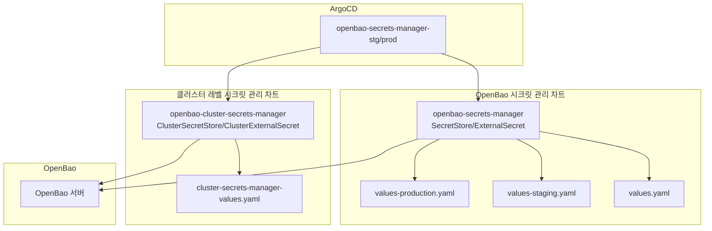
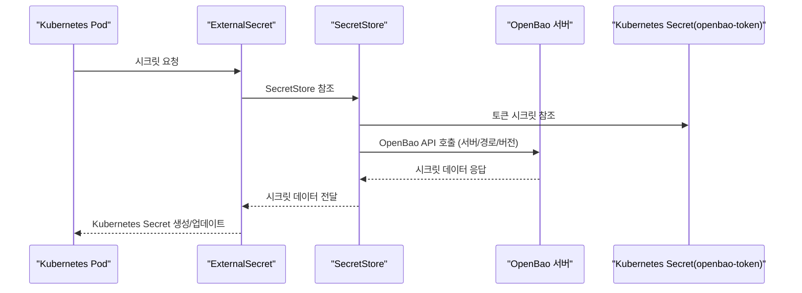
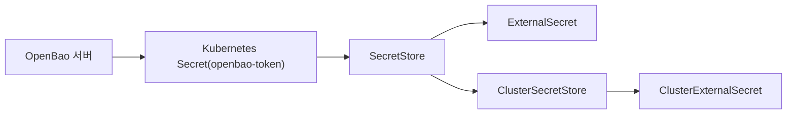

# SecretStore 설정

<cite>
**이 문서에서 참조하는 파일**
- [Chart.yaml](file://helm/shared-configs/openbao-secrets-manager/Chart.yaml)
- [secret-store.yaml](file://helm/shared-configs/openbao-secrets-manager/templates/secret-store.yaml)
- [values.yaml](file://helm/shared-configs/openbao-secrets-manager/values.yaml)
- [values-staging.yaml](file://helm/shared-configs/openbao-secrets-manager/values-staging.yaml)
- [values-production.yaml](file://helm/shared-configs/openbao-secrets-manager/values-production.yaml)
- [cluster-secret-store.yaml](file://helm/shared-configs/openbao-cluster-secrets-manager/templates/cluster-secret-store.yaml)
- [cluster-external-secret.yaml](file://helm/shared-configs/openbao-cluster-secrets-manager/templates/cluster-external-secret.yaml)
- [cluster-secrets-manager-values.yaml](file://helm/shared-configs/openbao-cluster-secrets-manager/values.yaml)
- [create-token.sh](file://scripts/openbao/create-token.sh)
- [openbao-secrets-manager-prod.yaml](file://environments/argocd/apps/openbao-secrets-manager-prod.yaml)
- [openbao-secrets-manager-stg.yaml](file://environments/argocd/apps/openbao-secrets-manager-stg.yaml)
</cite>

## 목차
1. [소개](#소개)
2. [프로젝트 구조](#프로젝트-구조)
3. [핵심 구성 요소](#핵심-구성-요소)
4. [아키텍처 개요](#아키텍처-개요)
5. [상세 구성 분석](#상세-구성-분석)
6. [의존성 분석](#의존성-분석)
7. [성능 고려사항](#성능-고려사항)
8. [장애 대응 가이드](#장애-대응-가이드)
9. [결론](#결론)
10. [부록](#부록)

## 소개
이 문서는 Kubernetes 클러스터 내 OpenBao 시크릿을 안전하게 관리하기 위한 SecretStore 기반 설정을 상세히 설명합니다. OpenBao 엔드포인트 연결 정보, 인증 방식(TLS, 토큰), 여러 환경(스테이징/프로덕션)별 차이점, 보안상 중요한 설정값의 기본값과 권장값, 연결 테스트 방법, 인증서 갱신 프로세스까지 포괄적으로 다룹니다.

## 프로젝트 구조
- 공통 시크릿 관리 차트: openbao-secrets-manager
  - SecretStore/ExternalSecret 템플릿과 기본값 제공
  - 스테이징/프로덕션별 values 파일을 통해 환경 차이 반영
- 클러스터 레벨 시크릿 관리 차트: openbao-cluster-secrets-manager
  - ClusterSecretStore/ClusterExternalSecret 템플릿과 기본값 제공
  - 모든 네임스페이스에 동일한 시크릿 배포
- OpenBao 토큰 생성 스크립트: scripts/openbao/create-token.sh
  - OpenBao 연결 테스트, 토큰 생성/갱신/폐기, Kubernetes Secret 생성
- ArgoCD 어플리케이션 정의: environments/argocd/apps
  - 각 환경별 openbao-secrets-manager 어플리케이션 정의

**도표 출처**
- [secret-store.yaml](file://helm/shared-configs/openbao-secrets-manager/templates/secret-store.yaml#L1-L29)
- [values.yaml](file://helm/shared-configs/openbao-secrets-manager/values.yaml#L1-L233)
- [values-staging.yaml](file://helm/shared-configs/openbao-secrets-manager/values-staging.yaml#L1-L167)
- [values-production.yaml](file://helm/shared-configs/openbao-secrets-manager/values-production.yaml#L1-L196)
- [cluster-secret-store.yaml](file://helm/shared-configs/openbao-cluster-secrets-manager/templates/cluster-secret-store.yaml#L1-L31)
- [cluster-external-secret.yaml](file://helm/shared-configs/openbao-cluster-secrets-manager/templates/cluster-external-secret.yaml#L1-L55)
- [cluster-secrets-manager-values.yaml](file://helm/shared-configs/openbao-cluster-secrets-manager/values.yaml#L1-L49)
- [openbao-secrets-manager-stg.yaml](file://environments/argocd/apps/openbao-secrets-manager-stg.yaml)
- [openbao-secrets-manager-prod.yaml](file://environments/argocd/apps/openbao-secrets-manager-prod.yaml)

**섹션 출처**
- [Chart.yaml](file://helm/shared-configs/openbao-secrets-manager/Chart.yaml#L1-L25)

## 핵심 구성 요소
- SecretStore
  - OpenBao 서버, 볼륨 엔진 경로, 버전, 인증 토큰 시크릿 참조를 정의
  - 네임스페이스별로 생성되며, ExternalSecret이 이를 참조하여 시크릿 동기화
- ExternalSecret
  - SecretStore를 참조하고, OpenBao 경로/속성에 따라 Kubernetes Secret 생성
  - refreshInterval, 타겟 Secret 이름/생성 정책, 라벨/템플릿 등을 설정
- ClusterSecretStore/ClusterExternalSecret
  - 클러스터 전역에서 사용 가능한 SecretStore/ExternalSecret
  - 특정 네임스페이스 집합에 동일한 시크릿 배포
- OpenBao 토큰
  - 토큰 생성/갱신/폐기, Kubernetes Secret 생성, 연결 테스트를 지원하는 스크립트

**섹션 출처**
- [secret-store.yaml](file://helm/shared-configs/openbao-secrets-manager/templates/secret-store.yaml#L1-L29)
- [values.yaml](file://helm/shared-configs/openbao-secrets-manager/values.yaml#L1-L233)
- [values-staging.yaml](file://helm/shared-configs/openbao-secrets-manager/values-staging.yaml#L1-L167)
- [values-production.yaml](file://helm/shared-configs/openbao-secrets-manager/values-production.yaml#L1-L196)
- [cluster-secret-store.yaml](file://helm/shared-configs/openbao-cluster-secrets-manager/templates/cluster-secret-store.yaml#L1-L31)
- [cluster-external-secret.yaml](file://helm/shared-configs/openbao-cluster-secrets-manager/templates/cluster-external-secret.yaml#L1-L55)
- [create-token.sh](file://scripts/openbao/create-token.sh#L1-L550)

## 아키텍처 개요
OpenBao 시크릿 관리는 External Secrets Operator 기반으로 작동합니다. SecretStore/ExternalSecret은 OpenBao 서버에 연결하여 지정된 경로의 키/값을 읽어 Kubernetes Secret으로 동기화합니다. 클러스터 레벨 시크릿은 ClusterSecretStore/ClusterExternalSecret을 통해 모든 지정된 네임스페이스에 배포됩니다.

**도표 출처**
- [secret-store.yaml](file://helm/shared-configs/openbao-secrets-manager/templates/secret-store.yaml#L1-L29)
- [values.yaml](file://helm/shared-configs/openbao-secrets-manager/values.yaml#L1-L233)
- [cluster-secret-store.yaml](file://helm/shared-configs/openbao-cluster-secrets-manager/templates/cluster-secret-store.yaml#L1-L31)
- [cluster-external-secret.yaml](file://helm/shared-configs/openbao-cluster-secrets-manager/templates/cluster-external-secret.yaml#L1-L55)

## 상세 구성 분석

### SecretStore 구성
- OpenBao 엔드포인트 연결 정보
  - server: OpenBao 서버 URL
  - path: 볼륨 엔진 경로 (예: secret/)
  - version: API 버전 (예: v2)
- 인증 방식
  - tokenSecretRef: 토큰 시크릿 이름과 키 이름
- 네임스페이스 적용
  - global.namespaces에 지정된 모든 네임스페이스에 SecretStore 생성
  - 환경 라벨(environment) 자동 설정 (staging/production/development)

**섹션 출처**
- [secret-store.yaml](file://helm/shared-configs/openbao-secrets-manager/templates/secret-store.yaml#L1-L29)
- [values.yaml](file://helm/shared-configs/openbao-secrets-manager/values.yaml#L1-L233)

### ExternalSecret 구성
- SecretStore 참조
  - secretStoreRef: SecretStore 이름과 kind
- 시크릿 동기화
  - refreshInterval: 시크릿 동기화 주기
  - target: 타겟 Secret 이름, 생성 정책, 라벨/템플릿
- 데이터 매핑
  - data: secretKey(remoteRef.key/property)를 통해 OpenBao 경로 속성 매핑
  - 환경별 values-staging.yaml/values-production.yaml에서 경로 key를 재정의

**섹션 출처**
- [values.yaml](file://helm/shared-configs/openbao-secrets-manager/values.yaml#L1-L233)
- [values-staging.yaml](file://helm/shared-configs/openbao-secrets-manager/values-staging.yaml#L1-L167)
- [values-production.yaml](file://helm/shared-configs/openbao-secrets-manager/values-production.yaml#L1-L196)

### 클러스터 레벨 SecretStore/ExternalSecret
- ClusterSecretStore
  - server/path/version/auth(tokenSecretRef) 동일하게 설정
  - tokenSecretRef.namespace: 토큰 시크릿이 위치한 네임스페이스 지정
- ClusterExternalSecret
  - namespaceSelector: 지정된 네임스페이스 집합에 시크릿 배포
  - refreshTime: 클러스터 레벨 시크릿 갱신 주기
  - data: OpenBao 경로(secret/server/cluster) 속성 매핑

**섹션 출처**
- [cluster-secret-store.yaml](file://helm/shared-configs/openbao-cluster-secrets-manager/templates/cluster-secret-store.yaml#L1-L31)
- [cluster-external-secret.yaml](file://helm/shared-configs/openbao-cluster-secrets-manager/templates/cluster-external-secret.yaml#L1-L55)
- [cluster-secrets-manager-values.yaml](file://helm/shared-configs/openbao-cluster-secrets-manager/values.yaml#L1-L49)

### OpenBao 토큰 관리
- 연결 테스트
  - VAULT_ADDR 설정, vault CLI 설치 여부 확인, vault status로 연결 테스트
- 토큰 생성/갱신/폐기
  - 정책(policy) 검증, TTL/Period 설정, 갱신 가능 여부, 기존 토큰 검색 및 무효화
- Kubernetes Secret 생성
  - external-secrets/plate-stg/plate-prod 네임스페이스에 openbao-token Secret 생성
- 사용 예시
  - VAULT_TOKEN 설정, CLI에서 직접 사용, 토큰 정보 확인/갱신/폐기

**섹션 출처**
- [create-token.sh](file://scripts/openbao/create-token.sh#L1-L550)

### 환경별 차이점 (스테이징 vs 프로덕션)
- 네임스페이스
  - 스테이징: plate-stg
  - 프로덕션: plate-prod
- SecretStore 이름/라벨/애너테이션
  - 스테이징: openbao-env-staging, environment=staging, tier=non-production
  - 프로덕션: openbao-env-production, environment=production, tier=production
- refreshInterval
  - 스테이징: 30m (변경 가능)
  - 프로덕션: 1h (기본)
- 리소스 제한/보안 컨텍스트
  - 프로덕션: CPU/Memory 제한, readOnlyRootFilesystem, 노드 선택/어피니티, 톨러레이션 설정
- Harbor 시크릿
  - 두 환경 모두 활성화, refreshInterval는 스테이징 30m, 프로덕션 1h

**섹션 출처**
- [values-staging.yaml](file://helm/shared-configs/openbao-secrets-manager/values-staging.yaml#L1-L167)
- [values-production.yaml](file://helm/shared-configs/openbao-secrets-manager/values-production.yaml#L1-L196)

### 보안상 중요한 설정값 (기본값 및 권장값)
- OpenBao 엔드포인트
  - server: https://openbao.cocdev.co.kr (기본)
  - 권장: TLS를 통한 HTTPS 연결, CA 인증서 신뢰 체계 확보
- 볼륨 엔진 경로
  - path: secret (기본)
  - 권장: 최소 권한 정책을 가진 별도 경로 사용
- API 버전
  - version: v2 (기본)
  - 권장: OpenBao 버전에 따라 최신 버전 사용
- 인증 토큰
  - tokenSecretRef.name/key: openbao-token/token (기본)
  - 권장: 짧은 TTL과 주기적 갱신, 갱신 가능(renewable) 설정
- 네임스페이스
  - global.namespaces: plate-stg, plate-prod (기본)
  - 권장: 최소한의 네임스페이스만 지정
- refreshInterval
  - 스테이징: 30m (기본)
  - 프로덕션: 1h (기본)
  - 권장: 민감도에 따라 조절 (변경 가능)
- 프로덕션 보안
  - readOnlyRootFilesystem, nodeSelector, tolerations, affinity 권장
- 클러스터 레벨 시크릿
  - tokenSecretRef.namespace: external-secrets (기본)
  - 권장: 토큰 시크릿을 최소한의 네임스페이스에만 노출

**섹션 출처**
- [values.yaml](file://helm/shared-configs/openbao-secrets-manager/values.yaml#L1-L233)
- [values-staging.yaml](file://helm/shared-configs/openbao-secrets-manager/values-staging.yaml#L1-L167)
- [values-production.yaml](file://helm/shared-configs/openbao-secrets-manager/values-production.yaml#L1-L196)
- [cluster-secrets-manager-values.yaml](file://helm/shared-configs/openbao-cluster-secrets-manager/values.yaml#L1-L49)

### 연결 테스트 방법
- OpenBao 연결 테스트
  - VAULT_ADDR 설정, vault CLI 설치 확인, vault status로 연결 확인
- 토큰 인증 상태 확인
  - vault token lookup로 현재 토큰 상태 확인
- OpenBao CLI를 통한 테스트
  - vault kv get secret/server/<env>로 테스트 경로 읽기

**섹션 출처**
- [create-token.sh](file://scripts/openbao/create-token.sh#L1-L550)

### 인증서 갱신 프로세스
- 토큰 갱신
  - vault token renew <token>으로 갱신 가능 여부 확인 및 갱신
- 토큰 폐기
  - vault token revoke <token>으로 폐기
- 새로운 토큰 생성
  - create-token.sh로 정책 검증 후 토큰 생성, Base64 인코딩 검증, Kubernetes Secret 생성

**섹션 출처**
- [create-token.sh](file://scripts/openbao/create-token.sh#L1-L550)

## 의존성 분석
- 외부 종속성
  - External Secrets Operator (Chart.yaml에 의존성 선언)
- 구성 의존성
  - SecretStore는 OpenBao 토큰 시크릿을 참조
  - ExternalSecret은 SecretStore를 참조
  - ClusterSecretStore는 토큰 시크릿이 위치한 네임스페이스를 지정
  - ClusterExternalSecret은 ClusterSecretStore를 참조

**도표 출처**
- [Chart.yaml](file://helm/shared-configs/openbao-secrets-manager/Chart.yaml#L1-L25)
- [secret-store.yaml](file://helm/shared-configs/openbao-secrets-manager/templates/secret-store.yaml#L1-L29)
- [cluster-secret-store.yaml](file://helm/shared-configs/openbao-cluster-secrets-manager/templates/cluster-secret-store.yaml#L1-L31)
- [cluster-external-secret.yaml](file://helm/shared-configs/openbao-cluster-secrets-manager/templates/cluster-external-secret.yaml#L1-L55)

**섹션 출처**
- [Chart.yaml](file://helm/shared-configs/openbao-secrets-manager/Chart.yaml#L1-L25)

## 성능 고려사항
- refreshInterval
  - 스테이징: 30m (변경 가능)
  - 프로덕션: 1h (기본)
  - 민감도에 따라 조절 가능하나, 너무 짧은 주기는 OpenBao 부하 증가
- 리소스 제한
  - 프로덕션에서는 CPU/Memory 제한 설정 권장
- 네임스페이스 수
  - global.namespaces에 지정된 네임스페이스 수에 따라 SecretStore/ExternalSecret 생성 수 증가

[이 섹션은 일반적인 성능 논의를 포함하므로 구체적인 파일 분석 없음]

## 장애 대응 가이드
- 연결 실패
  - VAULT_ADDR 확인, 네트워크 연결 상태 점검, vault status로 연결 테스트
- 토큰 인증 실패
  - vault token lookup로 현재 토큰 상태 확인, 정책(policy) 검증
- 시크릿 동기화 실패
  - ExternalSecret/ClusterExternalSecret 상태 확인, OpenBao 경로/속성 확인
- 토큰 갱신/폐기
  - vault token renew/revoke로 갱신/폐기, 새로운 토큰 생성 후 Kubernetes Secret 교체

**섹션 출처**
- [create-token.sh](file://scripts/openbao/create-token.sh#L1-L550)

## 결론
SecretStore 기반 OpenBao 시크릿 관리는 External Secrets Operator를 통해 안전하고 자동화된 시크릿 동기화를 가능하게 합니다. 네임스페이스별 SecretStore와 클러스터 레벨 ClusterSecretStore/ClusterExternalSecret을 조합하여 다양한 환경에 맞춘 시크릿 배포가 가능하며, 토큰 기반 인증과 연결 테스트, 갱신/폐기 프로세스를 통해 보안성을 강화할 수 있습니다.

[이 섹션은 요약 내용을 포함하므로 구체적인 파일 분석 없음]

## 부록
- ArgoCD 어플리케이션
  - 스테이징: environments/argocd/apps/openbao-secrets-manager-stg.yaml
  - 프로덕션: environments/argocd/apps/openbao-secrets-manager-prod.yaml
- 토큰 생성 스크립트
  - scripts/openbao/create-token.sh

**섹션 출처**
- [openbao-secrets-manager-stg.yaml](file://environments/argocd/apps/openbao-secrets-manager-stg.yaml)
- [openbao-secrets-manager-prod.yaml](file://environments/argocd/apps/openbao-secrets-manager-prod.yaml)
- [create-token.sh](file://scripts/openbao/create-token.sh#L1-L550)