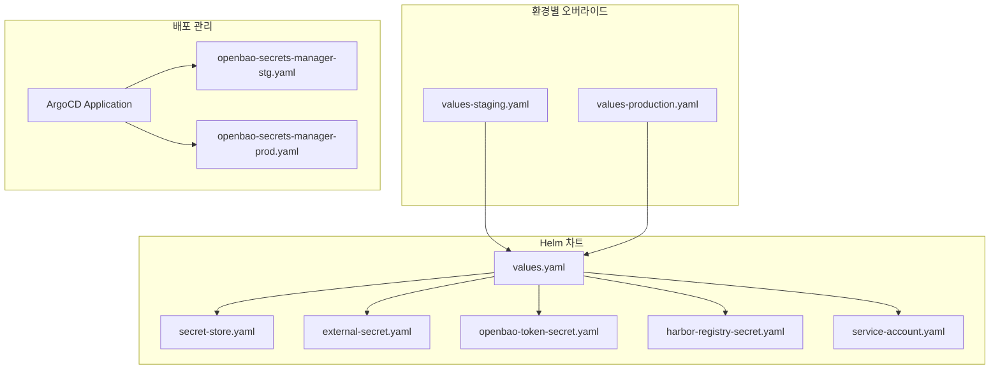
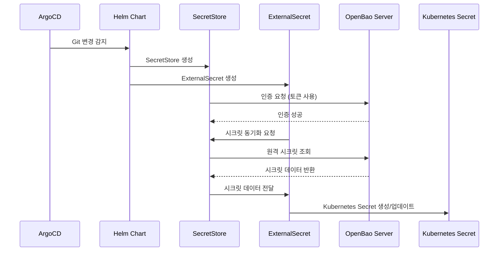
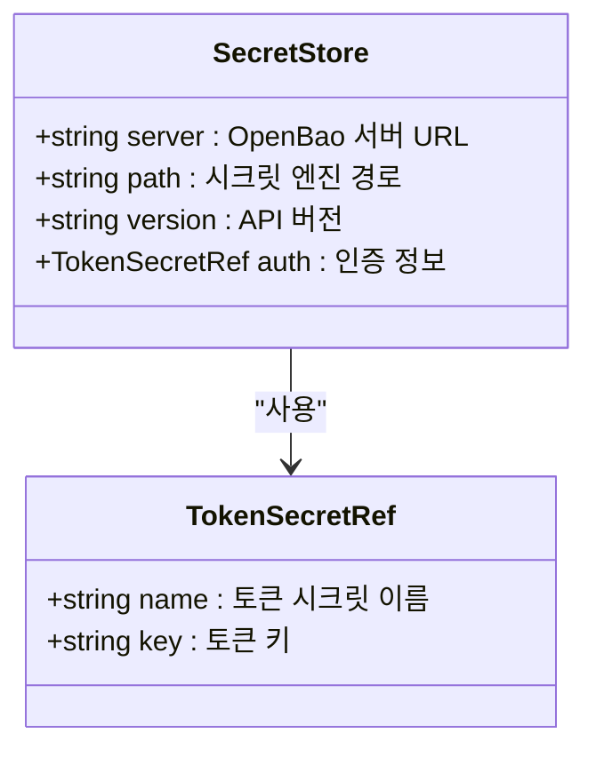
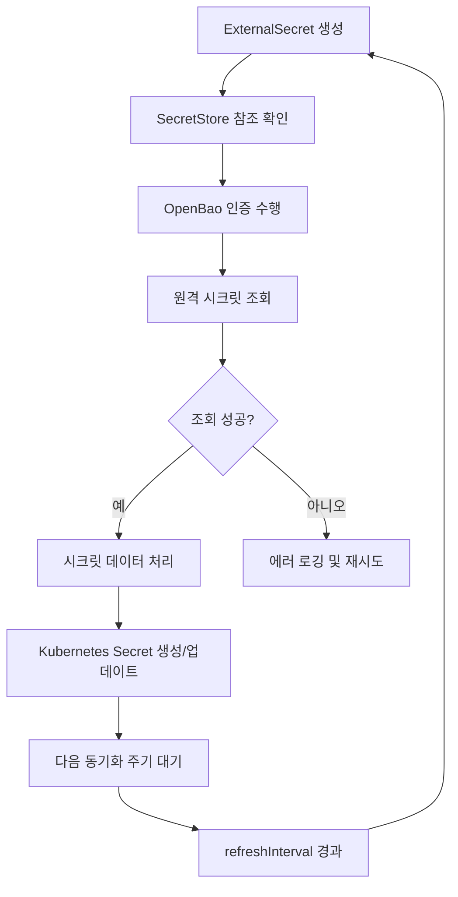
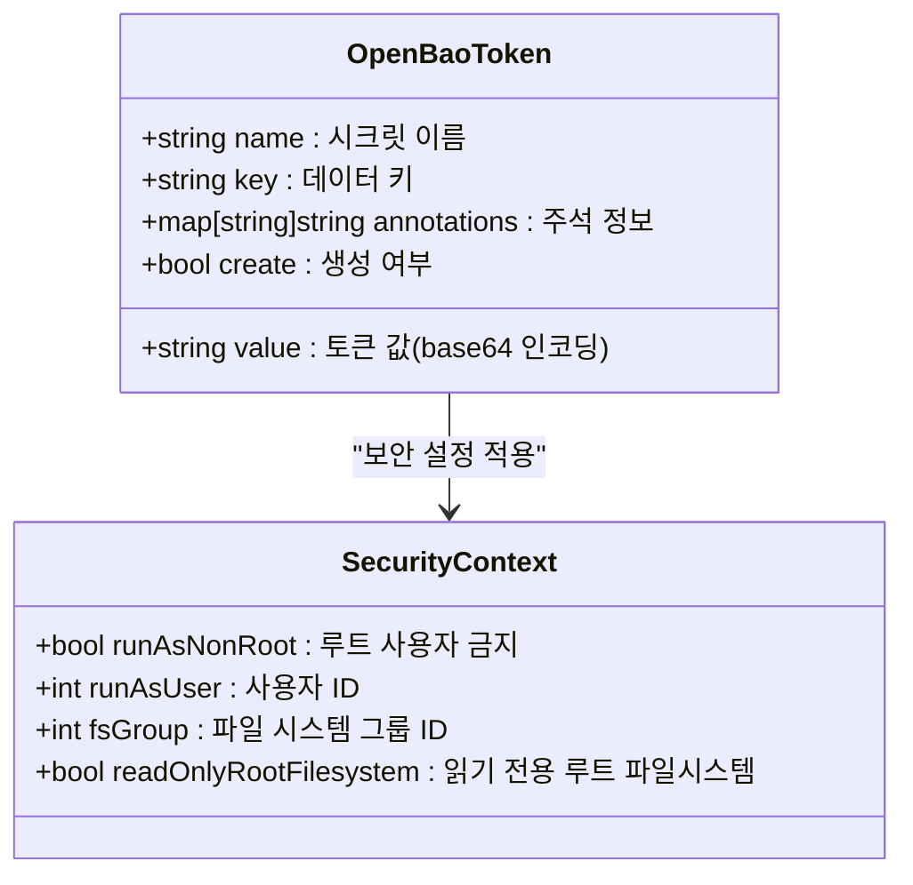
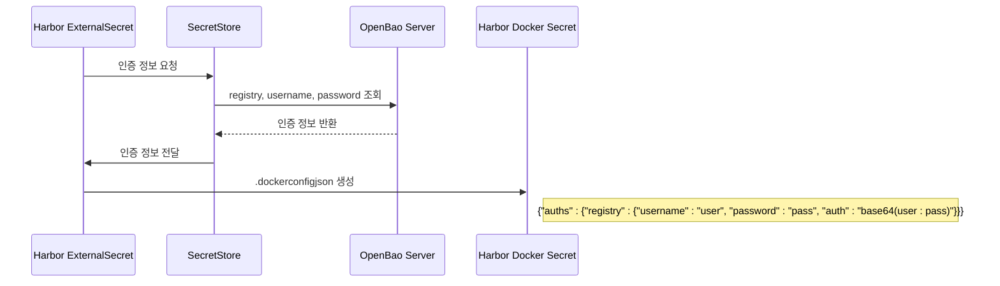
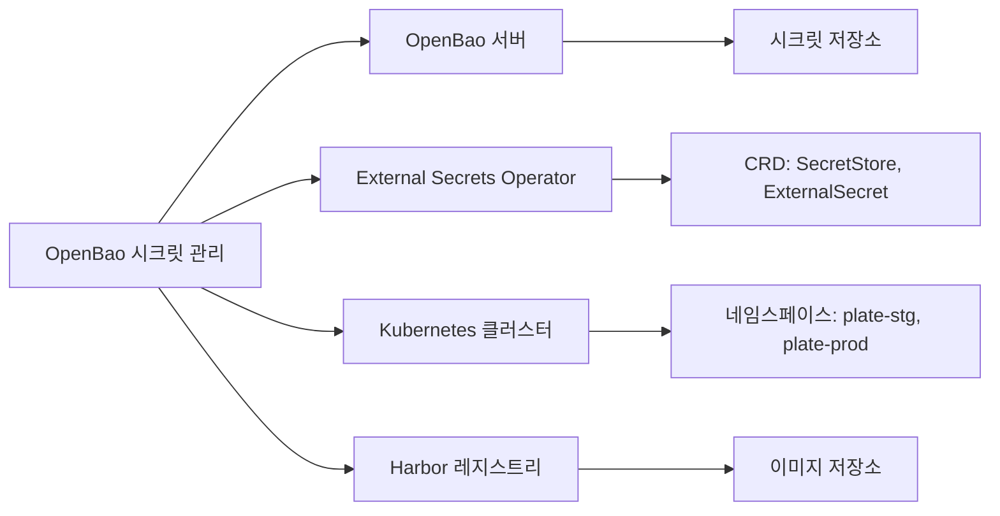

# 시크릿 관리 통합

<cite>
**이 문서에서 참조한 파일**  
- [openbao-secrets-manager/values.yaml](file://helm/shared-configs/openbao-secrets-manager/values.yaml)
- [openbao-secrets-manager/values-production.yaml](file://helm/shared-configs/openbao-secrets-manager/values-production.yaml)
- [openbao-secrets-manager/values-staging.yaml](file://helm/shared-configs/openbao-secrets-manager/values-staging.yaml)
- [openbao-secrets-manager/templates/secret-store.yaml](file://helm/shared-configs/openbao-secrets-manager/templates/secret-store.yaml)
- [openbao-secrets-manager/templates/external-secret.yaml](file://helm/shared-configs/openbao-secrets-manager/templates/external-secret.yaml)
- [openbao-secrets-manager/templates/openbao-token-secret.yaml](file://helm/shared-configs/openbao-secrets-manager/templates/openbao-token-secret.yaml)
- [openbao-secrets-manager/templates/harbor-registry-secret.yaml](file://helm/shared-configs/openbao-secrets-manager/templates/harbor-registry-secret.yaml)
- [openbao-secrets-manager/templates/service-account.yaml](file://helm/shared-configs/openbao-secrets-manager/templates/service-account.yaml)
- [environments/argocd/apps/openbao-secrets-manager-prod.yaml](file://environments/argocd/apps/openbao-secrets-manager-prod.yaml)
- [environments/argocd/apps/openbao-secrets-manager-stg.yaml](file://environments/argocd/apps/openbao-secrets-manager-stg.yaml)
</cite>

## 목차
1. [소개](#소개)
2. [프로젝트 구조](#프로젝트-구조)
3. [핵심 구성 요소](#핵심-구성-요소)
4. [아키텍처 개요](#아키텍처-개요)
5. [상세 구성 요소 분석](#상세-구성-요소-분석)
6. [의존성 분석](#의존성-분석)
7. [성능 고려사항](#성능-고려사항)
8. [문제 해결 가이드](#문제-해결-가이드)
9. [결론](#결론)

## 소개
이 문서는 OpenBao 시크릿 매니저와의 통합 방식을 설명합니다. Kubernetes 환경에서 외부 시크릿을 안전하게 관리하고 동기화하는 방법을 다루며, ExternalSecret 리소스를 통한 시크릿 동기화, SecretStore 구성, OpenBao 토큰 관리 방식을 상세히 설명합니다. 또한 인증 및 권한 부여 설정 방법, 시크릿 유효성 검사, 롤오버 전략, 장애 대응 방안에 대한 가이드를 포함합니다.

## 프로젝트 구조
OpenBao 시크릿 관리는 Helm 기반으로 구성되며, `helm/shared-configs/openbao-secrets-manager` 디렉터리에 위치한 차트를 통해 관리됩니다. 이 차트는 다양한 환경(staging, production)에 맞춰 동일한 구조를 유지하면서도 환경별로 특화된 설정을 제공합니다. 주요 구성 요소는 다음과 같습니다:

- **values.yaml**: 기본 설정 값
- **values-staging.yaml**: 스테이징 환경 전용 오버라이드 값
- **values-production.yaml**: 프로덕션 환경 전용 오버라이드 값
- **templates/**: Helm 템플릿 파일들

**다이어그램 출처**  
- [values.yaml](file://helm/shared-configs/openbao-secrets-manager/values.yaml#L1-L230)
- [secret-store.yaml](file://helm/shared-configs/openbao-secrets-manager/templates/secret-store.yaml#L1-L29)
- [external-secret.yaml](file://helm/shared-configs/openbao-secrets-manager/templates/external-secret.yaml#L1-L49)
- [openbao-secrets-manager-stg.yaml](file://environments/argocd/apps/openbao-secrets-manager-stg.yaml#L1-L78)
- [openbao-secrets-manager-prod.yaml](file://environments/argocd/apps/openbao-secrets-manager-prod.yaml#L1-L80)

**섹션 출처**  
- [helm/shared-configs/openbao-secrets-manager](file://helm/shared-configs/openbao-secrets-manager)

## 핵심 구성 요소
OpenBao와의 통합은 주로 세 가지 핵심 구성 요소를 중심으로 이루어집니다: SecretStore, ExternalSecret, 그리고 OpenBao 토큰 관리 메커니즘. 이들은 외부 시크릿을 Kubernetes 내부로 안전하게 가져오고, 지속적으로 동기화하며, 인증을 보장하는 역할을 합니다.

**섹션 출처**  
- [values.yaml](file://helm/shared-configs/openbao-secrets-manager/values.yaml#L1-L230)
- [secret-store.yaml](file://helm/shared-configs/openbao-secrets-manager/templates/secret-store.yaml#L1-L29)
- [external-secret.yaml](file://helm/shared-configs/openbao-secrets-manager/templates/external-secret.yaml#L1-L49)

## 아키텍처 개요
시스템 아키텍처는 OpenBao 외부 시크릿 관리자(External Secrets Operator)를 중심으로 구성됩니다. 이는 OpenBao 서버와 통신하여 시크릿을 가져오고, 이를 Kubernetes Secret으로 변환하여 지정된 네임스페이스에 생성합니다. 전체 흐름은 다음과 같습니다:

**다이어그램 출처**  
- [openbao-secrets-manager-prod.yaml](file://environments/argocd/apps/openbao-secrets-manager-prod.yaml#L1-L80)
- [secret-store.yaml](file://helm/shared-configs/openbao-secrets-manager/templates/secret-store.yaml#L1-L29)
- [external-secret.yaml](file://helm/shared-configs/openbao-secrets-manager/templates/external-secret.yaml#L1-L49)

## 상세 구성 요소 분석

### SecretStore 구성 분석
SecretStore는 OpenBao 서버에 대한 연결 정보와 인증 방법을 정의합니다. 이는 외부 시크릿 관리자가 OpenBao에 접근하기 위한 핵심 구성 요소입니다.

**다이어그램 출처**  
- [secret-store.yaml](file://helm/shared-configs/openbao-secrets-manager/templates/secret-store.yaml#L1-L29)
- [values.yaml](file://helm/shared-configs/openbao-secrets-manager/values.yaml#L13-L26)

**섹션 출처**  
- [secret-store.yaml](file://helm/shared-configs/openbao-secrets-manager/templates/secret-store.yaml#L1-L29)
- [values.yaml](file://helm/shared-configs/openbao-secrets-manager/values.yaml#L13-L26)

### ExternalSecret 동기화 분석
ExternalSecret 리소스는 OpenBao에서 가져올 특정 시크릿의 매핑 정보를 정의합니다. 이는 원격 시크릿의 키와 Kubernetes 시크릿의 키를 연결하며, 주기적으로 동기화를 수행합니다.

**다이어그램 출처**  
- [external-secret.yaml](file://helm/shared-configs/openbao-secrets-manager/templates/external-secret.yaml#L1-L49)
- [values.yaml](file://helm/shared-configs/openbao-secrets-manager/values.yaml#L36-L164)

**섹션 출처**  
- [external-secret.yaml](file://helm/shared-configs/openbao-secrets-manager/templates/external-secret.yaml#L1-L49)
- [values.yaml](file://helm/shared-configs/openbao-secrets-manager/values.yaml#L36-L164)

### OpenBao 토큰 관리 분석
OpenBao 토큰은 SecretStore가 OpenBao 서버에 인증하기 위해 사용되는 중요한 자격 증명입니다. 이 토큰은 Kubernetes Secret으로 저장되며, 환경에 따라 다른 값과 보안 설정을 가집니다.

**다이어그램 출처**  
- [openbao-token-secret.yaml](file://helm/shared-configs/openbao-secrets-manager/templates/openbao-token-secret.yaml#L1-L26)
- [values-production.yaml](file://helm/shared-configs/openbao-secrets-manager/values-production.yaml#L189-L195)
- [values-staging.yaml](file://helm/shared-configs/openbao-secrets-manager/values-staging.yaml#L158-L164)

**섹션 출처**  
- [openbao-token-secret.yaml](file://helm/shared-configs/openbao-secrets-manager/templates/openbao-token-secret.yaml#L1-L26)
- [values-production.yaml](file://helm/shared-configs/openbao-secrets-manager/values-production.yaml#L189-L195)
- [values-staging.yaml](file://helm/shared-configs/openbao-secrets-manager/values-staging.yaml#L158-L164)

### Harbor 레지스트리 인증 분석
Harbor 레지스트리에 대한 인증 정보도 OpenBao를 통해 관리되며, 도커 구성 형식의 시크릿으로 생성됩니다. 이는 컨테이너 이미지 풀링을 위한 자격 증명을 제공합니다.

**다이어그램 출처**  
- [harbor-registry-secret.yaml](file://helm/shared-configs/openbao-secrets-manager/templates/harbor-registry-secret.yaml#L1-L77)
- [values.yaml](file://helm/shared-configs/openbao-secrets-manager/values.yaml#L211-L230)

**섹션 출처**  
- [harbor-registry-secret.yaml](file://helm/shared-configs/openbao-secrets-manager/templates/harbor-registry-secret.yaml#L1-L77)
- [values.yaml](file://helm/shared-configs/openbao-secrets-manager/values.yaml#L211-L230)

## 의존성 분석
OpenBao 시크릿 관리 시스템은 여러 외부 시스템과의 의존성을 가지고 있습니다. 이러한 의존성은 시스템의 안정성과 보안에 직접적인 영향을 미칩니다.

**다이어그램 출처**  
- [values.yaml](file://helm/shared-configs/openbao-secrets-manager/values.yaml#L15-L19)
- [secret-store.yaml](file://helm/shared-configs/openbao-secrets-manager/templates/secret-store.yaml#L22-L24)
- [global.namespaces](file://helm/shared-configs/openbao-secrets-manager/values.yaml#L8-L10)

**섹션 출처**  
- [values.yaml](file://helm/shared-configs/openbao-secrets-manager/values.yaml#L1-L230)
- [secret-store.yaml](file://helm/shared-configs/openbao-secrets-manager/templates/secret-store.yaml#L1-L29)

## 성능 고려사항
OpenBao 시크릿 관리 시스템의 성능은 주로 동기화 주기, 리소스 제한, 네트워크 지연에 의해 영향을 받습니다. 환경에 따라 최적화된 설정이 필요합니다.

- **동기화 주기**: 스테이징 환경은 30분, 프로덕션 환경은 1시간으로 설정되어 있습니다.
- **리소스 제한**: 프로덕션 환경은 더 높은 CPU 및 메모리 제한을 가지며, 스테이징 환경은 경량화된 설정을 사용합니다.
- **노드 선택 및 선호도**: 프로덕션 환경은 특정 노드 타입과 어피니티 설정을 통해 안정성을 보장합니다.

이러한 설정은 `values-production.yaml`과 `values-staging.yaml`에서 환경별로 다르게 구성되어 있습니다.

**섹션 출처**  
- [values-production.yaml](file://helm/shared-configs/openbao-secrets-manager/values-production.yaml#L143-L179)
- [values-staging.yaml](file://helm/shared-configs/openbao-secrets-manager/values-staging.yaml#L141-L148)

## 문제 해결 가이드
OpenBao 시크릿 관리 시스템에서 발생할 수 있는 주요 문제와 그 해결 방법을 안내합니다.

### 인증 실패
- **현상**: SecretStore가 OpenBao 서버에 인증할 수 없음
- **원인**: OpenBao 토큰이 만료되었거나 잘못된 값이 설정됨
- **해결**: `openbao-token` 시크릿의 값을 확인하고 갱신

### 시크릿 동기화 실패
- **현상**: ExternalSecret이 생성되었지만, 대상 Secret이 생성되지 않음
- **원인**: SecretStore 구성 오류 또는 OpenBao 서버 접근 문제
- **해결**: SecretStore의 server URL과 경로를 확인하고, 네트워크 연결 상태를 점검

### Harbor 인증 실패
- **현상**: 파드가 Harbor에서 이미지를 풀링할 수 없음
- **원인**: harbor-docker-secret이 생성되지 않았거나, 인증 정보가 잘못됨
- **해결**: harbor-registry-secret ExternalSecret의 로그를 확인하고, OpenBao 내 인증 정보를 검증

**섹션 출처**  
- [openbao-token-secret.yaml](file://helm/shared-configs/openbao-secrets-manager/templates/openbao-token-secret.yaml#L1-L26)
- [harbor-registry-secret.yaml](file://helm/shared-configs/openbao-secrets-manager/templates/harbor-registry-secret.yaml#L1-L77)
- [verify-harbor-auth.sh](file://scripts/verify-harbor-auth.sh#L70-L74)

## 결론
OpenBao 시크릿 관리 시스템은 Kubernetes 환경에서 외부 시크릿을 안전하고 효율적으로 관리하는 핵심 인프라입니다. SecretStore와 ExternalSecret을 통한 선언적 구성, 환경별로 최적화된 설정, 그리고 자동화된 동기화 메커니즘을 통해 운영의 안정성과 보안을 보장합니다. 지속적인 모니터링과 정기적인 토큰 롤오버 전략을 통해 시스템의 신뢰성을 유지해야 합니다.