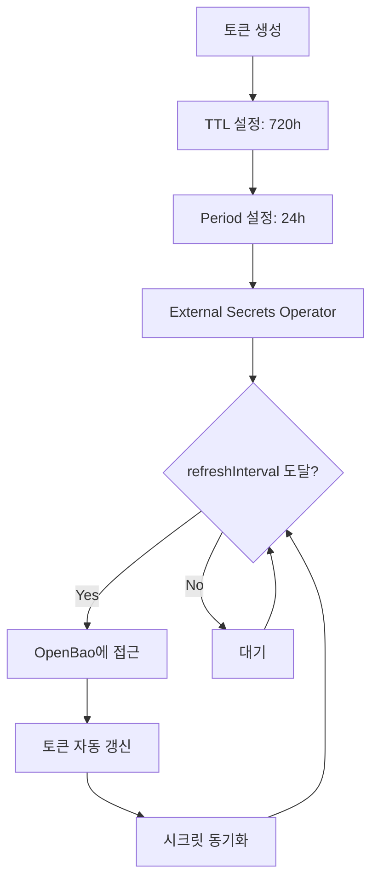
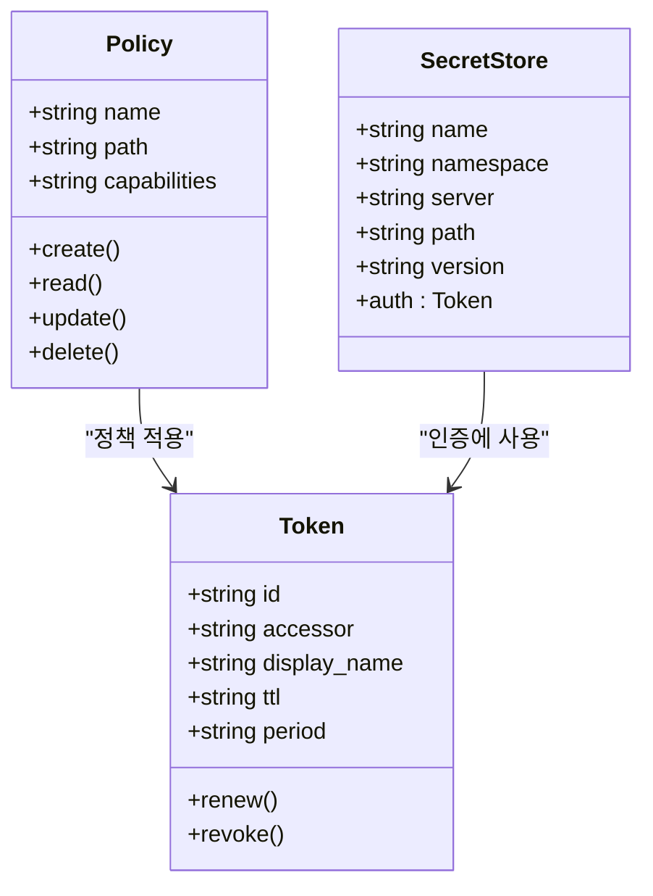
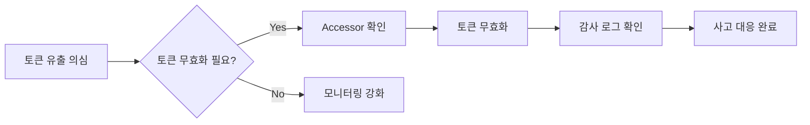

# 인증 토큰 관리

<cite>
**이 문서에서 참조한 파일**  
- [openbao-token-secret.yaml](file://helm/shared-configs/openbao-secrets-manager/templates/openbao-token-secret.yaml)
- [external-secret.yaml](file://helm/shared-configs/openbao-secrets-manager/templates/external-secret.yaml)
- [secret-store.yaml](file://helm/shared-configs/openbao-secrets-manager/templates/secret-store.yaml)
- [values.yaml](file://helm/shared-configs/openbao-secrets-manager/values.yaml)
- [values-production.yaml](file://helm/shared-configs/openbao-secrets-manager/values-production.yaml)
- [values-staging.yaml](file://helm/shared-configs/openbao-secrets-manager/values-staging.yaml)
- [create-token.sh](file://scripts/openbao/create-token.sh)
- [create-policy.sh](file://scripts/openbao/create-policy.sh)
- [setup-esc.sh](file://scripts/openbao/setup-esc.sh)
- [revoke-non-root-tokens.sh](file://scripts/openbao/revoke-non-root-tokens.sh)
- [plate-api/values.yaml](file://helm/applications/plate-server/values.yaml)
- [plate-web/values.yaml](file://helm/applications/plate-web/values.yaml)
</cite>

## 목차
1. [소개](#소개)
2. [토큰 생성 및 저장 전략](#토큰-생성-및-저장-전략)
3. [자동 갱신 및 유효기간 관리](#자동-갱신-및-유효기간-관리)
4. [이중 토큰 전략 및 롤오버](#이중-토큰-전략-및-롤오버)
5. [RBAC 기반 접근 제어](#rbac-기반-접근-제어)
6. [토큰 유출 대응 및 감사 로그](#토큰-유출-대응-및-감사-로그)
7. [결론](#결론)

## 소개
OpenBao는 민감한 시크릿 정보를 안전하게 관리하기 위한 솔루션으로, Kubernetes 환경에서 외부 시크릿 관리자(External Secrets Operator)와 통합되어 동작합니다. 본 문서는 OpenBao 접근을 위한 인증 토큰의 생성, 저장, 갱신 전략을 설명하며, Kubernetes Secret을 통한 안전한 토큰 관리 방식과 함께, 토큰의 유효기간 관리, 자동 갱신 메커니즘, 롤오버 시나리오에서의 중단 없는 운영을 위한 이중 토큰 전략, 권한 최소화 원칙에 따른 역할 기반 접근 제어(RBAC) 설정 예시를 제공합니다. 또한 토큰 유출 시 대응 절차와 감사 로그 확인 방법도 포함합니다.

## 토큰 생성 및 저장 전략

OpenBao 토큰은 `scripts/openbao/create-token.sh` 스크립트를 통해 생성되며, 이 스크립트는 사용자에게 정책명, 표시 이름, 유효 기간(TTL), 자동 갱신 주기(period), 갱신 가능 여부 등을 입력받아 토큰을 생성합니다. 생성된 토큰은 Base64로 인코딩되어 Kubernetes Secret으로 저장되며, 이는 `helm/shared-configs/openbao-secrets-manager` Helm 차트를 통해 관리됩니다.

토큰은 `openbao-token-secret.yaml` 템플릿을 통해 생성되며, `.Values.openbao.token.create`가 `false`로 설정되어 있어 Helm 차트 내에서 직접 생성되지 않고, 외부 스크립트를 통해 생성된 후 수동으로 적용됩니다. 이는 토큰 생성 과정의 보안을 강화하고, 생성 시점에서의 정책 및 권한 검토를 가능하게 합니다.

```mermaid
sequenceDiagram
participant 사용자
participant create-token.sh
participant OpenBao
participant Kubernetes
사용자->>create-token.sh : 토큰 생성 요청
create-token.sh->>OpenBao : 정책 확인 및 토큰 생성
OpenBao-->>create-token.sh : 토큰 반환
create-token.sh->>create-token.sh : Base64 인코딩
create-token.sh->>Kubernetes : Secret 생성 요청
Kubernetes-->>create-token.sh : Secret 생성 완료
create-token.sh->>사용자 : 토큰 정보 출력
```

**다이어그램 출처**  
- [create-token.sh](file://scripts/openbao/create-token.sh#L1-L550)
- [openbao-token-secret.yaml](file://helm/shared-configs/openbao-secrets-manager/templates/openbao-token-secret.yaml#L1-L26)

**섹션 출처**  
- [create-token.sh](file://scripts/openbao/create-token.sh#L1-L550)
- [openbao-token-secret.yaml](file://helm/shared-configs/openbao-secrets-manager/templates/openbao-token-secret.yaml#L1-L26)

## 자동 갱신 및 유효기간 관리

OpenBao 토큰은 `TTL(Time To Live)`과 `Period`를 통해 유효기간과 자동 갱신 주기를 관리합니다. TTL은 토큰의 총 수명을 의미하며, Period는 토큰이 자동으로 갱신되는 주기를 의미합니다. 예를 들어, TTL이 720시간(30일), Period가 24시간인 경우, 토큰은 24시간마다 자동으로 갱신되며, 총 30일간 유효합니다.

자동 갱신은 External Secrets Operator가 OpenBao 서버에 정기적으로 접근하여 시크릿을 동기화하는 과정에서 자연스럽게 이루어지며, 이는 `refreshInterval` 설정을 통해 조절할 수 있습니다. 스테이징 환경은 30분, 프로덕션 환경은 1시간으로 설정되어 있습니다.



**다이어그램 출처**  
- [values-staging.yaml](file://helm/shared-configs/openbao-secrets-manager/values-staging.yaml#L28)
- [values-production.yaml](file://helm/shared-configs/openbao-secrets-manager/values-production.yaml#L29)
- [create-token.sh](file://scripts/openbao/create-token.sh#L119-L131)

**섹션 출처**  
- [values-staging.yaml](file://helm/shared-configs/openbao-secrets-manager/values-staging.yaml#L28)
- [values-production.yaml](file://helm/shared-configs/openbao-secrets-manager/values-production.yaml#L29)
- [create-token.sh](file://scripts/openbao/create-token.sh#L119-L131)

## 이중 토큰 전략 및 롤오버

롤오버 시나리오에서의 중단 없는 운영을 위해 이중 토큰 전략이 사용됩니다. 새로운 토큰을 생성한 후, 기존 토큰을 무효화(revoke)하기 전에 새로운 토큰이 정상적으로 동작하는지 확인합니다. `create-token.sh` 스크립트는 기존 토큰을 검색하고 무효화할 수 있는 옵션을 제공하여, 안전한 롤오버를 지원합니다.

또한, `revoke-non-root-tokens.sh` 스크립트는 Root 토큰을 제외한 모든 토큰을 무효화할 수 있어, 긴급 상황에서의 대규모 토큰 폐기를 가능하게 합니다.

```mermaid
sequenceDiagram
participant 관리자
participant create-token.sh
participant OpenBao
관리자->>create-token.sh : 새 토큰 생성
create-token.sh->>OpenBao : 새 토큰 생성 요청
OpenBao-->>create-token.sh : 새 토큰 반환
create-token.sh->>관리자 : 새 토큰 정보 출력
관리자->>OpenBao : 새 토큰으로 시크릿 접근 테스트
OpenBao-->>관리자 : 성공
관리자->>create-token.sh : 기존 토큰 무효화 요청
create-token.sh->>OpenBao : 기존 토큰 무효화
OpenBao-->>create-token.sh : 무효화 완료
```

**다이어그램 출처**  
- [create-token.sh](file://scripts/openbao/create-token.sh#L164-L281)
- [revoke-non-root-tokens.sh](file://scripts/openbao/revoke-non-root-tokens.sh#L1-L126)

**섹션 출처**  
- [create-token.sh](file://scripts/openbao/create-token.sh#L164-L281)
- [revoke-non-root-tokens.sh](file://scripts/openbao/revoke-non-root-tokens.sh#L1-L126)

## RBAC 기반 접근 제어

OpenBao는 역할 기반 접근 제어(RBAC)를 통해 토큰의 권한을 세밀하게 제어합니다. `create-policy.sh` 스크립트를 통해 정책을 생성하며, 이 정책은 특정 경로에 대한 읽기 전용 접근 권한을 부여합니다. 예를 들어, `esc-policy`는 `secret/data/server/{staging,production,default}` 및 `secret/data/harbor/{staging,production,development}` 경로에 대한 읽기 권한만을 허용합니다.



**다이어그램 출처**  
- [create-policy.sh](file://scripts/openbao/create-policy.sh#L1-L177)
- [secret-store.yaml](file://helm/shared-configs/openbao-secrets-manager/templates/secret-store.yaml#L1-L29)

**섹션 출처**  
- [create-policy.sh](file://scripts/openbao/create-policy.sh#L1-L177)
- [secret-store.yaml](file://helm/shared-configs/openbao-secrets-manager/templates/secret-store.yaml#L1-L29)

## 토큰 유출 대응 및 감사 로그

토큰 유출 시에는 즉시 해당 토큰을 무효화(revoke)해야 합니다. `create-token.sh` 스크립트는 토큰 생성 시 Accessor를 출력하며, 이 Accessor를 사용하여 토큰을 무효화할 수 있습니다. 또한, `revoke-non-root-tokens.sh` 스크립트를 사용하여 모든 비-루트 토큰을 일괄적으로 무효화할 수 있습니다.

OpenBao는 모든 토큰 생성, 조회, 갱신, 무효화 등의 작업에 대한 감사 로그를 기록합니다. `vault token lookup` 명령을 통해 토큰의 생성 시간, TTL, 정책 등을 확인할 수 있으며, `vault audit` 명령을 통해 감사 로그를 조회할 수 있습니다.



**다이어그램 출처**  
- [create-token.sh](file://scripts/openbao/create-token.sh#L338-L340)
- [revoke-non-root-tokens.sh](file://scripts/openbao/revoke-non-root-tokens.sh#L1-L126)

**섹션 출처**  
- [create-token.sh](file://scripts/openbao/create-token.sh#L338-L340)
- [revoke-non-root-tokens.sh](file://scripts/openbao/revoke-non-root-tokens.sh#L1-L126)

## 결론

OpenBao 인증 토큰 관리는 생성, 저장, 갱신, 롤오버, 접근 제어, 유출 대응에 이르기까지 체계적인 전략을 요구합니다. Kubernetes Secret을 통한 안전한 저장, Period 기반의 자동 갱신, 이중 토큰 전략을 통한 안정적인 롤오버, RBAC 기반의 세밀한 접근 제어, 그리고 신속한 유출 대응과 감사 로그 확인은 모두 시스템의 보안과 안정성을 확보하는 데 필수적입니다. 제공된 스크립트와 Helm 차트를 활용하여 이러한 전략을 효과적으로 구현할 수 있습니다.