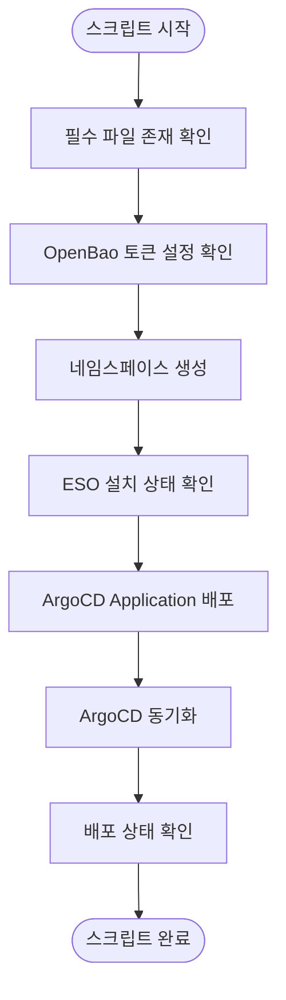
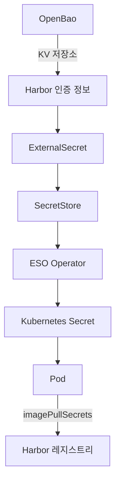
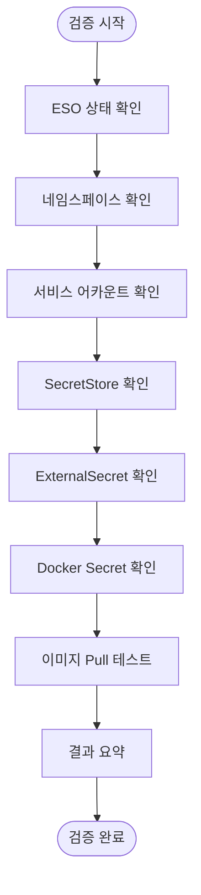

# Harbor 인증 설정

<cite>
**이 문서에서 참조한 파일**  
- [deploy-harbor-auth.sh](file://scripts/deploy-harbor-auth.sh)
- [verify-harbor-auth.sh](file://scripts/verify-harbor-auth.sh)
- [harbor-registry-secret.yaml](file://helm/shared-configs/openbao-secrets-manager/templates/harbor-registry-secret.yaml)
- [secret-store.yaml](file://helm/shared-configs/openbao-secrets-manager/templates/secret-store.yaml)
- [openbao-token-secret.yaml](file://helm/shared-configs/openbao-secrets-manager/templates/openbao-token-secret.yaml)
- [service-account.yaml](file://helm/shared-configs/openbao-secrets-manager/templates/service-account.yaml)
- [values.yaml](file://helm/shared-configs/openbao-secrets-manager/values.yaml)
- [values-staging.yaml](file://helm/shared-configs/openbao-secrets-manager/values-staging.yaml)
- [values-production.yaml](file://helm/shared-configs/openbao-secrets-manager/values-production.yaml)
- [openbao-secrets-manager-stg.yaml](file://environments/argocd/apps/openbao-secrets-manager-stg.yaml)
- [openbao-secrets-manager-prod.yaml](file://environments/argocd/apps/openbao-secrets-manager-prod.yaml)
</cite>

## 목차
1. [소개](#소개)
2. [스크립트 개요](#스크립트-개요)
3. [주요 기능 분석](#주요-기능-분석)
4. [TLS 인증서 설정 및 갱신](#tls-인증서-설정-및-갱신)
5. [오류 진단 및 문제 해결](#오류-진단-및-문제-해결)
6. [스크립트 확장성](#스크립트-확장성)
7. [검증 절차](#검증-절차)
8. [결론](#결론)

## 소개
`deploy-harbor-auth.sh` 스크립트는 Harbor 레지스트리 인증을 Kubernetes 환경에 자동으로 설정하는 데 사용됩니다. 이 문서는 스크립트의 작동 원리, 주요 기능, 오류 해결 방법 및 사용자 정의 확장 방법을 단계별로 설명합니다. Harbor 인증은 External Secrets Operator(ESO)와 OpenBao를 통합하여 GitOps 방식으로 관리되며, ArgoCD를 통해 자동 배포됩니다.

## 스크립트 개요
`deploy-harbor-auth.sh`는 Harbor 인증을 위한 ESO 리소스를 ArgoCD를 통해 배포하는 Bash 스크립트입니다. 스크립트는 OpenBao 토큰 설정, 네임스페이스 생성, ESO 상태 확인, ArgoCD 애플리케이션 배포 및 동기화 등의 단계를 수행합니다. 최종적으로 Harbor Docker Secret이 정상 생성되었는지 확인하고, 다음 단계로 검증 스크립트 실행을 안내합니다.

**스크립트 흐름 다이어그램**


**다이어그램 출처**  
- [deploy-harbor-auth.sh](file://scripts/deploy-harbor-auth.sh#L26-L178)

**섹션 출처**  
- [deploy-harbor-auth.sh](file://scripts/deploy-harbor-auth.sh#L1-L194)

## 주요 기능 분석
### 인증 토큰 생성
스크립트는 OpenBao에서 생성한 토큰을 base64 인코딩하여 `openbao-token-secret.yaml` 파일에 삽입합니다. 이 토큰은 ESO가 OpenBao에 접근하여 Harbor 인증 정보를 가져오기 위한 자격 증명으로 사용됩니다. 토큰이 설정되지 않은 경우 스크립트는 오류를 발생시키고 설정 방법을 안내합니다.

### Kubernetes Secret 생성
ESO는 `ExternalSecret` 리소스를 통해 OpenBao에서 Harbor 인증 정보(username, password, registry URL)를 가져와 `harbor-docker-secret`이라는 Kubernetes Secret을 생성합니다. 이 Secret은 `kubernetes.io/dockerconfigjson` 타입으로 생성되어, Kubernetes가 Harbor 레지스트리에서 이미지를 Pull할 수 있도록 합니다.

### 서비스 어카운트 연동
`service-account.yaml` 템플릿은 각 네임스페이스에 `harbor-secret-reader` 서비스 어카운트를 생성합니다. 이 서비스 어카운트는 ESO와 연동되어 Secret 리소스에 접근할 수 있는 권한을 부여받으며, RBAC 설정을 통해 보안을 강화합니다.

**ESO 통합 아키텍처**


**다이어그램 출처**  
- [harbor-registry-secret.yaml](file://helm/shared-configs/openbao-secrets-manager/templates/harbor-registry-secret.yaml#L11-L76)
- [secret-store.yaml](file://helm/shared-configs/openbao-secrets-manager/templates/secret-store.yaml#L3-L28)

**섹션 출처**  
- [harbor-registry-secret.yaml](file://helm/shared-configs/openbao-secrets-manager/templates/harbor-registry-secret.yaml#L1-L77)
- [secret-store.yaml](file://helm/shared-configs/openbao-secrets-manager/templates/secret-store.yaml#L1-L29)
- [openbao-token-secret.yaml](file://helm/shared-configs/openbao-secrets-manager/templates/openbao-token-secret.yaml#L1-L26)
- [service-account.yaml](file://helm/shared-configs/openbao-secrets-manager/templates/service-account.yaml#L1-L19)

## TLS 인증서 설정 및 갱신
Harbor 인증은 TLS 기반으로 동작하며, 인증서는 OpenBao의 KV 저장소에 안전하게 저장됩니다. `values.yaml` 파일에서 `harbor` 섹션을 통해 각 환경(staging, production)별로 인증서 경로를 지정할 수 있습니다. 인증서 갱신은 `refreshInterval` 설정에 따라 자동으로 수행되며, staging 환경은 30분, production 환경은 1시간 간격으로 동기화됩니다.

**섹션 출처**  
- [values.yaml](file://helm/shared-configs/openbao-secrets-manager/values.yaml#L210-L230)
- [values-staging.yaml](file://helm/shared-configs/openbao-secrets-manager/values-staging.yaml#L149-L156)
- [values-production.yaml](file://helm/shared-configs/openbao-secrets-manager/values-production.yaml#L180-L187)

## 오류 진단 및 문제 해결
### 인증 오류 발생 시 로그 확인
ESO 관련 오류는 다음 명령어로 확인할 수 있습니다:
```bash
kubectl logs -n external-secrets-system -l app.kubernetes.io/name=external-secrets
```
로그에서 `authentication failed`, `permission denied`, `secret not found` 등의 메시지를 확인하여 문제 원인을 진단할 수 있습니다.

### 주요 오류 유형 및 해결 방법
- **OpenBao 토큰 미설정**: `openbao-token-secret.yaml` 파일에 base64 인코딩된 토큰을 삽입
- **ESO 미설치**: Helm을 통해 ESO를 설치하고 CRD를 활성화
- **Harbor Robot Account 미생성**: Harbor UI에서 Robot Account를 생성하고 OpenBao에 인증 정보 저장
- **SecretStore 연결 실패**: OpenBao 서버 URL, 경로, 버전이 정확한지 확인

**섹션 출처**  
- [verify-harbor-auth.sh](file://scripts/verify-harbor-auth.sh#L206-L211)

## 스크립트 확장성
`deploy-harbor-auth.sh` 스크립트는 다양한 인증 방식으로 확장할 수 있습니다. 예를 들어, AWS Secrets Manager, Azure Key Vault, Hashicorp Vault 등 다른 외부 비밀 관리 시스템을 사용하려면 `SecretStore` 리소스의 `provider` 설정을 변경하면 됩니다. 또한, 새로운 네임스페이스를 추가하려면 `values.yaml`의 `global.namespaces` 배열에 네임스페이스를 추가하고, 해당 환경의 values 파일을 생성하면 자동으로 지원됩니다.

**섹션 출처**  
- [values.yaml](file://helm/shared-configs/openbao-secrets-manager/values.yaml#L6-L11)

## 검증 절차
`verify-harbor-auth.sh` 스크립트는 Harbor 인증 설정이 정상적으로 작동하는지 종합적으로 검증합니다. 검증 항목은 다음과 같습니다:
- ESO 설치 및 실행 상태 확인
- 네임스페이스, 서비스 어카운트, SecretStore, ExternalSecret 존재 여부
- `harbor-docker-secret` 생성 및 타입 확인
- `.dockerconfigjson` 내용에 Harbor 레지스트리 URL 포함 여부
- 실제 Pod 생성을 통한 Harbor 이미지 Pull 테스트

스크립트는 각 검증 항목의 통과/실패 여부를 색상과 아이콘으로 표시하며, 최종 결과 요약을 제공합니다. 실패 시 문제 해결 가이드를 출력하여 신속한 복구를 지원합니다.

**검증 흐름 다이어그램**


**다이어그램 출처**  
- [verify-harbor-auth.sh](file://scripts/verify-harbor-auth.sh#L40-L212)

**섹션 출처**  
- [verify-harbor-auth.sh](file://scripts/verify-harbor-auth.sh#L1-L212)

## 결론
`deploy-harbor-auth.sh` 스크립트는 Harbor 인증 설정을 자동화하여 운영 효율성과 보안을 동시에 강화합니다. OpenBao, ESO, ArgoCD를 통합한 GitOps 기반의 인증 관리 방식은 변경 사항을 추적 가능하게 하고, 오류를 신속하게 복구할 수 있도록 합니다. 이 문서에서 설명한 절차와 도구를 활용하면 안정적이고 확장 가능한 Harbor 인증 환경을 구축할 수 있습니다.