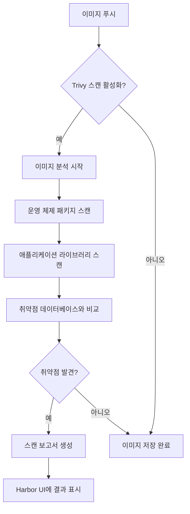

# 보안 구성

<cite>
**이 문서에서 참조한 파일**   
- [harbor-registry-secret.yaml](file://helm/shared-configs/openbao-secrets-manager/templates/harbor-registry-secret.yaml)
- [values-production.yaml](file://helm/shared-configs/openbao-secrets-manager/values-production.yaml)
- [values-staging.yaml](file://helm/shared-configs/openbao-secrets-manager/values-staging.yaml)
- [values.yaml](file://helm/shared-configs/openbao-secrets-manager/values.yaml)
- [openbao-secrets-manager-prod.yaml](file://environments/argocd/apps/openbao-secrets-manager-prod.yaml)
- [openbao-secrets-manager-stg.yaml](file://environments/argocd/apps/openbao-secrets-manager-stg.yaml)
- [harbor/values.yaml](file://helm/development-tools/harbor/values.yaml)
- [harbor/README.md](file://helm/development-tools/harbor/README.md)
</cite>

## 목차
1. [소개](#소개)
2. [OpenBao 연동 비밀 정보 관리](#openbao-연동-비밀-정보-관리)
3. [TLS 암호화 설정](#tls-암호화-설정)
4. [이미지 스캔 보안 정책](#이미지-스캔-보안-정책)
5. [비밀 정보 회전 및 갱신 절차](#비밀-정보-회전-및-갱신-절차)
6. [보안 취약점 점검 및 CVE 대응](#보안-취약점-점검-및-cve-대응)
7. [프로덕션 환경 보안 강화 방안](#프로덕션-환경-보안-강화-방안)

## 소개
Harbor 레지스트리는 컨테이너 이미지 및 헬름 차트를 안전하게 저장하고 관리하는 오픈소스 레지스트리 솔루션입니다. 본 문서는 Harbor 레지스트리의 핵심 보안 구성 요소에 대해 설명하며, 특히 OpenBao와의 연동을 통한 비밀 정보 관리, 내부 및 외부 TLS 암호화 설정, Trivy 기반 이미지 스캔 보안 정책을 중점적으로 다룹니다. 또한, `harbor-registry-secret.yaml` 파일을 통해 정의된 비밀 정보의 구조와 사용 목적을 분석하고, 비밀 정보의 회전 및 갱신 절차를 안내합니다. 마지막으로, 프로덕션 환경에서의 보안 취약점 점검 방법과 최신 CVE 대응 전략을 포함하여, 전체적인 보안 강화 방안을 제시합니다.

## OpenBao 연동 비밀 정보 관리

Harbor 레지스트리의 인증 정보는 OpenBao와 연동된 외부 시크릿 관리 시스템을 통해 안전하게 관리됩니다. 이 시스템은 `external-secrets.io/v1` API를 사용하는 ExternalSecret 리소스를 기반으로 하며, Kubernetes 클러스터 내에서 OpenBao에 저장된 비밀 정보를 동기화합니다. 이 접근 방식은 비밀 정보를 코드에 하드코딩하는 것을 방지하고, 중앙 집중식으로 비밀 정보를 관리할 수 있는 장점이 있습니다.

`harbor-registry-secret.yaml` 템플릿 파일은 Harbor 레지스트리에 접근하기 위한 Docker 구성 파일(`.dockerconfigjson`)을 생성하는 ExternalSecret 리소스를 정의합니다. 이 리소스는 OpenBao SecretStore를 참조하여 `registry`, `username`, `password` 등의 비밀 정보를 가져옵니다. 가져온 정보는 `.dockerconfigjson` 형식으로 변환되어, Kubernetes Pod가 Harbor 레지스트리에서 이미지를 풀(Pull)할 수 있도록 `kubernetes.io/dockerconfigjson` 유형의 시크릿으로 생성됩니다. 이 과정은 환경(`production`, `staging`, `development`)에 따라 동적으로 비밀 정보의 경로를 결정하며, 각 환경별로 별도의 OpenBao 키 경로를 사용합니다.

비밀 정보의 동기화 주기는 `values.yaml` 파일에서 `harbor.refreshInterval` 값으로 설정되며, 프로덕션 환경에서는 일반적으로 1시간(`1h`)으로 설정됩니다. 이는 비밀 정보가 너무 자주 변경되지 않도록 하여 시스템의 안정성을 유지하는 데 도움이 됩니다. 비밀 정보의 실제 값은 OpenBao 내부에 저장되며, Kubernetes 클러스터 내에서는 암호화된 상태로만 존재합니다. 이로 인해 비밀 정보가 유출될 위험이 크게 줄어듭니다.

**Section sources**
- [harbor-registry-secret.yaml](file://helm/shared-configs/openbao-secrets-manager/templates/harbor-registry-secret.yaml#L1-L77)
- [values.yaml](file://helm/shared-configs/openbao-secrets-manager/values.yaml#L210-L230)
- [values-production.yaml](file://helm/shared-configs/openbao-secrets-manager/values-production.yaml#L180-L187)
- [values-staging.yaml](file://helm/shared-configs/openbao-secrets-manager/values-staging.yaml#L149-L156)
- [openbao-secrets-manager-prod.yaml](file://environments/argocd/apps/openbao-secrets-manager-prod.yaml#L27-L31)
- [openbao-secrets-manager-stg.yaml](file://environments/argocd/apps/openbao-secrets-manager-stg.yaml#L27-L31)

## TLS 암호화 설정

Harbor 레지스트리는 내부 구성 요소 간의 통신과 외부 클라이언트와의 통신 모두에 TLS 암호화를 적용하여 데이터의 기밀성과 무결성을 보장합니다. TLS 설정은 외부 노출(expose)과 내부 TLS(internalTLS) 두 가지 범주로 나뉩니다.

외부 TLS 설정은 클라이언트가 Harbor 웹 UI나 API에 접근할 때 사용됩니다. `harbor/values.yaml` 파일에서 `expose.tls.enabled`를 `true`로 설정하여 활성화하며, 인증서 소스(`certSource`)를 `auto`, `secret`, 또는 `none` 중 하나로 지정합니다. 프로덕션 환경에서는 일반적으로 `secret`으로 설정하여, Let's Encrypt와 같은 외부 인증 기관(CA)에서 발급한 유효한 인증서를 사용합니다. 이 경우, `expose.tls.secret.secretName`에 인증서와 개인 키가 포함된 Kubernetes Secret의 이름을 지정합니다. `externalURL`은 Harbor의 외부 URL을 정의하며, 이 URL은 Docker 명령어에 표시되므로 정확하게 설정되어야 합니다.

내부 TLS 설정은 Harbor의 핵심(core), 작업 서비스(jobservice), 레지스트리(registry), Trivy 스캐너 등 내부 구성 요소들 간의 통신을 암호화합니다. `harbor/values.yaml` 파일에서 `internalTLS.enabled`를 `true`로 설정하여 활성화할 수 있습니다. 인증서는 `auto` (Helm 차트가 자동 생성), `manual` (직접 인증서 내용 제공), 또는 `secret` (기존 Secret에서 인증서 가져오기) 방식으로 제공할 수 있습니다. 내부 TLS가 활성화되면, 각 구성 요소는 환경 변수를 통해 TLS 인증서의 경로를 전달받아 안전한 통신을 수행합니다. 내부 TLS는 특히 민감한 데이터가 네트워크를 통해 전송되는 것을 방지하는 데 중요합니다.

```mermaid
graph TB
subgraph "외부 클라이언트"
Client[Docker Client]
end
subgraph "Kubernetes 클러스터"
Ingress[Ingress Controller]
subgraph "Harbor 구성 요소"
Core[Core Service]
Registry[Registry Service]
Jobservice[Jobservice]
Trivy[Trivy Scanner]
end
end
Client --> |HTTPS (TLS)| Ingress
Ingress --> |HTTP| Core
Core --> |HTTPS (Internal TLS)| Registry
Core --> |HTTPS (Internal TLS)| Jobservice
Core --> |HTTPS (Internal TLS)| Trivy
```

**Diagram sources**
- [harbor/values.yaml](file://helm/development-tools/harbor/values.yaml#L1-L113)
- [harbor/values.yaml](file://helm/development-tools/harbor/values.yaml#L278-L332)

**Section sources**
- [harbor/values.yaml](file://helm/development-tools/harbor/values.yaml#L1-L113)
- [harbor/values.yaml](file://helm/development-tools/harbor/values.yaml#L278-L332)
- [harbor/README.md](file://helm/development-tools/harbor/README.md#L78-L132)

## 이미지 스캔 보안 정책

Harbor는 Trivy 오픈소스 스캐너를 통합하여 컨테이너 이미지에 포함된 알려진 취약점(Vulnerability)을 자동으로 스캔하고 보고합니다. 이 기능은 이미지가 레지스트리에 푸시(Push)될 때 또는 주기적으로 실행되어, 보안 위협을 조기에 발견하고 대응할 수 있도록 합니다.

Trivy 스캐너의 동작은 `harbor/values.yaml` 파일의 `trivy` 섹션에서 상세히 구성됩니다. `trivy.enabled`를 `true`로 설정하여 스캐너를 활성화합니다. 스캔 대상은 운영 체제 패키지(`os`)와 애플리케이션 라이브러리(`library`)로 나뉘며, `trivy.vulnType`을 통해 지정할 수 있습니다. 스캔의 엄격함은 `trivy.severity` 옵션으로 조절할 수 있으며, `UNKNOWN`, `LOW`, `MEDIUM`, `HIGH`, `CRITICAL` 중 하나 이상의 심각도를 설정할 수 있습니다. 프로덕션 환경에서는 일반적으로 `HIGH` 및 `CRITICAL` 수준의 취약점만 스캔 대상으로 포함시켜, 경고의 과부하를 방지합니다.

또한, `trivy.ignoreUnfixed` 옵션을 `false`로 설정하면 아직 패치가 없는 취약점(fixed vulnerabilities)도 스캔 결과에 포함됩니다. 이는 보안 팀이 알려진 문제를 인지하고, 다른 보완 조치를 취할 수 있도록 합니다. 스캔은 `trivy.timeout`에 지정된 시간 내에 완료되어야 하며, 이를 초과하면 타임아웃 오류가 발생합니다. Trivy는 GitHub에서 취약점 데이터베이스(Trivy DB)를 주기적으로 업데이트하며, `trivy.skipUpdate`를 `false`로 설정하여 최신 정보를 항상 사용하도록 해야 합니다.



**Diagram sources**
- [harbor/values.yaml](file://helm/development-tools/harbor/values.yaml#L793-L815)
- [harbor/README.md](file://helm/development-tools/harbor/README.md#L297-L312)

**Section sources**
- [harbor/values.yaml](file://helm/development-tools/harbor/values.yaml#L793-L815)
- [harbor/README.md](file://helm/development-tools/harbor/README.md#L297-L312)

## 비밀 정보 회전 및 갱신 절차

비밀 정보의 주기적인 회전(Rotation)은 보안 사고의 영향을 최소화하는 핵심적인 보안 관행입니다. Harbor 레지스트리의 인증 정보는 OpenBao를 통해 관리되므로, 비밀 정보의 회전은 OpenBao 내에서 수행됩니다. 절차는 다음과 같습니다.

1.  **새 비밀 정보 생성**: OpenBao 관리자는 OpenBao 콘솔이나 CLI를 사용하여 기존 비밀 정보의 새 버전을 생성합니다. 예를 들어, `harbor/production` 경로에 새로운 `username`과 `password` 값을 저장합니다.
2.  **버전 관리**: OpenBao는 비밀 정보의 여러 버전을 유지 관리합니다. 새 버전이 생성되면, 이전 버전은 자동으로 비활성화되거나 삭제될 수 있습니다.
3.  **자동 갱신**: `harbor-registry-secret.yaml`에 정의된 ExternalSecret 리소스는 `refreshInterval` (예: 1시간) 주기로 OpenBao를 폴링하여 비밀 정보의 변경 사항을 확인합니다. 변경 사항이 감지되면, External Secrets Operator는 클러스터 내의 Kubernetes Secret을 자동으로 업데이트합니다.
4.  **워크로드 재시작**: Kubernetes Secret이 업데이트되더라도, 이를 사용하는 Pod는 일반적으로 자동으로 재시작하지 않습니다. 따라서, 비밀 정보가 변경된 후에는 관련 애플리케이션 Pod를 수동으로 재시작하거나, Rolling Update 전략을 사용하여 점진적으로 Pod를 재배포해야 합니다. 이는 새로운 비밀 정보를 사용할 수 있도록 보장합니다.

이러한 자동화된 절차는 수동 개입을 최소화하고, 비밀 정보 회전의 주기를 일관되게 유지할 수 있게 합니다. `openbao-secrets-manager-prod.yaml`과 같은 ArgoCD Application 설정은 `ignoreDifferences`를 통해 Secret의 `data` 필드 변경을 무시하도록 구성되어 있어, 외부에서 관리되는 비밀 정보의 변경이 ArgoCD의 동기화 상태에 영향을 미치지 않도록 합니다.

**Section sources**
- [harbor-registry-secret.yaml](file://helm/shared-configs/openbao-secrets-manager/templates/harbor-registry-secret.yaml#L21-L25)
- [values.yaml](file://helm/shared-configs/openbao-secrets-manager/values.yaml#L219-L220)
- [openbao-secrets-manager-prod.yaml](file://environments/argocd/apps/openbao-secrets-manager-prod.yaml#L64-L73)

## 보안 취약점 점검 및 CVE 대응

Harbor 레지스트리의 보안 취약점을 점검하고 최신 CVE(Common Vulnerabilities and Exposures)에 대응하기 위한 전략은 다음과 같습니다.

**정기적인 이미지 스캔**: 모든 이미지에 대해 Trivy를 통한 정기적인 스캔을 수행합니다. 이는 개발 단계에서부터 프로덕션 배포 전까지 지속적으로 이루어져야 합니다. 스캔 결과는 Harbor UI에서 확인할 수 있으며, 심각도가 높은 취약점이 발견된 이미지는 배포를 차단하는 정책을 설정할 수 있습니다.

**Harbor 자체의 취약점 점검**: Harbor 자체가 취약점의 표적이 될 수 있으므로, Harbor의 버전을 최신 상태로 유지하는 것이 중요합니다. Helm 차트의 `harbor/values.yaml` 파일에서 사용하는 이미지 태그(`tag`)를 최신 안정 버전으로 지속적으로 업데이트해야 합니다. 예를 들어, `v2.13.2`에서 `v2.14.0`으로 업그레이드하는 등의 작업이 필요합니다.

**CVE 대응 전략**:
1.  **모니터링**: NVD(National Vulnerability Database) 및 공급업체의 보안 공지 등을 통해 Harbor 및 Trivy와 관련된 새로운 CVE를 지속적으로 모니터링합니다.
2.  **영향 평가**: 새로운 CVE가 보고되면, 해당 CVE가 현재 사용 중인 Harbor 및 Trivy 버전에 영향을 미치는지 여부를 평가합니다.
3.  **긴급 패치**: 영향을 받는 경우, 가능한 한 빨리 Helm 차트를 업데이트하여 최신 보안 패치가 포함된 버전으로 업그레이드합니다. 이는 `values.yaml` 파일의 이미지 태그를 변경하고, ArgoCD를 통해 클러스터에 동기화하는 방식으로 수행됩니다.
4.  **이미지 재스캔**: Harbor가 업그레이드된 후에는, 기존에 저장된 모든 이미지를 재스캔하여, 새로운 스캐너 버전에서 발견되는 새로운 취약점이 없는지 확인합니다.

이러한 체계적인 점검과 대응 절차는 Harbor 레지스트리의 전체적인 보안 수준을 유지하고 향상시키는 데 필수적입니다.

**Section sources**
- [harbor/values.yaml](file://helm/development-tools/harbor/values.yaml#L793-L815)
- [harbor/values.yaml](file://helm/development-tools/harbor/values.yaml#L490-L492)

## 프로덕션 환경 보안 강화 방안

프로덕션 환경에서 Harbor 레지스트리의 보안을 극대화하기 위해 다음과 같은 추가적인 강화 방안을 제안합니다.

1.  **엄격한 네트워크 정책**: Kubernetes NetworkPolicy를 사용하여 Harbor 구성 요소들 간의 통신을 엄격하게 제한합니다. 예를 들어, 외부에서 직접 Registry 서비스에 접근하는 것을 차단하고, 오직 Core 서비스를 통해서만 접근하도록 합니다.
2.  **리소스 제한 및 보안 컨텍스트**: `harbor/values.yaml` 파일에서 `resources`와 `containerSecurityContext`를 설정하여, 각 Pod의 CPU, 메모리 사용량을 제한하고, 특권 모드 실행(`privileged: false`) 및 루트 사용자 실행(`runAsNonRoot: true`)을 금지합니다. 이는 컨테이너 탈출(Container Escape) 공격의 위험을 줄입니다.
3.  **RBAC 기반 접근 제어**: Harbor 내부의 사용자 및 프로젝트에 대해 역할 기반 접근 제어(RBAC)를 설정하여, 사용자에게 필요한 최소한의 권한만 부여합니다. 예를 들어, 특정 프로젝트의 이미지만 푸시할 수 있는 권한을 가진 사용자 역할을 생성할 수 있습니다.
4.  **감사 로그 활성화**: Harbor의 감사 로그(Audit Log)를 활성화하여, 모든 사용자 활동(이미지 푸시/풀, 사용자 생성, 정책 변경 등)을 기록하고 모니터링합니다. 이는 보안 사고 발생 시 원인 분석에 필수적인 정보를 제공합니다.
5.  **정기적인 백업**: Harbor의 데이터베이스와 저장소 볼륨을 정기적으로 백업하여, 재해 복구(DR) 계획을 수립합니다. 이는 데이터 손실 사고에 대비하는 중요한 조치입니다.

이러한 방안들을 종합적으로 적용함으로써, 프로덕션 환경에서 Harbor 레지스트리를 안전하고 안정적으로 운영할 수 있습니다.

**Section sources**
- [harbor/values.yaml](file://helm/development-tools/harbor/values.yaml#L470-L482)
- [harbor/values.yaml](file://helm/development-tools/harbor/values.yaml#L143-L157)
- [harbor/values.yaml](file://helm/development-tools/harbor/values.yaml#L176-L179)