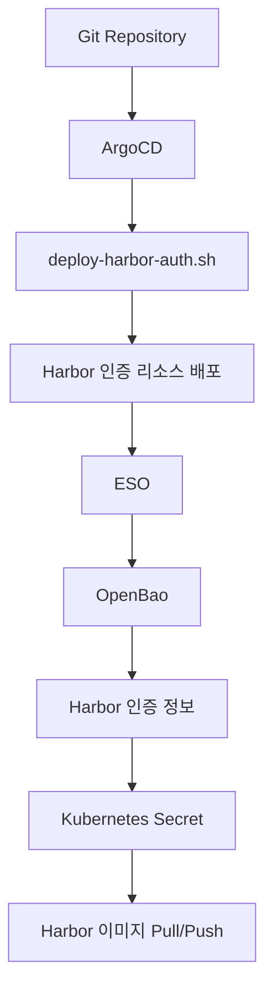
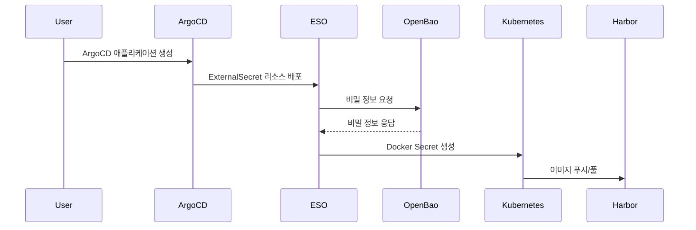
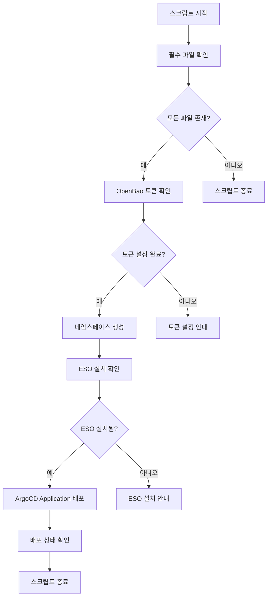
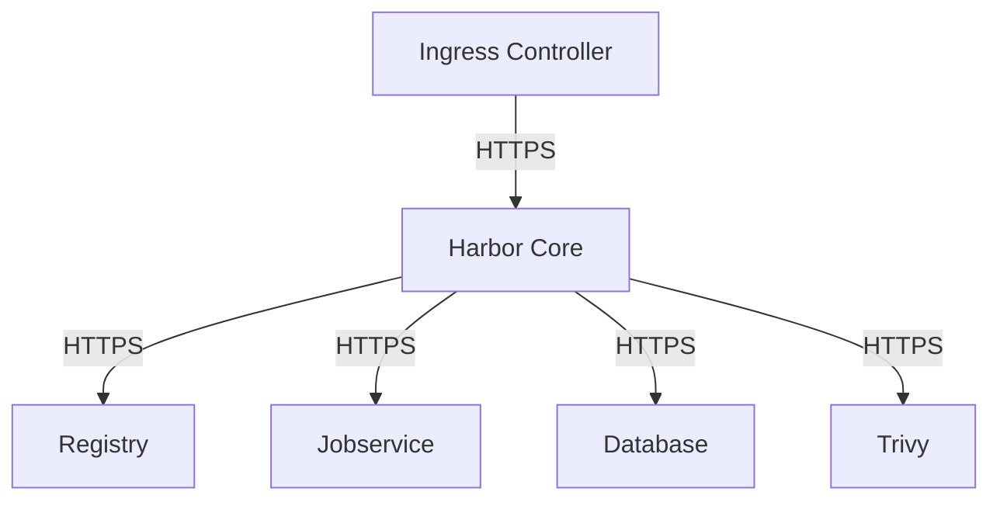
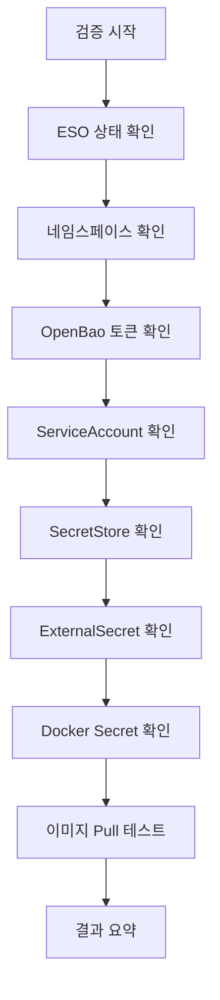
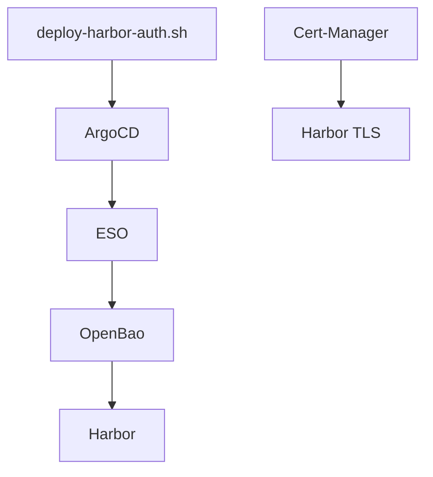

# 이미지 레지스트리 통합

<cite>
**이 문서에서 참조한 파일**  
- [deploy-harbor-auth.sh](file://scripts/deploy-harbor-auth.sh)
- [harbor-registry-secret.yaml](file://helm/shared-configs/openbao-secrets-manager/templates/harbor-registry-secret.yaml)
- [values.yaml](file://helm/shared-configs/openbao-secrets-manager/values.yaml)
- [verify-harbor-auth.sh](file://scripts/verify-harbor-auth.sh)
- [harbor/templates/ingress/secret.yaml](file://helm/development-tools/harbor/templates/ingress/secret.yaml)
- [harbor/templates/registry/registry-tls.yaml](file://helm/development-tools/harbor/templates/registry/registry-tls.yaml)
- [harbor/README.md](file://helm/development-tools/harbor/README.md)
- [esc-policy.hcl](file://scripts/openbao/policies/esc-policy.hcl)
</cite>

## 목차
1. [소개](#소개)
2. [프로젝트 구조](#프로젝트-구조)
3. [핵심 구성 요소](#핵심-구성-요소)
4. [아키텍처 개요](#아키텍처-개요)
5. [상세 구성 요소 분석](#상세-구성-요소-분석)
6. [의존성 분석](#의존성-분석)
7. [성능 고려사항](#성능-고려사항)
8. [문제 해결 가이드](#문제-해결-가이드)
9. [결론](#결론)

## 소개
이 문서는 Harbor 컨테이너 레지스트리와의 통합을 설명합니다. `deploy-harbor-auth.sh` 스크립트를 통한 인증 설정, Harbor Helm 차트 구성, 이미지 푸시/풀 권한 관리 방식을 상세히 설명합니다. TLS 설정, 사용자 인증, RBAC 정책 구성 방법을 안내하고, OpenBao와 연동된 Harbor 레지스트리 비밀 관리 방식을 설명합니다. 인증 문제 해결을 위한 진단 절차를 포함합니다.

## 프로젝트 구조
Harbor 레지스트리 통합은 Helm 기반의 GitOps 방식으로 관리되며, ESO(External Secrets Operator)를 통해 OpenBao에서 비밀 정보를 가져와 Kubernetes 클러스터 내에서 Harbor 인증을 위한 Docker Secret을 생성합니다. 주요 구성 요소는 다음과 같습니다:

- **scripts/deploy-harbor-auth.sh**: ArgoCD를 통해 Harbor 인증 리소스를 배포하는 스크립트
- **helm/shared-configs/openbao-secrets-manager/**: OpenBao에서 Harbor 인증 정보를 가져와 Kubernetes Secret으로 생성하는 Helm 차트
- **helm/development-tools/harbor/**: Harbor 레지스트리 자체의 Helm 차트
- **scripts/verify-harbor-auth.sh**: Harbor 인증 설정이 정상적으로 작동하는지 검증하는 스크립트

**다이어그램 출처**
- [deploy-harbor-auth.sh](file://scripts/deploy-harbor-auth.sh)
- [harbor-registry-secret.yaml](file://helm/shared-configs/openbao-secrets-manager/templates/harbor-registry-secret.yaml)
- [values.yaml](file://helm/shared-configs/openbao-secrets-manager/values.yaml)

**섹션 출처**
- [deploy-harbor-auth.sh](file://scripts/deploy-harbor-auth.sh)
- [harbor-registry-secret.yaml](file://helm/shared-configs/openbao-secrets-manager/templates/harbor-registry-secret.yaml)
- [values.yaml](file://helm/shared-configs/openbao-secrets-manager/values.yaml)

## 핵심 구성 요소
Harbor 인증 통합의 핵심 구성 요소는 다음과 같습니다:

- **External Secrets Operator (ESO)**: OpenBao에서 비밀 정보를 가져와 Kubernetes Secret으로 생성하는 오픈소스 연산자
- **OpenBao**: 비밀 정보를 저장하고 관리하는 비밀 관리 도구
- **Harbor**: 컨테이너 이미지 레지스트리
- **ArgoCD**: GitOps 방식의 지속적 배포 도구

이러한 구성 요소들은 서로 긴밀하게 연동되어 Harbor 인증을 위한 비밀 정보를 안전하게 관리하고, Kubernetes 클러스터 내에서 이미지 푸시/풀을 가능하게 합니다.

**섹션 출처**
- [deploy-harbor-auth.sh](file://scripts/deploy-harbor-auth.sh)
- [harbor-registry-secret.yaml](file://helm/shared-configs/openbao-secrets-manager/templates/harbor-registry-secret.yaml)
- [values.yaml](file://helm/shared-configs/openbao-secrets-manager/values.yaml)

## 아키텍처 개요
Harbor 인증 통합 아키텍처는 다음과 같은 흐름으로 작동합니다:

1. **OpenBao에 Harbor 인증 정보 저장**: Harbor Robot Account의 사용자 이름, 비밀번호, 레지스트리 URL 등의 인증 정보를 OpenBao에 저장
2. **ESO를 통한 비밀 정보 동기화**: ESO가 OpenBao에서 비밀 정보를 가져와 Kubernetes Secret으로 생성
3. **Kubernetes Pod에서의 이미지 푸시/풀**: 생성된 Docker Secret을 사용하여 Kubernetes Pod에서 Harbor 레지스트리에 이미지 푸시/풀 수행

이러한 아키텍처는 비밀 정보를 Git 저장소에 직접 저장하지 않고, OpenBao와 같은 전용 비밀 관리 도구를 통해 안전하게 관리할 수 있도록 합니다.

**다이어그램 출처**
- [deploy-harbor-auth.sh](file://scripts/deploy-harbor-auth.sh)
- [harbor-registry-secret.yaml](file://helm/shared-configs/openbao-secrets-manager/templates/harbor-registry-secret.yaml)
- [values.yaml](file://helm/shared-configs/openbao-secrets-manager/values.yaml)

## 상세 구성 요소 분석

### deploy-harbor-auth.sh 스크립트 분석
`deploy-harbor-auth.sh` 스크립트는 ArgoCD를 통해 Harbor 인증 리소스를 배포하는 역할을 합니다. 주요 기능은 다음과 같습니다:

- **필수 파일 존재 확인**: `serviceaccount.yaml`, `openbao-token-secret.yaml`, `secret-store.yaml`, `external-secret.yaml` 파일이 존재하는지 확인
- **OpenBao 토큰 설정 확인**: `openbao-token-secret.yaml` 파일에 OpenBao 토큰이 설정되어 있는지 확인
- **네임스페이스 생성**: `plate-stg`, `plate-prod` 네임스페이스 생성
- **ESO 설치 확인**: ESO가 설치되어 있고 실행 중인지 확인
- **ArgoCD Application 배포**: `harbor-auth.yaml` 파일을 통해 ArgoCD Application 생성
- **배포 상태 확인**: SecretStore, ExternalSecret, Harbor Docker Secret이 정상적으로 생성되었는지 확인

**다이어그램 출처**
- [deploy-harbor-auth.sh](file://scripts/deploy-harbor-auth.sh)

**섹션 출처**
- [deploy-harbor-auth.sh](file://scripts/deploy-harbor-auth.sh)

### Harbor Helm 차트 구성 분석
Harbor Helm 차트는 다양한 구성 옵션을 제공하며, 주요 구성 항목은 다음과 같습니다:

- **expose.type**: 서비스 노출 방식 (ingress, clusterIP, nodePort, loadBalancer)
- **expose.tls.enabled**: TLS 활성화 여부
- **expose.tls.certSource**: TLS 인증서 소스 (auto, secret, none)
- **internalTLS.enabled**: 내부 구성 요소 간 TLS 활성화 여부
- **persistence.enabled**: 데이터 영구 저장 활성화 여부
- **externalURL**: Harbor 코어 서비스의 외부 URL

이러한 구성 옵션을 통해 Harbor 레지스트리를 다양한 환경에 맞게 유연하게 구성할 수 있습니다.

**섹션 출처**
- [harbor/README.md](file://helm/development-tools/harbor/README.md)

### 이미지 푸시/풀 권한 관리 방식
이미지 푸시/풀 권한은 Harbor의 RBAC(Role-Based Access Control) 정책을 통해 관리됩니다. 주요 권한은 다음과 같습니다:

- **프로젝트 소유자**: 프로젝트 내 모든 리소스에 대한 완전한 제어 권한
- **프로젝트 개발자**: 이미지 푸시/풀, 태그 생성, 스캔 실행 권한
- **프로젝트 게스트**: 이미지 푸시/풀 권한
- **프로젝트 뷰어**: 이미지 조회 권한

이러한 권한은 Harbor UI 또는 API를 통해 설정할 수 있으며, Robot Account를 생성하여 CI/CD 파이프라인에서 사용할 수 있습니다.

**섹션 출처**
- [harbor/README.md](file://helm/development-tools/harbor/README.md)

### TLS 설정
Harbor는 외부 및 내부 TLS 설정을 모두 지원합니다.

- **외부 TLS**: `expose.tls.enabled`를 `true`로 설정하고, `expose.tls.certSource`를 `auto`, `secret`, 또는 `none`으로 구성
- **내부 TLS**: `internalTLS.enabled`를 `true`로 설정하고, `internalTLS.certSource`를 `auto`, `manual`, 또는 `secret`으로 구성

내부 TLS는 Harbor의 핵심 구성 요소들(코어, jobservice, registry 등) 간의 통신을 암호화하여 보안을 강화합니다.

**다이어그램 출처**
- [harbor/templates/ingress/secret.yaml](file://helm/development-tools/harbor/templates/ingress/secret.yaml)
- [harbor/templates/registry/registry-tls.yaml](file://helm/development-tools/harbor/templates/registry/registry-tls.yaml)

**섹션 출처**
- [harbor/README.md](file://helm/development-tools/harbor/README.md)

### 사용자 인증 및 RBAC 정책 구성
Harbor는 다양한 인증 방식을 지원하며, 주로 Robot Account를 사용하여 자동화된 시스템에서 인증을 처리합니다. RBAC 정책은 다음과 같은 방식으로 구성됩니다:

1. **Robot Account 생성**: Harbor UI에서 Robot Account를 생성하고, 적절한 권한을 부여
2. **OpenBao에 인증 정보 저장**: 생성된 Robot Account의 사용자 이름, 비밀번호, 레지스트리 URL을 OpenBao에 저장
3. **ESO를 통한 비밀 정보 동기화**: ESO가 OpenBao에서 비밀 정보를 가져와 Kubernetes Secret으로 생성
4. **Kubernetes Pod에서의 사용**: 생성된 Docker Secret을 Pod의 `imagePullSecrets`에 지정하여 이미지 푸시/풀 수행

이러한 방식은 비밀 정보를 안전하게 관리하면서도 자동화된 CI/CD 파이프라인에서 쉽게 사용할 수 있도록 합니다.

**섹션 출처**
- [esc-policy.hcl](file://scripts/openbao/policies/esc-policy.hcl)
- [harbor-registry-secret.yaml](file://helm/shared-configs/openbao-secrets-manager/templates/harbor-registry-secret.yaml)

### OpenBao와 연동된 Harbor 레지스트리 비밀 관리
OpenBao는 Harbor 인증 정보를 안전하게 저장하고 관리하는 역할을 합니다. 주요 특징은 다음과 같습니다:

- **중앙 집중식 비밀 관리**: 모든 환경(staging, production)의 Harbor 인증 정보를 하나의 도구에서 관리
- **세분화된 접근 제어**: Vault 정책을 통해 특정 경로에 대한 읽기/쓰기 권한을 세밀하게 제어
- **자동화된 비밀 동기화**: ESO를 통해 OpenBao의 비밀 정보를 자동으로 Kubernetes Secret으로 동기화

이러한 방식은 비밀 정보의 노출 위험을 최소화하면서도 운영 효율성을 높입니다.

**섹션 출처**
- [values.yaml](file://helm/shared-configs/openbao-secrets-manager/values.yaml)
- [harbor-registry-secret.yaml](file://helm/shared-configs/openbao-secrets-manager/templates/harbor-registry-secret.yaml)

### 인증 문제 해결을 위한 진단 절차
`verify-harbor-auth.sh` 스크립트는 Harbor 인증 설정이 정상적으로 작동하는지 검증하는 데 사용됩니다. 주요 검증 항목은 다음과 같습니다:

- **ESO 설치 상태 확인**: ESO가 설치되어 있고 실행 중인지 확인
- **네임스페이스 존재 확인**: `plate-stg`, `plate-prod` 네임스페이스가 존재하는지 확인
- **OpenBao 토큰 Secret 확인**: `openbao-token` Secret이 존재하는지 확인
- **ServiceAccount 확인**: `harbor-secret-reader` ServiceAccount가 존재하는지 확인
- **SecretStore 확인**: `openbao-harbor` SecretStore가 생성되고 연결 상태가 정상인지 확인
- **ExternalSecret 확인**: `harbor-registry-secret` ExternalSecret이 생성되고 동기화 상태가 정상인지 확인
- **Harbor Docker Secret 확인**: `harbor-docker-secret`이 생성되고 타입이 `kubernetes.io/dockerconfigjson`인지 확인
- **Harbor 이미지 Pull 테스트**: 실제 이미지를 풀할 수 있는지 테스트

이러한 진단 절차를 통해 인증 문제를 신속하게 식별하고 해결할 수 있습니다.

**다이어그램 출처**
- [verify-harbor-auth.sh](file://scripts/verify-harbor-auth.sh)

**섹션 출처**
- [verify-harbor-auth.sh](file://scripts/verify-harbor-auth.sh)

## 의존성 분석
Harbor 인증 통합은 다음과 같은 주요 의존성을 가지고 있습니다:

- **External Secrets Operator (ESO)**: OpenBao에서 비밀 정보를 가져오는 데 필수적인 연산자
- **OpenBao**: 비밀 정보를 저장하고 관리하는 데 필수적인 비밀 관리 도구
- **ArgoCD**: GitOps 방식으로 리소스를 배포하는 데 필수적인 지속적 배포 도구
- **Cert-Manager**: TLS 인증서를 자동으로 생성하고 관리하는 데 사용될 수 있음

이러한 의존성들은 Harbor 인증 통합의 핵심 기능을 제공하며, 각각의 구성 요소가 정상적으로 작동해야 전체 시스템이 원활하게 동작합니다.

**다이어그램 출처**
- [deploy-harbor-auth.sh](file://scripts/deploy-harbor-auth.sh)
- [harbor-registry-secret.yaml](file://helm/shared-configs/openbao-secrets-manager/templates/harbor-registry-secret.yaml)
- [values.yaml](file://helm/shared-configs/openbao-secrets-manager/values.yaml)

**섹션 출처**
- [deploy-harbor-auth.sh](file://scripts/deploy-harbor-auth.sh)
- [harbor-registry-secret.yaml](file://helm/shared-configs/openbao-secrets-manager/templates/harbor-registry-secret.yaml)
- [values.yaml](file://helm/shared-configs/openbao-secrets-manager/values.yaml)

## 성능 고려사항
Harbor 인증 통합에서 고려해야 할 주요 성능 요소는 다음과 같습니다:

- **ESO 동기화 주기**: `refreshInterval`을 적절히 설정하여 비밀 정보의 최신성을 유지하면서도 불필요한 API 호출을 최소화
- **OpenBao 성능**: OpenBao 서버의 성능이 비밀 정보 조회 속도에 직접적인 영향을 미침
- **네트워크 지연**: OpenBao와 Kubernetes 클러스터 간의 네트워크 지연이 전체 인증 흐름에 영향을 미칠 수 있음
- **TLS 오버헤드**: 내부 TLS를 활성화하면 보안은 강화되지만, 암호화/복호화 과정에서 성능 오버헤드가 발생할 수 있음

이러한 요소들을 고려하여 시스템의 전반적인 성능을 최적화해야 합니다.

## 문제 해결 가이드
Harbor 인증 설정에서 발생할 수 있는 주요 문제와 해결 방법은 다음과 같습니다:

- **ESO가 설치되지 않은 경우**: `helm install external-secrets external-secrets/external-secrets --namespace external-secrets-system --create-namespace --set installCRDs=true` 명령어로 ESO를 설치
- **OpenBao 토큰이 설정되지 않은 경우**: `bao write auth/token/create policies="default" ttl="8760h"` 명령어로 토큰을 생성하고, base64 인코딩하여 `openbao-token-secret.yaml` 파일에 설정
- **SecretStore 연결 실패**: OpenBao 서버 URL, 경로, 버전, 인증 방법 등이 올바르게 설정되었는지 확인
- **ExternalSecret 동기화 실패**: OpenBao 정책에서 해당 경로에 대한 읽기 권한이 부여되었는지 확인
- **Harbor 이미지 Pull 실패**: 생성된 Docker Secret의 내용이 올바른지 확인하고, Harbor Robot Account가 활성화되어 있는지 확인

이러한 문제 해결 가이드를 참고하여 신속하게 문제를 해결할 수 있습니다.

**섹션 출처**
- [deploy-harbor-auth.sh](file://scripts/deploy-harbor-auth.sh)
- [verify-harbor-auth.sh](file://scripts/verify-harbor-auth.sh)

## 결론
Harbor 컨테이너 레지스트리와의 통합은 ESO와 OpenBao를 통해 안전하고 효율적인 비밀 관리 방식을 제공합니다. `deploy-harbor-auth.sh` 스크립트를 통해 ArgoCD를 이용한 GitOps 방식으로 인증 리소스를 배포하고, `verify-harbor-auth.sh` 스크립트를 통해 설정이 정상적으로 작동하는지 검증할 수 있습니다. TLS 설정, 사용자 인증, RBAC 정책 구성 방법을 숙지하고, OpenBao와의 연동을 통해 비밀 정보를 안전하게 관리함으로써, 안정적이고 보안성이 높은 컨테이너 이미지 레지스트리 환경을 구축할 수 있습니다.