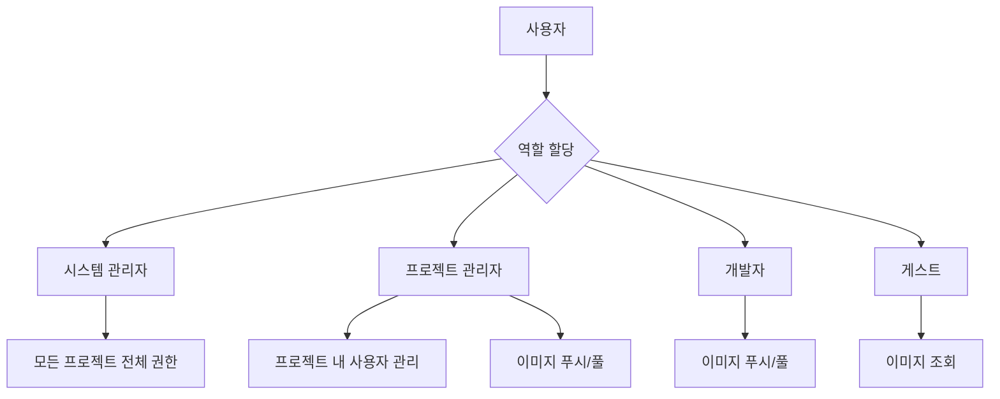
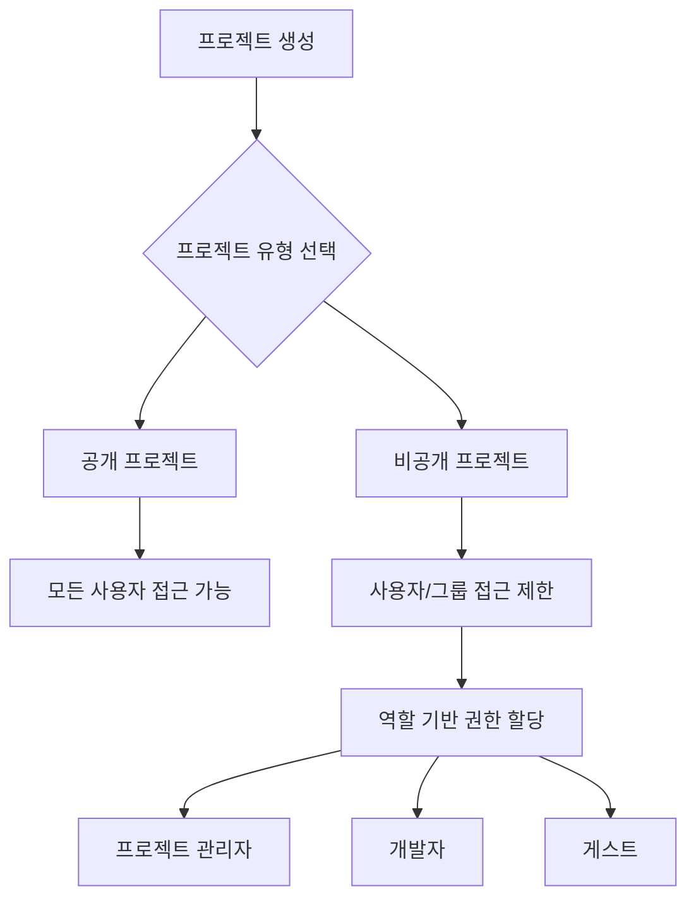
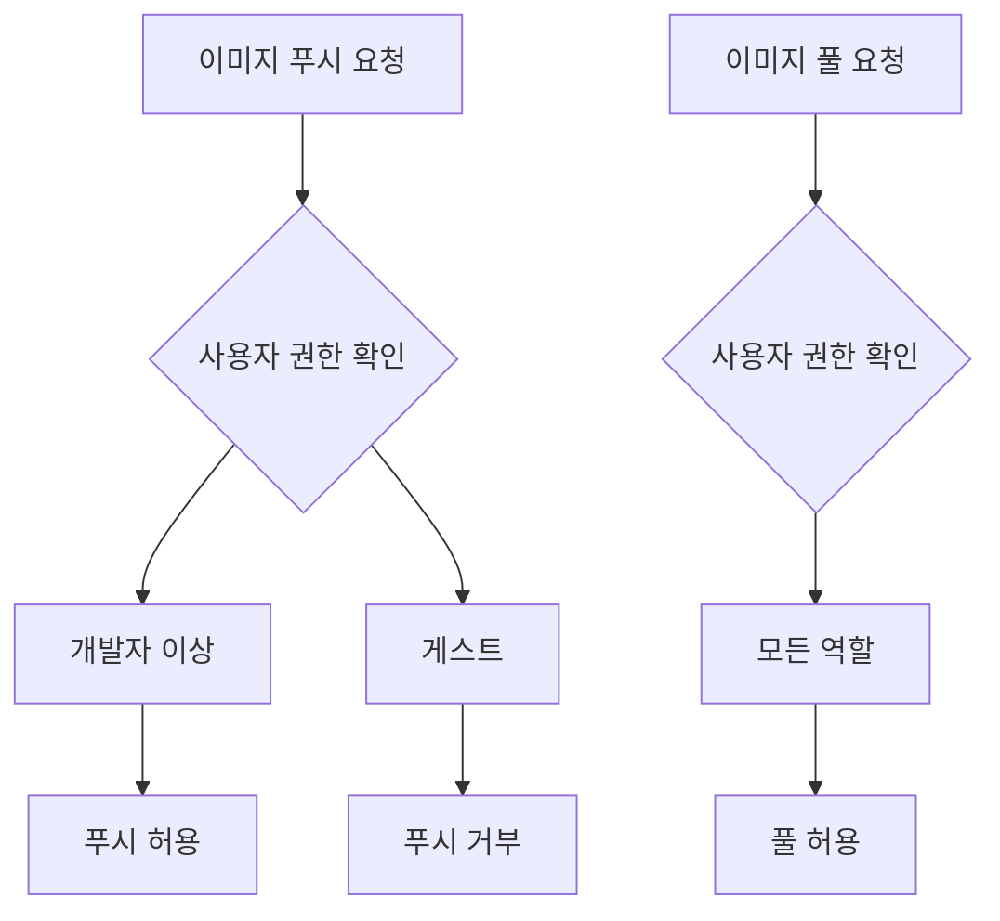

# 접근 제어

<cite>
**이 문서에서 참조한 파일**   
- [values.yaml](file://helm/development-tools/harbor/values.yaml)
- [core-cm.yaml](file://helm/development-tools/harbor/templates/core/core-cm.yaml)
- [registry-cm.yaml](file://helm/development-tools/harbor/templates/registry/registry-cm.yaml)
- [jobservice-cm.yaml](file://helm/development-tools/harbor/templates/jobservice/jobservice-cm.yaml)
- [esc-policy.hcl](file://scripts/openbao/policies/esc-policy.hcl)
</cite>

## 목차
1. [소개](#소개)
2. [RBAC 기반 사용자 역할 및 권한 설정](#rbac-기반-사용자-역할-및-권한-설정)
3. [프로젝트별 접근 정책 구성](#프로젝트별-접근-정책-구성)
4. [이미지 푸시/풀 권한 관리](#이미지-푸시풀-권한-관리)
5. [values.yaml 설정 값 설명](#valuesyaml-설정-값-설명)
6. [운영 환경 접근 제어 정책 수립 가이드](#운영-환경-접근-제어-정책-수립-가이드)
7. [접근 거부 오류 진단 및 해결 절차](#접근-거부-오류-진단-및-해결-절차)

## 소개
Harbor 레지스트리는 컨테이너 이미지 및 아티팩트 저장소로서, 안전한 접근 제어 메커니즘을 제공합니다. 이 문서는 Harbor의 접근 제어 시스템을 설명하며, RBAC(역할 기반 접근 제어)를 통한 사용자 역할 및 권한 설정, 프로젝트별 접근 정책 구성, 이미지 푸시/풀 권한 관리 방법을 상세히 기술합니다. 또한 Helm 차트의 `values.yaml` 파일에서 정의된 접근 제어 관련 설정 값들의 의미와 사용법을 설명하고, 실제 운영 환경에서의 접근 제어 정책 수립 가이드를 제공합니다. 접근 거부 오류 발생 시 진단 및 해결 절차도 포함되어 있습니다.

**Section sources**
- [values.yaml](file://helm/development-tools/harbor/values.yaml#L1-L1070)

## RBAC 기반 사용자 역할 및 권한 설정
Harbor는 RBAC(역할 기반 접근 제어) 시스템을 통해 사용자에게 역할을 할당하고, 역할에 따라 권한을 부여합니다. 사용자는 시스템 관리자, 프로젝트 관리자, 개발자, 게스트 등의 역할을 가질 수 있으며, 각 역할은 특정 작업을 수행할 수 있는 권한을 갖습니다. 시스템 관리자는 모든 프로젝트에 대한 전체 권한을 가지며, 프로젝트 관리자는 자신이 관리하는 프로젝트 내에서 사용자 역할을 관리하고, 이미지 푸시/풀 등의 작업을 수행할 수 있습니다. 개발자는 이미지 푸시/풀이 가능하며, 게스트는 이미지 조회만 가능합니다.

Harbor의 RBAC 설정은 OpenBao와 연동되어 있으며, `esc-policy.hcl` 파일에 정의된 정책을 통해 Harbor 시크릿에 대한 접근 권한이 관리됩니다. 이 정책은 staging, production, development 환경의 Harbor 시크릿에 대한 읽기 권한과 시크릿 목록 조회 권한을 정의합니다.

**Diagram sources**
- [esc-policy.hcl](file://scripts/openbao/policies/esc-policy.hcl#L54-L84)

**Section sources**
- [esc-policy.hcl](file://scripts/openbao/policies/esc-policy.hcl#L54-L84)

## 프로젝트별 접근 정책 구성
Harbor는 프로젝트 단위로 접근 정책을 구성할 수 있습니다. 각 프로젝트는 공개(public) 또는 비공개(private)로 설정할 수 있으며, 비공개 프로젝트는 특정 사용자 또는 그룹만 접근할 수 있도록 제한할 수 있습니다. 프로젝트 접근 정책은 프로젝트 생성 시 또는 이후에 수정할 수 있으며, 사용자 및 그룹에 대한 역할을 지정하여 세부적인 접근 제어를 구현할 수 있습니다.

프로젝트 접근 정책은 Harbor의 Core 서비스를 통해 관리되며, `core-cm.yaml` 템플릿 파일에 정의된 구성에 따라 동작합니다. 이 구성은 데이터베이스 연결 정보, 외부 엔드포인트, Redis 연결 정보 등을 포함하며, 프로젝트 접근 제어에 필요한 핵심 설정을 담고 있습니다.

**Diagram sources**
- [core-cm.yaml](file://helm/development-tools/harbor/templates/core/core-cm.yaml#L1-L92)

**Section sources**
- [core-cm.yaml](file://helm/development-tools/harbor/templates/core/core-cm.yaml#L1-L92)

## 이미지 푸시/풀 권한 관리
Harbor는 이미지 푸시(push) 및 풀(pull) 작업에 대한 세부적인 권한 관리를 제공합니다. 사용자의 역할에 따라 이미지 푸시 및 풀 권한이 결정되며, 이는 프로젝트 수준에서 설정됩니다. 예를 들어, 개발자 역할은 이미지 푸시 및 풀이 가능하지만, 게스트 역할은 이미지 풀만 가능합니다. 이러한 권한 관리는 Harbor의 Registry 컴포넌트를 통해 구현되며, `registry-cm.yaml` 템플릿 파일에 정의된 구성에 따라 동작합니다.

Registry 구성은 스토리지 백엔드, Redis 연결 정보, HTTP 설정 등을 포함하며, 이미지 푸시/풀 요청을 처리하는 데 필요한 모든 설정을 담고 있습니다. 특히, `auth` 섹션의 `htpasswd` 설정은 Harbor Core가 Registry 인스턴스에 접근하기 위한 인증 정보를 제공합니다.

**Diagram sources**
- [registry-cm.yaml](file://helm/development-tools/harbor/templates/registry/registry-cm.yaml#L1-L249)

**Section sources**
- [registry-cm.yaml](file://helm/development-tools/harbor/templates/registry/registry-cm.yaml#L1-L249)

## values.yaml 설정 값 설명
Harbor Helm 차트의 `values.yaml` 파일은 접근 제어와 관련된 다양한 설정 값을 포함하고 있습니다. 주요 설정 값들은 다음과 같습니다:

- `expose.tls.enabled`: TLS 활성화 여부. true로 설정하면 HTTPS를 통해 서비스에 접근할 수 있습니다.
- `expose.ingress.hosts.core`: Harbor Core 서비스의 인그레스 호스트 이름.
- `externalURL`: Harbor Core 서비스의 외부 URL. 이 URL은 포털에 표시되는 Docker/Helm 명령어 및 토큰 서비스 URL에 사용됩니다.
- `harborAdminPassword`: Harbor 관리자 계정의 초기 비밀번호.
- `core.secret`: Core 서버가 다른 컴포넌트와 통신할 때 사용하는 비밀 키.
- `registry.credentials.username` 및 `registry.credentials.password`: Harbor Core가 Registry 인스턴스에 접근하기 위해 사용하는 인증 정보.

이러한 설정 값들은 Harbor의 보안 및 접근 제어 동작을 결정하며, Helm 설치 시 적절한 값으로 구성되어야 합니다.

**Section sources**
- [values.yaml](file://helm/development-tools/harbor/values.yaml#L1-L1070)

## 운영 환경 접근 제어 정책 수립 가이드
운영 환경에서 Harbor의 접근 제어 정책을 수립할 때는 다음과 같은 가이드를 따르는 것이 좋습니다:

1. **최소 권한 원칙 적용**: 사용자에게 필요한 최소한의 권한만 부여합니다. 예를 들어, 이미지만 풀해야 하는 사용자에게는 개발자 역할 대신 게스트 역할을 부여합니다.
2. **역할 기반 접근 제어 강화**: 사용자 그룹을 생성하고, 그룹에 역할을 할당하여 관리의 효율성을 높입니다.
3. **정기적인 접근 권한 검토**: 주기적으로 사용자의 접근 권한을 검토하고, 필요 없는 권한은 제거합니다.
4. **감사 로그 활성화**: 모든 접근 시도에 대한 감사 로그를 활성화하여 보안 사고 발생 시 추적할 수 있도록 합니다.
5. **비밀번호 정책 강화**: 강력한 비밀번호 정책을 적용하고, 정기적인 비밀번호 변경을 요구합니다.

이러한 가이드를 따르면 운영 환경에서 Harbor의 보안을 강화하고, 무단 접근을 방지할 수 있습니다.

**Section sources**
- [values.yaml](file://helm/development-tools/harbor/values.yaml#L1-L1070)

## 접근 거부 오류 진단 및 해결 절차
Harbor에 접근할 때 접근 거부 오류가 발생하면 다음과 같은 절차에 따라 진단하고 해결할 수 있습니다:

1. **사용자 자격 증명 확인**: 사용자 이름과 비밀번호가 올바른지 확인합니다.
2. **역할 및 권한 확인**: 사용자에게 올바른 역할이 할당되었는지, 해당 역할이 요청한 작업을 수행할 수 있는 권한을 가지고 있는지 확인합니다.
3. **프로젝트 접근 정책 확인**: 사용자가 접근하려는 프로젝트가 공개 프로젝트인지, 아니면 사용자가 접근 권한을 가지고 있는지 확인합니다.
4. **감사 로그 분석**: Harbor의 감사 로그를 확인하여 접근 거부의 정확한 원인을 파악합니다.
5. **OpenBao 정책 확인**: OpenBao의 `esc-policy.hcl` 파일에서 Harbor 시크릿에 대한 접근 권한이 올바르게 설정되었는지 확인합니다.

이러한 절차를 따르면 접근 거부 오류의 원인을 신속하게 진단하고 해결할 수 있습니다.

**Section sources**
- [esc-policy.hcl](file://scripts/openbao/policies/esc-policy.hcl#L54-L84)
- [values.yaml](file://helm/development-tools/harbor/values.yaml#L1-L1070)