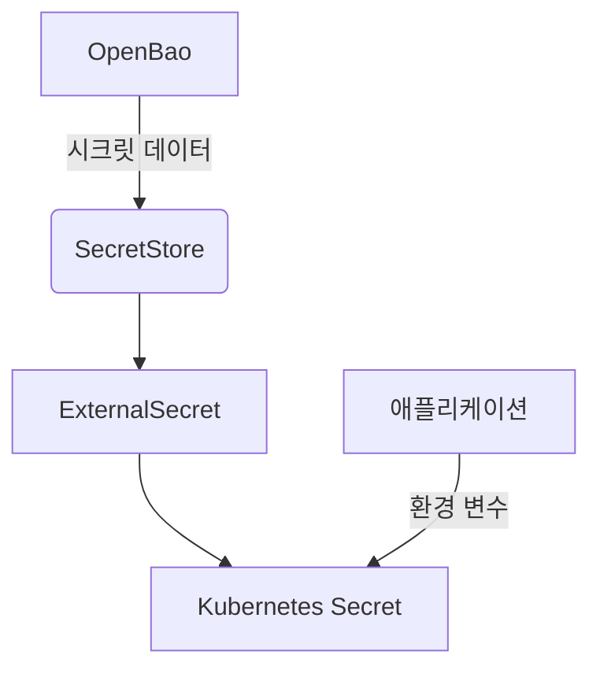
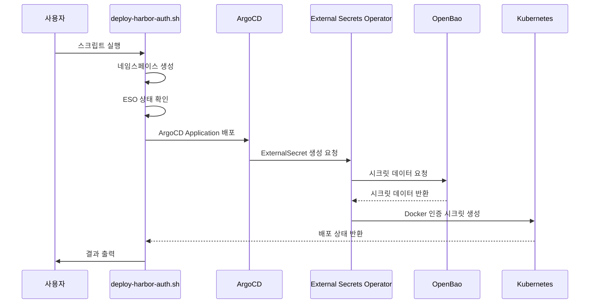
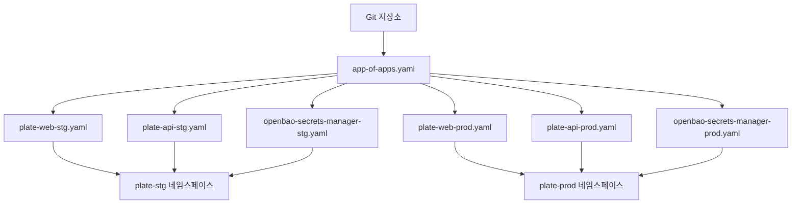

# 통합 포인트

<cite>
**이 문서에서 참조한 파일**   
- [openbao-secrets-manager/Chart.yaml](file://helm/shared-configs/openbao-secrets-manager/Chart.yaml)
- [openbao-secrets-manager/values.yaml](file://helm/shared-configs/openbao-secrets-manager/values.yaml)
- [openbao-secrets-manager/values-staging.yaml](file://helm/shared-configs/openbao-secrets-manager/values-staging.yaml)
- [openbao-secrets-manager/values-production.yaml](file://helm/shared-configs/openbao-secrets-manager/values-production.yaml)
- [openbao-secrets-manager/templates/external-secret.yaml](file://helm/shared-configs/openbao-secrets-manager/templates/external-secret.yaml)
- [openbao-secrets-manager/templates/harbor-registry-secret.yaml](file://helm/shared-configs/openbao-secrets-manager/templates/harbor-registry-secret.yaml)
- [openbao-secrets-manager/templates/openbao-token-secret.yaml](file://helm/shared-configs/openbao-secrets-manager/templates/openbao-token-secret.yaml)
- [openbao-secrets-manager/templates/secret-store.yaml](file://helm/shared-configs/openbao-secrets-manager/templates/secret-store.yaml)
- [environments/argocd/apps/openbao-secrets-manager-stg.yaml](file://environments/argocd/apps/openbao-secrets-manager-stg.yaml)
- [environments/argocd/apps/openbao-secrets-manager-prod.yaml](file://environments/argocd/apps/openbao-secrets-manager-prod.yaml)
- [environments/argocd/app-of-apps.yaml](file://environments/argocd/app-of-apps.yaml)
- [scripts/deploy-harbor-auth.sh](file://scripts/deploy-harbor-auth.sh)
- [scripts/verify-harbor-auth.sh](file://scripts/verify-harbor-auth.sh)
- [helm/development-tools/harbor/values.yaml](file://helm/development-tools/harbor/values.yaml)
</cite>

## 목차
1. [소개](#소개)
2. [OpenBao 시크릿 매니저 통합](#openbao-시크릿-매니저-통합)
3. [Harbor 인증 설정 통합](#harbor-인증-설정-통합)
4. [ArgoCD 애플리케이션 정의 통합](#argocd-애플리케이션-정의-통합)
5. [확장 가이드](#확장-가이드)
6. [결론](#결론)

## 소개

이 문서는 시스템 내외부로의 주요 통합 포인트를 설명합니다. OpenBao 시크릿 매니저와의 통합 방식, Harbor 인증 설정 스크립트, ArgoCD Application 정의를 통한 배포 통합 등을 분석합니다. 각 통합의 목적, 구현 방식, 보안 고려사항을 설명하고, 새로운 통합을 추가하기 위한 확장 가이드를 제공합니다. 실제 코드 예제를 통해 통합의 동작 원리를 이해할 수 있도록 돕습니다.

## OpenBao 시크릿 매니저 통합

OpenBao 시크릿 매니저 통합은 외부 시크릿 관리 시스템과 Kubernetes 간의 연결을 제공합니다. 이 통합은 External Secrets Operator(ESO)를 사용하여 OpenBao에 저장된 시크릿을 Kubernetes 시크릿으로 동기화합니다.

### 목적

- 중앙 집중식 시크릿 관리: 모든 환경의 시크릿을 OpenBao에서 중앙에서 관리
- 보안 강화: 시크릿을 Git 저장소에 직접 저장하지 않고, 외부 시크릿 매니저에서 관리
- 자동화된 동기화: 변경 사항이 OpenBao에 반영되면 자동으로 Kubernetes 시크릿으로 동기화

### 구현 방식

OpenBao 시크릿 매니저 통합은 Helm 차트를 통해 구현됩니다. 차트는 다음 주요 구성 요소로 구성됩니다:

- **SecretStore**: OpenBao와의 연결을 정의하는 리소스
- **ExternalSecret**: OpenBao에서 가져올 시크릿의 매핑을 정의
- **ServiceAccount**: ESO가 OpenBao에 접근하기 위한 서비스 계정

환경별로 별도의 values 파일(values-staging.yaml, values-production.yaml)을 사용하여 환경별 설정을 관리합니다.

**Diagram sources**
- [openbao-secrets-manager/Chart.yaml](file://helm/shared-configs/openbao-secrets-manager/Chart.yaml)
- [openbao-secrets-manager/templates/secret-store.yaml](file://helm/shared-configs/openbao-secrets-manager/templates/secret-store.yaml)
- [openbao-secrets-manager/templates/external-secret.yaml](file://helm/shared-configs/openbao-secrets-manager/templates/external-secret.yaml)

**Section sources**
- [openbao-secrets-manager/Chart.yaml](file://helm/shared-configs/openbao-secrets-manager/Chart.yaml)
- [openbao-secrets-manager/values.yaml](file://helm/shared-configs/openbao-secrets-manager/values.yaml)
- [openbao-secrets-manager/values-staging.yaml](file://helm/shared-configs/openbao-secrets-manager/values-staging.yaml)
- [openbao-secrets-manager/values-production.yaml](file://helm/shared-configs/openbao-secrets-manager/values-production.yaml)

### 보안 고려사항

- **토큰 관리**: OpenBao 토큰은 Kubernetes 시크릿으로 저장되며, 적절한 RBAC 정책을 통해 접근을 제한
- **읽기 전용 파일 시스템**: 프로덕션 환경에서는 읽기 전용 루트 파일 시스템을 사용하여 보안 강화
- **노드 선택자 및 허용 구역**: 프로덕션 워크로드는 특정 노드에서만 실행되도록 제한

## Harbor 인증 설정 통합

Harbor 인증 설정 통합은 Kubernetes 클러스터가 Harbor 컨테이너 레지스트리에서 이미지를 가져올 수 있도록 인증 정보를 설정합니다.

### 목적

- 이미지 풀 인증: Kubernetes 노드가 Harbor에서 이미지를 가져올 수 있도록 인증 정보 제공
- 자동화된 설정: 수동으로 Docker 설정을 구성하지 않고, 자동으로 인증 정보를 배포
- 환경별 관리: 스테이징과 프로덕션 환경에 대해 별도의 인증 정보 관리

### 구현 방식

Harbor 인증 설정은 `deploy-harbor-auth.sh` 스크립트를 통해 자동화됩니다. 이 스크립트는 다음 단계를 수행합니다:

1. 필요한 네임스페이스 생성
2. ESO 설치 상태 확인
3. ArgoCD Application을 통해 Harbor 인증 리소스 배포
4. 배포 상태 검증

스크립트는 OpenBao 토큰이 올바르게 설정되었는지 확인하고, 그렇지 않으면 오류를 발생시킵니다.

**Diagram sources**
- [scripts/deploy-harbor-auth.sh](file://scripts/deploy-harbor-auth.sh)
- [openbao-secrets-manager/templates/harbor-registry-secret.yaml](file://helm/shared-configs/openbao-secrets-manager/templates/harbor-registry-secret.yaml)

**Section sources**
- [scripts/deploy-harbor-auth.sh](file://scripts/deploy-harbor-auth.sh)
- [scripts/verify-harbor-auth.sh](file://scripts/verify-harbor-auth.sh)
- [helm/development-tools/harbor/values.yaml](file://helm/development-tools/harbor/values.yaml)

### 보안 고려사항

- **Robot Account 사용**: Harbor Robot Account를 사용하여 최소 권한 원칙 적용
- **토큰 유효기간**: OpenBao 토큰에 유효기간 설정
- **네트워크 정책**: ESO와 OpenBao 간의 통신을 네트워크 정책으로 제한

## ArgoCD 애플리케이션 정의 통합

ArgoCD 애플리케이션 정의 통합은 GitOps 방식으로 애플리케이션을 배포하고 관리합니다.

### 목적

- 선언적 배포: Git 저장소의 상태가 시스템의 실제 상태를 반영
- 자동 동기화: Git 변경 사항이 자동으로 클러스터에 적용
- App-of-Apps 패턴: 여러 애플리케이션을 계층적으로 관리

### 구현 방식

ArgoCD 통합은 `environments/argocd/` 디렉터리에 정의된 Application 리소스를 통해 구현됩니다. 주요 특징은 다음과 같습니다:

- **App-of-Apps 패턴**: `app-of-apps.yaml`이 모든 하위 Application을 관리
- **환경 분리**: 스테이징과 프로덕션 환경이 별도의 Application으로 관리
- **자동 동기화**: `syncPolicy.automated`를 통해 Git 저장소 변경 시 자동 배포

**Diagram sources**
- [environments/argocd/app-of-apps.yaml](file://environments/argocd/app-of-apps.yaml)
- [environments/argocd/apps/plate-web-stg.yaml](file://environments/argocd/apps/plate-web-stg.yaml)
- [environments/argocd/apps/plate-api-stg.yaml](file://environments/argocd/apps/plate-api-stg.yaml)
- [environments/argocd/apps/plate-web-prod.yaml](file://environments/argocd/apps/plate-web-prod.yaml)
- [environments/argocd/apps/plate-api-prod.yaml](file://environments/argocd/apps/plate-api-prod.yaml)
- [environments/argocd/apps/openbao-secrets-manager-stg.yaml](file://environments/argocd/apps/openbao-secrets-manager-stg.yaml)
- [environments/argocd/apps/openbao-secrets-manager-prod.yaml](file://environments/argocd/apps/openbao-secrets-manager-prod.yaml)

**Section sources**
- [environments/argocd/app-of-apps.yaml](file://environments/argocd/app-of-apps.yaml)
- [environments/argocd/apps/plate-web-stg.yaml](file://environments/argocd/apps/plate-web-stg.yaml)
- [environments/argocd/apps/plate-api-stg.yaml](file://environments/argocd/apps/plate-api-stg.yaml)
- [environments/argocd/apps/plate-web-prod.yaml](file://environments/argocd/apps/plate-web-prod.yaml)
- [environments/argocd/apps/plate-api-prod.yaml](file://environments/argocd/apps/plate-api-prod.yaml)
- [environments/argocd/apps/openbao-secrets-manager-stg.yaml](file://environments/argocd/apps/openbao-secrets-manager-stg.yaml)
- [environments/argocd/apps/openbao-secrets-manager-prod.yaml](file://environments/argocd/apps/openbao-secrets-manager-prod.yaml)

### 보안 고려사항

- **RBAC**: ArgoCD 접근을 RBAC으로 제한
- **Private 저장소**: Git 저장소를 Private으로 유지
- **Self-Healing**: 수동 변경 사항을 자동으로 되돌리는 Self-Healing 기능 활성화

## 확장 가이드

새로운 통합을 추가하기 위한 확장 가이드입니다.

### 새 환경 추가

1. `environments/` 아래에 새 디렉터리 생성
2. 환경 전용 values 파일 작성
3. 필요 시 스크립트 분기/조건 추가

### 새 애플리케이션 추가

1. `helm/applications/` 이하에 새 차트 생성
2. 환경별 values 파일 작성
3. ArgoCD Application 정의 추가

### 인프라 수정

1. `helm/cluster-services/` 또는 `helm/development-tools/` 내 차트 수정
2. 스테이징 환경에서 검증
3. 프로덕션 환경에 반영

## 결론

이 문서는 OpenBao 시크릿 매니저, Harbor 인증 설정, ArgoCD 애플리케이션 정의의 세 가지 주요 통합 포인트를 설명했습니다. 각 통합은 보안, 자동화, 환경 분리를 고려하여 설계되었습니다. 새로운 통합을 추가할 때는 이 문서의 패턴을 따르면 일관성 있는 구조를 유지할 수 있습니다.