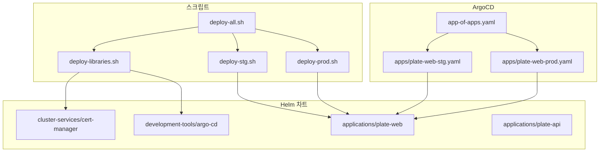
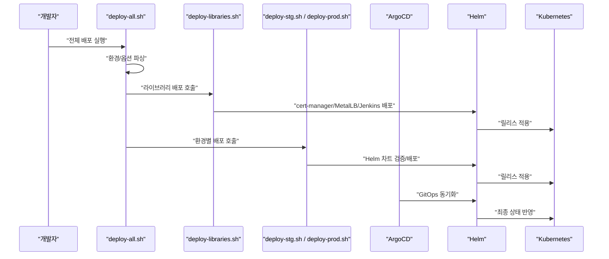
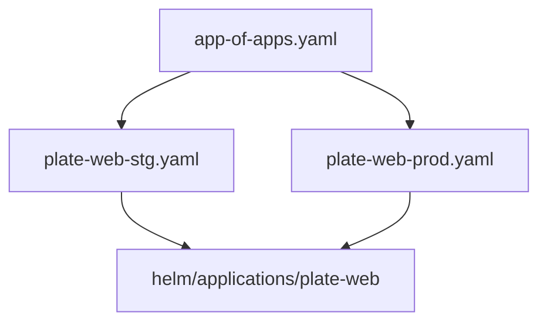
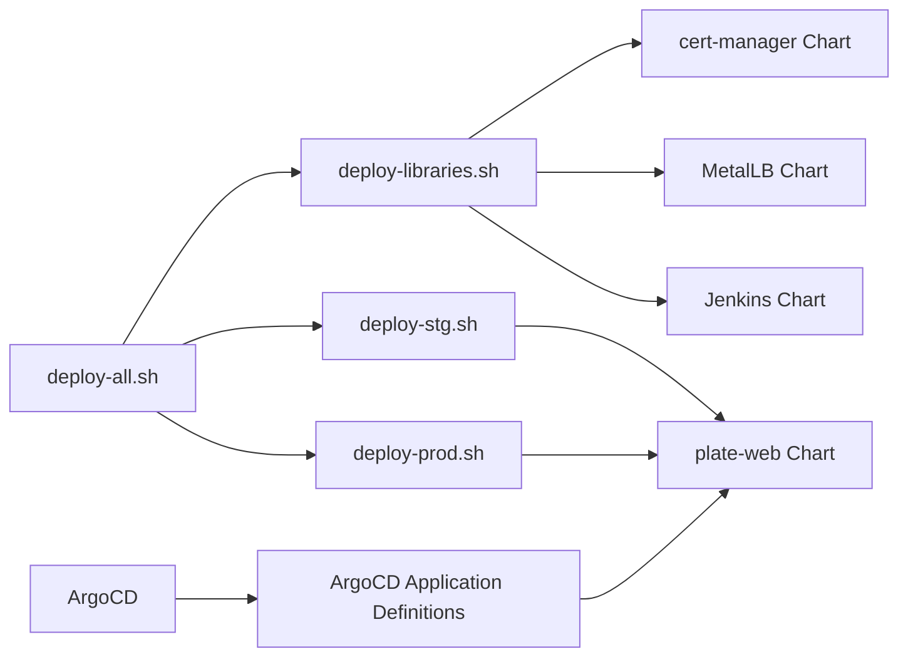

# 핵심 구현

<cite>
**문서에서 참조하는 파일 목록**
- [deploy-all.sh](file://scripts/deploy-all.sh)
- [deploy-libraries.sh](file://scripts/deploy-libraries.sh)
- [deploy-stg.sh](file://scripts/deploy-stg.sh)
- [deploy-prod.sh](file://scripts/deploy-prod.sh)
- [README.md](file://README.md)
- [app-of-apps.yaml](file://environments/argocd/app-of-apps.yaml)
- [plate-web-stg.yaml](file://environments/argocd/apps/plate-web-stg.yaml)
- [plate-web-prod.yaml](file://environments/argocd/apps/plate-web-prod.yaml)
- [Chart.yaml (plate-web)](file://helm/applications/plate-web/Chart.yaml)
- [Chart.yaml (plate-api)](file://helm/applications/plate-server/Chart.yaml)
- [Chart.yaml (cert-manager)](file://helm/cluster-services/cert-manager/Chart.yaml)
</cite>

## 목차
1. [소개](#소개)
2. [프로젝트 구조](#프로젝트-구조)
3. [핵심 컴포넌트](#핵심-컴포넌트)
4. [아키텍처 개요](#아키텍처-개요)
5. [상세 컴포넌트 분석](#상세-컴포넌트-분석)
6. [의존성 분석](#의존성-분석)
7. [성능 고려사항](#성능-고려사항)
8. [장애 해결 가이드](#장애-해결-가이드)
9. [결론](#결론)

## 소개
본 문서는 prj-devops의 핵심 배포 오케스트레이션 스크립트를 중심으로, 메인 배포 스크립트(deploy-all.sh), 클러스터 서비스 및 도구 배포 스크립트(deploy-libraries.sh), 각 환경별 배포 스크립트(deploy-stg.sh, deploy-prod.sh)의 구현 세부 사항을 설명합니다. 이 스크립트들이 ArgoCD와 Helm 차트를 어떻게 오케스트레이션하여 Kubernetes 클러스터에 배포하는지도 함께 설명합니다.

## 프로젝트 구조
- 스크립트: scripts/ 디렉토리에 위치한 배포 자동화 스크립트
- Helm 차트: helm/ 디렉토리에 계층별로 분리된 Helm 차트
- ArgoCD: environments/argocd/ 디렉토리에 App-of-Apps 패턴과 각 환경별 Application 정의
- 환경별 values: environments/ 디렉토리에 스테이징/프로덕션 values 파일

**도표 출처**
- [deploy-all.sh](file://scripts/deploy-all.sh#L1-L279)
- [deploy-libraries.sh](file://scripts/deploy-libraries.sh#L1-L128)
- [deploy-stg.sh](file://scripts/deploy-stg.sh#L1-L173)
- [deploy-prod.sh](file://scripts/deploy-prod.sh#L1-L299)
- [app-of-apps.yaml](file://environments/argocd/app-of-apps.yaml#L1-L35)
- [plate-web-stg.yaml](file://environments/argocd/apps/plate-web-stg.yaml#L1-L46)
- [plate-web-prod.yaml](file://environments/argocd/apps/plate-web-prod.yaml#L1-L46)
- [Chart.yaml (plate-web)](file://helm/applications/plate-web/Chart.yaml#L1-L17)
- [Chart.yaml (plate-api)](file://helm/applications/plate-server/Chart.yaml#L1-L16)
- [Chart.yaml (cert-manager)](file://helm/cluster-services/cert-manager/Chart.yaml#L1-L23)

**섹션 출처**
- [README.md](file://README.md#L1-L120)

## 핵심 컴포넌트
- deploy-all.sh: 전체 배포 오케스트레이터. 환경 선택, 라이브러리/애플리케이션 배포 순서, 건너뛰기/라이브러리 전용/드라이런 옵션, 프로덕션 확인, 헬스 체크, 요약 보고
- deploy-libraries.sh: 클러스터 서비스 및 개발 도구 배포. cert-manager, MetalLB, Jenkins 등을 순차적으로 배포하고 준비 상태 확인
- deploy-stg.sh: 스테이징 환경 배포 스크립트. 차트 검증, 네임스페이스 생성, 배포, 상태/접근 정보 표시
- deploy-prod.sh: 프로덕션 환경 배포 스크립트. 안전장치(사용자 확인, 드라이런, 백업), 검증, 원자적 배포(atomic), 헬스 체크, 롤백, 상태/접근 정보 표시

**섹션 출처**
- [deploy-all.sh](file://scripts/deploy-all.sh#L1-L279)
- [deploy-libraries.sh](file://scripts/deploy-libraries.sh#L1-L128)
- [deploy-stg.sh](file://scripts/deploy-stg.sh#L1-L173)
- [deploy-prod.sh](file://scripts/deploy-prod.sh#L1-L299)

## 아키텍처 개요
- ArgoCD App-of-Apps 패턴: environments/argocd/app-of-apps.yaml이 모든 하위 Application을 관리
- 각 환경별 Application: environments/argocd/apps/ 디렉토리에 스테이징/프로덕션 Application 정의
- Helm 차트: helm/ 디렉토리에 계층별 차트 존재 (cluster-services, development-tools, applications)
- 배포 흐름: deploy-all.sh → deploy-libraries.sh → deploy-stg.sh 또는 deploy-prod.sh → ArgoCD 동기화

**도표 출처**
- [deploy-all.sh](file://scripts/deploy-all.sh#L1-L279)
- [deploy-libraries.sh](file://scripts/deploy-libraries.sh#L1-L128)
- [deploy-stg.sh](file://scripts/deploy-stg.sh#L1-L173)
- [deploy-prod.sh](file://scripts/deploy-prod.sh#L1-L299)
- [app-of-apps.yaml](file://environments/argocd/app-of-apps.yaml#L1-L35)

## 상세 컴포넌트 분석

### deploy-all.sh 분석
- 주요 기능
  - 환경 파싱(staging/production) 및 옵션 (--skip-libraries, --libraries-only, --dry-run, --help)
  - 프로덕션 배포 전 사용자 확인
  - 라이브러리 배포 후 대기, 애플리케이션 배포
  - 헬스 체크(kubectl 연결, cert-manager, 애플리케이션 Pod 상태)
  - 요약 보고(환경, 라이브러리/애플리케이션 배포 여부, 드라이런 모드)
- 실행 흐름
  - 인자 파싱 → 환경 검증 → 배포 계획 출력 → 프로덕션 확인(드라이런 제외) → 라이브러리 배포(선택) → 애플리케이션 배포 → 헬스 체크 → 요약
- 인자 처리 방식
  - 첫 번째 인자는 환경(staging/production), 두 번째 이후 인자는 옵션
  - unknown 옵션 시 도움말 출력 후 종료
- 오류 처리 전략
  - 필수 조건(스크립트 존재, kubectl 연결) 검증
  - 환경 불가 시 오류 출력 후 종료
  - 프로덕션 배포 전 사용자 확인 없이 종료
  - 헬스 체크 실패 시 경고 출력
- ArgoCD/Helm 연계
  - 직접 ArgoCD를 조작하지 않으며, 라이브러리 배포는 Helm을 통한 차트 설치/업데이트
  - 애플리케이션 배포는 Helm을 통한 차트 검증/배포

**섹션 출처**
- [deploy-all.sh](file://scripts/deploy-all.sh#L1-L279)

### deploy-libraries.sh 분석
- 주요 기능
  - cert-manager 배포(CRD 설치, Jetstack 저장소 추가, 버전 고정, 준비 대기, 설정 적용)
  - MetalLB 배포(저장소 추가, 설치, 설정 적용)
  - Jenkins 배포(values 공통 적용)
  - 사전 검사(Helm, kubectl)
  - 배포 상태 요약
- 실행 흐름
  - 사전 검사 → cert-manager → MetalLB → Jenkins → 상태 출력
- 인자 처리 방식
  - 인자가 없음
- 오류 처리 전략
  - Helm 미설치 시 즉시 종료
  - kubectl 연결 실패 시 즉시 종료
  - cert-manager 준비 대기(timeout 포함)
- ArgoCD/Helm 연계
  - Helm 차트를 직접 설치/업데이트
  - cert-manager는 Jetstack 저장소 사용

**섹션 출처**
- [deploy-libraries.sh](file://scripts/deploy-libraries.sh#L1-L128)
- [Chart.yaml (cert-manager)](file://helm/cluster-services/cert-manager/Chart.yaml#L1-L23)

### deploy-stg.sh 분석
- 주요 기능
  - Helm 차트 검증(helm lint)
  - 네임스페이스 생성(DRY-RUN YAML → apply)
  - 애플리케이션 배포(--wait, --timeout)
  - 배포 상태 표시(helm status, kubectl pods/svc/ingress)
  - 접근 정보 표시(ingress host 기반 URL)
- 실행 흐름
  - 사전 검사 → 차트 검증 → 네임스페이스 생성 → 배포 → 상태/접근 정보 출력
- 인자 처리 방식
  - deploy|status|delete 선택
- 오류 처리 전략
  - Chart.yaml 누락 시 오류 출력 후 종료
  - 사전 검사 실패 시 오류 출력 후 종료
  - kubectl wait timeout 발생 시 오류 출력
- ArgoCD/Helm 연계
  - Helm 차트를 직접 배포
  - values는 공통 values와 환경별 values 병합

**섹션 출처**
- [deploy-stg.sh](file://scripts/deploy-stg.sh#L1-L173)

### deploy-prod.sh 분석
- 주요 기능
  - 사용자 확인(프로덕션 배포 전)
  - kubectl 클러스터 검증(context 이름 검사)
  - 차트 검증(helm lint, helm template)
  - 백업 생성(helm get values/manifest)
  - 네임스페이스 생성
  - 원자적 배포(--atomic)
  - 헬스 체크(kubectl wait, rollout status)
  - 롤백(rollout history 기반)
  - 배포 상태 표시, 접근 정보 표시
- 실행 흐름
  - 사용자 확인 → 사전 검사 → 차트 검증 → 백업 → 네임스페이스 → 배포 → 헬스 체크 → 상태/접근 정보 → 요약
- 인자 처리 방식
  - deploy|status|rollback [revision]|delete 선택
  - 환경 변수 DRY_RUN, SKIP_BACKUP 지원
- 오류 처리 전략
  - Helm 미설치/클러스터 연결 실패 시 즉시 종료
  - 클러스터 이름 검증 후 사용자 확인 없이 진행 여부 선택
  - 차트 검증 실패 시 즉시 종료
  - 롤백 시 revision 누락 시 기본값 적용
- ArgoCD/Helm 연계
  - Helm 차트를 직접 배포
  - 롤백은 helm rollback 사용

**섹션 출처**
- [deploy-prod.sh](file://scripts/deploy-prod.sh#L1-L299)

### ArgoCD 연계 분석
- App-of-Apps 패턴
  - environments/argocd/app-of-apps.yaml이 environments/argocd/apps/ 하위 Application들을 관리
- 각 환경별 Application
  - plate-web-stg.yaml, plate-web-prod.yaml은 각각 스테이징/프로덕션 환경에 대한 Application 정의
  - valueFiles를 통해 환경별 values를 적용
- Helm 연계
  - Application.spec.source.path는 helm/applications/plate-web로 지정
  - valueFiles에 values-stg.yaml 또는 values-prod.yaml을 지정하여 배포

**도표 출처**
- [app-of-apps.yaml](file://environments/argocd/app-of-apps.yaml#L1-L35)
- [plate-web-stg.yaml](file://environments/argocd/apps/plate-web-stg.yaml#L1-L46)
- [plate-web-prod.yaml](file://environments/argocd/apps/plate-web-prod.yaml#L1-L46)
- [Chart.yaml (plate-web)](file://helm/applications/plate-web/Chart.yaml#L1-L17)

**섹션 출처**
- [README.md](file://README.md#L356-L408)
- [app-of-apps.yaml](file://environments/argocd/app-of-apps.yaml#L1-L35)
- [plate-web-stg.yaml](file://environments/argocd/apps/plate-web-stg.yaml#L1-L46)
- [plate-web-prod.yaml](file://environments/argocd/apps/plate-web-prod.yaml#L1-L46)

## 의존성 분석
- deploy-all.sh는 deploy-libraries.sh, deploy-stg.sh, deploy-prod.sh에 의존
- deploy-libraries.sh는 Helm, kubectl, cert-manager/MetalLB/Jenkins 차트에 의존
- deploy-stg.sh/deploy-prod.sh는 Helm, kubectl, 특정 애플리케이션 차트에 의존
- ArgoCD는 Git 저장소에 있는 Application 정의를 기반으로 Helm 차트를 동기화

**도표 출처**
- [deploy-all.sh](file://scripts/deploy-all.sh#L1-L279)
- [deploy-libraries.sh](file://scripts/deploy-libraries.sh#L1-L128)
- [deploy-stg.sh](file://scripts/deploy-stg.sh#L1-L173)
- [deploy-prod.sh](file://scripts/deploy-prod.sh#L1-L299)
- [Chart.yaml (plate-web)](file://helm/applications/plate-web/Chart.yaml#L1-L17)
- [Chart.yaml (cert-manager)](file://helm/cluster-services/cert-manager/Chart.yaml#L1-L23)

**섹션 출처**
- [deploy-all.sh](file://scripts/deploy-all.sh#L1-L279)
- [deploy-libraries.sh](file://scripts/deploy-libraries.sh#L1-L128)
- [deploy-stg.sh](file://scripts/deploy-stg.sh#L1-L173)
- [deploy-prod.sh](file://scripts/deploy-prod.sh#L1-L299)

## 성능 고려사항
- 배포 시간 최적화
  - deploy-all.sh에서 라이브러리 배포 후 짧은 대기(30초)를 통해 의존성 확보
  - deploy-stg.sh/deploy-prod.sh에서 --wait/--timeout 설정을 통한 배포 완료 대기
- 자원 사용
  - values 파일에서 replicaCount, resources 설정을 통해 CPU/메모리 요청/제한 조절
- 안정성
  - deploy-prod.sh에서 --atomic을 통한 원자적 배포, 롤백 가능
  - ArgoCD의 automated syncPolicy를 통한 자동 동기화

[이 섹션은 일반적인 성능 논의를 포함하므로 구체적인 파일 분석 없음]

## 장애 해결 가이드
- 인증서 문제
  - cert-manager Pod 로그 확인, Certificate/Order/Challenge 리소스 검토
- Ingress 문제
  - DNS A/CNAME 레코드 확인, Ingress Controller LB IP 매칭 여부 점검
- Pod 문제
  - 리소스 부족(OOMKilled/CrashLoopBackOff), 이미지 Pull 오류 확인
- 배포 상태 확인
  - deploy-stg.sh status, deploy-prod.sh status 사용
  - kubectl get ingress -A, kubectl get certificates -A 등 추가 진단

**섹션 출처**
- [README.md](file://README.md#L335-L355)

## 결론
- deploy-all.sh은 환경과 옵션에 따라 라이브러리/애플리케이션 배포를 오케스트레이션하며, 프로덕션 배포 전 안전장치를 제공
- deploy-libraries.sh은 cert-manager, MetalLB, Jenkins 등의 클러스터 서비스 및 개발 도구를 Helm 차트를 통해 배포
- deploy-stg.sh/deploy-prod.sh은 각 환경별로 차트 검증, 네임스페이스 생성, 배포, 상태/접근 정보 표시를 수행
- ArgoCD는 App-of-Apps 패턴을 통해 GitOps 기반 자동 동기화를 구현하고, 환경별 Application 정의를 통해 Helm 차트를 배포

[이 섹션은 요약을 포함하므로 구체적인 파일 분석 없음]