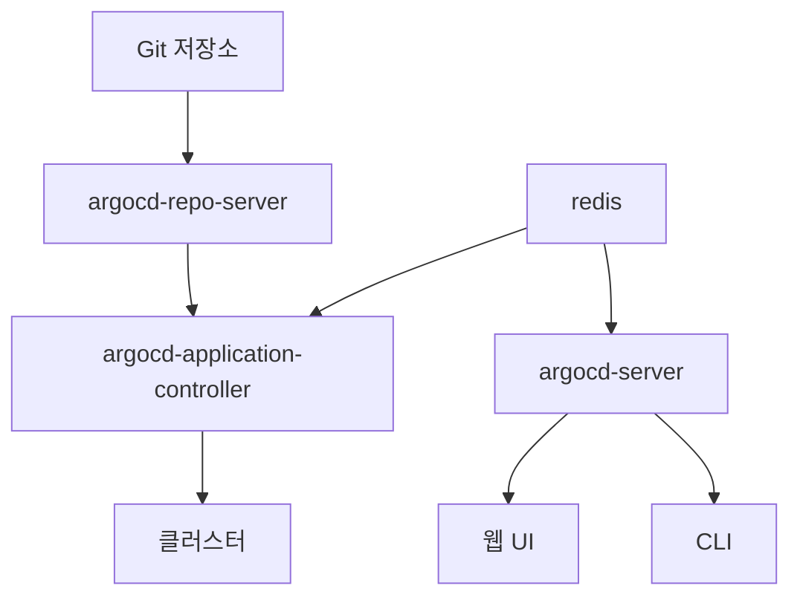
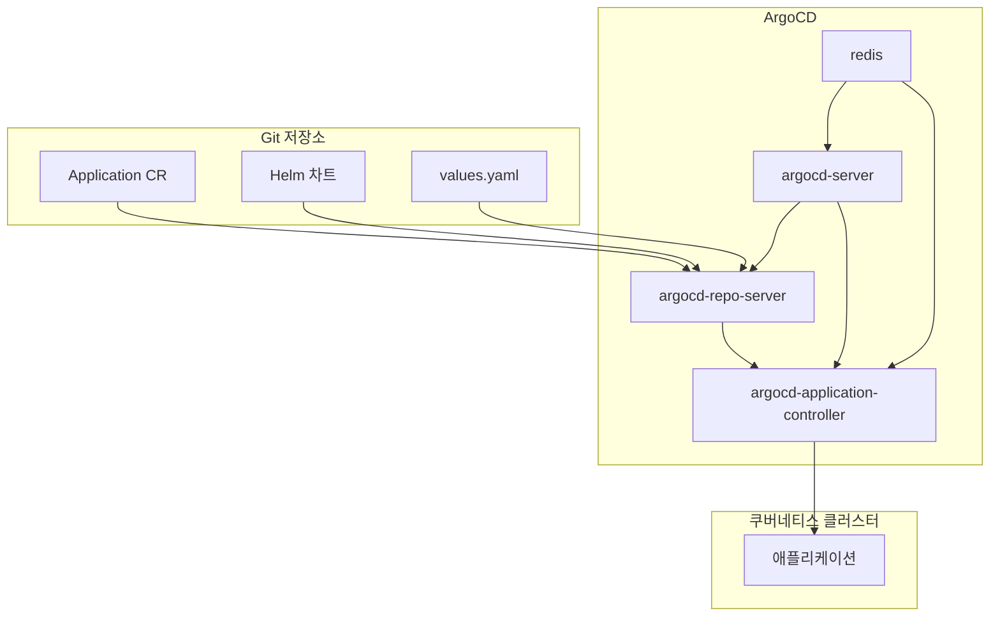
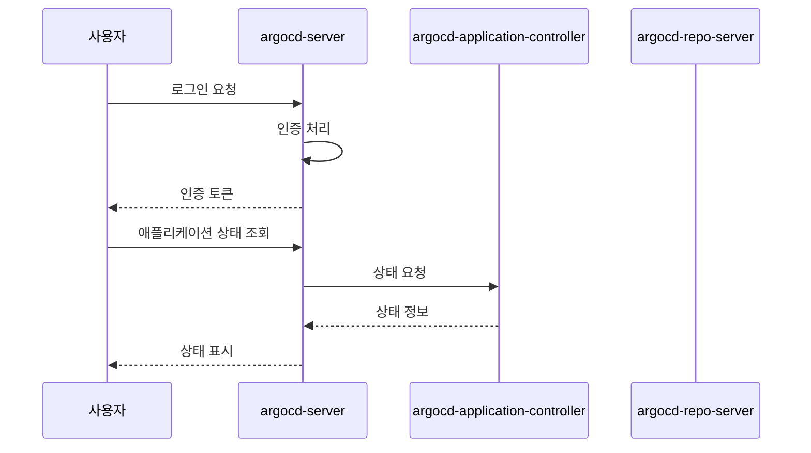
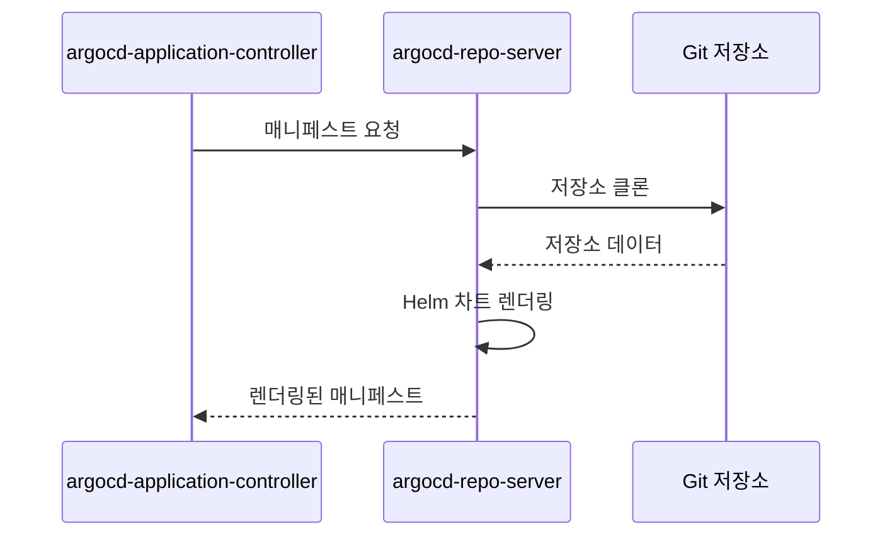
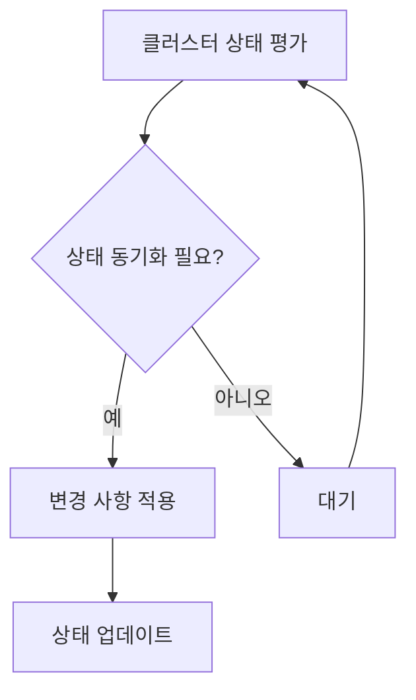
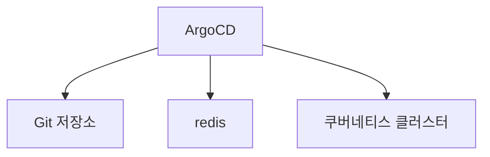

# ArgoCD

<cite>
**이 문서에서 참조하는 파일**   
- [app-of-apps.yaml](file://environments/argocd/app-of-apps.yaml)
- [ingress-prod.yaml](file://environments/argocd/apps/ingress-prod.yaml)
- [ingress-stg.yaml](file://environments/argocd/apps/ingress-stg.yaml)
- [plate-api-prod.yaml](file://environments/argocd/apps/plate-api-prod.yaml)
- [plate-api-stg.yaml](file://environments/argocd/apps/plate-api-stg.yaml)
- [plate-web-prod.yaml](file://environments/argocd/apps/plate-web-prod.yaml)
- [plate-web-stg.yaml](file://environments/argocd/apps/plate-web-stg.yaml)
- [values.yaml](file://helm/applications/plate-server/values.yaml)
- [values-prod.yaml](file://helm/applications/plate-server/values-prod.yaml)
- [values-stg.yaml](file://helm/applications/plate-server/values-stg.yaml)
- [Chart.yaml](file://helm/applications/plate-server/Chart.yaml)
- [values.yaml](file://helm/applications/plate-web/values.yaml)
- [values-prod.yaml](file://helm/applications/plate-web/values-prod.yaml)
- [values-stg.yaml](file://helm/applications/plate-web/values-stg.yaml)
- [Chart.yaml](file://helm/applications/plate-web/Chart.yaml)
- [values.yaml](file://helm/ingress/values.yaml)
- [values-stg.yaml](file://helm/ingress/values-stg.yaml)
- [Chart.yaml](file://helm/ingress/Chart.yaml)
- [argocd-server](file://helm/development-tools/argocd/templates/argocd-server/deployment.yaml)
- [argocd-repo-server](file://helm/development-tools/argocd/templates/argocd-repo-server/deployment.yaml)
- [argocd-application-controller](file://helm/development-tools/argocd/templates/argocd-application-controller/deployment.yaml)
- [argocd-cm.yaml](file://helm/development-tools/argocd/templates/argocd-configs/argocd-cm.yaml)
- [argocd-rbac-cm.yaml](file://helm/development-tools/argocd/templates/argocd-configs/argocd-rbac-cm.yaml)
- [crd-application.yaml](file://helm/development-tools/argocd/templates/crds/crd-application.yaml)
- [crd-applicationset.yaml](file://helm/development-tools/argocd/templates/crds/crd-applicationset.yaml)
- [values.yaml](file://helm/development-tools/argocd/values.yaml)
- [README.md](file://helm/development-tools/argocd/README.md)
</cite>

## 목차
1. [소개](#소개)
2. [프로젝트 구조](#프로젝트-구조)
3. [핵심 구성 요소](#핵심-구성-요소)
4. [아키텍처 개요](#아키텍처-개요)
5. [상세 구성 요소 분석](#상세-구성-요소-분석)
6. [의존성 분석](#의존성-분석)
7. [성능 고려사항](#성능-고려사항)
8. [문제 해결 가이드](#문제-해결-가이드)
9. [결론](#결론)

## 소개
ArgoCD는 쿠버네티스 애플리케이션을 위한 GitOps 기반의 선언형 지속적 배포 도구입니다. 이 문서는 ArgoCD의 아키텍처와 핵심 구성 요소인 argocd-server, argocd-repo-server, argocd-application-controller의 역할과 상호작용 방식을 설명합니다. 또한 CRD(Application, ApplicationSet)를 통한 애플리케이션 정의 방식, Git 저장소와의 동기화 메커니즘, 인증 및 권한 관리 설정, 웹 UI 및 CLI를 통한 운영 방법을 포함합니다. values.yaml을 통한 Helm 기반의 커스터마이징 방식과 프로덕션 환경에서의 보안 설정(best practices)도 설명합니다.

**Section sources**
- [README.md](file://helm/development-tools/argocd/README.md)

## 프로젝트 구조
ArgoCD는 Helm 차트로 설치되며, 주요 구성 요소는 다음과 같습니다:
- **argocd-server**: 웹 UI 및 API 서버를 제공합니다.
- **argocd-repo-server**: Git 저장소에서 애플리케이션 매니페스트를 가져오고 렌더링합니다.
- **argocd-application-controller**: 클러스터 상태를 모니터링하고 Git 저장소와 동기화합니다.
- **redis**: 세션 및 캐시 저장소로 사용됩니다.

애플리케이션은 Git 저장소에 정의된 Helm 차트를 기반으로 배포되며, 각 환경(예: prod, stg)에 따라 별도의 values 파일을 사용합니다.

**Diagram sources**
- [argocd-server](file://helm/development-tools/argocd/templates/argocd-server/deployment.yaml)
- [argocd-repo-server](file://helm/development-tools/argocd/templates/argocd-repo-server/deployment.yaml)
- [argocd-application-controller](file://helm/development-tools/argocd/templates/argocd-application-controller/deployment.yaml)

**Section sources**
- [values.yaml](file://helm/development-tools/argocd/values.yaml)
- [README.md](file://helm/development-tools/argocd/README.md)

## 핵심 구성 요소
ArgoCD의 핵심 구성 요소는 다음과 같습니다:
- **argocd-server**: 사용자 인터페이스와 API를 제공하며, 인증 및 권한 관리를 담당합니다.
- **argocd-repo-server**: Git 저장소에서 애플리케이션 매니페스트를 가져오고, Helm 차트를 렌더링하여 클러스터에 적용할 수 있는 형태로 변환합니다.
- **argocd-application-controller**: 클러스터의 실제 상태와 Git 저장소의 선언된 상태를 비교하고, 차이가 있을 경우 자동으로 동기화합니다.

이러한 구성 요소들은 서로 협력하여 Git 저장소의 상태를 쿠버네티스 클러스터에 반영합니다.

**Section sources**
- [argocd-server](file://helm/development-tools/argocd/templates/argocd-server/deployment.yaml)
- [argocd-repo-server](file://helm/development-tools/argocd/templates/argocd-repo-server/deployment.yaml)
- [argocd-application-controller](file://helm/development-tools/argocd/templates/argocd-application-controller/deployment.yaml)

## 아키텍처 개요
ArgoCD는 GitOps 원칙을 기반으로 하며, Git 저장소를 소스 오브 트루스(SoT)로 사용합니다. 애플리케이션의 상태는 Git 저장소에 선언되며, ArgoCD는 이 상태를 쿠버네티스 클러스터에 반영합니다. 주요 아키텍처 구성 요소는 다음과 같습니다:

**Diagram sources**
- [crd-application.yaml](file://helm/development-tools/argocd/templates/crds/crd-application.yaml)
- [argocd-server](file://helm/development-tools/argocd/templates/argocd-server/deployment.yaml)
- [argocd-repo-server](file://helm/development-tools/argocd/templates/argocd-repo-server/deployment.yaml)
- [argocd-application-controller](file://helm/development-tools/argocd/templates/argocd-application-controller/deployment.yaml)

## 상세 구성 요소 분석

### argocd-server 분석
argocd-server는 ArgoCD의 웹 UI 및 API 서버로, 사용자 인증, 권한 관리, 웹 인터페이스 제공을 담당합니다. 이 컴포넌트는 사용자 요청을 처리하고, argocd-application-controller와 통신하여 애플리케이션 상태를 조회하고 조작합니다.

**Diagram sources**
- [argocd-server](file://helm/development-tools/argocd/templates/argocd-server/deployment.yaml)

**Section sources**
- [argocd-server](file://helm/development-tools/argocd/templates/argocd-server/deployment.yaml)

### argocd-repo-server 분석
argocd-repo-server는 Git 저장소에서 애플리케이션 매니페스트를 가져오고, Helm 차트를 렌더링하여 클러스터에 적용할 수 있는 형태로 변환합니다. 이 컴포넌트는 Git 저장소와의 통신을 담당하며, 매니페스트 생성을 위한 주요 역할을 수행합니다.

**Diagram sources**
- [argocd-repo-server](file://helm/development-tools/argocd/templates/argocd-repo-server/deployment.yaml)

**Section sources**
- [argocd-repo-server](file://helm/development-tools/argocd/templates/argocd-repo-server/deployment.yaml)

### argocd-application-controller 분석
argocd-application-controller는 클러스터의 실제 상태와 Git 저장소의 선언된 상태를 비교하고, 차이가 있을 경우 자동으로 동기화합니다. 이 컴포넌트는 주기적으로 클러스터 상태를 평가하고, 필요한 경우 변경 사항을 적용합니다.

**Diagram sources**
- [argocd-application-controller](file://helm/development-tools/argocd/templates/argocd-application-controller/deployment.yaml)

**Section sources**
- [argocd-application-controller](file://helm/development-tools/argocd/templates/argocd-application-controller/deployment.yaml)

## 의존성 분석
ArgoCD는 다음과 같은 외부 의존성을 가집니다:
- **Git 저장소**: 애플리케이션 매니페스트의 소스 오브 트루스로 사용됩니다.
- **redis**: 세션 및 캐시 저장소로 사용됩니다.
- **쿠버네티스 클러스터**: 애플리케이션이 배포되는 대상입니다.

이러한 의존성들은 ArgoCD의 정상적인 동작을 위해 필수적입니다.

**Diagram sources**
- [values.yaml](file://helm/development-tools/argocd/values.yaml)

**Section sources**
- [values.yaml](file://helm/development-tools/argocd/values.yaml)

## 성능 고려사항
ArgoCD의 성능은 다음과 같은 요소에 영향을 받습니다:
- **Git 저장소의 크기와 복잡성**: 저장소가 클수록 매니페스트 생성에 더 많은 시간이 소요됩니다.
- **클러스터의 크기와 복잡성**: 관리하는 리소스가 많을수록 상태 평가에 더 많은 시간이 소요됩니다.
- **네트워크 지연**: Git 저장소와 클러스터 간의 네트워크 지연은 동기화 속도에 영향을 미칩니다.

성능을 최적화하기 위해선, 저장소를 적절히 분할하고, 불필요한 리소스를 제거하며, 네트워크 지연을 최소화하는 것이 중요합니다.

## 문제 해결 가이드
ArgoCD에서 발생할 수 있는 일반적인 문제와 해결 방법은 다음과 같습니다:
- **동기화 실패**: Git 저장소와 클러스터 상태가 일치하지 않을 경우 발생합니다. 원인을 분석하고, 필요한 경우 수동으로 동기화를 수행합니다.
- **인증 문제**: 사용자 인증이 실패할 경우 발생합니다. 인증 설정을 확인하고, 필요한 경우 재설정합니다.
- **성능 저하**: 시스템이 느려질 경우 발생합니다. 리소스 사용량을 모니터링하고, 필요한 경우 리소스를 확장합니다.

이러한 문제들은 ArgoCD의 로그와 메트릭을 통해 진단할 수 있습니다.

**Section sources**
- [argocd-server](file://helm/development-tools/argocd/templates/argocd-server/deployment.yaml)
- [argocd-repo-server](file://helm/development-tools/argocd/templates/argocd-repo-server/deployment.yaml)
- [argocd-application-controller](file://helm/development-tools/argocd/templates/argocd-application-controller/deployment.yaml)

## 결론
ArgoCD는 GitOps 기반의 강력한 배포 자동화 도구로, 쿠버네티스 애플리케이션의 선언적 관리를 가능하게 합니다. 이 문서는 ArgoCD의 아키텍처와 구성 요소를 상세히 설명하며, 실제 운영 환경에서의 활용 방법을 제시합니다. 이를 통해 안정적이고 신뢰할 수 있는 배포 프로세스를 구축할 수 있습니다.