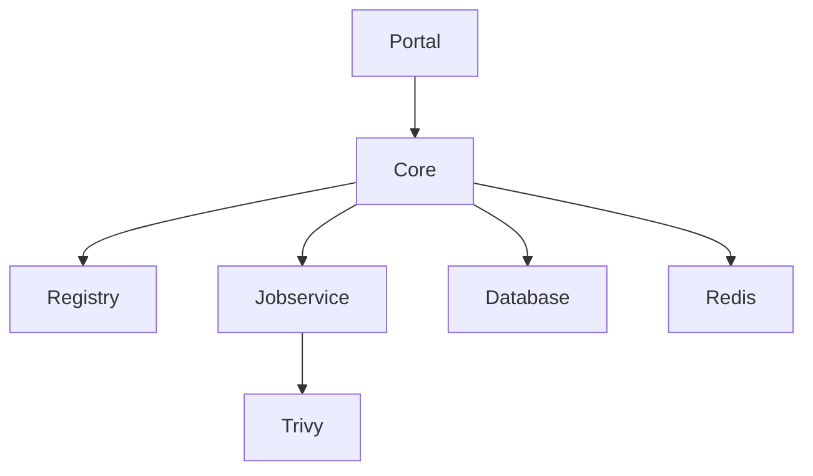
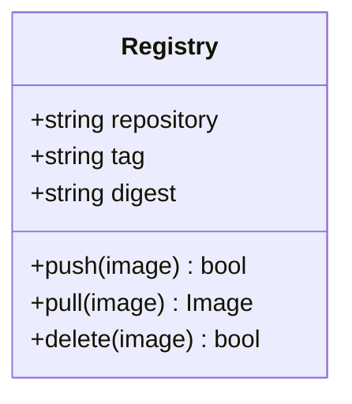
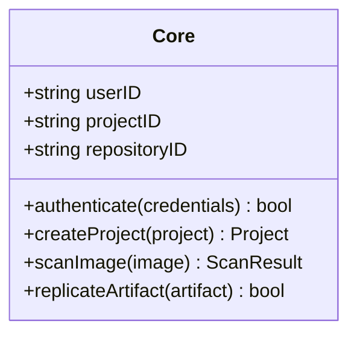
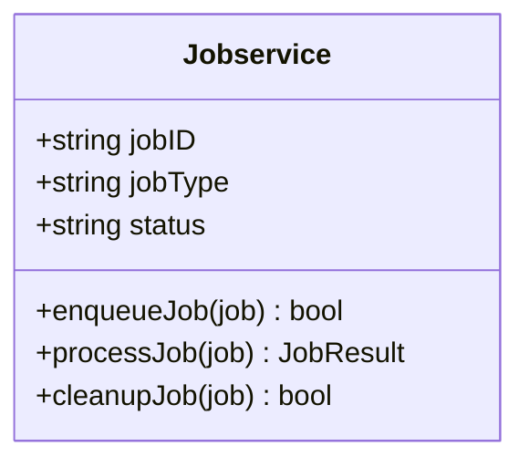
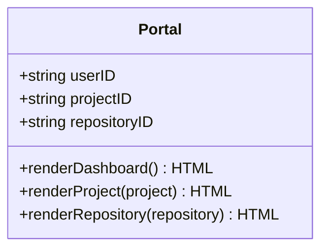
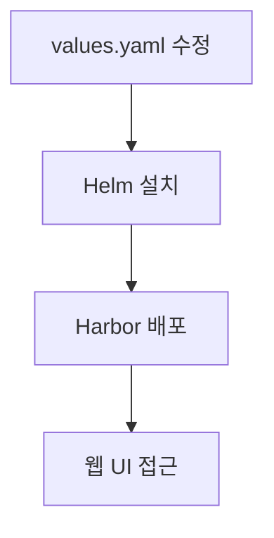

# Harbor

<cite>
**이 문서에서 참조한 파일**   
- [harbor/values.yaml](file://helm/development-tools/harbor/values.yaml)
- [harbor/Chart.yaml](file://helm/development-tools/harbor/Chart.yaml)
- [harbor/templates/core/core-dpl.yaml](file://helm/development-tools/harbor/templates/core/core-dpl.yaml)
- [harbor/templates/registry/registry-dpl.yaml](file://helm/development-tools/harbor/templates/registry/registry-dpl.yaml)
- [harbor/templates/jobservice/jobservice-dpl.yaml](file://helm/development-tools/harbor/templates/jobservice/jobservice-dpl.yaml)
- [harbor/templates/portal/configmap.yaml](file://helm/development-tools/harbor/templates/portal/configmap.yaml)
- [harbor/templates/portal/service.yaml](file://helm/development-tools/harbor/templates/portal/service.yaml)
- [harbor/templates/_helpers.tpl](file://helm/development-tools/harbor/templates/_helpers.tpl)
</cite>

## 목차
1. [소개](#소개)
2. [핵심 컴포넌트 아키텍처](#핵심-컴포넌트-아키텍처)
3. [주요 기능](#주요-기능)
4. [Helm을 통한 설치 및 구성](#helm을-통한-설치-및-구성)
5. [TLS 설정](#tls-설정)
6. [외부 인증 연동](#외부-인증-연동)
7. [문제 해결](#문제-해결)
8. [결론](#결론)

## 소개

Harbor는 신뢰할 수 있는 클라우드 네이티브 레지스트리로, 컨테이너 이미지 및 Helm 차트를 저장, 서명, 스캔할 수 있는 오픈 소스 솔루션입니다. 이 문서는 Harbor의 구조와 주요 기능을 설명하며, 핵심 컴포넌트의 역할과 상호작용, 보안 기능, 설치 및 구성 방법을 다룹니다.

**소개**
- [README.md](file://README.md#L1-L472)

## 핵심 컴포넌트 아키텍처

Harbor는 여러 핵심 컴포넌트로 구성되어 있으며, 각 컴포넌트는 특정 기능을 담당합니다. 주요 컴포넌트는 Registry, Core, Jobservice, Portal입니다.



**다이어그램 소스**
- [harbor/templates/_helpers.tpl](file://helm/development-tools/harbor/templates/_helpers.tpl#L265-L304)

### Registry

Registry는 컨테이너 이미지와 Helm 차트를 저장하고 관리하는 핵심 컴포넌트입니다. Harbor는 Docker Distribution 프로젝트를 기반으로 하며, 이미지 푸시/풀, 레지스트리 API 등을 제공합니다.



**다이어그램 소스**
- [harbor/templates/registry/registry-dpl.yaml](file://helm/development-tools/harbor/templates/registry/registry-dpl.yaml#L1-L432)

**섹션 소스**
- [harbor/templates/registry/registry-dpl.yaml](file://helm/development-tools/harbor/templates/registry/registry-dpl.yaml#L1-L432)

### Core

Core는 Harbor의 중심 컴포넌트로, 사용자 인증, 프로젝트 관리, 이미지 스캔, 복제 정책 등을 처리합니다. Core는 다른 컴포넌트들과 통신하여 전체 시스템을 조정합니다.



**다이어그램 소스**
- [harbor/templates/core/core-dpl.yaml](file://helm/development-tools/harbor/templates/core/core-dpl.yaml#L1-L259)

**섹션 소스**
- [harbor/templates/core/core-dpl.yaml](file://helm/development-tools/harbor/templates/core/core-dpl.yaml#L1-L259)

### Jobservice

Jobservice는 백그라운드 작업을 처리하는 컴포넌트로, 이미지 복제, 스캔, 정리 작업 등을 수행합니다. Jobservice는 Redis를 사용하여 작업 큐를 관리합니다.



**다이어그램 소스**
- [harbor/templates/jobservice/jobservice-dpl.yaml](file://helm/development-tools/harbor/templates/jobservice/jobservice-dpl.yaml#L1-L184)

**섹션 소스**
- [harbor/templates/jobservice/jobservice-dpl.yaml](file://helm/development-tools/harbor/templates/jobservice/jobservice-dpl.yaml#L1-L184)

### Portal

Portal은 Harbor의 웹 기반 사용자 인터페이스로, 사용자가 이미지, 프로젝트, 사용자 등을 관리할 수 있도록 합니다. Portal은 Nginx를 사용하여 정적 파일을 제공합니다.



**다이어그램 소스**
- [harbor/templates/portal/configmap.yaml](file://helm/development-tools/harbor/templates/portal/configmap.yaml#L1-L69)
- [harbor/templates/portal/service.yaml](file://helm/development-tools/harbor/templates/portal/service.yaml#L1-L22)

**섹션 소스**
- [harbor/templates/portal/configmap.yaml](file://helm/development-tools/harbor/templates/portal/configmap.yaml#L1-L69)
- [harbor/templates/portal/service.yaml](file://helm/development-tools/harbor/templates/portal/service.yaml#L1-L22)

## 주요 기능

### 이미지 보안 스캔

Harbor는 Trivy를 통합하여 컨테이너 이미지의 취약점을 스캔합니다. 이미지 푸시 시 자동 스캔이 가능하며, 스캔 결과는 웹 UI에서 확인할 수 있습니다.

**섹션 소스**
- [harbor/values.yaml](file://helm/development-tools/harbor/values.yaml#L793-L800)

### 접근 제어

Harbor는 프로젝트 기반의 접근 제어를 지원합니다. 사용자는 프로젝트에 대한 다양한 권한(읽기, 쓰기, 관리자)을 부여받을 수 있습니다.

**섹션 소스**
- [harbor/values.yaml](file://helm/development-tools/harbor/values.yaml#L271-L276)

### 복제 정책

Harbor는 다른 레지스트리 간에 이미지를 복제하는 기능을 제공합니다. 복제 정책을 설정하여 특정 조건에 따라 이미지를 자동으로 복제할 수 있습니다.

**섹션 소스**
- [harbor/values.yaml](file://helm/development-tools/harbor/values.yaml#L366-L375)

### 프로젝트 기반 멀티테넌시

Harbor는 프로젝트를 통해 멀티테넌시를 지원합니다. 각 프로젝트는 독립적인 네임스페이스를 가지며, 리소스 할당 및 접근 제어를 개별적으로 설정할 수 있습니다.

**섹션 소스**
- [harbor/values.yaml](file://helm/development-tools/harbor/values.yaml#L100-L113)

## Helm을 통한 설치 및 구성

Harbor는 Helm 차트를 통해 Kubernetes에 쉽게 설치할 수 있습니다. `values.yaml` 파일을 통해 다양한 설정을 구성할 수 있습니다.



**다이어그램 소스**
- [harbor/values.yaml](file://helm/development-tools/harbor/values.yaml#L1-L800)

**섹션 소스**
- [harbor/values.yaml](file://helm/development-tools/harbor/values.yaml#L1-L800)

## TLS 설정

Harbor는 TLS를 통해 HTTPS 통신을 지원합니다. `values.yaml` 파일에서 TLS 설정을 구성할 수 있으며, 인증서는 자동 생성되거나 기존 시크릿에서 제공할 수 있습니다.

```yaml
expose:
  tls:
    enabled: true
    certSource: secret
    secret:
      secretName: habor-tls
```

**섹션 소스**
- [harbor/values.yaml](file://helm/development-tools/harbor/values.yaml#L1-L80)

## 외부 인증 연동

Harbor는 OAuth, LDAP 등을 통해 외부 인증 시스템과 연동할 수 있습니다. 이를 통해 기존 사용자 디렉터리를 활용하여 사용자 인증을 처리할 수 있습니다.

**섹션 소스**
- [harbor/values.yaml](file://helm/development-tools/harbor/values.yaml#L384-L389)

## 문제 해결

### 이미지 푸시/풀 문제

이미지 푸시/풀 문제가 발생할 경우, 다음 사항을 점검해야 합니다:
- 네트워크 연결 상태
- TLS 설정
- 인증 정보
- 저장소 용량

**섹션 소스**
- [harbor/values.yaml](file://helm/development-tools/harbor/values.yaml#L9-L10)

## 결론

Harbor는 강력한 기능을 갖춘 프라이빗 컨테이너 이미지 레지스트리로, 보안, 접근 제어, 복제 정책 등을 통해 안정적인 이미지 관리 환경을 제공합니다. Helm을 통한 설치와 구성은 간단하며, 다양한 외부 시스템과의 연동을 지원합니다.

**결론**
- [README.md](file://README.md#L454-L472)