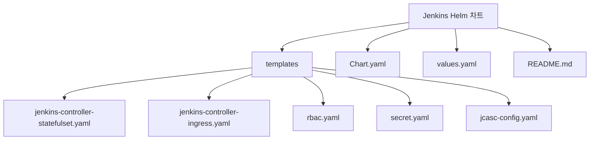
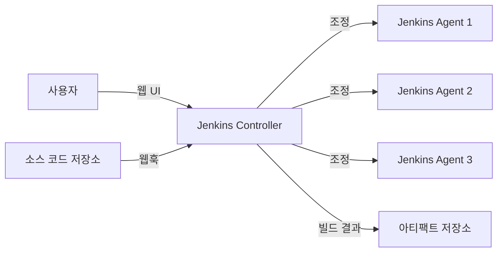
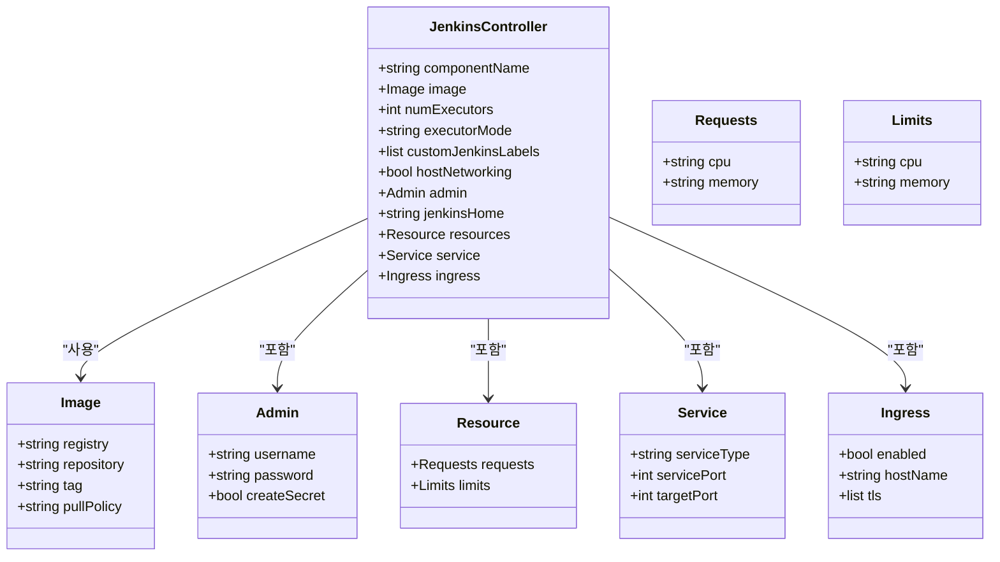
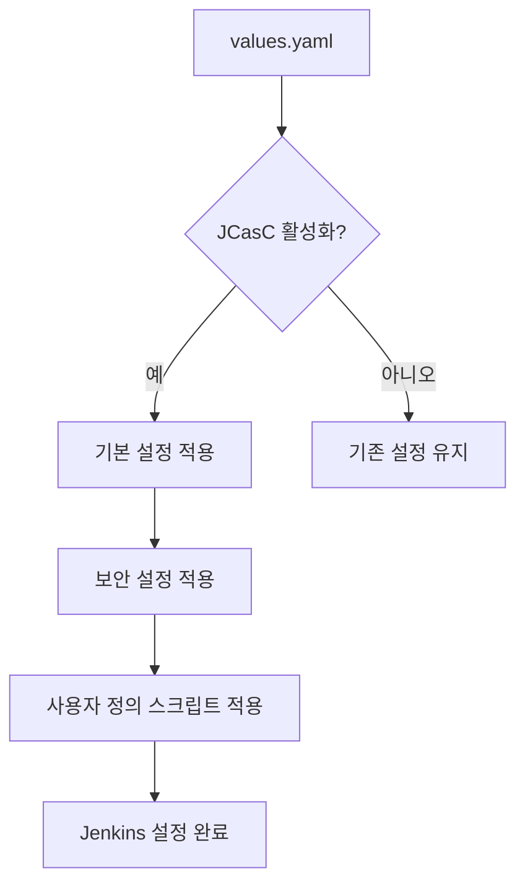
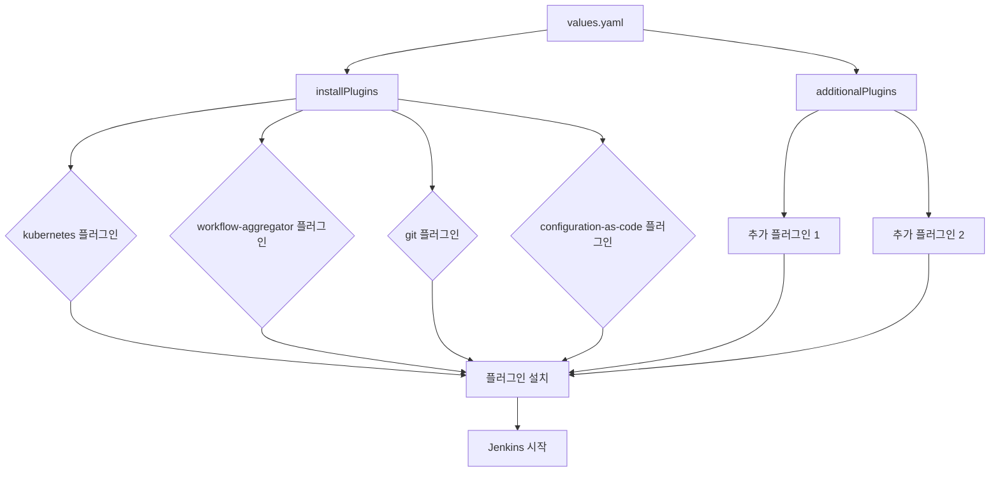
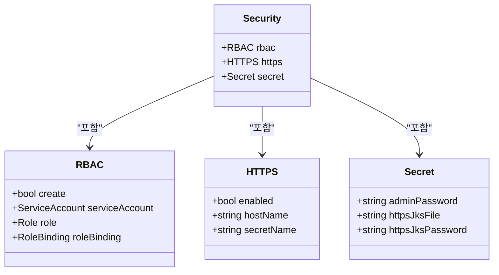
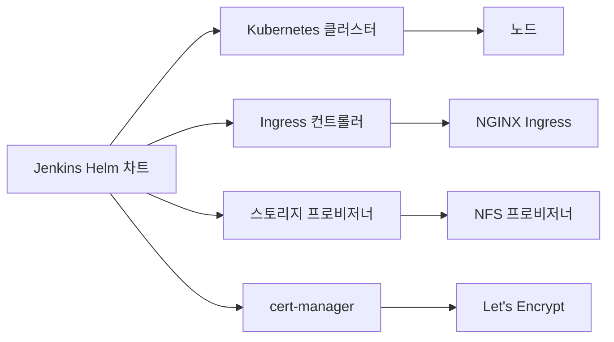

# Jenkins

<cite>
**이 문서에서 참조한 파일**   
- [values.yaml](file://helm/development-tools/jenkins/values.yaml)
- [Chart.yaml](file://helm/development-tools/jenkins/Chart.yaml)
- [jenkins-controller-statefulset.yaml](file://helm/development-tools/jenkins/templates/jenkins-controller-statefulset.yaml)
- [jenkins-controller-ingress.yaml](file://helm/development-tools/jenkins/templates/jenkins-controller-ingress.yaml)
- [rbac.yaml](file://helm/development-tools/jenkins/templates/rbac.yaml)
- [secret.yaml](file://helm/development-tools/jenkins/templates/secret.yaml)
- [jcasc-config.yaml](file://helm/development-tools/jenkins/templates/jcasc-config.yaml)
</cite>

## 목차
1. [소개](#소개)
2. [프로젝트 구조](#프로젝트-구조)
3. [핵심 구성 요소](#핵심-구성-요소)
4. [아키텍처 개요](#아키텍처-개요)
5. [상세 구성 분석](#상세-구성-분석)
6. [의존성 분석](#의존성-분석)
7. [성능 고려사항](#성능-고려사항)
8. [문제 해결 가이드](#문제-해결-가이드)
9. [결론](#결론)

## 소개
Jenkins는 CI/CD 파이프라인을 위한 대표적인 빌드 및 배포 자동화 도구입니다. 이 문서는 Kubernetes 환경에서 Helm을 통해 Jenkins를 설치하고 구성하는 방법을 설명합니다. Jenkins Controller(StatefulSet)와 Agent의 역할, JCasC(Java Configuration as Code)를 통한 설정 관리, 플러그인 관리, 파이프라인 정의(Jenkinsfile) 등 핵심 기능을 다룹니다. 또한 Helm을 통한 설치, values.yaml을 통한 확장성 있는 구성, 스토리지(PVC) 설정, 보안 설정(HTTPS, RBAC) 등 실제 운영 환경에서 필요한 구성 요소들을 설명합니다.

## 프로젝트 구조
Jenkins Helm 차트는 `helm/development-tools/jenkins/` 디렉터리에 위치하며, 다음과 같은 주요 구성 요소로 이루어져 있습니다:

- `templates/`: Kubernetes 리소스를 위한 템플릿 파일들
- `Chart.yaml`: 차트의 메타데이터 정보
- `values.yaml`: 구성 가능한 파라미터들
- `README.md`: 설치 및 구성 가이드

템플릿 디렉터리에는 Jenkins Controller를 위한 StatefulSet, Ingress, RBAC, 비밀 정보(Secret) 등 다양한 Kubernetes 리소스 템플릿이 포함되어 있습니다.

**Diagram sources**
- [Chart.yaml](file://helm/development-tools/jenkins/Chart.yaml)
- [values.yaml](file://helm/development-tools/jenkins/values.yaml)

## 핵심 구성 요소

Jenkins Helm 차트의 핵심 구성 요소는 다음과 같습니다:

- **Controller**: Jenkins 마스터 노드로, 파이프라인 실행을 조정하고 Agent를 관리합니다.
- **Agent**: 빌드 작업을 수행하는 워커 노드입니다.
- **JCasC**: 코드로 구성(Configuration as Code)을 가능하게 하는 플러그인으로, Jenkins 설정을 코드로 관리할 수 있습니다.
- **RBAC**: 역할 기반 접근 제어로, Jenkins 내 사용자 권한을 관리합니다.
- **Ingress**: 외부에서 Jenkins에 접근할 수 있도록 HTTP/HTTPS 트래픽을 라우팅합니다.

**Section sources**
- [values.yaml](file://helm/development-tools/jenkins/values.yaml#L35-L800)
- [Chart.yaml](file://helm/development-tools/jenkins/Chart.yaml#L1-L50)

## 아키텍처 개요

Jenkins는 Controller와 Agent로 구성된 마스터-에이전트 아키텍처를 사용합니다. Controller는 파이프라인을 조정하고 Agent를 관리하며, Agent는 실제 빌드 작업을 수행합니다. Kubernetes 환경에서는 Jenkins Controller를 StatefulSet으로 배포하여 상태를 유지하고, Agent는 필요할 때마다 Pod로 동적으로 생성됩니다.

**Diagram sources**
- [jenkins-controller-statefulset.yaml](file://helm/development-tools/jenkins/templates/jenkins-controller-statefulset.yaml)
- [values.yaml](file://helm/development-tools/jenkins/values.yaml#L35-L800)

## 상세 구성 분석

### Jenkins Controller 구성
Jenkins Controller는 StatefulSet으로 배포되며, 다음과 같은 주요 설정을 포함합니다:

- **이미지**: `jenkins/jenkins` 이미지를 사용하며, 태그는 `2.516.2-jdk21`입니다.
- **리소스**: CPU와 메모리에 대한 요청 및 제한을 설정할 수 있습니다.
- **보안 컨텍스트**: Jenkins를 비루트 사용자로 실행하기 위해 `runAsUser: 1000`으로 설정되어 있습니다.
- **서비스**: ClusterIP 또는 LoadBalancer 유형의 서비스를 통해 접근할 수 있습니다.
- **Ingress**: 외부에서 HTTPS를 통해 접근할 수 있도록 Ingress를 구성할 수 있습니다.

**Diagram sources**
- [jenkins-controller-statefulset.yaml](file://helm/development-tools/jenkins/templates/jenkins-controller-statefulset.yaml)
- [values.yaml](file://helm/development-tools/jenkins/values.yaml#L35-L800)

### JCasC를 통한 설정 관리
Jenkins Configuration as Code(JCasC)는 Jenkins 설정을 코드로 관리할 수 있게 해주는 플러그인입니다. `values.yaml` 파일의 `controller.JCasC` 섹션을 통해 다양한 설정을 구성할 수 있습니다.

- **기본 설정**: `defaultConfig: true`로 설정하면 기본적인 Jenkins 설정이 자동으로 적용됩니다.
- **보안 설정**: `securityRealm`과 `authorizationStrategy`를 통해 사용자 인증 및 권한 부여 전략을 설정할 수 있습니다.
- **사용자 정의 스크립트**: `configScripts`를 통해 사용자 정의 설정을 추가할 수 있습니다.

**Diagram sources**
- [jcasc-config.yaml](file://helm/development-tools/jenkins/templates/jcasc-config.yaml)
- [values.yaml](file://helm/development-tools/jenkins/values.yaml#L511-L554)

### 플러그인 관리
Jenkins는 다양한 플러그인을 통해 기능을 확장할 수 있습니다. `values.yaml` 파일의 `controller.installPlugins` 섹션을 통해 설치할 플러그인을 지정할 수 있습니다.

- **기본 플러그인**: `kubernetes`, `workflow-aggregator`, `git`, `configuration-as-code` 등이 기본으로 설치됩니다.
- **추가 플러그인**: `additionalPlugins`를 통해 추가로 설치할 플러그인을 지정할 수 있습니다.
- **초기화 설정**: `initializeOnce: true`로 설정하면 처음 설치 시에만 플러그인이 설치되어 이후 업그레이드 시에는 변경되지 않습니다.

**Diagram sources**
- [values.yaml](file://helm/development-tools/jenkins/values.yaml#L409-L438)
- [config.yaml](file://helm/development-tools/jenkins/templates/config.yaml)

### 보안 설정
Jenkins는 RBAC와 HTTPS를 통해 보안을 강화할 수 있습니다.

- **RBAC**: `rbac.create: true`로 설정하면 Jenkins 서비스 어카운트에 필요한 권한이 자동으로 생성됩니다.
- **HTTPS**: `controller.ingress.tls`를 통해 TLS 설정을 구성할 수 있습니다. 인증서는 비밀 정보(Secret)로 관리됩니다.
- **비밀 정보 관리**: 관리자 비밀번호, API 토큰 등 민감한 정보는 비밀 정보(Secret)로 저장됩니다.

**Diagram sources**
- [rbac.yaml](file://helm/development-tools/jenkins/templates/rbac.yaml)
- [secret.yaml](file://helm/development-tools/jenkins/templates/secret.yaml)
- [jenkins-controller-ingress.yaml](file://helm/development-tools/jenkins/templates/jenkins-controller-ingress.yaml)

## 의존성 분석

Jenkins Helm 차트는 다음과 같은 외부 의존성을 가지고 있습니다:

- **Kubernetes 클러스터**: Jenkins는 Kubernetes 클러스터 위에서 실행됩니다.
- **Ingress 컨트롤러**: 외부 접근을 위해 Ingress 컨트롤러가 필요합니다.
- **스토리지 프로비저너**: 영구 볼륨을 제공하기 위한 스토리지 프로비저너가 필요합니다.
- **인증서 관리자**: TLS 인증서를 자동으로 발급하기 위해 cert-manager가 필요할 수 있습니다.

**Diagram sources**
- [values.yaml](file://helm/development-tools/jenkins/values.yaml#L696-L742)
- [Chart.yaml](file://helm/development-tools/jenkins/Chart.yaml#L1-L50)

## 성능 고려사항

Jenkins의 성능을 최적화하기 위해 다음과 같은 사항을 고려해야 합니다:

- **리소스 할당**: Controller와 Agent에 충분한 CPU와 메모리를 할당해야 합니다.
- **에이전트 풀링**: 빈번한 에이전트 생성/삭제를 방지하기 위해 에이전트 풀링을 고려할 수 있습니다.
- **플러그인 관리**: 불필요한 플러그인은 제거하여 오버헤드를 줄여야 합니다.
- **정기적인 재시작**: 메모리 누수를 방지하기 위해 정기적인 재시작을 고려할 수 있습니다.

## 문제 해결 가이드

### 빌드 에이전트 연결 실패
빌드 에이전트가 Controller에 연결하지 못하는 경우 다음과 같은 원인이 있을 수 있습니다:

- **네트워크 문제**: Controller와 Agent 간의 네트워크 연결을 확인합니다.
- **포트 문제**: Agent가 Controller의 50000 포트에 접근할 수 있는지 확인합니다.
- **인증서 문제**: TLS 인증서가 유효한지 확인합니다.
- **RBAC 문제**: Agent 서비스 어카운트에 필요한 권한이 있는지 확인합니다.

### 파이프라인 실행 지연
파이프라인 실행이 지연되는 경우 다음과 같은 원인이 있을 수 있습니다:

- **리소스 부족**: Controller 또는 Agent에 할당된 리소스가 부족한지 확인합니다.
- **에이전트 부족**: 실행 가능한 에이전트가 부족한지 확인합니다.
- **플러그인 문제**: 특정 플러그인이 성능에 영향을 미치는지 확인합니다.
- **네트워크 지연**: 외부 서비스(예: 아티팩트 저장소)에 대한 네트워크 지연이 있는지 확인합니다.

**Section sources**
- [values.yaml](file://helm/development-tools/jenkins/values.yaml#L333-L350)
- [jenkins-controller-statefulset.yaml](file://helm/development-tools/jenkins/templates/jenkins-controller-statefulset.yaml)

## 결론
Jenkins는 Helm을 통해 Kubernetes 환경에 쉽게 배포하고 관리할 수 있는 강력한 CI/CD 도구입니다. JCasC를 통해 설정을 코드로 관리함으로써 구성의 일관성과 추적성을 확보할 수 있으며, RBAC와 HTTPS를 통해 보안을 강화할 수 있습니다. 적절한 리소스 할당과 문제 해결 전략을 통해 안정적인 CI/CD 파이프라인을 구축할 수 있습니다.