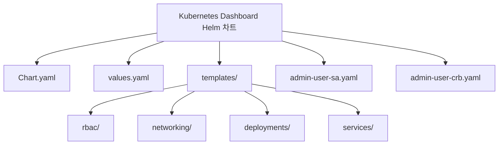
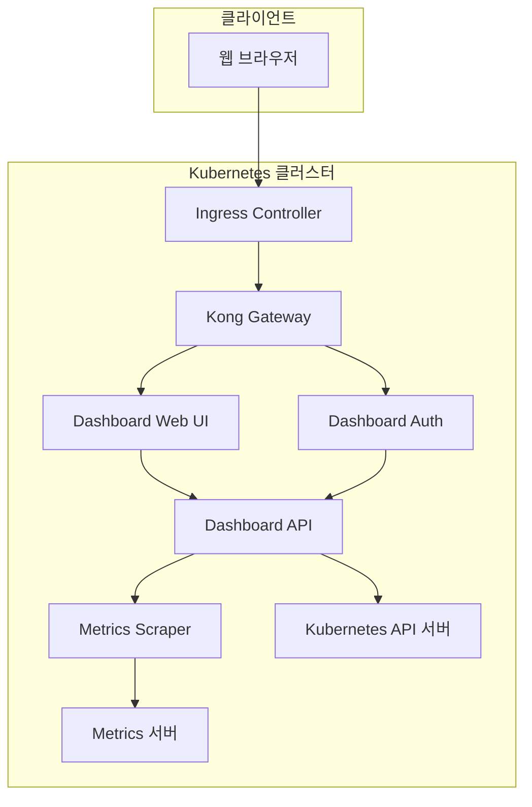
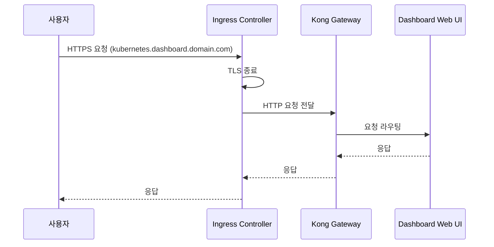
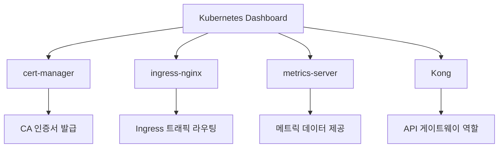
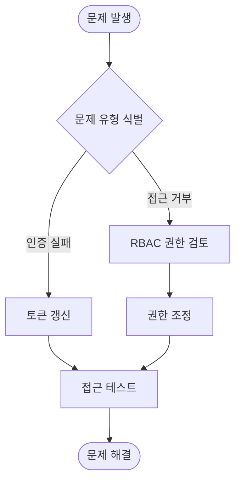

# Kubernetes 대시보드

<cite>
**이 문서에서 참조한 파일**  
- [Chart.yaml](file://helm/development-tools/kubernetes-dashboard/Chart.yaml)
- [values.yaml](file://helm/development-tools/kubernetes-dashboard/values.yaml)
- [README.md](file://helm/development-tools/kubernetes-dashboard/README.md)
- [admin-user-sa.yaml](file://helm/development-tools/kubernetes-dashboard/admin-user-sa.yaml)
- [admin-user-crb.yaml](file://helm/development-tools/kubernetes-dashboard/admin-user-crb.yaml)
- [ingress.yaml](file://helm/development-tools/kubernetes-dashboard/templates/networking/ingress.yaml)
</cite>

## 목차
1. [소개](#소개)
2. [프로젝트 구조](#프로젝트-구조)
3. [핵심 구성 요소](#핵심-구성-요소)
4. [아키텍처 개요](#아키텍처-개요)
5. [상세 구성 요소 분석](#상세-구성-요소-분석)
6. [의존성 분석](#의존성-분석)
7. [성능 고려사항](#성능-고려사항)
8. [문제 해결 가이드](#문제-해결-가이드)
9. [결론](#결론)

## 소개
Kubernetes 대시보드는 Kubernetes 클러스터의 상태를 시각적으로 확인할 수 있는 웹 기반 UI 도구입니다. 이 문서는 Helm을 통한 Kubernetes 대시보드의 설치 및 운영 방법을 설명하며, 주요 기능(리소스 조회, 로그 확인, 명령 실행), RBAC 기반 접근 제어 설정, HTTPS 구성, 인증 방식(OIDC, 토큰) 등을 다룹니다. 또한, values.yaml을 통한 커스터마이징 방식과 인증 실패 또는 리소스 접근 거부 문제 해결 방법을 포함합니다.

**Section sources**
- [README.md](file://helm/development-tools/kubernetes-dashboard/README.md#L1-L163)

## 프로젝트 구조
Kubernetes 대시보드 Helm 차트는 `helm/development-tools/kubernetes-dashboard/` 디렉터리에 위치하며, 다음과 같은 주요 구성 요소로 이루어져 있습니다:

- `Chart.yaml`: 차트의 메타데이터와 종속성 정의
- `values.yaml`: 설치 시 사용자 정의 가능한 설정 값들
- `templates/`: Kubernetes 리소스를 생성하는 템플릿 파일들
- `templates/rbac/`: RBAC 관련 리소스(Role, RoleBinding, ServiceAccount) 템플릿
- `templates/networking/`: Ingress 리소스 템플릿
- `templates/deployments/`: 주요 컴포넌트(Dashboard API, Auth, Web UI, Metrics Scraper)의 Deployment 템플릿
- `templates/services/`: 각 컴포넌트의 Service 템플릿
- `admin-user-sa.yaml`, `admin-user-crb.yaml`: 관리자 사용자 생성을 위한 매니페스트 파일



**Diagram sources**
- [Chart.yaml](file://helm/development-tools/kubernetes-dashboard/Chart.yaml#L1-L36)
- [values.yaml](file://helm/development-tools/kubernetes-dashboard/values.yaml#L1-L452)
- [admin-user-sa.yaml](file://helm/development-tools/kubernetes-dashboard/admin-user-sa.yaml#L1-L6)
- [admin-user-crb.yaml](file://helm/development-tools/kubernetes-dashboard/admin-user-crb.yaml#L1-L13)

**Section sources**
- [Chart.yaml](file://helm/development-tools/kubernetes-dashboard/Chart.yaml#L1-L36)
- [values.yaml](file://helm/development-tools/kubernetes-dashboard/values.yaml#L1-L452)
- [admin-user-sa.yaml](file://helm/development-tools/kubernetes-dashboard/admin-user-sa.yaml#L1-L6)
- [admin-user-crb.yaml](file://helm/development-tools/kubernetes-dashboard/admin-user-crb.yaml#L1-L13)

## 핵심 구성 요소
Kubernetes 대시보드는 여러 개의 컨테이너로 구성된 멀티 컨테이너 애플리케이션입니다. 주요 구성 요소는 다음과 같습니다:

- **Dashboard API**: Kubernetes API 서버와 통신하여 클러스터 상태를 조회하고 조작하는 핵심 컴포넌트
- **Auth 컨테이너**: 사용자 인증을 처리하는 컴포넌트
- **Web UI 컨테이너**: 사용자 인터페이스를 제공하는 프론트엔드 컴포넌트
- **Metrics Scraper**: 메트릭스 서버로부터 메트릭 데이터를 수집하고 저장하는 컴포넌트

각 컴포넌트는 별도의 Deployment와 Service로 관리되며, RBAC를 통해 엄격한 접근 제어가 적용됩니다.

**Section sources**
- [values.yaml](file://helm/development-tools/kubernetes-dashboard/values.yaml#L144-L367)

## 아키텍처 개요
Kubernetes 대시보드는 다음과 같은 아키텍처로 구성되어 있습니다:



**Diagram sources**
- [values.yaml](file://helm/development-tools/kubernetes-dashboard/values.yaml#L308-L367)
- [Chart.yaml](file://helm/development-tools/kubernetes-dashboard/Chart.yaml#L3-L19)

## 상세 구성 요소 분석

### RBAC 기반 접근 제어 설정
Kubernetes 대시보드는 RBAC를 기반으로 접근 제어를 수행합니다. 관리자 사용자를 생성하기 위해 다음과 같은 리소스를 사용할 수 있습니다:

```yaml
# admin-user-sa.yaml
apiVersion: v1
kind: ServiceAccount
metadata:
  name: admin-user
  namespace: kubernetes-dashboard
```

```yaml
# admin-user-crb.yaml
apiVersion: rbac.authorization.k8s.io/v1
kind: ClusterRoleBinding
metadata:
  name: admin-user
roleRef:
  apiGroup: rbac.authorization.k8s.io
  kind: ClusterRole
  name: cluster-admin
subjects:
- kind: ServiceAccount
  name: admin-user
  namespace: kubernetes-dashboard
```

이 설정을 통해 `admin-user` 서비스 어카운트에 클러스터 전체에 대한 관리자 권한을 부여할 수 있습니다.

**Section sources**
- [admin-user-sa.yaml](file://helm/development-tools/kubernetes-dashboard/admin-user-sa.yaml#L1-L6)
- [admin-user-crb.yaml](file://helm/development-tools/kubernetes-dashboard/admin-user-crb.yaml#L1-L13)

### Ingress 구성
Kubernetes 대시보드는 Ingress를 통해 외부에서 접근할 수 있도록 구성할 수 있습니다. `values.yaml` 파일에서 다음과 같은 설정을 통해 Ingress를 활성화할 수 있습니다:

```yaml
app:
  ingress:
    enabled: true
    hosts:
      - kubernetes.dashboard.domain.com
    ingressClassName: internal-nginx
    tls:
      enabled: true
      secretName: dashboard-tls-secret
```

이 설정은 cert-manager와 연동하여 자동으로 TLS 인증서를 발급받고, HTTPS를 통해 안전하게 대시보드에 접근할 수 있도록 합니다.



**Diagram sources**
- [values.yaml](file://helm/development-tools/kubernetes-dashboard/values.yaml#L103-L136)
- [ingress.yaml](file://helm/development-tools/kubernetes-dashboard/templates/networking/ingress.yaml)

**Section sources**
- [values.yaml](file://helm/development-tools/kubernetes-dashboard/values.yaml#L103-L136)
- [ingress.yaml](file://helm/development-tools/kubernetes-dashboard/templates/networking/ingress.yaml)

## 의존성 분석
Kubernetes 대시보드 Helm 차트는 다음과 같은 외부 종속성을 가집니다:



이러한 종속성들은 `Chart.yaml` 파일의 dependencies 섹션에 정의되어 있으며, 필요에 따라 활성화/비활성화할 수 있습니다.

**Diagram sources**
- [Chart.yaml](file://helm/development-tools/kubernetes-dashboard/Chart.yaml#L2-L19)

**Section sources**
- [Chart.yaml](file://helm/development-tools/kubernetes-dashboard/Chart.yaml#L2-L19)

## 성능 고려사항
Kubernetes 대시보드의 성능은 다음과 같은 요소에 영향을 받습니다:

- **리소스 요청 및 제한**: 각 컨테이너에 적절한 CPU 및 메모리 리소스를 할당해야 합니다.
- **자동 새로 고침 간격**: 대시보드 설정에서 리소스 및 로그의 자동 새로 고침 간격을 조정하여 클러스터에 대한 부하를 줄일 수 있습니다.
- **네트워크 정책**: 불필요한 네트워크 트래픽을 차단하기 위해 네트워크 정책을 구성하는 것이 좋습니다.

**Section sources**
- [values.yaml](file://helm/development-tools/kubernetes-dashboard/values.yaml#L166-L172)

## 문제 해결 가이드
Kubernetes 대시보드 운영 중 발생할 수 있는 주요 문제와 해결 방법은 다음과 같습니다:

### 인증 실패 문제
- **문제 원인**: 잘못된 토큰 또는 만료된 인증 정보
- **해결 방법**: 새로운 서비스 어카운트 토큰을 생성하고, 대시보드 로그인 페이지에서 해당 토큰을 사용하여 로그인

### 리소스 접근 거부 문제
- **문제 원인**: RBAC 권한 부족
- **해결 방법**: 사용자에게 필요한 최소한의 권한만 부여하는 맞춤형 Role과 RoleBinding을 생성



**Diagram sources**
- [admin-user-crb.yaml](file://helm/development-tools/kubernetes-dashboard/admin-user-crb.yaml#L1-L13)

**Section sources**
- [admin-user-crb.yaml](file://helm/development-tools/kubernetes-dashboard/admin-user-crb.yaml#L1-L13)

## 결론
Kubernetes 대시보드는 Helm을 통해 쉽게 설치하고 운영할 수 있는 강력한 클러스터 관리 도구입니다. RBAC 기반의 엄격한 접근 제어, HTTPS를 통한 안전한 통신, 다양한 인증 방식 지원 등의 기능을 통해 보안성과 사용 편의성을 모두 갖추고 있습니다. 본 문서에서 설명한 설치 및 구성 방법을 따르면, 안정적이고 안전한 Kubernetes 대시보드 환경을 구축할 수 있습니다.