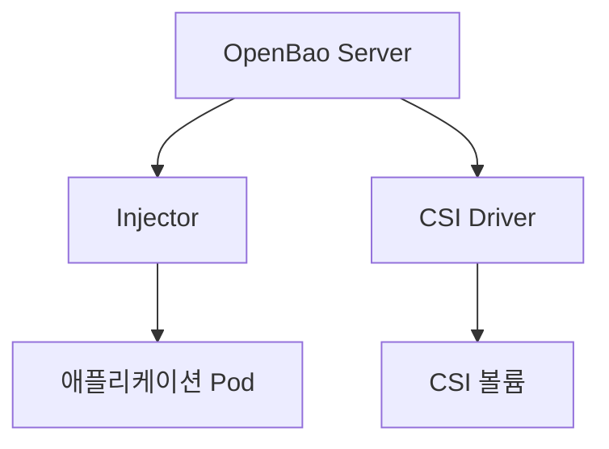
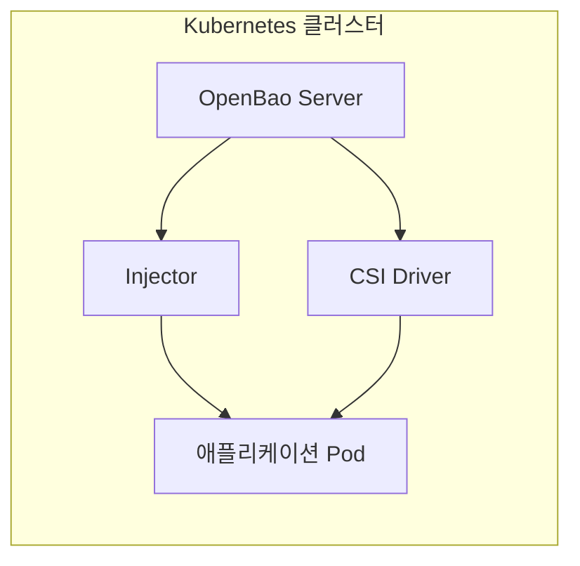
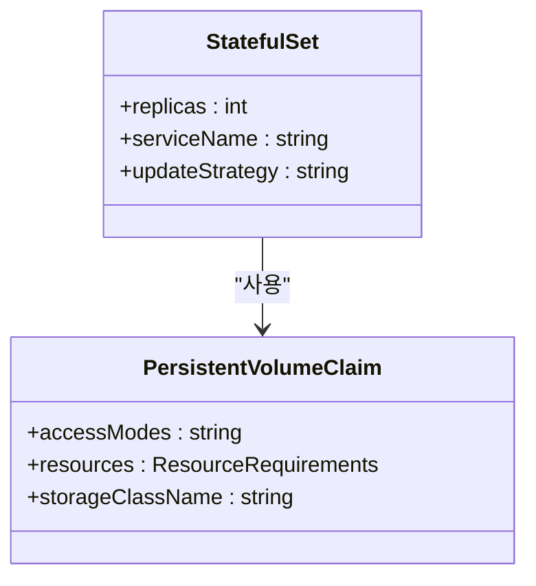
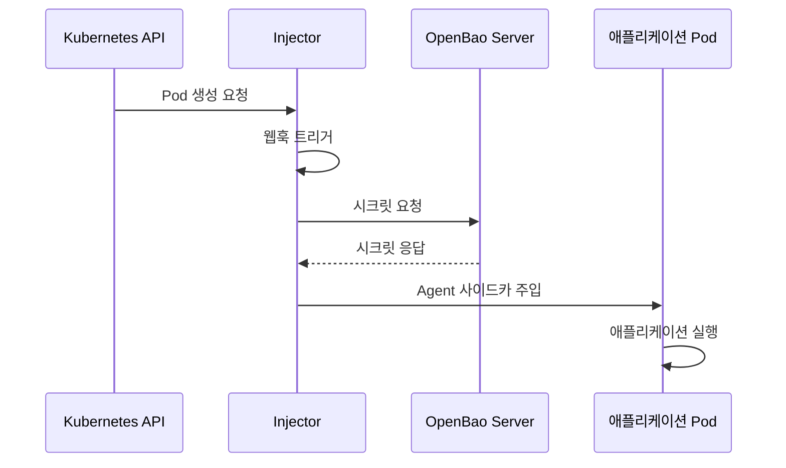
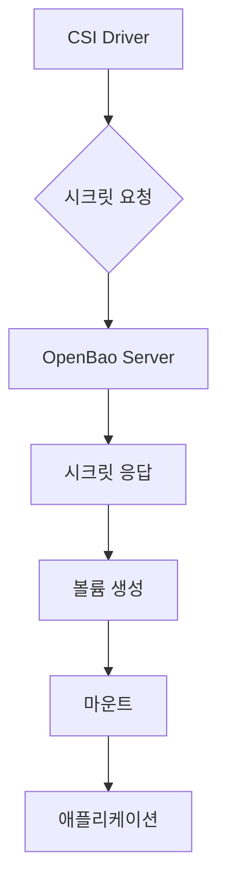
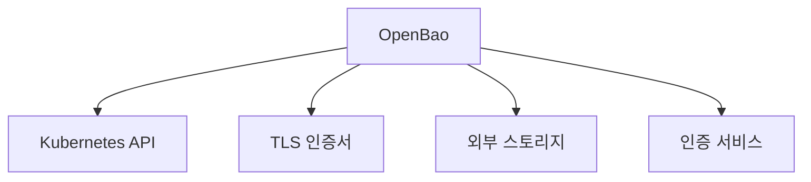

# OpenBao

<cite>
**이 문서에서 참조한 파일**  
- [openbao/templates/server-statefulset.yaml](file://helm/development-tools/openbao/templates/server-statefulset.yaml)
- [openbao/templates/injector-deployment.yaml](file://helm/development-tools/openbao/templates/injector-deployment.yaml)
- [openbao/templates/csi-daemonset.yaml](file://helm/development-tools/openbao/templates/csi-daemonset.yaml)
- [openbao/values.yaml](file://helm/development-tools/openbao/values.yaml)
- [openbao/Chart.yaml](file://helm/development-tools/openbao/Chart.yaml)
</cite>

## 목차
1. [소개](#소개)
2. [프로젝트 구조](#프로젝트-구조)
3. [핵심 구성 요소](#핵심-구성-요소)
4. [아키텍처 개요](#아키텍처-개요)
5. [상세 구성 요소 분석](#상세-구성-요소-분석)
6. [의존성 분석](#의존성-분석)
7. [성능 고려 사항](#성능-고려-사항)
8. [문제 해결 가이드](#문제-해결-가이드)
9. [결론](#결론)

## 소개
OpenBao는 Kubernetes 환경에서 시크릿 관리 및 암호화 서비스를 제공하는 오픈소스 도구입니다. 이 문서는 OpenBao의 핵심 컴포넌트인 Server, Injector, CSI Driver의 역할과 상호작용 방식을 설명합니다. 또한 시크릿 저장, 동적 시크릿 생성, 암호화/복호화 서비스, Kubernetes와의 통합 방식을 다룹니다. Helm을 통한 설치 및 values.yaml을 통한 구성 방법, HA 설정, 백엔드 스토리지 구성, TLS 설정도 포함됩니다.

## 프로젝트 구조
OpenBao는 Helm 차트로 배포되며, 주요 구성 요소는 다음과 같습니다:
- **Server**: 시크릿 저장 및 암호화 서비스를 제공하는 핵심 서버
- **Injector**: Pod에 시크릿을 주입하는 사이드카 인젝터
- **CSI Driver**: Kubernetes CSI 드라이버를 통해 볼륨 형태로 시크릿을 마운트

**다이어그램 출처**  
- [openbao/templates/server-statefulset.yaml](file://helm/development-tools/openbao/templates/server-statefulset.yaml)
- [openbao/templates/injector-deployment.yaml](file://helm/development-tools/openbao/templates/injector-deployment.yaml)
- [openbao/templates/csi-daemonset.yaml](file://helm/development-tools/openbao/templates/csi-daemonset.yaml)

**섹션 출처**  
- [openbao/Chart.yaml](file://helm/development-tools/openbao/Chart.yaml)
- [openbao/values.yaml](file://helm/development-tools/openbao/values.yaml)

## 핵심 구성 요소
OpenBao의 핵심 구성 요소는 Server, Injector, CSI Driver로 나뉩니다. 각 구성 요소는 독립적으로 배포되며, 서로 협력하여 시크릿 관리 서비스를 제공합니다.

**섹션 출처**  
- [openbao/values.yaml](file://helm/development-tools/openbao/values.yaml)

## 아키텍처 개요
OpenBao는 Kubernetes 클러스터 내에서 시크릿을 안전하게 저장하고 관리하는 분산 아키텍처를 제공합니다. Server는 StatefulSet으로 배포되어 상태를 유지하며, Injector와 CSI Driver는 Server와 통신하여 시크릿을 주입하거나 마운트합니다.

**다이어그램 출처**  
- [openbao/templates/server-statefulset.yaml](file://helm/development-tools/openbao/templates/server-statefulset.yaml)
- [openbao/templates/injector-deployment.yaml](file://helm/development-tools/openbao/templates/injector-deployment.yaml)
- [openbao/templates/csi-daemonset.yaml](file://helm/development-tools/openbao/templates/csi-daemonset.yaml)

## 상세 구성 요소 분석

### Server 분석
OpenBao Server는 시크릿 저장소의 핵심으로, 시크릿의 저장, 검색, 암호화, 복호화를 담당합니다. StatefulSet으로 배포되며, 데이터는 PVC를 통해 영구 저장됩니다.

**다이어그램 출처**  
- [openbao/templates/server-statefulset.yaml](file://helm/development-tools/openbao/templates/server-statefulset.yaml)

**섹션 출처**  
- [openbao/templates/server-statefulset.yaml](file://helm/development-tools/openbao/templates/server-statefulset.yaml)
- [openbao/values.yaml](file://helm/development-tools/openbao/values.yaml)

### Injector 분석
Injector는 Mutating Webhook을 통해 Pod 생성 시 OpenBao Agent를 사이드카로 주입합니다. 주입된 Agent는 OpenBao Server와 통신하여 시크릿을 가져와서 애플리케이션 컨테이너에 제공합니다.

**다이어그램 출처**  
- [openbao/templates/injector-deployment.yaml](file://helm/development-tools/openbao/templates/injector-deployment.yaml)

**섹션 출처**  
- [openbao/templates/injector-deployment.yaml](file://helm/development-tools/openbao/templates/injector-deployment.yaml)
- [openbao/values.yaml](file://helm/development-tools/openbao/values.yaml)

### CSI Driver 분석
CSI Driver는 Kubernetes CSI 인터페이스를 통해 시크릿을 볼륨 형태로 마운트합니다. 애플리케이션은 마운트된 볼륨을 통해 시크릿에 접근할 수 있습니다.

**다이어그램 출처**  
- [openbao/templates/csi-daemonset.yaml](file://helm/development-tools/openbao/templates/csi-daemonset.yaml)

**섹션 출처**  
- [openbao/templates/csi-daemonset.yaml](file://helm/development-tools/openbao/templates/csi-daemonset.yaml)
- [openbao/values.yaml](file://helm/development-tools/openbao/values.yaml)

## 의존성 분석
OpenBao는 Kubernetes API, TLS 인증서, 외부 스토리지 등 다양한 외부 리소스에 의존합니다. 이러한 의존성은 Helm 차트의 values.yaml을 통해 구성할 수 있습니다.

**다이어그램 출처**  
- [openbao/values.yaml](file://helm/development-tools/openbao/values.yaml)

**섹션 출처**  
- [openbao/values.yaml](file://helm/development-tools/openbao/values.yaml)

## 성능 고려 사항
OpenBao는 고가용성(HA) 설정을 지원하며, 여러 인스턴스를 통해 부하 분산을 구현할 수 있습니다. 또한, 네트워크 지연을 최소화하기 위해 클러스터 내부 통신을 최적화해야 합니다.

## 문제 해결 가이드
시크릿 주입 실패 또는 인증 문제가 발생할 경우, 다음 단계를 따라 문제를 진단할 수 있습니다:
1. Injector 및 CSI Driver의 로그 확인
2. OpenBao Server의 상태 확인
3. 네트워크 연결 및 TLS 인증서 유효성 검사
4. Kubernetes RBAC 설정 확인

**섹션 출처**  
- [openbao/templates/injector-deployment.yaml](file://helm/development-tools/openbao/templates/injector-deployment.yaml)
- [openbao/templates/csi-daemonset.yaml](file://helm/development-tools/openbao/templates/csi-daemonset.yaml)

## 결론
OpenBao는 Kubernetes 환경에서 안전하고 확장 가능한 시크릿 관리 솔루션을 제공합니다. Server, Injector, CSI Driver의 협업을 통해 다양한 시크릿 관리 요구사항을 충족할 수 있으며, Helm을 통한 간편한 배포와 구성이 가능합니다.