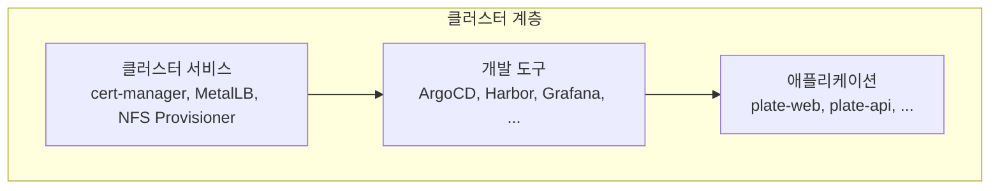
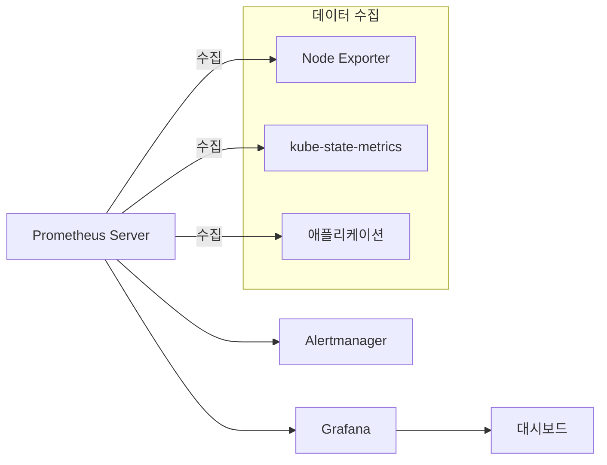
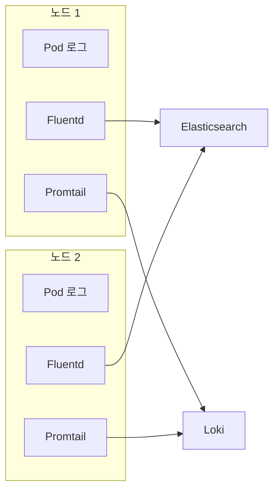

# 개발 도구

<cite>
**이 문서에서 참조된 파일**
- [README.md](file://README.md)
- [argocd/Chart.yaml](file://helm/development-tools/argocd/Chart.yaml)
- [argocd/values.yaml](file://helm/development-tools/argocd/values.yaml)
- [harbor/Chart.yaml](file://helm/development-tools/harbor/Chart.yaml)
- [harbor/values.yaml](file://helm/development-tools/harbor/values.yaml)
- [grafana/Chart.yaml](file://helm/development-tools/grafana/Chart.yaml)
- [grafana/values.yaml](file://helm/development-tools/grafana/values.yaml)
- [prometheus/Chart.yaml](file://helm/development-tools/prometheus/Chart.yaml)
- [prometheus/values.yaml](file://helm/development-tools/prometheus/values.yaml)
- [jenkins/Chart.yaml](file://helm/development-tools/jenkins/Chart.yaml)
- [jenkins/values.yaml](file://helm/development-tools/jenkins/values.yaml)
- [fluentd/Chart.yaml](file://helm/development-tools/fluentd/Chart.yaml)
- [fluentd/values.yaml](file://helm/development-tools/fluentd/values.yaml)
- [promtail/Chart.yaml](file://helm/development-tools/promtail/Chart.yaml)
- [promtail/values.yaml](file://helm/development-tools/promtail/values.yaml)
- [kubernetes-dashboard/Chart.yaml](file://helm/development-tools/kubernetes-dashboard/Chart.yaml)
- [kubernetes-dashboard/values.yaml](file://helm/development-tools/kubernetes-dashboard/values.yaml)
- [openbao/Chart.yaml](file://helm/development-tools/openbao/Chart.yaml)
- [openbao/values.yaml](file://helm/development-tools/openbao/values.yaml)
</cite>

## 목차
1. [소개](#소개)
2. [핵심 도구 개요](#핵심-도구-개요)
3. [ArgoCD](#argocd)
4. [Harbor](#harbor)
5. [Grafana 및 Prometheus](#grafana-및-prometheus)
6. [Jenkins](#jenkins)
7. [Fluentd 및 Promtail](#fluentd-및-promtail)
8. [Kubernetes Dashboard](#kubernetes-dashboard)
9. [OpenBao](#openbao)
10. [결론](#결론)

## 소개

이 문서는 클러스터 운영 및 개발을 지원하는 핵심 도구들의 구조와 기능을 설명합니다. 해당 도구들은 Helm 차트를 통해 Kubernetes 환경에 배포되며, GitOps 기반의 배포 자동화, 보안 강화된 컨테이너 이미지 관리, 실시간 모니터링 및 로깅, CI/CD 파이프라인 자동화, 시크릿 관리 및 클러스터 상태 시각화를 제공합니다. 각 도구는 `helm/development-tools/` 디렉터리에 위치한 Helm 차트를 통해 구성되며, `values.yaml` 파일을 통해 환경별 설정을 관리합니다.

**Section sources**
- [README.md](file://README.md#L1-L417)

## 핵심 도구 개요

프로젝트는 클러스터 서비스, 개발 도구, 애플리케이션의 3계층 구조로 구성되어 있으며, 이 문서에서 다루는 도구들은 2계층인 개발 도구에 해당합니다. 주요 도구들은 다음과 같습니다:

- **ArgoCD**: GitOps 기반의 배포 자동화 도구로, 애플리케이션 상태를 Git 저장소와 동기화합니다.
- **Harbor**: 프라이빗 컨테이너 이미지 레지스트리로, 이미지 보안 스캔 및 접근 제어 기능을 제공합니다.
- **Grafana 및 Prometheus**: 모니터링 및 메트릭 수집을 위한 쌍을 이루며, 실시간 대시보드와 경보 시스템을 구축합니다.
- **Jenkins**: CI/CD 파이프라인을 위한 빌드 및 배포 자동화 도구입니다.
- **Fluentd 및 Promtail**: 로그 수집 및 전송을 담당합니다.
- **Kubernetes Dashboard**: 클러스터 상태를 시각적으로 확인할 수 있는 UI 도구이며, OpenBao는 시크릿 관리 및 암호화 서비스를 제공합니다.

이러한 도구들은 `environments/argocd/app-of-apps.yaml` 파일에 정의된 App-of-Apps 패턴을 통해 ArgoCD를 통해 자동으로 배포 및 관리됩니다.

**Diagram sources**
- [README.md](file://README.md#L1-L417)

## ArgoCD

ArgoCD는 GitOps 기반의 지속적 배포(CD) 도구로, Kubernetes 애플리케이션의 선언적이고 자동화된 배포를 가능하게 합니다. 이 도구는 Git 저장소에 정의된 애플리케이션 상태를 클러스터의 실제 상태와 지속적으로 비교하고 동기화하여, 인프라와 애플리케이션을 코드로 관리(IaC)할 수 있도록 합니다.

### Helm 차트 구조

ArgoCD Helm 차트는 `helm/development-tools/argocd/` 디렉터리에 위치하며, 다음과 같은 주요 구성 요소를 포함합니다:
- **CRDs**: `templates/crds/` 디렉터리에 Application, ApplicationSet, Project 등의 CRD가 정의되어 있습니다.
- **주요 컴포넌트**: `templates/` 디렉터리에는 `argocd-server`, `argocd-repo-server`, `argocd-application-controller` 등의 StatefulSet과 Deployment가 정의되어 있습니다.
- **Redis HA**: `charts/redis-ha/` 하위 차트를 통해 고가용성 Redis 클러스터를 배포합니다.

### 주요 구성 요소

- **argocd-server**: 웹 UI와 API 엔드포인트를 제공하는 컴포넌트입니다.
- **argocd-repo-server**: Git 저장소에서 매니페스트를 가져와서 캐싱하는 컴포넌트입니다.
- **argocd-application-controller**: 클러스터의 실제 상태와 Git 저장소의 목표 상태를 비교하고 동기화하는 핵심 컴포넌트입니다.
- **argocd-applicationset**: ApplicationSet CRD를 통해 동적 애플리케이션 생성을 가능하게 합니다.

### values.yaml 설정 방식

`values.yaml` 파일을 통해 다양한 설정을 구성할 수 있습니다:
- **전역 설정**: `.global.domain`을 통해 도메인을 설정하고, `.global.image.repository`를 통해 이미지 레지스트리를 지정합니다.
- **RBAC 설정**: `.configs.rbac.policy.csv`를 통해 역할 기반 접근 제어(RBAC) 정책을 정의합니다. 예를 들어, `role:admin` 역할에 모든 리소스에 대한 접근 권한을 부여할 수 있습니다.
- **노드 스케줄링**: `.global.nodeSelector`와 `.global.tolerations`를 통해 특정 노드에 ArgoCD를 스케줄링할 수 있습니다.
- **보안 설정**: `.global.securityContext`를 통해 Pod의 보안 컨텍스트를 설정하고, `.configs.rbac.create`를 통해 RBAC 리소스 생성 여부를 제어합니다.

**Section sources**
- [argocd/Chart.yaml](file://helm/development-tools/argocd/Chart.yaml#L1-L32)
- [argocd/values.yaml](file://helm/development-tools/argocd/values.yaml#L1-L800)

## Harbor

Harbor는 신뢰할 수 있는 클라우드 네이티브 레지스트리로, Docker 이미지 및 Helm 차트를 안전하게 저장, 서명 및 스캔할 수 있습니다. 이 도구는 프라이빗 이미지 레지스트리를 제공하며, 이미지 취약점 스캔 및 정책 기반 접근 제어를 통해 보안을 강화합니다.

### Helm 차트 구조

Harbor Helm 차트는 `helm/development-tools/harbor/` 디렉터리에 위치하며, 다음과 같은 주요 구성 요소를 포함합니다:
- **주요 서비스**: `templates/` 디렉터리에는 `core`, `jobservice`, `registry`, `portal`, `database`, `redis` 등의 Deployment와 StatefulSet이 정의되어 있습니다.
- **Ingress 설정**: `templates/ingress/` 디렉터리에 Ingress 리소스가 정의되어 있습니다.
- **TLS 설정**: `templates/internal/auto-tls.yaml`을 통해 내부 TLS 설정을 관리합니다.

### 주요 구성 요소

- **Core**: Harbor의 핵심 로직을 처리하는 서비스로, 사용자 인증, 프로젝트 관리, 이미지 푸시/풀 요청을 처리합니다.
- **Registry**: Docker 레지스트리 프로토콜을 구현하여 이미지 저장소 역할을 합니다.
- **Jobservice**: 백그라운드 작업(예: 이미지 스캔, 복제)을 처리하는 서비스입니다.
- **Portal**: 웹 기반 사용자 인터페이스(UI)를 제공합니다.
- **Trivy**: 이미지 취약점 스캔을 수행하는 컴포넌트입니다.

### values.yaml 설정 방식

`values.yaml` 파일을 통해 다양한 설정을 구성할 수 있습니다:
- **노출 방식**: `expose.type`을 통해 `ingress`, `clusterIP`, `nodePort`, `loadBalancer` 중 하나를 선택하여 서비스를 노출할 수 있습니다.
- **TLS 설정**: `expose.tls.enabled`를 통해 TLS를 활성화하고, `expose.tls.certSource`를 통해 인증서 소스를 `auto`, `secret`, `none` 중 하나로 설정할 수 있습니다.
- **영구 저장소**: `persistence.enabled`를 통해 영구 저장소를 활성화하고, `persistence.persistentVolumeClaim.registry.storageClass`를 통해 스토리지 클래스를 지정합니다.
- **관리자 비밀번호**: `harborAdminPassword`를 통해 초기 관리자 비밀번호를 설정합니다.
- **외부 데이터베이스/Redis**: `persistence.database.existingClaim` 및 `persistence.redis.existingClaim`을 설정하여 외부 데이터베이스와 Redis를 사용할 수 있습니다.

**Section sources**
- [harbor/Chart.yaml](file://helm/development-tools/harbor/Chart.yaml#L1-L25)
- [harbor/values.yaml](file://helm/development-tools/harbor/values.yaml#L1-L800)

## Grafana 및 Prometheus

Grafana와 Prometheus는 모니터링 및 메트릭 수집을 위한 핵심 도구 쌍입니다. Prometheus는 시계열 데이터베이스로서 메트릭을 수집하고 저장하며, Grafana는 이를 시각화하여 실시간 대시보드와 경보 시스템을 구축합니다.

### Helm 차트 구조

- **Prometheus**: `helm/development-tools/prometheus/` 디렉터리에 위치하며, `charts/alertmanager/`, `charts/kube-state-metrics/`, `charts/prometheus-node-exporter/` 등의 하위 차트를 포함합니다.
- **Grafana**: `helm/development-tools/grafana/` 디렉터리에 위치하며, 자체적으로 독립적인 차트 구조를 가집니다.

### 주요 구성 요소

- **Prometheus Server**: 메트릭을 수집하고 저장하는 핵심 컴포넌트입니다. `server` StatefulSet 또는 Deployment로 배포됩니다.
- **Alertmanager**: Prometheus에서 생성된 경보를 중앙에서 관리하고, 중복 경보를 제거하며, 다양한 알림 채널(이메일, Slack 등)로 전송합니다.
- **Node Exporter**: 각 Kubernetes 노드의 하드웨어 및 운영 체제 메트릭을 수집합니다.
- **kube-state-metrics**: Kubernetes API 서버에서 오브젝트 상태를 모니터링하고, 이를 Prometheus에서 수집할 수 있는 메트릭으로 노출합니다.
- **Grafana Server**: 웹 기반 대시보드 UI를 제공하며, 다양한 데이터 소스(Prometheus 포함)를 연결할 수 있습니다.

### values.yaml 설정 방식

- **Prometheus**:
    - `server.persistentVolume.enabled` 및 `server.persistentVolume.storageClass`를 통해 영구 저장소를 구성합니다.
    - `server.ingress.enabled`를 통해 Ingress를 활성화하고, `server.ingress.hosts`를 통해 호스트를 설정합니다.
    - `server.resources`를 통해 리소스 요청 및 제한을 설정합니다.
    - `rbac.create`를 통해 RBAC 리소스 생성 여부를 제어합니다.

- **Grafana**:
    - `persistence.enabled` 및 `persistence.storageClassName`를 통해 영구 저장소를 구성합니다.
    - `adminUser` 및 `adminPassword`를 통해 초기 관리자 계정을 설정합니다.
    - `datasources`를 통해 데이터 소스를 선언적으로 구성할 수 있습니다 (예: Prometheus).
    - `ingress.enabled`를 통해 Ingress를 활성화하고, `ingress.hosts`를 통해 호스트를 설정합니다.
    - `plugins`를 통해 추가 플러그인을 설치할 수 있습니다.

**Diagram sources**
- [prometheus/Chart.yaml](file://helm/development-tools/prometheus/Chart.yaml#L1-L59)
- [prometheus/values.yaml](file://helm/development-tools/prometheus/values.yaml#L1-L800)
- [grafana/Chart.yaml](file://helm/development-tools/grafana/Chart.yaml#L1-L36)
- [grafana/values.yaml](file://helm/development-tools/grafana/values.yaml#L1-L800)

## Jenkins

Jenkins는 오픈소스 자동화 서버로, CI/CD 파이프라인을 구축하고 관리하는 데 사용됩니다. 이 도구는 코드 빌드, 테스트, 배포를 자동화하여 소프트웨어 개발 프로세스를 가속화합니다.

### Helm 차트 구조

Jenkins Helm 차트는 `helm/development-tools/jenkins/` 디렉터리에 위치하며, 다음과 같은 주요 구성 요소를 포함합니다:
- **Controller**: Jenkins 마스터 역할을 하는 컴포넌트로, 웹 UI와 파이프라인 실행을 관리합니다.
- **Agent**: Controller에 연결되어 작업을 수행하는 워커 노드입니다. 이 차트는 Agent를 별도로 배포하지 않으며, 파이프라인에서 필요할 때 동적으로 생성합니다.

### 주요 구성 요소

- **Jenkins Controller**: 파이프라인 정의를 저장하고, Agent를 관리하며, 웹 인터페이스를 제공하는 핵심 서비스입니다. `StatefulSet` 또는 `Deployment`로 배포됩니다.
- **Kubernetes Plugin**: Jenkins Controller 내에서 Kubernetes 클러스터에 연결하여, 파이프라인 실행 시마다 임시 Agent Pod를 동적으로 생성하고 파괴합니다.

### values.yaml 설정 방식

`values.yaml` 파일을 통해 다양한 설정을 구성할 수 있습니다:
- **컨트롤러 설정**: `controller.image.repository` 및 `controller.image.tag`를 통해 Jenkins 컨트롤러 이미지를 지정합니다.
- **관리자 계정**: `controller.admin.username` 및 `controller.admin.password`를 통해 초기 관리자 계정을 설정합니다.
- **플러그인 설치**: `controller.installPlugins` 목록을 통해 Jenkins 시작 시 자동으로 설치할 플러그인을 지정합니다 (예: `kubernetes`, `git`, `configuration-as-code`).
- **JCasC (Jenkins Configuration as Code)**: `controller.JCasC.configScripts`를 통해 Jenkins의 전반적인 설정(보안, 권한, 시스템 메시지 등)을 YAML 형식으로 선언적으로 정의할 수 있습니다.
- **Ingress 설정**: `controller.ingress.enabled`를 통해 Ingress를 활성화하고, `controller.ingress.hostName`을 통해 호스트를 설정합니다.
- **리소스 설정**: `controller.resources`를 통해 컨트롤러의 CPU 및 메모리 리소스 요청과 제한을 설정합니다.

**Section sources**
- [jenkins/Chart.yaml](file://helm/development-tools/jenkins/Chart.yaml#L1-L50)
- [jenkins/values.yaml](file://helm/development-tools/jenkins/values.yaml#L1-L800)

## Fluentd 및 Promtail

Fluentd와 Promtail은 로그 수집 및 전송을 담당하는 에이전트입니다. 두 도구 모두 클러스터의 모든 노드에 에이전트를 배포하여, 애플리케이션 및 시스템 로그를 중앙 집중식 로깅 백엔드(Loki)로 전송합니다.

### Helm 차트 구조

- **Fluentd**: `helm/development-tools/fluentd/` 디렉터리에 위치하며, `kind: DaemonSet`으로 설정되어 모든 노드에 배포됩니다.
- **Promtail**: `helm/development-tools/promtail/` 디렉터리에 위치하며, `daemonset.enabled: true`로 설정되어 모든 노드에 배포됩니다.

### 주요 구성 요소

- **Fluentd DaemonSet**: 각 노드에서 실행되며, `/var/log/containers/` 디렉터리에서 컨테이너 로그를 수집합니다. 수집된 로그는 `elasticsearch` 출력 플러그인을 통해 Elasticsearch로 전송됩니다.
- **Promtail DaemonSet**: 각 노드에서 실행되며, `/var/log/pods/` 및 `/var/lib/docker/containers/` 디렉터리에서 로그를 수집합니다. 수집된 로그는 `clients` 설정을 통해 Loki 게이트웨이로 전송됩니다.

### values.yaml 설정 방식

- **Fluentd**:
    - `fileConfigs`를 통해 Fluentd 구성 파일(`01_sources.conf`, `02_filters.conf`, `04_outputs.conf` 등)을 직접 정의할 수 있습니다. 예를 들어, `04_outputs.conf`에서 `host`를 `elasticsearch-master`로 설정하여 출력 대상을 지정합니다.
    - `volumes` 및 `volumeMounts`를 통해 로그 파일이 저장된 호스트 디렉터리를 마운트합니다.
    - `rbac.create`를 통해 RBAC 리소스 생성 여부를 제어합니다.

- **Promtail**:
    - `config.clients`를 통해 로그를 전송할 Loki 엔드포인트를 설정합니다 (예: `url: http://loki-gateway/loki/api/v1/push`).
    - `config.snippets.common`을 통해 로그에 추가할 레이블(예: `namespace`, `pod`, `container`)을 정의하는 리레이블링 규칙을 설정합니다.
    - `defaultVolumes` 및 `defaultVolumeMounts`를 통해 로그 파일이 저장된 호스트 디렉터리를 마운트합니다.
    - `rbac.create`를 통해 RBAC 리소스 생성 여부를 제어합니다.

**Diagram sources**
- [fluentd/Chart.yaml](file://helm/development-tools/fluentd/Chart.yaml#L1-L16)
- [fluentd/values.yaml](file://helm/development-tools/fluentd/values.yaml#L1-L404)
- [promtail/Chart.yaml](file://helm/development-tools/promtail/Chart.yaml#L1-L18)
- [promtail/values.yaml](file://helm/development-tools/promtail/values.yaml#L1-L648)

## Kubernetes Dashboard

Kubernetes Dashboard는 Kubernetes 클러스터의 상태를 시각적으로 확인할 수 있는 웹 기반 UI 도구입니다. 이 도구를 통해 리소스(노드, 파드, 서비스 등)를 관리하고, 클러스터의 전반적인 상태를 모니터링할 수 있습니다.

### Helm 차트 구조

Kubernetes Dashboard Helm 차트는 `helm/development-tools/kubernetes-dashboard/` 디렉터리에 위치하며, 다음과 같은 주요 구성 요소를 포함합니다:
- **주요 컴포넌트**: `templates/` 디렉터리에는 `auth`, `api`, `web` 등의 Deployment가 정의되어 있습니다.
- **게이트웨이**: `kong` 하위 차트를 통해 Kong API 게이트웨이를 배포하여, 모든 컴포넌트의 트래픽을 라우팅합니다.
- **Ingress Controller**: `nginx` 하위 차트를 통해 Nginx Ingress Controller를 배포할 수 있습니다.

### 주요 구성 요소

- **API**: 클러스터와 상호 작용하는 핵심 백엔드 서비스입니다.
- **Auth**: 사용자 인증을 처리하는 서비스입니다.
- **Web**: 사용자 인터페이스(UI)를 제공하는 프론트엔드 서비스입니다.
- **Metrics Scraper**: 메트릭 서버에서 메트릭을 수집하여 대시보드에 표시하는 컴포넌트입니다.

### values.yaml 설정 방식

`values.yaml` 파일을 통해 다양한 설정을 구성할 수 있습니다:
- **모드 설정**: `app.mode`를 통해 `dashboard` (전체 구성) 또는 `api` (API만) 모드를 선택할 수 있습니다.
- **Ingress 설정**: `ingress.enabled`를 통해 Ingress를 활성화하고, `ingress.hosts`를 통해 호스트를 설정합니다. `ingress.issuer.name` 및 `ingress.issuer.scope`를 통해 Cert-Manager 발급자를 설정합니다.
- **보안 설정**: `app.security.containerSecurityContext`를 통해 컨테이너 보안 컨텍스트를 설정하고, `app.security.podDisruptionBudget.enabled`를 통해 Pod 중단 예산을 활성화할 수 있습니다.
- **리소스 설정**: `auth`, `api`, `web` 각 컴포넌트의 `containers.resources`를 통해 리소스 요청 및 제한을 설정합니다.

**Section sources**
- [kubernetes-dashboard/Chart.yaml](file://helm/development-tools/kubernetes-dashboard/Chart.yaml#L1-L36)
- [kubernetes-dashboard/values.yaml](file://helm/development-tools/kubernetes-dashboard/values.yaml#L1-L452)

## OpenBao

OpenBao는 시크릿 관리 및 암호화 서비스를 제공하는 도구로, 민감한 정보(예: API 키, 데이터베이스 암호)를 안전하게 저장하고 액세스할 수 있도록 합니다. 이 도구는 동적 시크릿 생성, 암호화/복호화 서비스, Kubernetes 인증 메서드 등을 지원합니다.

### Helm 차트 구조

OpenBao Helm 차트는 `helm/development-tools/openbao/` 디렉터리에 위치하며, 다음과 같은 주요 구성 요소를 포함합니다:
- **Server**: OpenBao 서버를 배포하는 StatefulSet입니다.
- **Injector**: OpenBao Agent를 파드에 자동으로 주입하는 웹훅 컨트롤러입니다.
- **CSI Provider**: CSI 드라이버를 통해 볼륨 마운트 방식으로 시크릿을 파드에 제공합니다.

### 주요 구성 요소

- **OpenBao Server**: 시크릿 저장소의 핵심이며, `server` StatefulSet으로 배포됩니다. HA(High Availability) 모드를 지원합니다.
- **Agent Injector**: `injector` Deployment로 배포되며, `vault.hashicorp.com/agent-inject: 'true'` 어노테이션이 있는 파드에 OpenBao Agent 컨테이너를 자동으로 주입합니다.
- **CSI Provider**: `csi` DaemonSet으로 배포되며, CSI 드라이버를 통해 시크릿을 볼륨으로 마운트합니다.

### values.yaml 설정 방식

`values.yaml` 파일을 통해 다양한 설정을 구성할 수 있습니다:
- **서버 설정**: `server.enabled`를 통해 서버 배포를 활성화하고, `server.image.repository` 및 `server.image.tag`를 통해 이미지를 지정합니다.
- **Ingress 설정**: `server.ingress.enabled`를 통해 Ingress를 활성화하고, `server.ingress.hosts`를 통해 호스트를 설정합니다.
- **데이터 저장소**: `server.dataStorage.enabled`를 통해 영구 저장소를 활성화하고, `server.dataStorage.storageClass`를 통해 스토리지 클래스를 지정합니다.
- **Injector 설정**: `injector.enabled`를 통해 Injector를 활성화하고, `injector.image.repository` 및 `injector.image.tag`를 통해 이미지를 지정합니다.
- **보안 설정**: `global.psp.enable`를 통해 PodSecurityPolicy를 활성화하고, `injector.securityContext.pod` 및 `injector.securityContext.container`를 통해 보안 컨텍스트를 설정합니다.

**Section sources**
- [openbao/Chart.yaml](file://helm/development-tools/openbao/Chart.yaml#L1-L26)
- [openbao/values.yaml](file://helm/development-tools/openbao/values.yaml#L1-L800)

## 결론

이 문서는 클러스터 운영 및 개발을 위한 핵심 도구들(ArgoCD, Harbor, Grafana, Prometheus, Jenkins, Fluentd, Promtail, Kubernetes Dashboard, OpenBao)의 구조와 기능을 상세히 설명하였습니다. 각 도구는 Helm 차트를 통해 일관된 방식으로 배포되며, `values.yaml` 파일을 통해 환경별로 세부 설정을 관리할 수 있습니다. 이러한 도구들을 조합하여 GitOps 기반의 자동화된 CI/CD 파이프라인, 강력한 모니터링 및 로깅 시스템, 보안한 시크릿 관리 체계를 구축할 수 있습니다. 이는 현대적인 클라우드 네이티브 애플리케이션 개발 및 운영에 필수적인 인프라를 제공합니다.