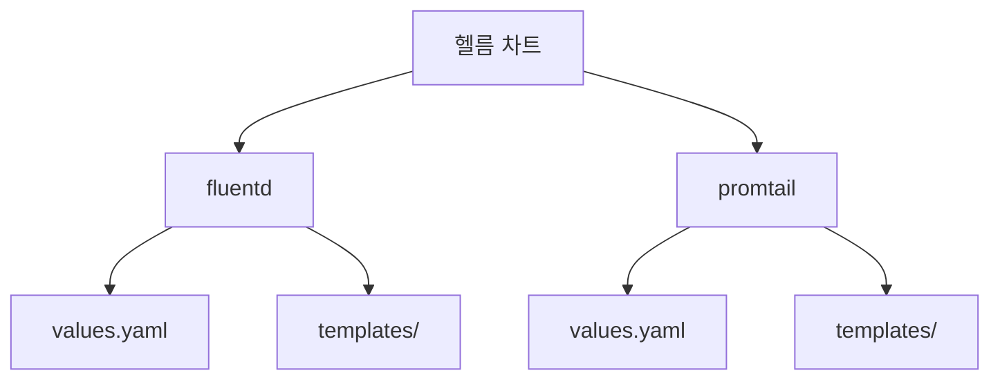
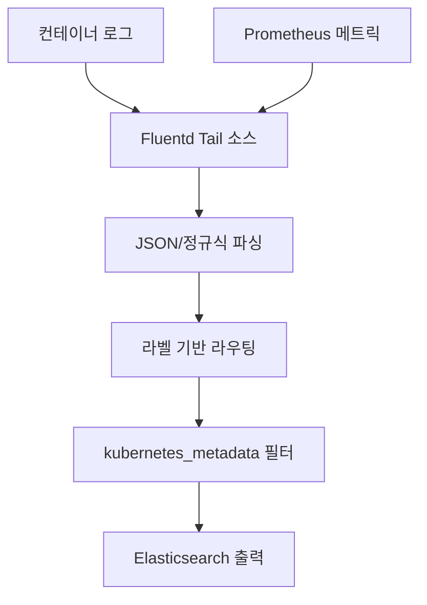
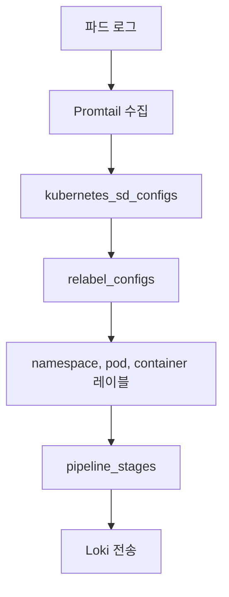
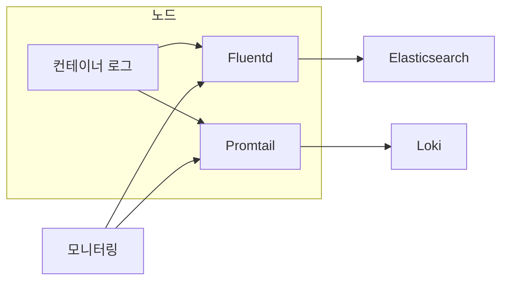
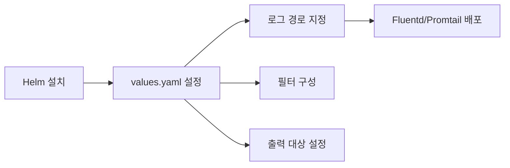

# 로그 수집 및 전송

<cite>
**이 문서에서 참조한 파일**  
- [fluentd/Chart.yaml](file://helm/development-tools/fluentd/Chart.yaml)
- [fluentd/values.yaml](file://helm/development-tools/fluentd/values.yaml)
- [fluentd/templates/daemonset.yaml](file://helm/development-tools/fluentd/templates/daemonset.yaml)
- [fluentd/templates/files.conf/prometheus.yaml](file://helm/development-tools/fluentd/templates/files.conf/prometheus.yaml)
- [promtail/Chart.yaml](file://helm/development-tools/promtail/Chart.yaml)
- [promtail/values.yaml](file://helm/development-tools/promtail/values.yaml)
- [promtail/templates/daemonset.yaml](file://helm/development-tools/promtail/templates/daemonset.yaml)
- [promtail/templates/networkpolicy.yaml](file://helm/development-tools/promtail/templates/networkpolicy.yaml)
- [promtail/templates/clusterrolebinding.yaml](file://helm/development-tools/promtail/templates/clusterrolebinding.yaml)
- [promtail/README.md](file://helm/development-tools/promtail/README.md)
</cite>

## 목차
1. [소개](#소개)
2. [프로젝트 구조](#프로젝트-구조)
3. [Fluentd 구성 분석](#fluentd-구성-분석)
4. [Promtail 구성 분석](#promtail-구성-분석)
5. [아키텍처 개요](#아키텍처-개요)
6. [역할 비교 및 사용 사례](#역할-비교-및-사용-사례)
7. [Helm을 통한 설치 및 설정](#helm을-통한-설치-및-설정)
8. [로그 파이프라인 설정](#로그-파이프라인-설정)
9. [문제 해결 가이드](#문제-해결-가이드)
10. [결론](#결론)

## 소개
이 문서는 Kubernetes 환경에서 로그를 수집하고 전송하기 위한 두 가지 주요 도구인 Fluentd와 Promtail의 아키텍처와 설정 방법을 설명합니다. Fluentd는 DaemonSet으로 배포되어 모든 노드의 컨테이너 로그를 수집하고, 필터링 및 변환 후 중앙 저장소로 전송합니다. Promtail은 Loki를 위한 전용 로그 에이전트로, 로그 스트림을 추출하고 레이블을 부여한 후 Loki 인스턴스로 전송합니다. 이 문서는 두 시스템의 차이점, Helm을 통한 설치 방법, values.yaml을 통한 설정, 로그 파이프라인 구성 및 문제 해결 방법을 포함합니다.

## 프로젝트 구조
프로젝트는 Helm 차트를 기반으로 구성되어 있으며, `helm/development-tools/` 디렉터리 아래에 Fluentd와 Promtail 각각의 Helm 차트가 위치합니다. 각 차트는 `templates/`, `values.yaml`, `Chart.yaml` 등의 표준 구조를 따르며, Kubernetes 리소스를 정의하고 설정할 수 있습니다. Fluentd는 `fluentd` 디렉터리에, Promtail은 `promtail` 디렉터리에 위치하며, 각각의 설정 파일을 통해 로그 수집 및 전송 동작을 제어할 수 있습니다.

**다이어그램 출처**  
- [fluentd/Chart.yaml](file://helm/development-tools/fluentd/Chart.yaml)
- [promtail/Chart.yaml](file://helm/development-tools/promtail/Chart.yaml)

**섹션 출처**  
- [fluentd/Chart.yaml](file://helm/development-tools/fluentd/Chart.yaml)
- [promtail/Chart.yaml](file://helm/development-tools/promtail/Chart.yaml)

## Fluentd 구성 분석
Fluentd는 Kubernetes 클러스터의 모든 노드에 DaemonSet으로 배포되며, `/var/log/containers/*.log` 경로에서 컨테이너 로그를 수집합니다. 수집된 로그는 `multi_format` 파서를 통해 JSON 또는 정규식 기반으로 파싱되며, 태그 기반으로 라우팅됩니다. 이후 `kubernetes_metadata` 필터를 통해 쿠버네티스 메타데이터를 추가하고, Elasticsearch로 출력됩니다. Fluentd는 Prometheus 메트릭을 노출하기 위해 별도의 소스를 구성하며, 모니터링을 지원합니다.

**다이어그램 출처**  
- [fluentd/values.yaml](file://helm/development-tools/fluentd/values.yaml#L292-L389)
- [fluentd/templates/files.conf/prometheus.yaml](file://helm/development-tools/fluentd/templates/files.conf/prometheus.yaml)

**섹션 출처**  
- [fluentd/values.yaml](file://helm/development-tools/fluentd/values.yaml#L292-L389)
- [fluentd/templates/daemonset.yaml](file://helm/development-tools/fluentd/templates/daemonset.yaml)

## Promtail 구성 분석
Promtail은 Loki를 위한 로그 에이전트로, DaemonSet으로 배포되어 노드의 `/var/log/pods` 및 Docker 컨테이너 로그 디렉터리에서 로그를 수집합니다. `kubernetes_sd_configs`를 사용하여 쿠버네티스 파드 정보를 동적으로 감지하며, `relabel_configs`를 통해 `namespace`, `pod`, `container` 등의 레이블을 추출합니다. 수집된 로그는 `pipeline_stages`를 통해 CRI 형식으로 파싱되며, Loki로 전송됩니다. 설정은 `values.yaml` 내 `config.file` 템플릿을 통해 구성됩니다.

**다이어그램 출처**  
- [promtail/values.yaml](file://helm/development-tools/promtail/values.yaml#L424-L540)
- [promtail/templates/daemonset.yaml](file://helm/development-tools/promtail/templates/daemonset.yaml)

**섹션 출처**  
- [promtail/values.yaml](file://helm/development-tools/promtail/values.yaml#L424-L540)
- [promtail/templates/daemonset.yaml](file://helm/development-tools/promtail/templates/daemonset.yaml)

## 아키텍처 개요
Fluentd와 Promtail 모두 DaemonSet으로 배포되어 각 노드에서 로그를 수집하지만, 출력 대상과 처리 방식에서 차이가 있습니다. Fluentd는 유연한 플러그인 아키텍처를 통해 다양한 출력 대상(Elasticsearch 등)을 지원하며, 복잡한 필터링과 변환이 가능합니다. 반면 Promtail은 Loki에 특화되어 있으며, 간단한 파이프라인과 레이블 기반 인덱싱을 통해 효율적인 로그 저장을 제공합니다. 두 시스템 모두 RBAC, 네트워크 정책, 서비스 어카운트 등을 통해 보안을 강화합니다.

**다이어그램 출처**  
- [fluentd/values.yaml](file://helm/development-tools/fluentd/values.yaml)
- [promtail/values.yaml](file://helm/development-tools/promtail/values.yaml)

**섹션 출처**  
- [fluentd/values.yaml](file://helm/development-tools/fluentd/values.yaml)
- [promtail/values.yaml](file://helm/development-tools/promtail/values.yaml)

## 역할 비교 및 사용 사례
| 항목 | Fluentd | Promtail |
|------|--------|---------|
| **주요 목적** | 유연한 로그 수집 및 변환 | Loki 전용 로그 수집 |
| **출력 대상** | Elasticsearch, Kafka, HTTP 등 | Loki |
| **파싱 기능** | 고급 필터링 및 변환 | 간단한 파이프라인 |
| **설정 복잡성** | 높음 | 낮음 |
| **사용 사례** | ELK 스택 통합, 복잡한 로그 처리 | Loki 기반 로깅, 경량 에이전트 |

**섹션 출처**  
- [fluentd/values.yaml](file://helm/development-tools/fluentd/values.yaml)
- [promtail/values.yaml](file://helm/development-tools/promtail/values.yaml)

## Helm을 통한 설치 및 설정
Fluentd와 Promtail은 Helm을 통해 설치되며, `values.yaml` 파일을 통해 로그 경로, 필터, 출력 대상 등을 설정할 수 있습니다. Fluentd는 `fileConfigs` 섹션에서 소스, 필터, 출력을 정의하며, Promtail은 `config.file` 템플릿을 통해 Loki URL, 레이블, 파이프라인을 구성합니다. 예를 들어, Promtail의 `clients.url`을 수정하여 Loki 엔드포인트를 지정할 수 있습니다.

**다이어그램 출처**  
- [fluentd/values.yaml](file://helm/development-tools/fluentd/values.yaml)
- [promtail/values.yaml](file://helm/development-tools/promtail/values.yaml)

**섹션 출처**  
- [fluentd/values.yaml](file://helm/development-tools/fluentd/values.yaml)
- [promtail/values.yaml](file://helm/development-tools/promtail/values.yaml)

## 로그 파이프라인 설정
Fluentd에서는 `match` 패턴을 사용하여 특정 태그의 로그를 필터링하고 재라벨링합니다. 예를 들어, Fluentd 자체 로그는 `@FLUENT_LOG` 라벨로 전달됩니다. Promtail에서는 `scrape_configs` 내 `pipeline_stages`를 사용하여 CRI 형식의 로그를 파싱하고, `relabel_configs`를 통해 사용자 정의 레이블을 추가할 수 있습니다. 두 시스템 모두 설정 파일을 통해 파이프라인을 정의하며, 실시간으로 로그를 처리합니다.

**섹션 출처**  
- [fluentd/values.yaml](file://helm/development-tools/fluentd/values.yaml#L331-L334)
- [promtail/values.yaml](file://helm/development-tools/promtail/values.yaml#L500-L540)

## 문제 해결 가이드
로그 누락, 전송 지연, 파싱 오류 등의 문제는 다음과 같은 방법으로 해결할 수 있습니다:
- **로그 누락**: `pos_file` 위치 확인, 파일 권한 검사, Fluentd/Promtail 재시작
- **전송 지연**: 출력 대상(Loki/Elasticsearch) 상태 확인, 네트워크 지연 측정, 리소스 제한 조정
- **파싱 오류**: 정규식 패턴 검증, `multi_format` 순서 확인, 파이프라인 스테이지 로그 분석
- **RBAC 오류**: ClusterRole, ServiceAccount, RoleBinding 설정 확인

**섹션 출처**  
- [fluentd/values.yaml](file://helm/development-tools/fluentd/values.yaml)
- [promtail/values.yaml](file://helm/development-tools/promtail/values.yaml)
- [promtail/templates/clusterrolebinding.yaml](file://helm/development-tools/promtail/templates/clusterrolebinding.yaml)

## 결론
Fluentd와 Promtail은 각각 유연성과 경량성을 강점으로 하는 로그 수집 도구입니다. Fluentd는 복잡한 로그 처리와 다중 출력을 필요로 하는 환경에 적합하며, Promtail은 Loki와의 통합을 위해 간단하고 효율적인 로깅을 제공합니다. Helm을 통해 쉽게 배포하고, `values.yaml`을 통해 세부 설정을 조정할 수 있으며, 운영 환경에서 안정적으로 로그를 수집하고 전송할 수 있습니다.