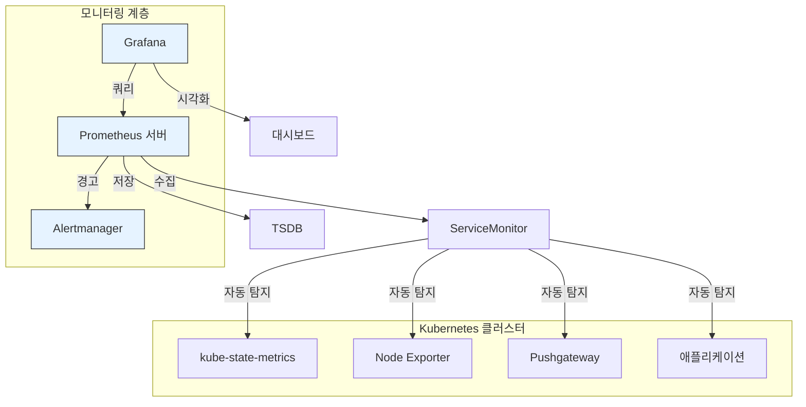
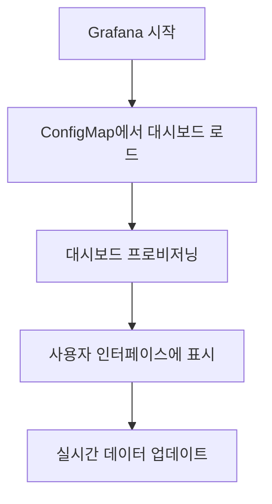
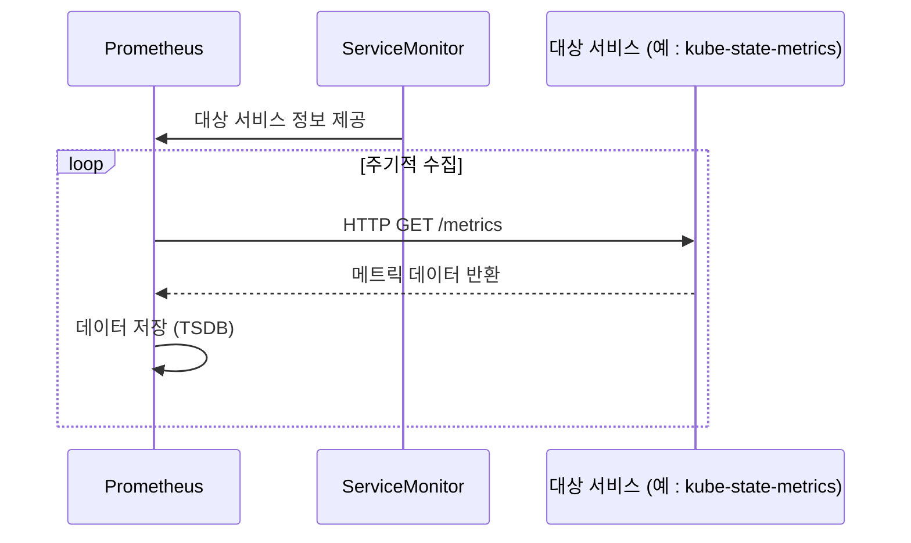

# 메트릭 모니터링

<cite>
**이 문서에서 참조한 파일**   
- [prometheus/values.yaml](file://helm/development-tools/prometheus/values.yaml)
- [grafana/values.yaml](file://helm/development-tools/grafana/values.yaml)
- [prometheus/templates/deploy.yaml](file://helm/development-tools/prometheus/templates/deploy.yaml)
- [grafana/templates/dashboards-json-configmap.yaml](file://helm/development-tools/grafana/templates/dashboards-json-configmap.yaml)
- [grafana/templates/deployment.yaml](file://helm/development-tools/grafana/templates/deployment.yaml)
- [prometheus/charts/kube-state-metrics/templates/servicemonitor.yaml](file://helm/development-tools/prometheus/charts/kube-state-metrics/templates/servicemonitor.yaml)
- [prometheus/charts/prometheus-node-exporter/templates/servicemonitor.yaml](file://helm/development-tools/prometheus/charts/prometheus-node-exporter/templates/servicemonitor.yaml)
</cite>

## 목차
1. [소개](#소개)
2. [시스템 아키텍처](#시스템-아키텍처)
3. [Prometheus 구성 및 작동 원리](#prometheus-구성-및-작동-원리)
4. [Grafana 통합 및 대시보드 관리](#grafana-통합-및-대시보드-관리)
5. [ServiceMonitor를 통한 메트릭 수집](#servicemonitor를-통한-메트릭-수집)
6. [알림 및 쿼리 언어](#알림-및-쿼리-언어)
7. [문제 해결 절차](#문제-해결-절차)
8. [결론](#결론)

## 소개
이 문서는 Kubernetes 클러스터 내에서 Prometheus와 Grafana를 기반으로 한 메트릭 모니터링 시스템의 구조와 작동 원리를 설명합니다. Prometheus는 클러스터 내 다양한 컴포넌트로부터 메트릭을 수집하고 저장하며, Grafana는 이를 시각화하여 운영자가 시스템 상태를 쉽게 파악할 수 있도록 지원합니다. Helm 차트를 통해 사전 구성된 대시보드를 배포하고, values.yaml을 통한 사용자 정의 설정, 알림 규칙(Prometheus Alertmanager), PromQL 활용 예시 등을 포함합니다.

## 시스템 아키텍처



**Diagram sources**
- [prometheus/values.yaml](file://helm/development-tools/prometheus/values.yaml)
- [grafana/values.yaml](file://helm/development-tools/grafana/values.yaml)

## Prometheus 구성 및 작동 원리

Prometheus는 Kubernetes 클러스터 내에서 메트릭을 수집하는 핵심 컴포넌트입니다. Helm 차트를 통해 배포되며, `values.yaml` 파일을 통해 다양한 설정을 관리합니다. 주요 구성 요소로는 서버 컨테이너, 설정 리로더, 영구 볼륨(Persistent Volume) 등이 있습니다.

### 데이터 저장 및 보존
Prometheus는 로컬 스토리지에 메트릭 데이터를 저장하며, 기본적으로 15일간의 데이터를 보존합니다. 이는 `values.yaml` 파일의 `server.retention` 설정을 통해 조정할 수 있습니다. 또한, `persistentVolume` 설정을 통해 데이터의 지속성을 보장합니다.

### 리소스 제한
Prometheus 서버는 리소스 요청 및 제한을 통해 안정적인 운영을 보장합니다. 이는 `resources` 섹션에서 CPU 및 메모리 제한을 정의함으로써 구현됩니다.

**Section sources**
- [prometheus/values.yaml](file://helm/development-tools/prometheus/values.yaml#L815-L821)
- [prometheus/templates/deploy.yaml](file://helm/development-tools/prometheus/templates/deploy.yaml#L295-L297)

## Grafana 통합 및 대시보드 관리

Grafana는 Prometheus를 데이터 소스로 연결하여 시각화 대시보드를 제공합니다. Helm 차트를 통해 Grafana를 배포하며, `values.yaml` 파일을 통해 다양한 설정을 관리합니다.

### 대시보드 임포트
Grafana는 `dashboards` 설정을 통해 JSON 형식의 대시보드를 임포트할 수 있습니다. 이는 `values.yaml` 파일에서 `dashboards` 섹션을 통해 정의되며, ConfigMap을 통해 대시보드를 관리합니다.



**Diagram sources**
- [grafana/values.yaml](file://helm/development-tools/grafana/values.yaml#L838-L884)
- [grafana/templates/dashboards-json-configmap.yaml](file://helm/development-tools/grafana/templates/dashboards-json-configmap.yaml)

**Section sources**
- [grafana/values.yaml](file://helm/development-tools/grafana/values.yaml#L838-L884)
- [grafana/templates/dashboards-json-configmap.yaml](file://helm/development-tools/grafana/templates/dashboards-json-configmap.yaml)

## ServiceMonitor를 통한 메트릭 수집

ServiceMonitor는 Prometheus Operator의 CRD(Custom Resource Definition)로, 대상 서비스를 자동으로 탐지하고 메트릭을 수집합니다. 각 컴포넌트는 자체 ServiceMonitor를 통해 Prometheus에 의해 수집될 수 있도록 구성됩니다.

### kube-state-metrics
kube-state-metrics는 Kubernetes 클러스터의 상태를 메트릭으로 노출합니다. ServiceMonitor를 통해 Prometheus가 이를 자동으로 탐지하고 수집합니다.

### Node Exporter
Node Exporter는 노드 수준의 하드웨어 및 운영 체제 메트릭을 수집합니다. ServiceMonitor를 통해 Prometheus가 이를 자동으로 탐지하고 수집합니다.



**Diagram sources**
- [prometheus/charts/kube-state-metrics/templates/servicemonitor.yaml](file://helm/development-tools/prometheus/charts/kube-state-metrics/templates/servicemonitor.yaml)
- [prometheus/charts/prometheus-node-exporter/templates/servicemonitor.yaml](file://helm/development-tools/prometheus/charts/prometheus-node-exporter/templates/servicemonitor.yaml)

**Section sources**
- [prometheus/charts/kube-state-metrics/templates/servicemonitor.yaml](file://helm/development-tools/prometheus/charts/kube-state-metrics/templates/servicemonitor.yaml)
- [prometheus/charts/prometheus-node-exporter/templates/servicemonitor.yaml](file://helm/development-tools/prometheus/charts/prometheus-node-exporter/templates/servicemonitor.yaml)

## 알림 및 쿼리 언어

### Prometheus Alertmanager
Prometheus는 Alertmanager를 통해 경고를 관리합니다. `values.yaml` 파일의 `alertmanagers` 섹션을 통해 Alertmanager를 구성할 수 있으며, 다양한 조건에 따라 경고를 생성하고 알림을 전송합니다.

### PromQL 활용 예시
PromQL(Prometheus Query Language)은 Prometheus에서 메트릭을 쿼리하는 언어입니다. 예를 들어, CPU 사용률이 80%를 초과하는 노드를 찾는 쿼리는 다음과 같습니다:

```
rate(node_cpu_seconds_total{mode="idle"}[5m]) < 0.2
```

이 쿼리는 5분 동안의 CPU 유휴 시간 비율이 20% 미만인 노드를 찾아냅니다.

**Section sources**
- [prometheus/values.yaml](file://helm/development-tools/prometheus/values.yaml#L628-L630)

## 문제 해결 절차

### 메트릭 수집 지연
메트릭 수집 지연이 발생할 경우, 다음 절차를 따르십시오:
1. Prometheus 서버의 리소스 사용량 확인
2. ServiceMonitor의 설정 및 상태 확인
3. 대상 서비스의 `/metrics` 엔드포인트 접근성 확인
4. 네트워크 정책 및 방화벽 규칙 확인

### 대시보드 렌더링 실패
대시보드 렌더링 실패가 발생할 경우, 다음 절차를 따르십시오:
1. Grafana 로그 확인
2. 데이터 소스 연결 상태 확인
3. 대시보드 JSON 파일의 유효성 검사
4. 브라우저 캐시 및 네트워크 문제 확인

**Section sources**
- [prometheus/values.yaml](file://helm/development-tools/prometheus/values.yaml)
- [grafana/values.yaml](file://helm/development-tools/grafana/values.yaml)

## 결론
Prometheus와 Grafana를 기반으로 한 메트릭 모니터링 시스템은 Kubernetes 클러스터의 상태를 실시간으로 모니터링하고 시각화하는 강력한 도구입니다. Helm 차트를 통해 쉽게 배포하고, values.yaml을 통해 사용자 정의 설정을 적용할 수 있으며, ServiceMonitor를 통해 자동으로 메트릭을 수집합니다. 이 문서는 시스템의 구조와 작동 원리를 설명하며, 문제 해결 절차를 제공하여 운영자가 안정적인 모니터링 환경을 유지할 수 있도록 지원합니다.