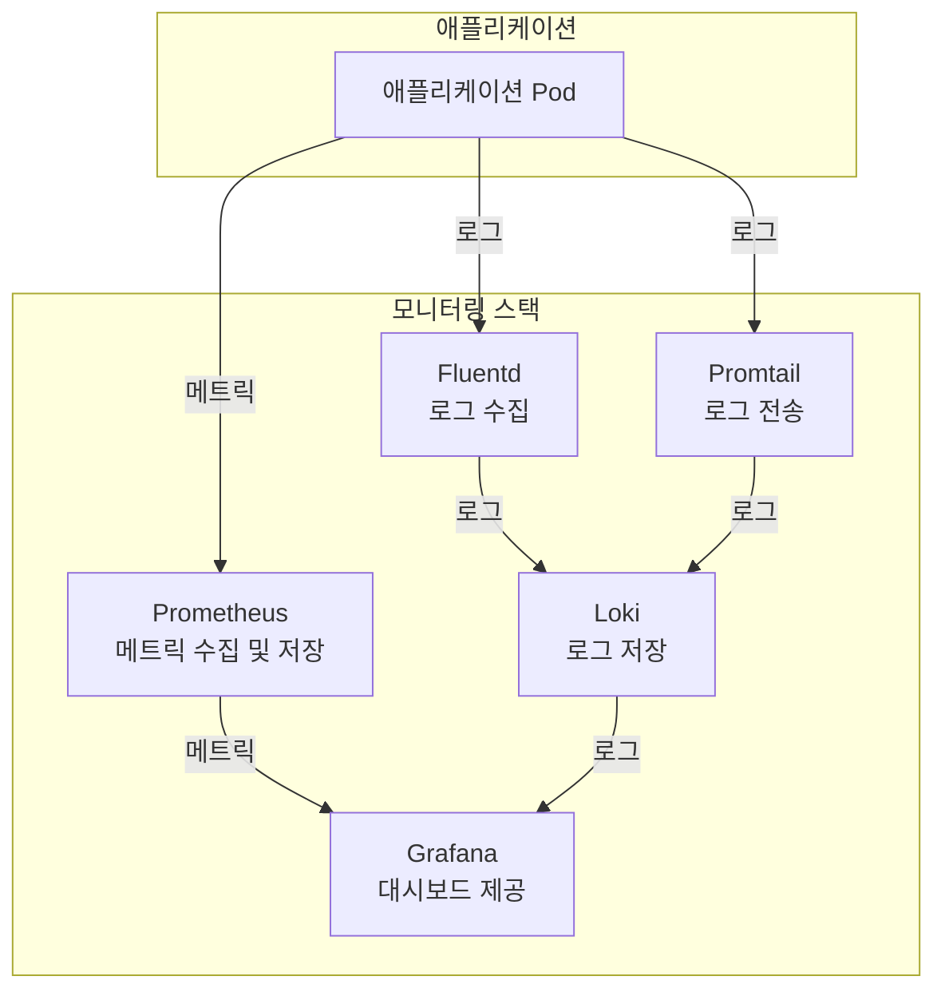
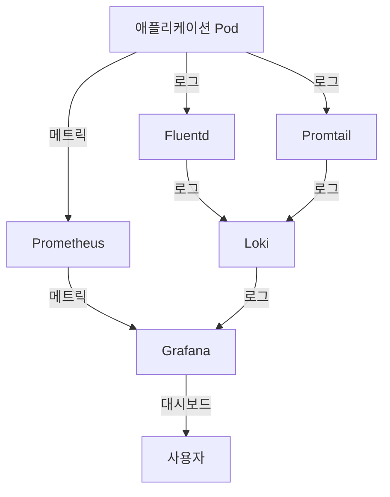

# 모니터링 스택

<cite>
**이 문서에서 참조한 파일**   
- [prometheus/values.yaml](file://helm/development-tools/prometheus/values.yaml)
- [prometheus/templates/deploy.yaml](file://helm/development-tools/prometheus/templates/deploy.yaml)
- [grafana/values.yaml](file://helm/development-tools/grafana/values.yaml)
- [grafana/templates/deployment.yaml](file://helm/development-tools/grafana/templates/deployment.yaml)
- [fluentd/values.yaml](file://helm/development-tools/fluentd/values.yaml)
- [fluentd/templates/daemonset.yaml](file://helm/development-tools/fluentd/templates/daemonset.yaml)
- [promtail/values.yaml](file://helm/development-tools/promtail/values.yaml)
- [promtail/templates/daemonset.yaml](file://helm/development-tools/promtail/templates/daemonset.yaml)
</cite>

## 목차
1. [소개](#소개)
2. [모니터링 스택 아키텍처](#모니터링-스택-아키텍처)
3. [Prometheus 구성 및 역할](#prometheus-구성-및-역할)
4. [Grafana 구성 및 역할](#grafana-구성-및-역할)
5. [Fluentd 구성 및 역할](#fluentd-구성-및-역할)
6. [Promtail 구성 및 역할](#promtail-구성-및-역할)
7. [Helm을 통한 설치 및 values.yaml 구성](#helm을-통한-설치-및-valuesyaml-구성)
8. [데이터 흐름 및 통합 방식](#데이터-흐름-및-통합-방식)
9. [문제 해결](#문제-해결)
10. [결론](#결론)

## 소개

이 문서는 Kubernetes 기반 환경에서 시스템 가시성을 제공하는 모니터링 스택의 통합 구조와 각 구성 요소의 역할을 설명합니다. Prometheus는 메트릭 수집 및 저장을 담당하며, Grafana는 이를 기반으로 대시보드를 제공합니다. Fluentd는 Kubernetes 클러스터의 로그를 수집하고, Promtail은 로그를 Loki로 전송합니다. 이 문서는 Helm을 통한 설치 및 values.yaml을 통한 구성 방법을 포함하며, 실제 코드 예제로는 Prometheus의 ServiceMonitor, Grafana의 대시보드 설정, Fluentd의 로그 파이프라인, Promtail의 scrape 설정 등을 제시하고, 메트릭 수집 실패 또는 로그 누락 문제 해결 방법을 포함합니다.

## 모니터링 스택 아키텍처



**Diagram sources**
- [prometheus/values.yaml](file://helm/development-tools/prometheus/values.yaml)
- [grafana/values.yaml](file://helm/development-tools/grafana/values.yaml)
- [fluentd/values.yaml](file://helm/development-tools/fluentd/values.yaml)
- [promtail/values.yaml](file://helm/development-tools/promtail/values.yaml)

**Section sources**
- [prometheus/values.yaml](file://helm/development-tools/prometheus/values.yaml)
- [grafana/values.yaml](file://helm/development-tools/grafana/values.yaml)
- [fluentd/values.yaml](file://helm/development-tools/fluentd/values.yaml)
- [promtail/values.yaml](file://helm/development-tools/promtail/values.yaml)

## Prometheus 구성 및 역할

Prometheus는 Kubernetes 클러스터의 메트릭을 수집하고 저장하는 역할을 합니다. Helm 차트를 통해 설치되며, `values.yaml` 파일을 통해 다양한 설정을 구성할 수 있습니다. Prometheus는 ServiceMonitor를 통해 메트릭 수집 대상을 자동으로 발견하고, 수집된 메트릭은 로컬 스토리지에 저장됩니다.

### 주요 구성 요소

- **server**: Prometheus 서버 컨테이너
- **configmapReload**: 설정 변경 시 Prometheus를 재시작하지 않고 설정을 다시 로드하는 기능
- **persistentVolume**: 메트릭 데이터를 저장하기 위한 영구 볼륨

### values.yaml 설정 예제

```yaml
server:
  replicaCount: 1
  persistentVolume:
    enabled: true
    size: 8Gi
    storageClass: "openebs-hostpath"
  resources:
    requests:
      cpu: 500m
      memory: 512Mi
    limits:
      cpu: 500m
      memory: 512Mi
  ingress:
    enabled: true
    hosts:
      - prometheus.cocdev.co.kr
    tls:
      - secretName: prometheus-server-tls
        hosts:
          - prometheus.cocdev.co.kr
```

**Section sources**
- [prometheus/values.yaml](file://helm/development-tools/prometheus/values.yaml)
- [prometheus/templates/deploy.yaml](file://helm/development-tools/prometheus/templates/deploy.yaml)

## Grafana 구성 및 역할

Grafana는 Prometheus에서 수집된 메트릭과 Loki에서 저장된 로그를 기반으로 대시보드를 제공합니다. Helm 차트를 통해 설치되며, `values.yaml` 파일을 통해 다양한 설정을 구성할 수 있습니다. Grafana는 데이터 소스로 Prometheus와 Loki를 추가하여 메트릭과 로그를 통합적으로 시각화할 수 있습니다.

### 주요 구성 요소

- **image**: Grafana 컨테이너 이미지
- **persistence**: 대시보드 및 설정을 저장하기 위한 영구 볼륨
- **datasources**: Prometheus와 Loki 데이터 소스 설정

### values.yaml 설정 예제

```yaml
image:
  repository: grafana/grafana
  tag: ""
  pullPolicy: IfNotPresent

persistence:
  enabled: true
  type: pvc
  storageClassName: openebs-hostpath
  size: 10Gi

datasources:
  datasources.yaml:
    apiVersion: 1
    datasources:
      - name: Prometheus
        type: prometheus
        url: http://prometheus-prometheus-server
        access: proxy
        isDefault: true
      - name: Loki
        type: loki
        url: http://loki-gateway
        access: proxy
```

**Section sources**
- [grafana/values.yaml](file://helm/development-tools/grafana/values.yaml)
- [grafana/templates/deployment.yaml](file://helm/development-tools/grafana/templates/deployment.yaml)

## Fluentd 구성 및 역할

Fluentd는 Kubernetes 클러스터의 로그를 수집하고, 수집된 로그를 Elasticsearch, Loki 등 다양한 백엔드로 전송합니다. Helm 차트를 통해 설치되며, `values.yaml` 파일을 통해 다양한 설정을 구성할 수 있습니다. Fluentd는 DaemonSet으로 배포되어 각 노드에서 로그를 수집합니다.

### 주요 구성 요소

- **image**: Fluentd 컨테이너 이미지
- **fileConfigs**: Fluentd 구성 파일
- **plugins**: 추가 플러그인 설치

### values.yaml 설정 예제

```yaml
image:
  repository: fluent/fluentd-kubernetes-daemonset
  tag: ""

fileConfigs:
  01_sources.conf: |-
    <source>
      @type tail
      path /var/log/containers/*.log
      pos_file /var/log/fluentd-containers.log.pos
      tag kubernetes.*
      read_from_head true
      <parse>
        @type multi_format
        <pattern>
          format json
          time_key time
          time_type string
          time_format "%Y-%m-%dT%H:%M:%S.%NZ"
        </pattern>
      </parse>
    </source>

  04_outputs.conf: |-
    <match **>
      @type elasticsearch
      host "elasticsearch-master"
      port 9200
      user elastic
      password changeme
    </match>
```

**Section sources**
- [fluentd/values.yaml](file://helm/development-tools/fluentd/values.yaml)
- [fluentd/templates/daemonset.yaml](file://helm/development-tools/fluentd/templates/daemonset.yaml)

## Promtail 구성 및 역할

Promtail은 Kubernetes 클러스터의 로그를 수집하고, 수집된 로그를 Loki로 전송합니다. Helm 차트를 통해 설치되며, `values.yaml` 파일을 통해 다양한 설정을 구성할 수 있습니다. Promtail은 DaemonSet으로 배포되어 각 노드에서 로그를 수집합니다.

### 주요 구성 요소

- **image**: Promtail 컨테이너 이미지
- **config**: Promtail 구성 파일
- **clients**: Loki 엔드포인트 설정

### values.yaml 설정 예제

```yaml
image:
  repository: grafana/promtail
  tag: ""

config:
  clients:
    - url: http://loki-gateway/loki/api/v1/push

  snippets:
    common:
      - action: replace
        source_labels:
          - __meta_kubernetes_pod_node_name
        target_label: node_name
      - action: replace
        source_labels:
          - __meta_kubernetes_namespace
        target_label: namespace
```

**Section sources**
- [promtail/values.yaml](file://helm/development-tools/promtail/values.yaml)
- [promtail/templates/daemonset.yaml](file://helm/development-tools/promtail/templates/daemonset.yaml)

## Helm을 통한 설치 및 values.yaml 구성

모니터링 스택은 Helm을 통해 설치되며, 각 구성 요소의 `values.yaml` 파일을 통해 세부 설정을 구성할 수 있습니다. Helm 차트는 `helm/development-tools/` 디렉터리에 위치하며, 각 구성 요소별로 별도의 차트가 존재합니다.

### 설치 절차

1. Helm 저장소 추가
2. 각 구성 요소의 Helm 차트 설치
3. `values.yaml` 파일을 통해 설정 오버라이드

### 예제 설치 명령어

```bash
# Prometheus 설치
helm upgrade --install prometheus helm/development-tools/prometheus -f helm/development-tools/prometheus/values.yaml

# Grafana 설치
helm upgrade --install grafana helm/development-tools/grafana -f helm/development-tools/grafana/values.yaml

# Fluentd 설치
helm upgrade --install fluentd helm/development-tools/fluentd -f helm/development-tools/fluentd/values.yaml

# Promtail 설치
helm upgrade --install promtail helm/development-tools/promtail -f helm/development-tools/promtail/values.yaml
```

**Section sources**
- [prometheus/values.yaml](file://helm/development-tools/prometheus/values.yaml)
- [grafana/values.yaml](file://helm/development-tools/grafana/values.yaml)
- [fluentd/values.yaml](file://helm/development-tools/fluentd/values.yaml)
- [promtail/values.yaml](file://helm/development-tools/promtail/values.yaml)

## 데이터 흐름 및 통합 방식

모니터링 스택의 데이터 흐름은 다음과 같습니다:

1. **메트릭 수집**: 애플리케이션 Pod에서 메트릭을 노출하고, Prometheus가 이를 수집하여 저장합니다.
2. **로그 수집**: 애플리케이션 Pod에서 로그를 생성하고, Fluentd 또는 Promtail이 이를 수집합니다.
3. **로그 전송**: 수집된 로그는 Fluentd가 Elasticsearch로 전송하거나, Promtail이 Loki로 전송합니다.
4. **대시보드 제공**: Grafana가 Prometheus와 Loki에서 데이터를 가져와 통합 대시보드를 제공합니다.



**Diagram sources**
- [prometheus/values.yaml](file://helm/development-tools/prometheus/values.yaml)
- [grafana/values.yaml](file://helm/development-tools/grafana/values.yaml)
- [fluentd/values.yaml](file://helm/development-tools/fluentd/values.yaml)
- [promtail/values.yaml](file://helm/development-tools/promtail/values.yaml)

**Section sources**
- [prometheus/values.yaml](file://helm/development-tools/prometheus/values.yaml)
- [grafana/values.yaml](file://helm/development-tools/grafana/values.yaml)
- [fluentd/values.yaml](file://helm/development-tools/fluentd/values.yaml)
- [promtail/values.yaml](file://helm/development-tools/promtail/values.yaml)

## 문제 해결

### 메트릭 수집 실패

- **원인**: ServiceMonitor 설정 오류, 타겟 Pod의 메트릭 엔드포인트 미노출
- **해결 방법**: ServiceMonitor의 `selector`와 `namespaceSelector` 확인, 타겟 Pod의 메트릭 엔드포인트 확인

### 로그 누락

- **원인**: Fluentd 또는 Promtail의 구성 오류, 로그 파일 경로 변경
- **해결 방법**: Fluentd 또는 Promtail의 구성 파일 확인, 로그 파일 경로 확인

### Grafana 대시보드 미표시

- **원인**: 데이터 소스 설정 오류, 쿼리 오류
- **해결 방법**: 데이터 소스 URL 확인, 쿼리 문법 확인

**Section sources**
- [prometheus/values.yaml](file://helm/development-tools/prometheus/values.yaml)
- [grafana/values.yaml](file://helm/development-tools/grafana/values.yaml)
- [fluentd/values.yaml](file://helm/development-tools/fluentd/values.yaml)
- [promtail/values.yaml](file://helm/development-tools/promtail/values.yaml)

## 결론

이 문서는 Prometheus, Grafana, Fluentd, Promtail로 구성된 모니터링 스택의 통합 구조와 각 구성 요소의 역할을 설명하였습니다. Helm을 통한 설치 및 values.yaml을 통한 구성 방법을 포함하며, 실제 코드 예제와 문제 해결 방법을 제공하였습니다. 이를 통해 Kubernetes 기반 환경에서 시스템 가시성을 효과적으로 제공할 수 있습니다.