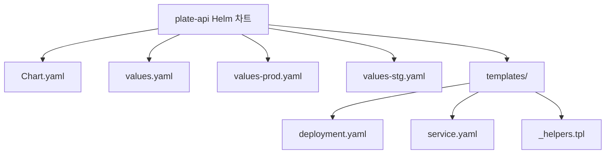
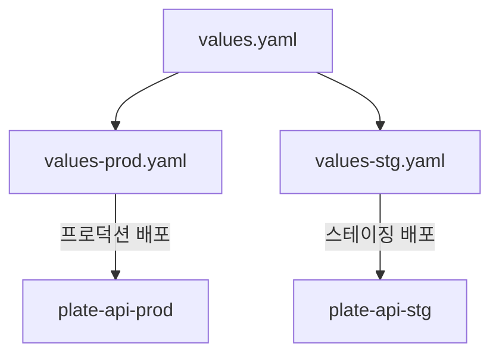
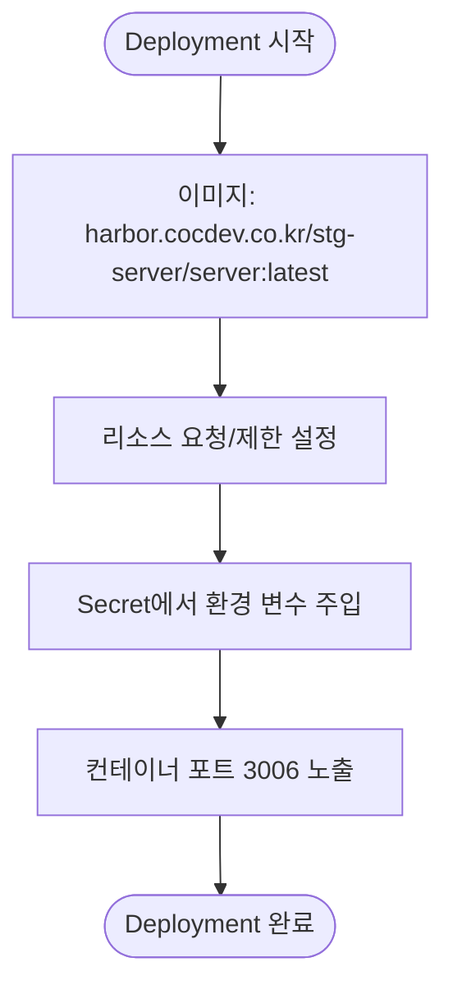
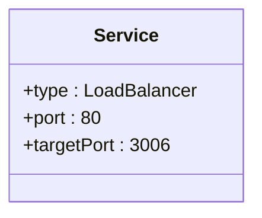
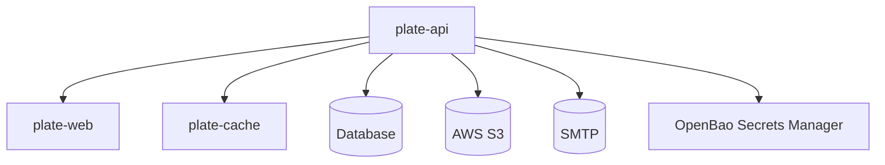

# plate-api

<cite>
**이 문서에서 참조한 파일**
- [plate-api/Chart.yaml](file://helm/applications/plate-server/Chart.yaml)
- [plate-api/values.yaml](file://helm/applications/plate-server/values.yaml)
- [plate-api/values-prod.yaml](file://helm/applications/plate-server/values-prod.yaml)
- [plate-api/values-stg.yaml](file://helm/applications/plate-server/values-stg.yaml)
- [plate-api/templates/deployment.yaml](file://helm/applications/plate-server/templates/deployment.yaml)
- [plate-api/templates/service.yaml](file://helm/applications/plate-server/templates/service.yaml)
- [plate-api/templates/_helpers.tpl](file://helm/applications/plate-server/templates/_helpers.tpl)
- [environments/argocd/apps/plate-api-prod.yaml](file://environments/argocd/apps/plate-api-prod.yaml)
- [environments/argocd/apps/plate-api-stg.yaml](file://environments/argocd/apps/plate-api-stg.yaml)
</cite>

## 목차
1. [소개](#소개)
2. [프로젝트 구조](#프로젝트-구조)
3. [핵심 구성 요소](#핵심-구성-요소)
4. [아키텍처 개요](#아키텍처-개요)
5. [상세 구성 요소 분석](#상세-구성-요소-분석)
6. [디펜던시 분석](#디펜던시-분석)
7. [성능 고려 사항](#성능-고려-사항)
8. [문제 해결 가이드](#문제-해결-가이드)
9. [결론](#결론)

## 소개
plate-api는 Kubernetes 환경에서 Helm 차트를 통해 배포되는 백엔드 RESTful API 서버입니다. 이 서비스는 plate-web 프론트엔드 및 plate-cache와 통합되어 동작하며, ArgoCD를 통해 GitOps 방식으로 운영 환경에 자동 배포됩니다. 본 문서는 plate-api의 아키텍처 설계, Helm 차트 구조, 배포 전략, 환경별 설정 전략, 서비스 노출 방식, 리소스 구성, 프로브 설정, 인증 및 환경 변수 관리 방식을 상세히 설명합니다.

## 프로젝트 구조

plate-api Helm 차트는 `helm/applications/plate-server/` 디렉터리에 위치하며, 다음과 같은 주요 구성 요소로 이루어져 있습니다:

```
helm/applications/plate-server/
├── Chart.yaml
├── values.yaml
├── values-prod.yaml
├── values-stg.yaml
└── templates/
    ├── deployment.yaml
    ├── service.yaml
    └── _helpers.tpl
```

- **Chart.yaml**: 차트의 메타데이터를 정의합니다.
- **values.yaml**: 기본 설정 값을 포함합니다.
- **values-prod.yaml**, **values-stg.yaml**: 각각 프로덕션 및 스테이징 환경을 위한 오버라이드 설정입니다.
- **templates/**: Kubernetes 리소스를 생성하는 Helm 템플릿이 포함됩니다.



**Diagram sources**
- [plate-api/Chart.yaml](file://helm/applications/plate-server/Chart.yaml)
- [plate-api/values.yaml](file://helm/applications/plate-server/values.yaml)
- [plate-api/templates/deployment.yaml](file://helm/applications/plate-server/templates/deployment.yaml)
- [plate-api/templates/service.yaml](file://helm/applications/plate-server/templates/service.yaml)

**Section sources**
- [plate-api/Chart.yaml](file://helm/applications/plate-server/Chart.yaml)
- [plate-api/values.yaml](file://helm/applications/plate-server/values.yaml)

## 핵심 구성 요소

plate-api는 다음과 같은 핵심 구성 요소로 구성됩니다:

- **Deployment**: 백엔드 애플리케이션 컨테이너를 관리합니다.
- **Service**: 클러스터 내부에서 서비스를 노출합니다.
- **ConfigMap 및 Secret**: 설정 및 민감 정보를 관리합니다.
- **ArgoCD Application**: GitOps 기반 배포를 정의합니다.

이 구성 요소들은 Helm 템플릿과 ArgoCD 설정을 통해 선언적으로 관리됩니다.

**Section sources**
- [plate-api/templates/deployment.yaml](file://helm/applications/plate-server/templates/deployment.yaml)
- [plate-api/templates/service.yaml](file://helm/applications/plate-server/templates/service.yaml)
- [environments/argocd/apps/plate-api-prod.yaml](file://environments/argocd/apps/plate-api-prod.yaml)

## 아키텍처 개요

plate-api는 Kubernetes 클러스터 내에서 독립적인 백엔드 서비스로 동작하며, plate-web 프론트엔드에서 요청을 받아 비즈니스 로직을 처리하고 plate-cache와 통신합니다. 전체 아키텍처는 다음과 같습니다.

```mermaid
graph LR
Client[사용자] --> Ingress[Ingress Controller]
Ingress --> PlateWeb[plate-web (Nginx)]
PlateWeb --> PlateAPI[plate-api]
PlateAPI --> PlateCache[plate-cache]
PlateAPI --> Database[(외부 데이터베이스)]
PlateAPI --> S3[(AWS S3)]
PlateAPI --> SMTP[(SMTP 서버)]
```

plate-api는 `LoadBalancer` 유형의 Service를 통해 외부와 통신하며, 모든 민감 정보는 Kubernetes Secret을 통해 주입됩니다. 배포는 ArgoCD를 통해 Git 저장소의 상태를 기준으로 자동 동기화됩니다.

**Diagram sources**
- [plate-api/templates/service.yaml](file://helm/applications/plate-server/templates/service.yaml)
- [environments/argocd/apps/plate-api-prod.yaml](file://environments/argocd/apps/plate-api-prod.yaml)

## 상세 구성 요소 분석

### Helm 차트 구조 분석

plate-api Helm 차트는 환경별 설정을 지원하기 위해 `values.yaml`을 기본으로 하며, `values-prod.yaml`과 `values-stg.yaml`을 통해 환경별로 설정을 오버라이드합니다.

#### 환경별 설정 전략

- **스테이징 환경** (`values-stg.yaml`): 이미지 풀 정책을 `Always`로 설정하여 최신 빌드를 항상 가져옵니다.
- **프로덕션 환경** (`values-prod.yaml`): 이미지 풀 정책을 `IfNotPresent`로 설정하여 안정성을 우선시합니다.



**Diagram sources**
- [plate-api/values.yaml](file://helm/applications/plate-server/values.yaml)
- [plate-api/values-prod.yaml](file://helm/applications/plate-server/values-prod.yaml)
- [plate-api/values-stg.yaml](file://helm/applications/plate-server/values-stg.yaml)

#### 디플로이먼트 구성

Deployment 템플릿은 다음과 같은 주요 설정을 포함합니다:

- **이미지 설정**: `harbor.cocdev.co.kr/stg-server/server:latest`를 사용합니다.
- **리소스 요청 및 제한**: CPU 250m/500m, 메모리 512Mi/1Gi로 설정되어 있습니다.
- **환경 변수 주입**: `appSecrets`를 통해 Secret에서 환경 변수를 주입합니다.



**Diagram sources**
- [plate-api/templates/deployment.yaml](file://helm/applications/plate-server/templates/deployment.yaml)

#### 서비스 노출 방식

Service는 `LoadBalancer` 유형으로 설정되어 외부 트래픽을 수신하며, 포트 80에서 3006 포트로 트래픽을 전달합니다.



**Diagram sources**
- [plate-api/templates/service.yaml](file://helm/applications/plate-server/templates/service.yaml)

### ArgoCD 기반 배포 전략

plate-api는 ArgoCD Application 리소스를 통해 GitOps 방식으로 배포됩니다. 각 환경별로 별도의 Application 리소스가 존재합니다.

#### 프로덕션 및 스테이징 배포 차이점

| 항목 | 프로덕션 | 스테이징 |
|------|--------|--------|
| 네임스페이스 | plate-prod | plate-stg |
| values 파일 | values-prod.yaml | values-stg.yaml |
| 재시도 제한 | 3회 | 5회 |
| 설명 | Production Environment | Staging Environment |

**Section sources**
- [environments/argocd/apps/plate-api-prod.yaml](file://environments/argocd/apps/plate-api-prod.yaml)
- [environments/argocd/apps/plate-api-stg.yaml](file://environments/argocd/apps/plate-api-stg.yaml)

## 디펜던시 분석

plate-api는 다음과 같은 내부 및 외부 서비스에 의존합니다:



- **내부 의존성**: plate-web, plate-cache
- **외부 의존성**: 데이터베이스, AWS S3, SMTP 서버
- **보안 의존성**: OpenBao를 통한 Secret 관리

**Diagram sources**
- [plate-api/values.yaml](file://helm/applications/plate-server/values.yaml)
- [environments/argocd/apps/plate-api-prod.yaml](file://environments/argocd/apps/plate-api-prod.yaml)

## 성능 고려 사항

plate-api는 다음과 같은 성능 관련 설정을 포함합니다:

- **리소스 요청 및 제한**: CPU 및 메모리 사용량을 제한하여 클러스터 리소스를 효율적으로 관리합니다.
- **자동 동기화 최적화**: ArgoCD의 `ApplyOutOfSyncOnly=true` 설정을 통해 불필요한 리소스 적용을 방지합니다.
- **이미지 풀 정책**: 프로덕션에서는 캐시를 활용하고, 스테이징에서는 최신 이미지를 항상 가져옵니다.

이러한 설정은 서비스 안정성과 배포 효율성을 동시에 확보합니다.

## 문제 해결 가이드

### 일반적인 문제 시나리오

1. **서비스가 외부에서 접근되지 않음**
   - 확인 사항: Service 타입이 `LoadBalancer`인지, Ingress 설정이 올바른지 확인
   - 관련 파일: `templates/service.yaml`, `environments/argocd/apps/ingress-prod.yaml`

2. **환경 변수 누락으로 인한 시작 실패**
   - 확인 사항: `app-env-secrets` Secret 존재 여부 및 키 확인
   - 관련 파일: `values.yaml`, Kubernetes Secret

3. **이미지 풀 실패**
   - 확인 사항: `harbor-docker-secret` 존재 여부 및 권한 확인
   - 관련 파일: `values.yaml`, `imagePullSecrets`

4. **ArgoCD 동기화 실패**
   - 확인 사항: Git 저장소 접근 권한, values 파일 경로 정확성 확인
   - 관련 파일: `plate-api-prod.yaml`, `plate-api-stg.yaml`

**Section sources**
- [plate-api/values.yaml](file://helm/applications/plate-server/values.yaml)
- [plate-api/templates/deployment.yaml](file://helm/applications/plate-server/templates/deployment.yaml)
- [environments/argocd/apps/plate-api-prod.yaml](file://environments/argocd/apps/plate-api-prod.yaml)

## 결론

plate-api는 Helm과 ArgoCD를 활용한 현대적인 GitOps 기반 백엔드 서비스입니다. 환경별 설정 분리, Secret 관리, 리소스 제어, 자동 배포 전략을 통해 안정적이고 확장 가능한 아키텍처를 제공합니다. 향후에는 레디니스/라이브니스 프로브 추가, Horizontal Pod Autoscaler 적용, 더 세분화된 리소스 제한 설정 등을 통해 운영 효율성을 더욱 높일 수 있습니다.