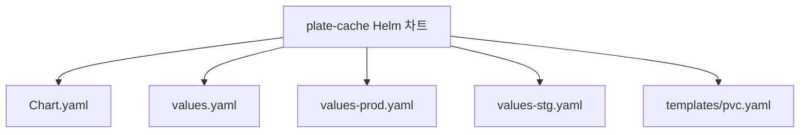
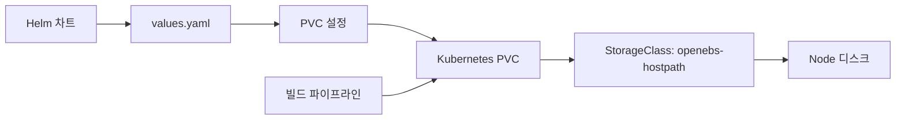
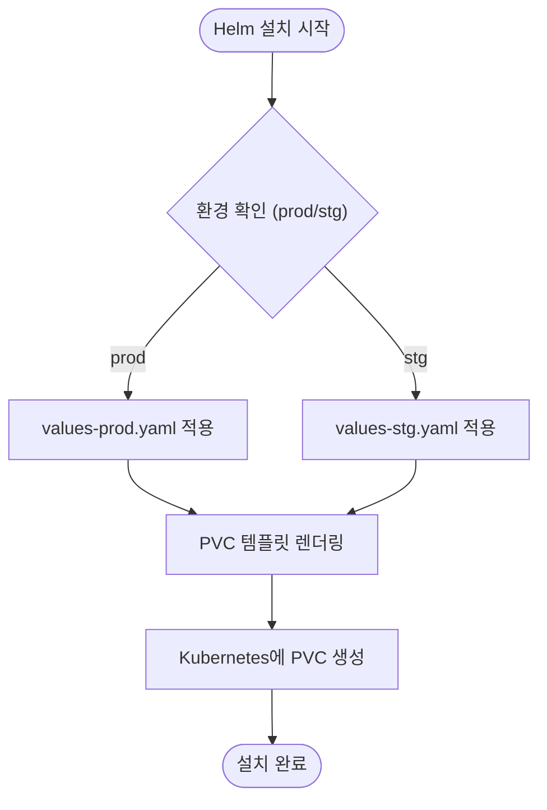
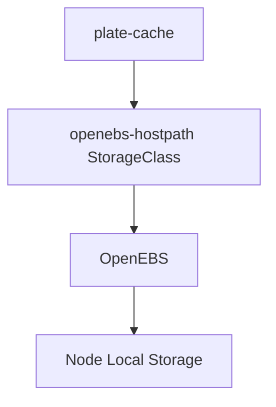

# plate-cache

<cite>
**이 문서에서 참조한 파일**
- [Chart.yaml](file://helm/applications/plate-cache/Chart.yaml)
- [values.yaml](file://helm/applications/plate-cache/values.yaml)
- [values-prod.yaml](file://helm/applications/plate-cache/values-prod.yaml)
- [values-stg.yaml](file://helm/applications/plate-cache/values-stg.yaml)
- [pvc.yaml](file://helm/applications/plate-cache/templates/pvc.yaml)
- [plate-cache-prod.yaml](file://environments/argocd/apps/plate-cache-prod.yaml)
- [plate-cache-stg.yaml](file://environments/argocd/apps/plate-cache-stg.yaml)
</cite>

## 목차
1. [소개](#소개)
2. [프로젝트 구조](#프로젝트-구조)
3. [핵심 구성 요소](#핵심-구성-요소)
4. [아키텍처 개요](#아키텍처-개요)
5. [상세 구성 요소 분석](#상세-구성-요소-분석)
6. [의존성 분석](#의존성-분석)
7. [성능 고려사항](#성능-고려사항)
8. [문제 해결 가이드](#문제-해결-가이드)
9. [결론](#결론)

## 소개

`plate-cache`는 Plate 애플리케이션의 컨테이너 빌드 캐시 및 영구 스토리지를 제공하기 위한 Helm 차트입니다. 이 서비스는 PVC(PersistentVolumeClaim)를 통해 Kubernetes 클러스터 내에서 영구 스토리지를 프로비저닝하며, 컨테이너 이미지 레지스트리 및 빌드 프로세스에서 발생하는 대용량 데이터를 안정적으로 저장합니다. 본 문서는 `plate-cache`의 구조, 설정 방법, 환경별 구성 전략, 데이터 지속성 보장 및 운영 가이드를 포함합니다.

## 프로젝트 구조

`plate-cache` Helm 차트는 `helm/applications/plate-cache/` 디렉터리에 위치하며, 다음과 같은 주요 구성 요소로 이루어져 있습니다:

- `Chart.yaml`: 차트의 메타데이터 및 설명 정보
- `values.yaml`: 기본 구성 값
- `values-prod.yaml`: 프로덕션 환경 전용 오버라이드 값
- `values-stg.yaml`: 스테이징 환경 전용 오버라이드 값
- `templates/pvc.yaml`: PVC 리소스를 생성하는 템플릿

이 구조는 환경별로 서로 다른 스토리지 요구사항을 유연하게 관리할 수 있도록 설계되었습니다.



**Diagram sources**
- [Chart.yaml](file://helm/applications/plate-cache/Chart.yaml)
- [values.yaml](file://helm/applications/plate-cache/values.yaml)
- [pvc.yaml](file://helm/applications/plate-cache/templates/pvc.yaml)

**구성 요소**
- [Chart.yaml](file://helm/applications/plate-cache/Chart.yaml#L1-L16)
- [values.yaml](file://helm/applications/plate-cache/values.yaml#L1-L14)
- [pvc.yaml](file://helm/applications/plate-cache/templates/pvc.yaml#L1-L25)

## 핵심 구성 요소

`plate-cache`의 핵심은 PVC 기반의 영구 스토리지 프로비저닝입니다. 이는 컨테이너 빌드 과정에서 생성되는 캐시 데이터를 유지하여 반복적인 다운로드 및 빌드 시간을 줄이는 데 목적을 둡니다. `values.yaml` 파일을 통해 스토리지 크기, 접근 모드, 스토리지 클래스 등을 설정할 수 있으며, Helm을 통해 Kubernetes 클러스터에 배포됩니다.

**구성 요소**
- [values.yaml](file://helm/applications/plate-cache/values.yaml#L4-L13)
- [pvc.yaml](file://helm/applications/plate-cache/templates/pvc.yaml#L1-L25)

## 아키텍처 개요

`plate-cache`는 Kubernetes의 PVC 메커니즘을 활용하여 영구 스토리지를 제공합니다. Helm 차트는 사용자가 정의한 `values.yaml` 파일의 설정에 따라 PVC를 동적으로 생성하며, 이는 지정된 스토리지 클래스와 크기를 기반으로 클러스터 내에서 프로비저닝됩니다. 생성된 PVC는 컨테이너 빌드 파이프라인에서 `/var/lib/docker` 경로에 마운트되어 캐시 데이터를 지속적으로 저장합니다.



**Diagram sources**
- [values.yaml](file://helm/applications/plate-cache/values.yaml#L4-L13)
- [pvc.yaml](file://helm/applications/plate-cache/templates/pvc.yaml#L1-L25)

## 상세 구성 요소 분석

### PVC 구성 분석

`plate-cache`의 핵심 리소스는 `PersistentVolumeClaim`입니다. 이는 `templates/pvc.yaml` 템플릿을 통해 Helm 차트 설치 시 생성되며, `.Values.pvc` 블록의 설정을 기반으로 동작합니다. PVC는 `enabled` 플래그에 따라 활성화되며, 이름, 접근 모드, 스토리지 클래스, 크기 등을 `values.yaml`에서 정의할 수 있습니다.

#### PVC 템플릿 구조

```mermaid
classDiagram
class PVC {
+metadata : ObjectMeta
+spec : PersistentVolumeClaimSpec
+status : PersistentVolumeClaimStatus
}
PVC : +name : string
PVC : +labels : map[string]string
PVC : +annotations : map[string]string
PVC : +accessModes : []string
PVC : +resources : ResourceRequirements
PVC : +storageClassName : string
```

**Diagram sources**
- [pvc.yaml](file://helm/applications/plate-cache/templates/pvc.yaml#L1-L25)

#### 환경별 설정 전략

`plate-cache`는 `values-prod.yaml`과 `values-stg.yaml`을 통해 프로덕션 및 스테이징 환경에 맞춘 스토리지 설정을 제공합니다. 예를 들어, 프로덕션 환경에서는 더 높은 성능을 제공하는 스토리지 클래스를 사용하거나, 더 큰 스토리지 용량을 할당할 수 있습니다. 반면 스테이징 환경에서는 비용 절감을 위해 보다 경제적인 스토리지 클래스를 선택할 수 있습니다.



**Diagram sources**
- [values-prod.yaml](file://helm/applications/plate-cache/values-prod.yaml)
- [values-stg.yaml](file://helm/applications/plate-cache/values-stg.yaml)
- [pvc.yaml](file://helm/applications/plate-cache/templates/pvc.yaml)

**구성 요소**
- [values-prod.yaml](file://helm/applications/plate-cache/values-prod.yaml)
- [values-stg.yaml](file://helm/applications/plate-cache/values-stg.yaml)
- [pvc.yaml](file://helm/applications/plate-cache/templates/pvc.yaml#L1-L25)

## 의존성 분석

`plate-cache`는 자체적으로 독립된 스토리지 서비스를 제공하지만, 클러스터 내에서 적절한 스토리지 프로비저너가 필요합니다. 현재 설정에서는 `openebs-hostpath` 스토리지 클래스를 사용하고 있으며, 이는 OpenEBS 프로젝트의 로컬 스토리지 프로비저너에 의존합니다. 따라서 `plate-cache`의 정상 작동을 위해서는 OpenEBS 또는 유사한 스토리지 솔루션의 사전 설치가 필요합니다.



**Diagram sources**
- [values.yaml](file://helm/applications/plate-cache/values.yaml#L7)
- [pvc.yaml](file://helm/applications/plate-cache/templates/pvc.yaml#L23)

**구성 요소**
- [values.yaml](file://helm/applications/plate-cache/values.yaml#L7)
- [pvc.yaml](file://helm/applications/plate-cache/templates/pvc.yaml#L23)

## 성능 고려사항

`plate-cache`의 성능은 주로 스토리지 백엔드의 I/O 성능에 의존합니다. `openebs-hostpath`는 노드의 로컬 디스크를 사용하므로, 빌드 노드의 디스크 성능이 직접적인 영향을 미칩니다. 프로덕션 환경에서는 고성능 SSD를 사용하는 노드에 `plate-cache` PVC가 스케줄링되도록 노드 선택기 또는 어피니티 설정을 추가하는 것이 권장됩니다. 또한, 충분한 스토리지 용량(기본 50Gi)을 확보하여 빌드 캐시가 자주 정리되지 않도록 해야 합니다.

## 문제 해결 가이드

### PVC 생성 실패

PVC가 `Pending` 상태에 머무는 경우, 다음과 같은 원인이 있을 수 있습니다:
- 스토리지 클래스(`openebs-hostpath`)가 존재하지 않거나, 프로비저너가 정상 작동하지 않음
- 노드에 충분한 디스크 공간이 없음
- PVC 요청 크기가 스토리지 클래스의 제한을 초과함

해결 방법:
1. `kubectl get storageclass`로 스토리지 클래스 존재 여부 확인
2. `kubectl describe pvc <pvc-name>`으로 이벤트 로그 확인
3. OpenEBS 구성 및 상태 점검

### 데이터 지속성 문제

빌드 노드가 변경된 후 캐시가 사라지는 경우, PVC가 해당 노드에 바인딩되어 있기 때문일 수 있습니다. 이를 방지하기 위해, 가능하면 스토리지 백엔드가 클러스터 전체에서 접근 가능한 네트워크 스토리지(예: NFS)를 사용하는 것이 좋습니다.

**구성 요소**
- [pvc.yaml](file://helm/applications/plate-cache/templates/pvc.yaml)
- [values.yaml](file://helm/applications/plate-cache/values.yaml)

## 결론

`plate-cache` Helm 차트는 Plate 애플리케이션의 빌드 효율성을 높이기 위해 필수적인 영구 스토리지 솔루션을 제공합니다. Helm을 통한 선언적 구성과 환경별 `values` 파일을 활용한 유연한 관리가 가능하며, PVC 기반의 안정적인 데이터 지속성을 보장합니다. 향후에는 Redis와 같은 고성능 캐시 시스템과의 통합을 통해 메타데이터 캐싱 등 추가적인 성능 최적화를 고려할 수 있습니다.