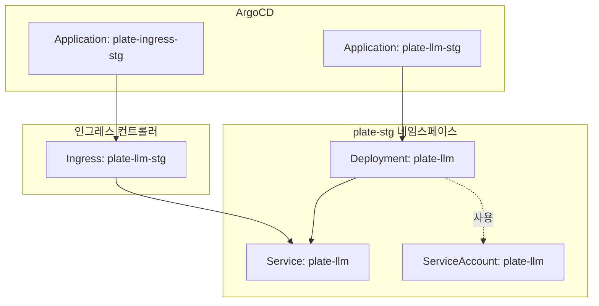
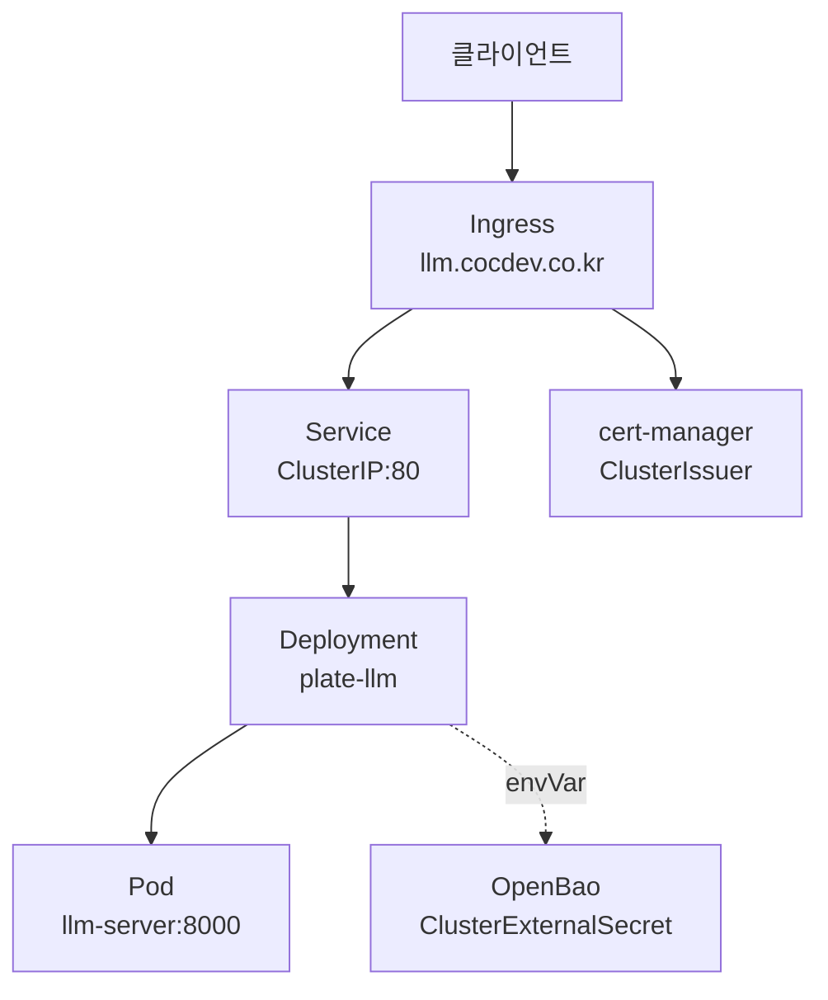
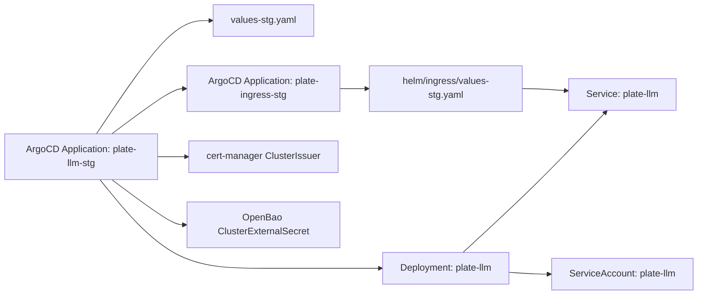

# plate-llm

<cite>
**문서에 참조된 파일들**
- [values-stg.yaml](file://helm/applications/plate-llm/values-stg.yaml)
- [deployment.yaml](file://helm/applications/plate-llm/templates/deployment.yaml)
- [service.yaml](file://helm/applications/plate-llm/templates/service.yaml)
- [serviceaccount.yaml](file://helm/applications/plate-llm/templates/serviceaccount.yaml)
- [plate-llm-stg.yaml](file://environments/argocd/apps/plate-llm-stg.yaml)
- [ingress-stg.yaml](file://environments/argocd/apps/ingress-stg.yaml)
- [values-stg.yaml](file://helm/ingress/values-stg.yaml)
- [values.yaml](file://helm/cluster-services/cert-manager/values.yaml)
- [cluster-issuer-staging.yaml](file://helm/cluster-services/cert-manager/templates/cluster-issuer-staging.yaml)
- [cluster-issuer-prod.yaml](file://helm/cluster-services/cert-manager/templates/cluster-issuer-prod.yaml)
- [values-staging.yaml](file://helm/shared-configs/openbao-secrets-manager/values-staging.yaml)
- [values.yaml](file://helm/applications/plate-llm/values.yaml)
</cite>

## 목차
1. [소개](#소개)
2. [프로젝트 구조](#프로젝트-구조)
3. [핵심 컴포넌트](#핵심-컴포넌트)
4. [아키텍처 개요](#아키텍처-개요)
5. [상세 컴포넌트 분석](#상세-컴포넌트-분석)
6. [의존성 분석](#의존성-분석)
7. [성능 고려사항](#성능-고려사항)
8. [보안 고려사항](#보안-고려사항)
9. [모니터링 설정](#모니터링-설정)
10. [배포 전략](#배포-전략)
11. [Troubleshooting 가이드](#troubleshooting-가이드)
12. [결론](#결론)

## 소개
이 문서는 plate-llm LLM 기반 서비스의 아키텍처와 배포 구성을 설명합니다. 특히 스테이징 환경에 대한 전용 배포 전략(values-stg.yaml 기반), 인그레스를 통한 외부 접근 방식, 서비스 계정을 통한 보안 구성, 리소스 요청(특히 CPU/메모리) 설정, 인그레스 룰 및 TLS 종료 구성 방법을 실제 코드 예제와 함께 설명합니다. 또한 LLM 모델 서빙 아키텍처, 요청 지연 최적화, 스케일링 전략, 보안 고려사항, 모니터링 설정을 문서화합니다.

## 프로젝트 구조
plate-llm Helm 차트는 다음과 같은 구조로 구성되어 있습니다:
- values-stg.yaml: 스테이징 환경 전용 설정(이미지, 서비스, 인그레스, 리소스, 시크릿 주입 등)
- templates/: 배포 리소스 템플릿(deployment.yaml, service.yaml, serviceaccount.yaml, ingress.yaml)
- environments/argocd/apps/: ArgoCD Application 정의(plate-llm-stg.yaml, ingress-stg.yaml)
- helm/ingress/: 공용 인그레스 차트(values-stg.yaml)를 통해 plate-llm-stg를 노출
- helm/cluster-services/cert-manager/: 인증서 발급(ClusterIssuer) 설정
- helm/shared-configs/openbao-secrets-manager/: 클러스터 레벨 시크릿 관리를 위한 OpenBao 연동(values-staging.yaml)

**다이어그램 출처**
- [plate-llm-stg.yaml](file://environments/argocd/apps/plate-llm-stg.yaml#L1-L64)
- [ingress-stg.yaml](file://environments/argocd/apps/ingress-stg.yaml#L1-L70)
- [deployment.yaml](file://helm/applications/plate-llm/templates/deployment.yaml#L1-L60)
- [service.yaml](file://helm/applications/plate-llm/templates/service.yaml#L1-L16)
- [serviceaccount.yaml](file://helm/applications/plate-llm/templates/serviceaccount.yaml#L1-L7)
- [values-stg.yaml](file://helm/ingress/values-stg.yaml#L1-L59)

**섹션 출처**
- [plate-llm-stg.yaml](file://environments/argocd/apps/plate-llm-stg.yaml#L1-L64)
- [ingress-stg.yaml](file://environments/argocd/apps/ingress-stg.yaml#L1-L70)

## 핵심 컴포넌트
- Helm 차트: plate-llm
  - values-stg.yaml: 스테이징 전용 설정(이미지, 서비스, 인그레스, 리소스, 시크릿 주입)
  - templates/deployment.yaml: LLM 서버 컨테이너 배포, 리소스 요청/제한, 시크릿 주입, 포트 노출
  - templates/service.yaml: ClusterIP Service로 Pod 노출
  - templates/serviceaccount.yaml: 서비스 계정 생성
- ArgoCD Application:
  - plate-llm-stg.yaml: plate-llm 차트를 plate-stg 네임스페이스에 배포하고, values-stg.yaml을 오버라이드
  - plate-ingress-stg.yaml: 인그레스 차트를 plate-stg 네임스페이스에 배포하고, values-stg.yaml을 오버라이드
- 인그레스 및 TLS:
  - helm/ingress/values-stg.yaml: llm.cocdev.co.kr 호스트로 plate-llm-stg 서비스 노출
  - cert-manager values 및 ClusterIssuer: ACME HTTP-01을 통한 TLS 발급
- 시크릿 관리:
  - helm/shared-configs/openbao-secrets-manager/values-staging.yaml: 클러스터 레벨 시크릿 생성/관리

**섹션 출처**
- [values-stg.yaml](file://helm/applications/plate-llm/values-stg.yaml#L1-L60)
- [deployment.yaml](file://helm/applications/plate-llm/templates/deployment.yaml#L1-L60)
- [service.yaml](file://helm/applications/plate-llm/templates/service.yaml#L1-L16)
- [serviceaccount.yaml](file://helm/applications/plate-llm/templates/serviceaccount.yaml#L1-L7)
- [plate-llm-stg.yaml](file://environments/argocd/apps/plate-llm-stg.yaml#L1-L64)
- [ingress-stg.yaml](file://environments/argocd/apps/ingress-stg.yaml#L1-L70)
- [values-stg.yaml](file://helm/ingress/values-stg.yaml#L1-L59)
- [values.yaml](file://helm/cluster-services/cert-manager/values.yaml#L1-L35)
- [cluster-issuer-staging.yaml](file://helm/cluster-services/cert-manager/templates/cluster-issuer-staging.yaml#L1-L20)
- [cluster-issuer-prod.yaml](file://helm/cluster-services/cert-manager/templates/cluster-issuer-prod.yaml#L1-L20)
- [values-staging.yaml](file://helm/shared-configs/openbao-secrets-manager/values-staging.yaml#L1-L167)

## 아키텍처 개요
plate-llm LLM 서빙 아키텍처는 다음과 같습니다:
- 외부 트래픽은 인그레스 컨트롤러를 통해 llm.cocdev.co.kr 도메인으로 들어오며, 해당 호스트에 대한 경로 "/"를 plate-llm-stg Service로 라우팅합니다.
- Service는 ClusterIP 타입이며, Deployment에 의해 실행 중인 LLM 서버 Pod로 트래픽을 전달합니다.
- 인증서는 cert-manager(ClusterIssuer)를 통해 ACME HTTP-01 검증을 통해 발급됩니다.
- 시크릿은 OpenBao를 통해 클러스터 레벨 시크릿으로 관리되며, LLM 서버에 환경 변수로 주입됩니다.

**다이어그램 출처**
- [values-stg.yaml](file://helm/ingress/values-stg.yaml#L1-L59)
- [service.yaml](file://helm/applications/plate-llm/templates/service.yaml#L1-L16)
- [deployment.yaml](file://helm/applications/plate-llm/templates/deployment.yaml#L1-L60)
- [values.yaml](file://helm/cluster-services/cert-manager/values.yaml#L1-L35)
- [values-staging.yaml](file://helm/shared-configs/openbao-secrets-manager/values-staging.yaml#L1-L167)

## 상세 컴포넌트 분석

### 1) 스테이징 전용 배포 전략 (values-stg.yaml)
- 이미지: Harbor 레지스트리에서 latest 태그를 사용하며, 스테이징에서는 항상 풀하도록 설정되어 있어 최신 빌드를 즉시 반영합니다.
- 서비스: ClusterIP 타입, 포트 80으로 노출되며, 컨테이너 포트는 8000입니다.
- 인그레스: nginx 클래스를 사용하고, cert-manager를 통한 TLS 종료를 수행하며, 호스트는 llm.cocdev.co.kr입니다.
- 리소스: CPU 500m~1000m, 메모리 1Gi~2Gi로 요청/제한이 설정되어 있습니다.
- 시크릿 주입: cluster-env-secrets라는 클러스터 레벨 시크릿에서 여러 환경변수를 주입합니다.

**섹션 출처**
- [values-stg.yaml](file://helm/applications/plate-llm/values-stg.yaml#L1-L60)

### 2) Deployment 구성 (templates/deployment.yaml)
- 서비스 계정: plate-llm ServiceAccount를 사용합니다.
- 컨테이너: llm-server 이름으로 8000 포트를 노출하고, 포트 매핑은 8000으로 지정됩니다.
- 시크릿 주입: appSecrets.enabled가 true일 경우, 지정된 시크릿에서 환경변수를 valueFrom.secretKeyRef로 주입합니다.
- 리소스: values-stg.yaml에 정의된 resources를 그대로 사용합니다.

**섹션 출처**
- [deployment.yaml](file://helm/applications/plate-llm/templates/deployment.yaml#L1-L60)
- [values-stg.yaml](file://helm/applications/plate-llm/values-stg.yaml#L1-L60)

### 3) Service 구성 (templates/service.yaml)
- 타입: ClusterIP
- 포트: 80 → targetPort 8000으로 연결
- 선택자: Deployment의 selectorLabels를 사용하여 Pod와 연동

**섹션 출처**
- [service.yaml](file://helm/applications/plate-llm/templates/service.yaml#L1-L16)

### 4) ServiceAccount 구성 (templates/serviceaccount.yaml)
- 단순히 ServiceAccount 리소스를 생성하며, 권한 부여는 RBAC 또는 PodSecurityContext 등을 통해 추가적으로 구성해야 합니다.

**섹션 출처**
- [serviceaccount.yaml](file://helm/applications/plate-llm/templates/serviceaccount.yaml#L1-L7)

### 5) 인그레스 구성 (helm/ingress/values-stg.yaml)
- 호스트: llm.cocdev.co.kr
- 경로: "/" 전체 경로를 plate-llm-stg Service(포트 80)로 라우팅
- TLS: SAN 인증서를 사용하여 stg.cocdev.co.kr과 llm.cocdev.co.kr 모두 지원

**섹션 출처**
- [values-stg.yaml](file://helm/ingress/values-stg.yaml#L1-L59)

### 6) ArgoCD Application (plate-llm-stg.yaml)
- 프로젝트: default
- 소스: helm/applications/plate-llm 차트, values-stg.yaml 오버라이드
- 배포 대상: plate-stg 네임스페이스
- 동기화: 자동화, prune, selfHeal, retry 정책 설정

**섹션 출처**
- [plate-llm-stg.yaml](file://environments/argocd/apps/plate-llm-stg.yaml#L1-L64)

### 7) 인그레스 Application (plate-ingress-stg.yaml)
- 프로젝트: default
- 소스: helm/ingress 차트, values-stg.yaml 오버라이드
- 배포 대상: plate-stg 네임스페이스
- 동기화: 자동화, prune, selfHeal, retry 정책 설정

**섹션 출처**
- [ingress-stg.yaml](file://environments/argocd/apps/ingress-stg.yaml#L1-L70)

### 8) 인증서(ClusterIssuer) 구성
- cert-manager values: production/staging ClusterIssuer를 활성화하고, HTTP-01 검증을 위한 ingress.class를 nginx로 설정합니다.
- ClusterIssuer 템플릿: production/staging 별로 ClusterIssuer 리소스를 생성합니다.

**섹션 출처**
- [values.yaml](file://helm/cluster-services/cert-manager/values.yaml#L1-L35)
- [cluster-issuer-staging.yaml](file://helm/cluster-services/cert-manager/templates/cluster-issuer-staging.yaml#L1-L20)
- [cluster-issuer-prod.yaml](file://helm/cluster-services/cert-manager/templates/cluster-issuer-prod.yaml#L1-L20)

### 9) 시크릿 관리 (OpenBao)
- 클러스터 레벨 시크릿 관리: openbao-secrets-manager를 통한 ClusterExternalSecret을 통해 cluster-env-secrets를 생성합니다.
- plate-llm Deployment는 appSecrets.enabled를 통해 해당 시크릿의 키들을 환경변수로 주입받습니다.

**섹션 출처**
- [values-staging.yaml](file://helm/shared-configs/openbao-secrets-manager/values-staging.yaml#L1-L167)
- [deployment.yaml](file://helm/applications/plate-llm/templates/deployment.yaml#L1-L60)

## 의존성 분석
plate-llm 배포에 대한 주요 의존성은 다음과 같습니다:

**다이어그램 출처**
- [plate-llm-stg.yaml](file://environments/argocd/apps/plate-llm-stg.yaml#L1-L64)
- [values-stg.yaml](file://helm/applications/plate-llm/values-stg.yaml#L1-L60)
- [deployment.yaml](file://helm/applications/plate-llm/templates/deployment.yaml#L1-L60)
- [service.yaml](file://helm/applications/plate-llm/templates/service.yaml#L1-L16)
- [serviceaccount.yaml](file://helm/applications/plate-llm/templates/serviceaccount.yaml#L1-L7)
- [ingress-stg.yaml](file://environments/argocd/apps/ingress-stg.yaml#L1-L70)
- [values-stg.yaml](file://helm/ingress/values-stg.yaml#L1-L59)
- [values.yaml](file://helm/cluster-services/cert-manager/values.yaml#L1-L35)
- [values-staging.yaml](file://helm/shared-configs/openbao-secrets-manager/values-staging.yaml#L1-L167)

**섹션 출처**
- [plate-llm-stg.yaml](file://environments/argocd/apps/plate-llm-stg.yaml#L1-L64)
- [ingress-stg.yaml](file://environments/argocd/apps/ingress-stg.yaml#L1-L70)

## 성능 고려사항
- 리소스 요청/제한:
  - CPU: 500m~1000m, 메모리: 1Gi~2Gi로 설정되어 있어 LLM 모델 서빙에 필요한 컴퓨팅 자원 확보가 목적입니다.
  - 병목 발생 시 CPU/메모리 제한을 조정하거나 Pod 수를 늘리는 것을 고려합니다.
- 스케일링 전략:
  - replicaCount를 1 이상으로 조정하여 수평 확장을 통해 동시 요청 대응력을 높일 수 있습니다.
  - HPA(Horizontal Pod Autoscaler)를 활용하여 CPU/메모리 사용률 또는 커스텀 메트릭 기반으로 자동 확장할 수 있습니다.
- 요청 지연 최적화:
  - 캐싱 전략(예: 프롬프트/응답 캐시) 도입
  - 연결 풀링, keep-alive 설정
  - 인그레스 측 TLS 종료 및 HTTP/2 활성화
  - Pod 배치 최적화(노드 풀/affinity/pdb)를 통한 안정성 확보

[이 섹션은 일반적인 성능 팁을 제공하므로 특정 파일 분석 없음]

## 보안 고려사항
- 인증서 및 TLS:
  - cert-manager를 통한 ACME HTTP-01 검증을 통해 TLS 종료를 수행하고, ClusterIssuer를 사용하여 Let’s Encrypt를 활용합니다.
  - 인그레스에 ssl-redirect=false 설정이 있으나, 스테이징 환경에서는 테스트 편의를 위해 HTTP 허용이 허용됩니다. 운영 환경에서는 HTTPS 강제를 권장합니다.
- 시크릿 관리:
  - OpenBao를 통한 클러스터 레벨 시크릿 관리로 민감 정보를 안전하게 노출하지 않도록 구성합니다.
  - Deployment는 ServiceAccount를 사용하고, RBAC/PSA(PodSecurityAdmission)를 통해 최소 권한 원칙을 적용하는 것이 좋습니다.
- 네트워크 정책:
  - Ingress 외부 노출을 제한하고, Pod 간 통신은 NetworkPolicy를 통해 제어합니다.

**섹션 출처**
- [values.yaml](file://helm/cluster-services/cert-manager/values.yaml#L1-L35)
- [values-stg.yaml](file://helm/ingress/values-stg.yaml#L1-L59)
- [values-staging.yaml](file://helm/shared-configs/openbao-secrets-manager/values-staging.yaml#L1-L167)
- [deployment.yaml](file://helm/applications/plate-llm/templates/deployment.yaml#L1-L60)

## 모니터링 설정
- Prometheus/Grafana 연동:
  - Prometheus Operator 또는 kube-prometheus-stack을 통해 Pod/Service/Ingress 메트릭 수집이 가능합니다.
  - LLM 서버 자체에 대한 메트릭(예: latency, throughput, error rate)을 노출하고, 이를 Prometheus가 수집하도록 설정합니다.
- 로깅:
  - Fluentd/Vector/Promtail 등을 통해 로그를 수집하고, Grafana 대시보드를 통해 집계합니다.
- 알림:
  - AlertManager를 통한 경고 정책 설정(예: 95퍼센실 지연 초과, 에러율 증가, CPU/메모리 제한 초과 등)

[이 섹션은 일반적인 모니터링 팁을 제공하므로 특정 파일 분석 없음]

## 배포 전략
- 스테이징 전용 배포:
  - plate-llm-stg.yaml은 values-stg.yaml을 오버라이드하여 plate-stg 네임스페이스에 배포합니다.
  - ArgoCD는 자동 동기화, prune, selfHeal, retry 정책을 적용하여 Git 변경 사항을 자동 반영합니다.
- 인그레스 노출:
  - plate-ingress-stg.yaml은 helm/ingress 차트를 통해 인그레스를 배포하고, llm.cocdev.co.kr 호스트를 plate-llm-stg Service로 라우팅합니다.
- 시크릿 주입:
  - openbao-secrets-manager를 통해 cluster-env-secrets를 생성하고, plate-llm Deployment는 appSecrets.enabled를 통해 해당 시크릿을 환경변수로 주입합니다.

**섹션 출처**
- [plate-llm-stg.yaml](file://environments/argocd/apps/plate-llm-stg.yaml#L1-L64)
- [ingress-stg.yaml](file://environments/argocd/apps/ingress-stg.yaml#L1-L70)
- [values-stg.yaml](file://helm/ingress/values-stg.yaml#L1-L59)
- [values-staging.yaml](file://helm/shared-configs/openbao-secrets-manager/values-staging.yaml#L1-L167)

## Troubleshooting 가이드
- 인증서 발급 실패:
  - ACME HTTP-01 검증이 실패하면 인그레스에 http01-edit-in-place 설정이 필요합니다. cert-manager ClusterIssuer가 올바르게 생성되었는지 확인하세요.
- TLS 종료 문제:
  - 인그레스에 ssl-redirect=false가 설정되어 있을 경우 HTTPS 강제가 되지 않으므로, 운영 환경에서는 HTTPS 강제를 권장합니다.
- 시크릿 주입 실패:
  - appSecrets.enabled가 true이고, secretName이 cluster-env-secrets인지 확인하세요. OpenBao ClusterExternalSecret이 정상적으로 시크릿을 생성했는지도 확인합니다.
- 리소스 부족:
  - CPU/메모리 제한이 너무 낮으면 OOMKilled 또는 CPU throttling이 발생할 수 있습니다. values-stg.yaml의 resources를 조정하세요.
- 인그레스 라우팅 불일치:
  - helm/ingress/values-stg.yaml의 hosts/paths 설정이 맞는지 확인하고, Service 이름과 포트가 일치하는지 검토하세요.

**섹션 출처**
- [values-stg.yaml](file://helm/cluster-services/cert-manager/values.yaml#L1-L35)
- [values-stg.yaml](file://helm/ingress/values-stg.yaml#L1-L59)
- [values-stg.yaml](file://helm/applications/plate-llm/values-stg.yaml#L1-L60)
- [deployment.yaml](file://helm/applications/plate-llm/templates/deployment.yaml#L1-L60)
- [values-staging.yaml](file://helm/shared-configs/openbao-secrets-manager/values-staging.yaml#L1-L167)

## 결론
plate-llm LLM 기반 서비스는 스테이징 환경에 적합한 배포 전략을 통해 안정적으로 운영됩니다. 인그레스를 통한 외부 접근, cert-manager를 통한 TLS 종료, OpenBao를 통한 시크릿 관리, 그리고 values-stg.yaml 기반 리소스 설정이 잘 통합되어 있습니다. 운영 환경에서는 HTTPS 강제, HPA 자동 확장, 메트릭/로깅/알림 시스템을 추가하여 안정성과 성능을 더욱 강화할 수 있습니다.