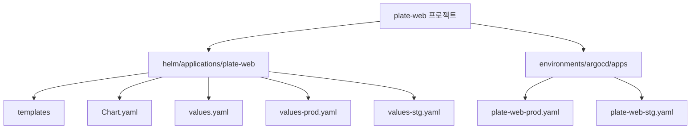
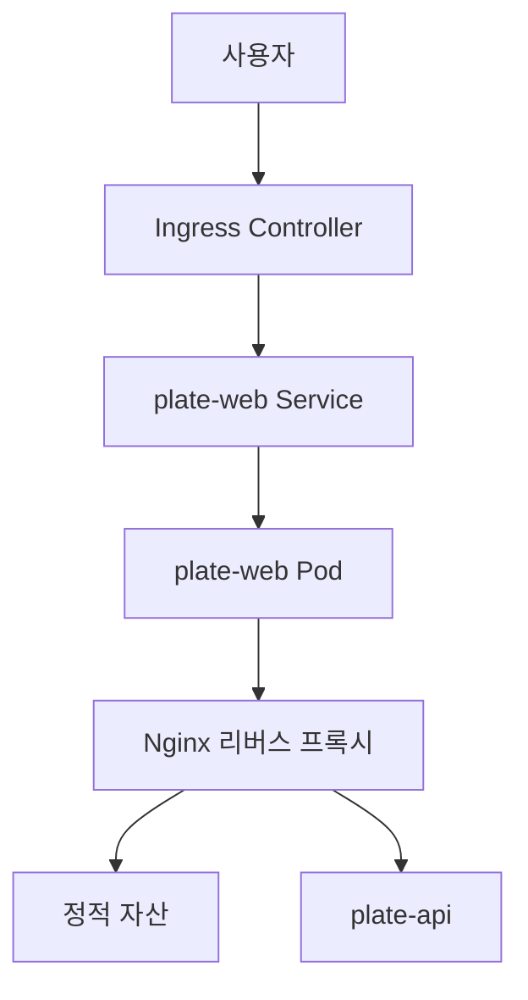
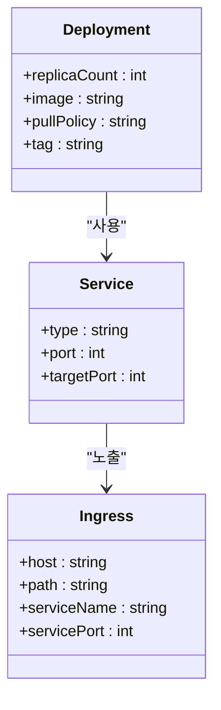
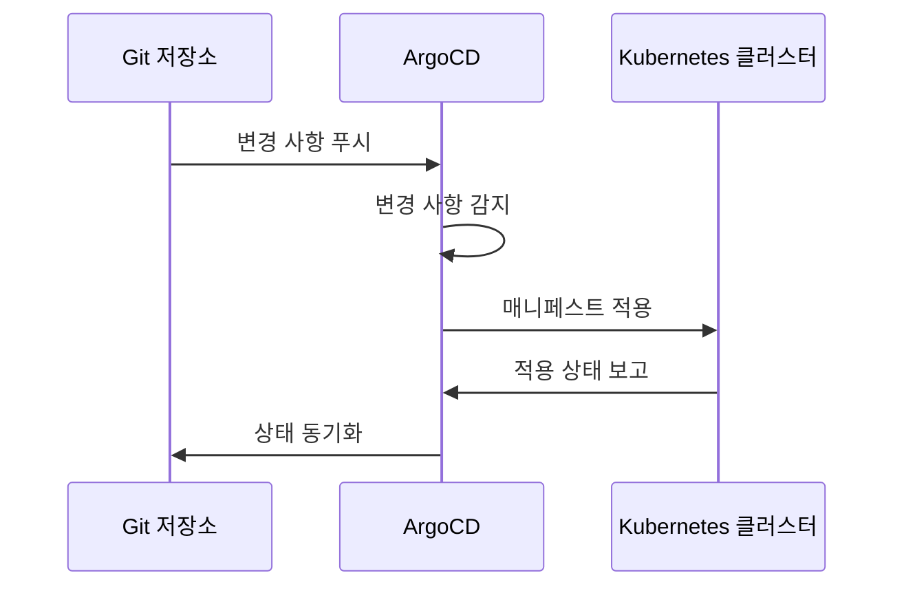
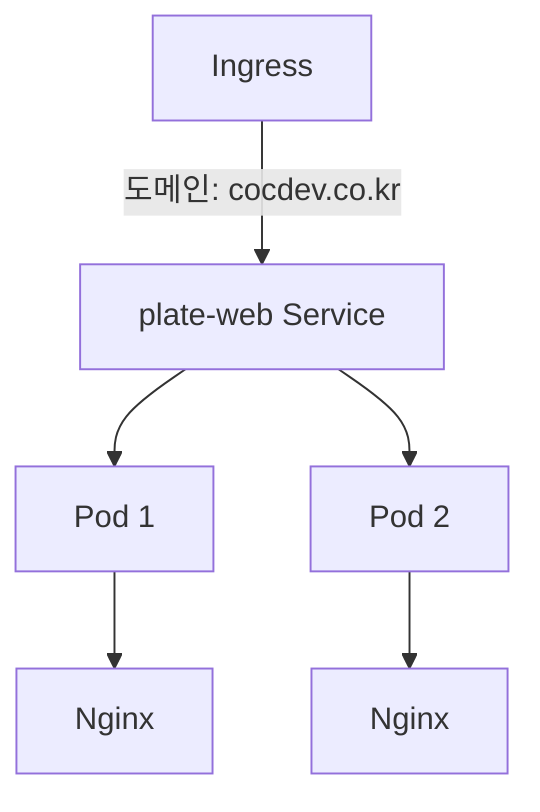

# plate-web

<cite>
**이 문서에서 참조한 파일**
- [plate-web-prod.yaml](file://environments/argocd/apps/plate-web-prod.yaml)
- [plate-web-stg.yaml](file://environments/argocd/apps/plate-web-stg.yaml)
- [Chart.yaml](file://helm/applications/plate-web/Chart.yaml)
- [values.yaml](file://helm/applications/plate-web/values.yaml)
- [values-prod.yaml](file://helm/applications/plate-web/values-prod.yaml)
- [values-stg.yaml](file://helm/applications/plate-web/values-stg.yaml)
- [deployment.yaml](file://helm/applications/plate-web/templates/deployment.yaml)
- [service.yaml](file://helm/applications/plate-web/templates/service.yaml)
- [serviceaccount.yaml](file://helm/applications/plate-web/templates/serviceaccount.yaml)
- [ingress-stg.yaml](file://environments/argocd/apps/ingress-stg.yaml)
- [ingress-prod.yaml](file://environments/argocd/apps/ingress-prod.yaml)
- [values.yaml](file://helm/ingress/values.yaml)
</cite>

## 목차
1. [소개](#소개)
2. [프로젝트 구조](#프로젝트-구조)
3. [핵심 구성 요소](#핵심-구성-요소)
4. [아키텍처 개요](#아키텍처-개요)
5. [상세 구성 요소 분석](#상세-구성-요소-분석)
6. [배포 구조 및 ArgoCD 설정](#배포-구조-및-argocd-설정)
7. [환경별 설정 오버라이드 전략](#환경별-설정-오버라이드-전략)
8. [서비스 및 포트 노출 방식](#서비스-및-포트-노출-방식)
9. [ConfigMap을 통한 환경 변수 주입](#configmap을-통한-환경-변수-주입)
10. [CORS 설정](#cors-설정)
11. [정적 리소스 캐싱 전략](#정적-리소스-캐싱-전략)
12. [통합 테스트 방법](#통합-테스트-방법)
13. [일반적인 배포 이슈 해결 방법](#일반적인-배포-이슈-해결-방법)
14. [결론](#결론)

## 소개
plate-web은 Plate 애플리케이션의 프론트엔드 웹 서비스로, Nginx 리버스 프록시를 기반으로 구축된 정적 웹 자산 제공 서비스입니다. 이 문서는 plate-web의 구조, plate-api와의 통신 방식, Helm 차트 기반의 배포 구조, 디플로이먼트 구성, 서비스 타입 및 포트 노출 방식, 환경별 설정 오버라이드 전략, ConfigMap을 통한 환경 변수 주입, CORS 설정, 정적 리소스 캐싱 전략, 사용자 인터페이스와의 통합 테스트 방법 및 일반적인 배포 이슈 해결 방법에 대해 설명합니다.

## 프로젝트 구조
plate-web 프로젝트는 Helm 차트 기반으로 구성되어 있으며, 다음과 같은 디렉터리 구조를 가지고 있습니다:
- `helm/applications/plate-web/`: plate-web의 Helm 차트 디렉터리
  - `templates/`: Kubernetes 매니페스트 템플릿 파일들
  - `Chart.yaml`: 차트의 메타데이터
  - `values.yaml`: 기본 설정 값
  - `values-prod.yaml`: 프로덕션 환경용 설정 값
  - `values-stg.yaml`: 스테이징 환경용 설정 값
- `environments/argocd/apps/`: ArgoCD 애플리케이션 정의 파일들
  - `plate-web-prod.yaml`: 프로덕션 환경용 ArgoCD 애플리케이션
  - `plate-web-stg.yaml`: 스테이징 환경용 ArgoCD 애플리케이션

**도면 출처**
- [Chart.yaml](file://helm/applications/plate-web/Chart.yaml)
- [values.yaml](file://helm/applications/plate-web/values.yaml)

**섹션 출처**
- [Chart.yaml](file://helm/applications/plate-web/Chart.yaml)
- [values.yaml](file://helm/applications/plate-web/values.yaml)

## 핵심 구성 요소
plate-web의 핵심 구성 요소는 다음과 같습니다:
- **Nginx 리버스 프록시**: 정적 웹 자산을 제공하고, plate-api와의 통신을 프록시합니다.
- **Helm 차트**: 배포를 위한 템플릿과 설정 값을 제공합니다.
- **ArgoCD 애플리케이션**: GitOps 기반의 자동 배포를 관리합니다.

**섹션 출처**
- [Chart.yaml](file://helm/applications/plate-web/Chart.yaml)
- [values.yaml](file://helm/applications/plate-web/values.yaml)
- [deployment.yaml](file://helm/applications/plate-web/templates/deployment.yaml)

## 아키텍처 개요
plate-web은 Kubernetes 클러스터 내에서 Nginx 컨테이너를 실행하여 정적 웹 자산을 제공하고, plate-api와의 통신을 프록시합니다. Ingress 컨트롤러를 통해 외부에서 접근할 수 있으며, ArgoCD를 통해 GitOps 기반의 자동 배포가 이루어집니다.

**도면 출처**
- [deployment.yaml](file://helm/applications/plate-web/templates/deployment.yaml)
- [service.yaml](file://helm/applications/plate-web/templates/service.yaml)
- [ingress-prod.yaml](file://environments/argocd/apps/ingress-prod.yaml)

## 상세 구성 요소 분석

### Nginx 리버스 프록시 분석
plate-web은 Nginx 컨테이너를 사용하여 정적 웹 자산을 제공하고, plate-api와의 통신을 프록시합니다. 디플로이먼트는 `replicaCount` 값을 통해 Pod의 복제 수를 설정하며, `image` 값을 통해 Nginx 이미지의 저장소와 태그를 지정합니다.

**도면 출처**
- [deployment.yaml](file://helm/applications/plate-web/templates/deployment.yaml)
- [service.yaml](file://helm/applications/plate-web/templates/service.yaml)

**섹션 출처**
- [deployment.yaml](file://helm/applications/plate-web/templates/deployment.yaml)
- [service.yaml](file://helm/applications/plate-web/templates/service.yaml)

## 배포 구조 및 ArgoCD 설정
plate-web은 Helm 차트를 사용하여 배포되며, ArgoCD를 통해 GitOps 기반의 자동 배포가 이루어집니다. ArgoCD 애플리케이션은 Git 저장소의 특정 경로를 추적하고, 변경 사항이 있을 경우 자동으로 클러스터에 적용합니다.

**도면 출처**
- [plate-web-prod.yaml](file://environments/argocd/apps/plate-web-prod.yaml)
- [plate-web-stg.yaml](file://environments/argocd/apps/plate-web-stg.yaml)

**섹션 출처**
- [plate-web-prod.yaml](file://environments/argocd/apps/plate-web-prod.yaml)
- [plate-web-stg.yaml](file://environments/argocd/apps/plate-web-stg.yaml)

## 환경별 설정 오버라이드 전략
plate-web은 `values.yaml` 파일을 기본 설정으로 사용하며, `values-prod.yaml`과 `values-stg.yaml` 파일을 통해 프로덕션 및 스테이징 환경의 설정을 오버라이드합니다. 예를 들어, 프로덕션 환경에서는 Nginx 이미지의 태그를 고정된 버전으로 설정하고, 스테이징 환경에서는 `latest` 태그를 사용하여 최신 빌드를 항상 가져오도록 설정합니다.

**섹션 출처**
- [values.yaml](file://helm/applications/plate-web/values.yaml)
- [values-prod.yaml](file://helm/applications/plate-web/values-prod.yaml)
- [values-stg.yaml](file://helm/applications/plate-web/values-stg.yaml)

## 서비스 및 포트 노출 방식
plate-web의 서비스는 `ClusterIP` 타입으로 설정되어 있으며, 외부 노출은 Ingress를 통해 이루어집니다. 서비스는 포트 80을 클러스터 내부에서 노출하며, Ingress는 이 서비스를 외부 도메인과 연결합니다.

**도면 출처**
- [service.yaml](file://helm/applications/plate-web/templates/service.yaml)
- [ingress-prod.yaml](file://environments/argocd/apps/ingress-prod.yaml)

**섹션 출처**
- [service.yaml](file://helm/applications/plate-web/templates/service.yaml)
- [ingress-prod.yaml](file://environments/argocd/apps/ingress-prod.yaml)

## ConfigMap을 통한 환경 변수 주입
plate-web은 ConfigMap을 사용하여 환경 변수를 주입하지 않으며, 대신 Helm 차트의 `values.yaml` 파일을 통해 설정 값을 관리합니다. 이는 정적 웹 자산 제공 서비스의 특성상 환경 변수보다는 설정 파일 기반의 구성이 더 적합하기 때문입니다.

**섹션 출처**
- [values.yaml](file://helm/applications/plate-web/values.yaml)

## CORS 설정
plate-web은 정적 웹 자산을 제공하는 역할만 수행하므로, 직접적인 CORS 설정은 필요하지 않습니다. 대신, plate-api에서 CORS를 활성화하여 프론트엔드 도메인에서의 요청을 허용하도록 설정합니다. 이는 `openbao`를 통해 관리되는 환경 변수 `CORS_ENABLED=true`에 의해 제어됩니다.

**섹션 출처**
- [create-secrets.sh](file://scripts/openbao/create-secrets.sh#L85)

## 정적 리소스 캐싱 전략
plate-web은 Nginx를 통해 정적 리소스의 캐싱을 관리합니다. Nginx 설정에서 `expires` 지시어를 사용하여 다양한 파일 유형에 대해 캐시 만료 시간을 설정할 수 있습니다. 예를 들어, 이미지와 자바스크립트 파일은 긴 캐시 시간을, HTML 파일은 짧은 캐시 시간을 가지도록 설정할 수 있습니다.

**섹션 출처**
- [deployment.yaml](file://helm/applications/plate-web/templates/deployment.yaml)

## 통합 테스트 방법
plate-web의 통합 테스트는 주로 정적 자산의 정상 제공 여부와 plate-api와의 통신이 원활한지 확인하는 데 중점을 둡니다. 이를 위해, 로컬 환경에서 Nginx를 실행하고, 실제 프로덕션과 동일한 설정을 적용한 후, 브라우저나 `curl` 명령어를 사용하여 다양한 엔드포인트에 접근하여 응답을 확인합니다.

**섹션 출처**
- [deployment.yaml](file://helm/applications/plate-web/templates/deployment.yaml)
- [service.yaml](file://helm/applications/plate-web/templates/service.yaml)

## 일반적인 배포 이슈 해결 방법
plate-web 배포 시 발생할 수 있는 일반적인 이슈와 그 해결 방법은 다음과 같습니다:
- **이미지 풀 실패**: `imagePullSecrets`를 통해 Harbor 레지스트리 인증 정보를 제공하여 해결합니다.
- **리소스 부족**: `resources` 설정을 통해 CPU와 메모리 요청 및 제한 값을 적절히 조정합니다.
- **Ingress 설정 오류**: Ingress 리소스의 호스트와 경로 설정이 올바른지 확인하고, TLS 설정이 정상인지 검사합니다.

**섹션 출처**
- [values.yaml](file://helm/applications/plate-web/values.yaml)
- [deployment.yaml](file://helm/applications/plate-web/templates/deployment.yaml)
- [ingress-prod.yaml](file://environments/argocd/apps/ingress-prod.yaml)

## 결론
plate-web은 Helm 차트와 ArgoCD를 활용하여 GitOps 기반의 자동 배포가 가능한 프론트엔드 웹 서비스입니다. Nginx 리버스 프록시를 통해 정적 자산을 제공하고, plate-api와의 통신을 프록시하며, 환경별 설정 오버라이드 전략을 통해 유연한 구성이 가능합니다. 이 문서를 통해 plate-web의 구조와 배포 방식을 이해하고, 효과적으로 운영할 수 있기를 바랍니다.