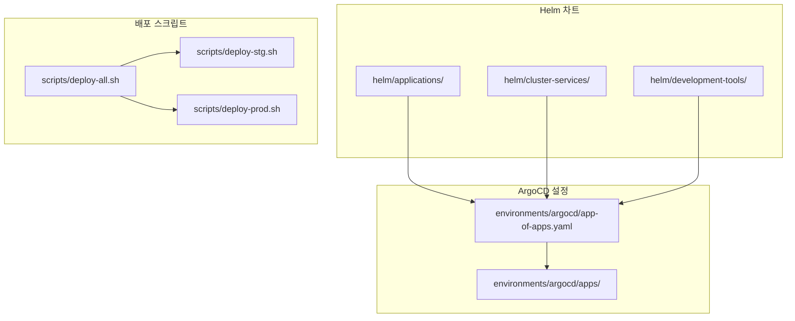
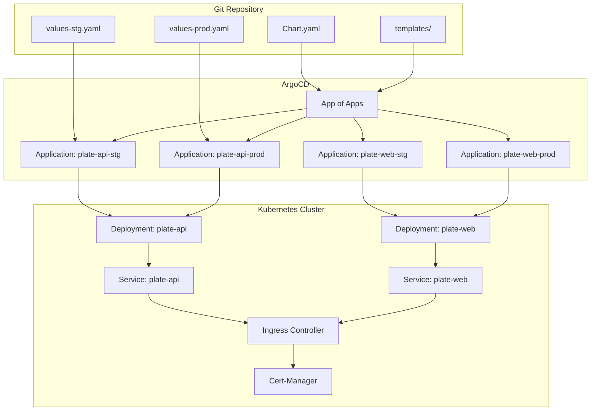
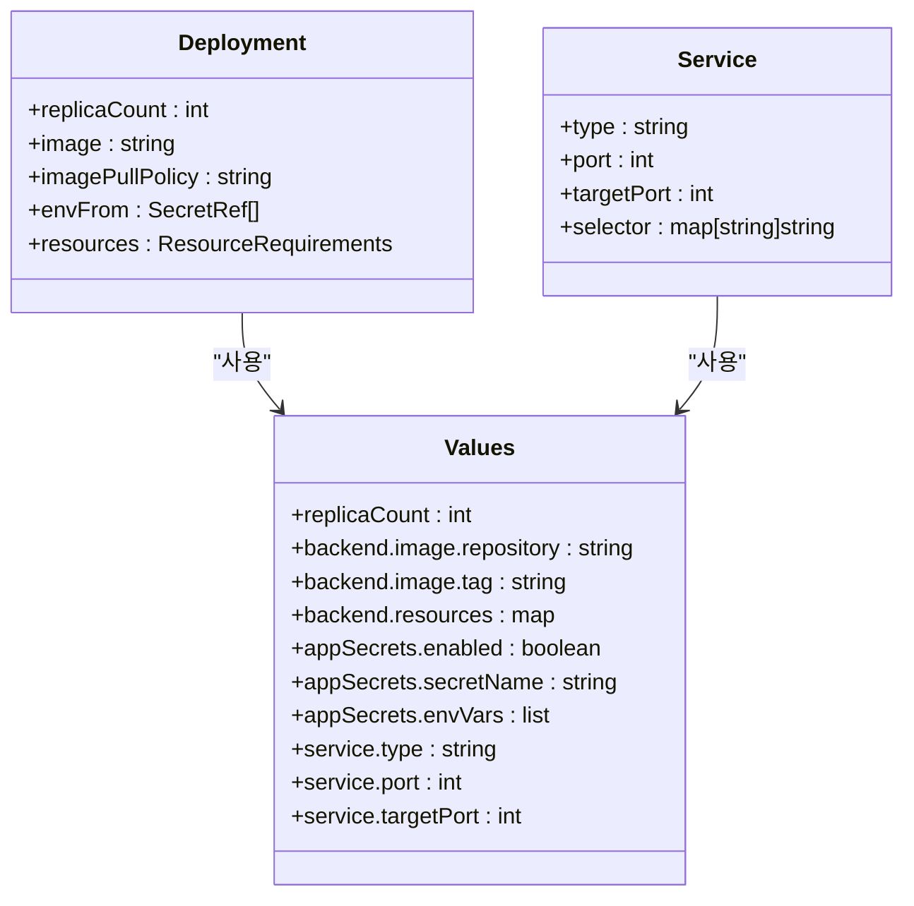
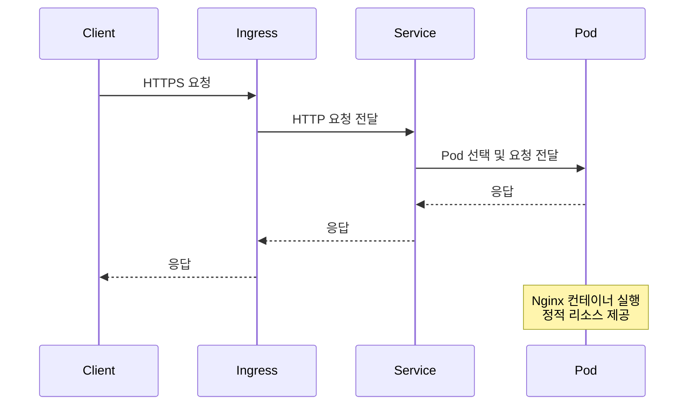
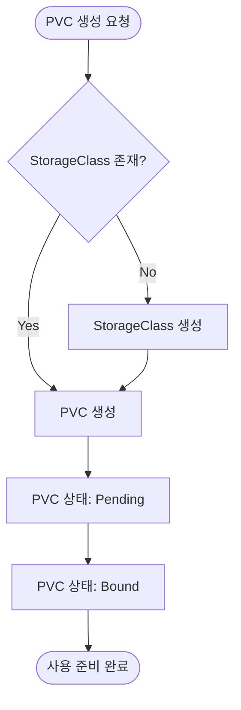
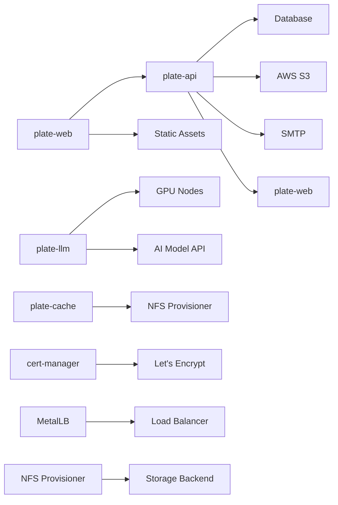

# 애플리케이션

<cite>
**이 문서에서 참조한 파일**  
- [plate-api/Chart.yaml](file://helm/applications/plate-api/Chart.yaml)
- [plate-api/values.yaml](file://helm/applications/plate-api/values.yaml)
- [plate-api/values-stg.yaml](file://helm/applications/plate-api/values-stg.yaml)
- [plate-api/values-prod.yaml](file://helm/applications/plate-api/values-prod.yaml)
- [plate-api/templates/deployment.yaml](file://helm/applications/plate-api/templates/deployment.yaml)
- [plate-api/templates/service.yaml](file://helm/applications/plate-api/templates/service.yaml)
- [plate-web/Chart.yaml](file://helm/applications/plate-web/Chart.yaml)
- [plate-web/values.yaml](file://helm/applications/plate-web/values.yaml)
- [plate-web/values-stg.yaml](file://helm/applications/plate-web/values-stg.yaml)
- [plate-web/values-prod.yaml](file://helm/applications/plate-web/values-prod.yaml)
- [plate-web/templates/deployment.yaml](file://helm/applications/plate-web/templates/deployment.yaml)
- [plate-web/templates/service.yaml](file://helm/applications/plate-web/templates/service.yaml)
- [plate-llm/Chart.yaml](file://helm/applications/plate-llm/Chart.yaml)
- [plate-llm/values.yaml](file://helm/applications/plate-llm/values.yaml)
- [plate-llm/values-stg.yaml](file://helm/applications/plate-llm/values-stg.yaml)
- [plate-cache/Chart.yaml](file://helm/applications/plate-cache/Chart.yaml)
- [plate-cache/values.yaml](file://helm/applications/plate-cache/values.yaml)
</cite>

## 목차
1. [소개](#소개)
2. [프로젝트 구조](#프로젝트-구조)
3. [핵심 구성 요소](#핵심-구성-요소)
4. [아키텍처 개요](#아키텍처-개요)
5. [상세 구성 요소 분석](#상세-구성-요소-분석)
6. [의존성 분석](#의존성-분석)
7. [성능 고려사항](#성능-고려사항)
8. [문제 해결 가이드](#문제-해결-가이드)
9. [결론](#결론)

## 소개
이 문서는 plate-api, plate-web, plate-llm, plate-cache 네 가지 핵심 애플리케이션 서비스의 구조와 기능을 설명합니다. 각 서비스는 Helm 차트를 통해 Kubernetes에 배포되며, ArgoCD 기반의 GitOps 전략으로 환경별로 관리됩니다. plate-api는 RESTful 백엔드 API 서버이며, plate-web은 정적 리소스를 제공하는 프론트엔드 웹 애플리케이션입니다. plate-llm은 LLM 기반 서비스로 인그레스를 통해 외부에 노출되며, plate-cache는 Redis와 같은 캐시 서비스를 위한 PVC 기반 스토리지 프로비저닝을 담당합니다. 이 문서는 각 애플리케이션의 Helm 차트 구조, 디플로이먼트 구성, 서비스 노출 방식 및 환경별 설정 전략을 분석합니다.

## 프로젝트 구조

이 프로젝트는 Helm과 ArgoCD를 기반으로 한 GitOps 아키텍처를 따르며, 다음과 같은 계층 구조를 가집니다:

- **helm/**: 모든 Helm 차트가 포함된 디렉터리
  - **applications/**: 비즈니스 로직을 수행하는 애플리케이션들 (plate-api, plate-web, plate-llm, plate-cache)
  - **cluster-services/**: 클러스터 레벨 인프라 서비스 (cert-manager, MetalLB, NFS 프로비저너)
  - **development-tools/**: 개발 및 운영 도구 (ArgoCD, Harbor, Grafana, Prometheus 등)
- **environments/argocd/**: ArgoCD Application 리소스 정의
  - **app-of-apps.yaml**: 최상위 애플리케이션
  - **apps/**: 각 서비스별 ArgoCD Application 정의 (환경별 분리)
- **scripts/**: 배포 자동화 스크립트 (deploy-all.sh, deploy-stg.sh, deploy-prod.sh 등)



**Diagram sources**
- [helm/applications/plate-api/Chart.yaml](file://helm/applications/plate-api/Chart.yaml)
- [environments/argocd/app-of-apps.yaml](file://environments/argocd/app-of-apps.yaml)
- [scripts/deploy-all.sh](file://scripts/deploy-all.sh)

**Section sources**
- [README.md](file://README.md#L1-L461)

## 핵심 구성 요소

plate-api, plate-web, plate-llm, plate-cache는 비즈니스 로직을 수행하는 핵심 애플리케이션입니다. 각 서비스는 독립적인 Helm 차트로 관리되며, values.yaml 파일을 통해 환경별 설정을 오버라이드합니다. plate-api와 plate-web은 values-stg.yaml과 values-prod.yaml을 통해 스테이징과 프로덕션 환경을 구분하며, plate-cache는 단일 values.yaml로 공유 리소스를 관리합니다.

**Section sources**
- [helm/applications/plate-api/Chart.yaml](file://helm/applications/plate-api/Chart.yaml)
- [helm/applications/plate-web/Chart.yaml](file://helm/applications/plate-web/Chart.yaml)
- [helm/applications/plate-llm/Chart.yaml](file://helm/applications/plate-llm/Chart.yaml)
- [helm/applications/plate-cache/Chart.yaml](file://helm/applications/plate-cache/Chart.yaml)

## 아키텍처 개요

전체 시스템 아키텍처는 GitOps 기반으로 구성되며, ArgoCD가 Git 저장소의 변경을 감지하여 자동으로 Kubernetes 클러스터에 배포합니다. 각 애플리케이션은 Helm 차트로 정의되며, 환경별 values 파일을 통해 설정이 관리됩니다. 인그레스는 별도의 Helm 차트(helm/ingress/)에서 중앙 집중적으로 관리되며, cert-manager를 통해 Let's Encrypt 기반의 SSL 인증서가 자동 발급됩니다.



**Diagram sources**
- [environments/argocd/app-of-apps.yaml](file://environments/argocd/app-of-apps.yaml)
- [environments/argocd/apps/plate-api-stg.yaml](file://environments/argocd/apps/plate-api-stg.yaml)
- [helm/applications/plate-api/templates/deployment.yaml](file://helm/applications/plate-api/templates/deployment.yaml)
- [helm/ingress/templates/ingress.yaml](file://helm/ingress/templates/ingress.yaml)

## 상세 구성 요소 분석

### plate-api 분석

plate-api는 백엔드 RESTful API 서버로, Node.js 기반의 애플리케이션을 컨테이너화하여 배포합니다. Helm 차트는 deployment.yaml과 service.yaml로 구성되며, values.yaml 파일을 통해 이미지 태그, 리소스 제한, 환경 변수 등을 설정합니다. appSecrets 기능을 통해 Kubernetes Secret에서 환경 변수를 주입받으며, AWS, SMTP, 데이터베이스 연결 정보 등을 안전하게 관리합니다.



**Diagram sources**
- [helm/applications/plate-api/values.yaml](file://helm/applications/plate-api/values.yaml)
- [helm/applications/plate-api/templates/deployment.yaml](file://helm/applications/plate-api/templates/deployment.yaml)
- [helm/applications/plate-api/templates/service.yaml](file://helm/applications/plate-api/templates/service.yaml)

**Section sources**
- [helm/applications/plate-api/Chart.yaml](file://helm/applications/plate-api/Chart.yaml)
- [helm/applications/plate-api/values-stg.yaml](file://helm/applications/plate-api/values-stg.yaml)
- [helm/applications/plate-api/values-prod.yaml](file://helm/applications/plate-api/values-prod.yaml)

### plate-web 분석

plate-web은 Nginx 기반의 프론트엔드 웹 서버로, 정적 리소스를 제공하고 plate-api와 통신합니다. 디플로이먼트는 Nginx 컨테이너만 포함하며, 서비스 타입은 ClusterIP로 설정되어 외부 노출은 인그레스를 통해 이루어집니다. livenessProbe와 readinessProbe를 통해 컨테이너의 상태를 모니터링하며, 환경별로 리소스 요청 및 제한이 다릅니다.



**Diagram sources**
- [helm/applications/plate-web/templates/deployment.yaml](file://helm/applications/plate-web/templates/deployment.yaml)
- [helm/applications/plate-web/templates/service.yaml](file://helm/applications/plate-web/templates/service.yaml)

**Section sources**
- [helm/applications/plate-web/Chart.yaml](file://helm/applications/plate-web/Chart.yaml)
- [helm/applications/plate-web/values-stg.yaml](file://helm/applications/plate-web/values-stg.yaml)
- [helm/applications/plate-web/values-prod.yaml](file://helm/applications/plate-web/values-prod.yaml)

### plate-llm 분석

plate-llm은 LLM 기반 서비스로, 특화된 배포 구조를 가집니다. values-stg.yaml 파일이 존재하나 values-prod.yaml은 제공되지 않아, 현재는 스테이징 환경에서만 배포 가능한 것으로 보입니다. 디플로이먼트와 서비스 외에 serviceaccount.yaml도 포함되어 있어, 특정 권한이 필요한 작업을 수행할 수 있습니다. 인그레스를 통해 외부에 노출되며, 고성능 컴퓨팅 리소스를 필요로 할 수 있습니다.

**Section sources**
- [helm/applications/plate-llm/Chart.yaml](file://helm/applications/plate-llm/Chart.yaml)
- [helm/applications/plate-llm/values-stg.yaml](file://helm/applications/plate-llm/values-stg.yaml)

### plate-cache 분석

plate-cache는 Redis 또는 유사한 캐시 서비스를 위한 PVC 기반 스토리지 프로비저닝을 담당합니다. templates 디렉터리에는 pvc.yaml만 존재하며, 디플로이먼트나 서비스 리소스는 포함하지 않습니다. values.yaml 파일을 통해 PVC의 크기와 접근 모드를 설정하며, 환경별로 별도의 설정 파일이 없어 모든 환경에서 동일한 구성이 사용됩니다.



**Diagram sources**
- [helm/applications/plate-cache/templates/pvc.yaml](file://helm/applications/plate-cache/templates/pvc.yaml)

**Section sources**
- [helm/applications/plate-cache/Chart.yaml](file://helm/applications/plate-cache/Chart.yaml)
- [helm/applications/plate-cache/values.yaml](file://helm/applications/plate-cache/values.yaml)

## 의존성 분석

각 애플리케이션은 다음과 같은 의존성을 가집니다:

- **plate-api**: 데이터베이스, AWS S3, SMTP 서버, plate-web(프론트엔드 도메인)
- **plate-web**: plate-api(백엔드 API), 정적 리소스 저장소
- **plate-llm**: 고성능 GPU 리소스, 외부 AI 모델 API
- **plate-cache**: NFS 프로비저너 또는 클라우드 스토리지 백엔드

클러스터 서비스인 cert-manager, MetalLB, NFS 프로비저너는 모든 애플리케이션에 공통적으로 의존합니다. 개발 도구인 ArgoCD, Harbor, OpenBao는 배포 및 보안 관리에 필수적입니다.



**Diagram sources**
- [helm/applications/plate-api/values.yaml](file://helm/applications/plate-api/values.yaml)
- [helm/applications/plate-web/values.yaml](file://helm/applications/plate-web/values.yaml)
- [helm/cluster-services/nfs-provisioner/Chart.yaml](file://helm/cluster-services/nfs-provisioner/Chart.yaml)

**Section sources**
- [README.md](file://README.md#L1-L461)

## 성능 고려사항

각 애플리케이션의 성능은 다음과 같은 요소에 의해 영향을 받습니다:

- **plate-api**: 데이터베이스 쿼리 성능, 외부 API 호출 지연, JWT 인증 오버헤드
- **plate-web**: 정적 리소스 크기, CDN 활용 여부, 클라이언트 캐싱 전략
- **plate-llm**: 모델 추론 시간, GPU 메모리 사용량, 요청 대기열 관리
- **plate-cache**: 네트워크 지연, 메모리 대역폭, 캐시 적중률

리소스 요청 및 제한은 values.yaml 파일에서 설정되며, 프로덕션 환경에서는 안정성을 위해 conservative한 설정이 적용됩니다. 오토스케일링은 현재 별도의 HPA 설정 없이 수동 스케일링만 지원됩니다.

**Section sources**
- [helm/applications/plate-api/values.yaml](file://helm/applications/plate-api/values.yaml)
- [helm/applications/plate-web/values.yaml](file://helm/applications/plate-web/values.yaml)

## 문제 해결 가이드

### 일반적인 문제 및 해결 방법

1. **이미지 풀 실패**: `imagePullSecrets`가 정확히 설정되었는지 확인하고, Harbor 레지스트리 접근 권한을 검증합니다.
2. **인증서 발급 실패**: cert-manager Pod 로그를 확인하고, DNS 레코드가 정확히 설정되었는지 검사합니다.
3. **서비스 접근 불가**: Ingress 리소스 상태와 Service의 Endpoints를 확인하고, 네트워크 정책을 점검합니다.
4. **Pod 크래시**: 로그를 확인하고, 리소스 제한이 적절한지 검토합니다.

### 진단 명령 예시

```bash
# Pod 상태 확인
kubectl get pods -l app.kubernetes.io/name=plate-api

# 로그 확인
kubectl logs <pod-name> -c <container-name>

# 서비스 엔드포인트 확인
kubectl get endpoints plate-api

# 인그레스 상태 확인
kubectl get ingress
```

**Section sources**
- [README.md](file://README.md#L368-L387)

## 결론

plate-api, plate-web, plate-llm, plate-cache는 Helm과 ArgoCD를 기반으로 한 GitOps 전략을 통해 효율적으로 관리되는 애플리케이션입니다. 각 서비스는 환경별 values 파일을 통해 설정이 오버라이드되며, 배포는 자동화된 프로세스를 따릅니다. plate-api와 plate-web은 RESTful API와 정적 리소스 제공의 전형적인 백엔드-프론트엔드 구조를 따르며, plate-llm은 특화된 AI 서비스로 확장 가능합니다. plate-cache는 공유 스토리지 리소스를 제공하여 상태 저장 애플리케이션의 기반을 마련합니다. 전체 시스템은 보안, 가용성, 유지보수성을 고려하여 설계되었습니다.