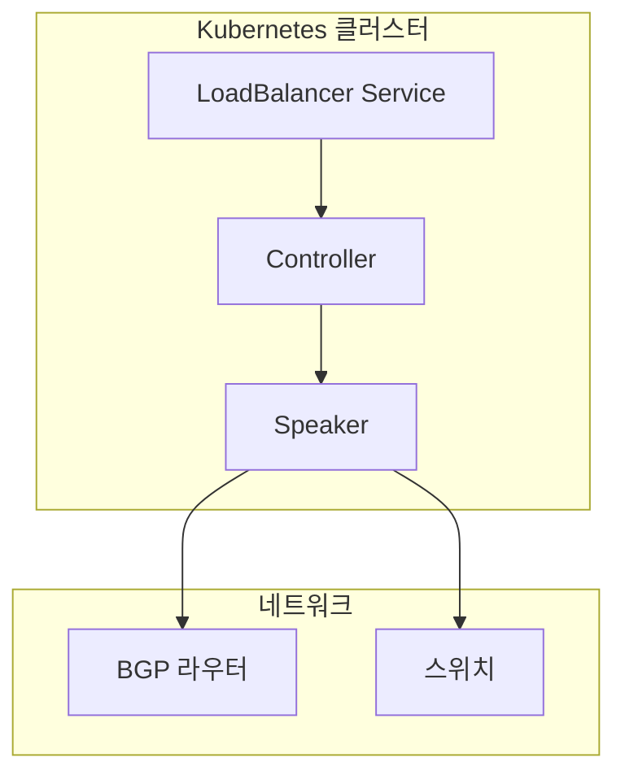
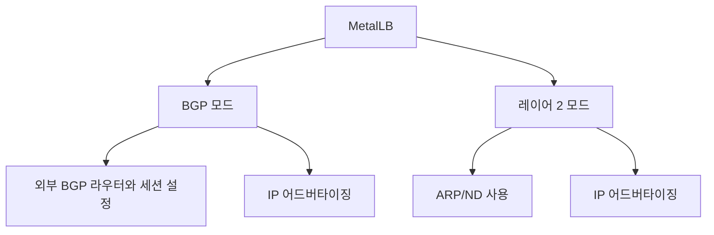
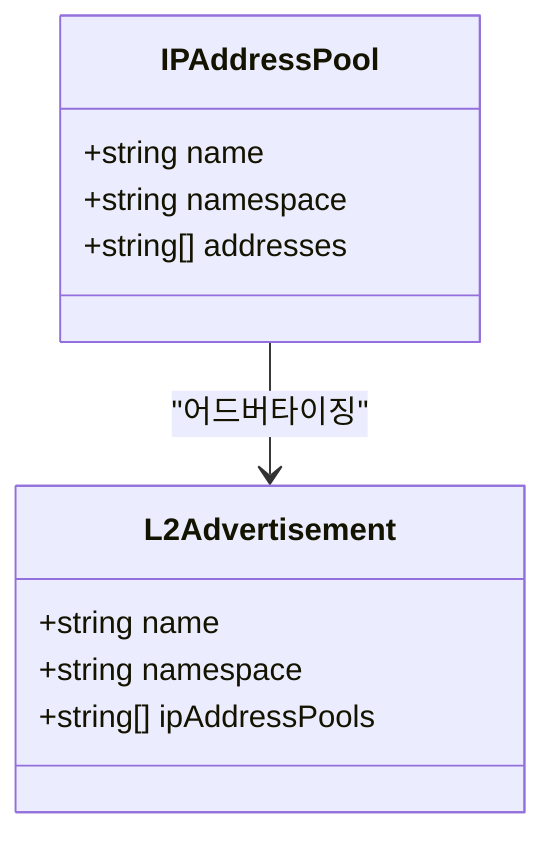
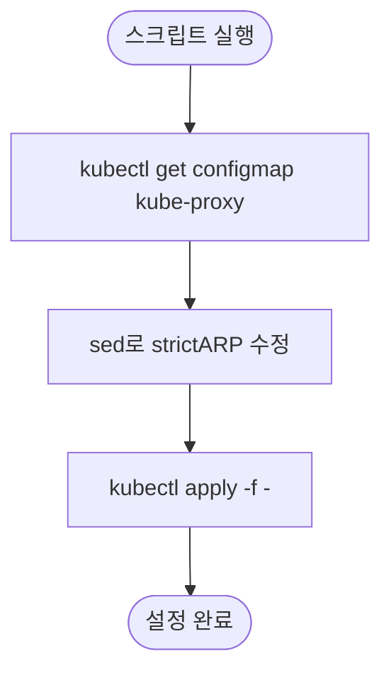
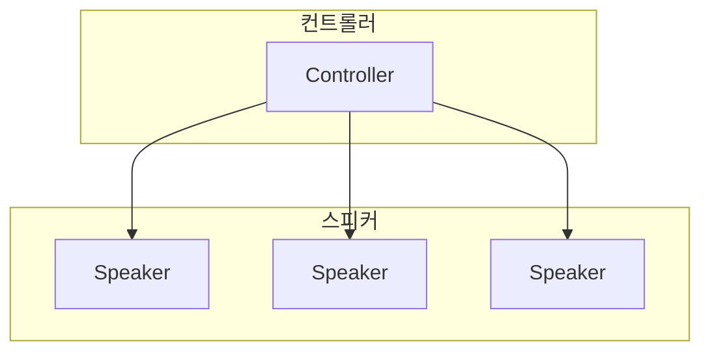

# MetalLB

<cite>
**이 문서에서 참조한 파일**
- [metallb-native.yaml](file://helm/cluster-services/metallb/metallb-native.yaml)
- [pool-1.yaml](file://helm/cluster-services/metallb/pool-1.yaml)
- [l2advertisement.yaml](file://helm/cluster-services/metallb/l2advertisement.yaml)
- [set-ipvs-mode.sh](file://helm/cluster-services/metallb/set-ipvs-mode.sh)
</cite>

## 목차
1. [소개](#소개)
2. [MetalLB 아키텍처 개요](#metallb-아키텍처-개요)
3. [BGP 및 레이어 2 동작 모드](#bgp-및-레이어-2-동작-모드)
4. [설치 및 구성](#설치-및-구성)
5. [IP 풀 및 어드버타이징 구성](#ip-풀-및-어드버타이징-구성)
6. [IPVS 모드 설정](#ipvs-모드-설정)
7. [CNI 호환성 문제 해결](#cni-호환성-문제-해결)
8. [운영 환경에서의 IP 관리 전략](#운영-환경에서의-ip-관리-전략)
9. [고가용성 구성](#고가용성-구성)
10. [BGP 라우터 통합](#bgp-라우터-통합)
11. [트래픽 분산 알고리즘](#트래픽-분산-알고리즘)
12. [Ingress 및 외부 서비스 노출](#ingress-및-외부-서비스-노출)

## 소개

MetalLB는 온프레미스 또는 클라우드가 아닌 환경에서 Kubernetes의 LoadBalancer 서비스 유형을 구현하는 네트워크 솔루션입니다. 이 문서는 MetalLB의 핵심 기능과 구성 요소를 분석하며, BGP 및 레이어 2 동작 모드, 설치 구성, IP 풀 할당, L2 어드버타이징 설정, IPVS 모드 설정, CNI 호환성 문제 해결 방법을 설명합니다. 또한 실제 운영 환경에서의 IP 주소 관리 전략, 고가용성 구성, BGP 라우터와의 통합 설정, 트래픽 분산 알고리즘에 대해 설명하며, MetalLB가 Ingress 및 외부 서비스 노출에 어떻게 기여하는지 기술합니다.

**Section sources**
- [metallb-native.yaml](file://helm/cluster-services/metallb/metallb-native.yaml#L1-L1986)
- [README.md](file://README.md#L24-L25)

## MetalLB 아키텍처 개요

MetalLB는 Kubernetes 클러스터에서 외부 로드 밸런싱을 제공하기 위해 컨트롤러(Controller)와 스피커(Speaker) 두 가지 주요 구성 요소로 구성됩니다. 컨트롤러는 클러스터 내 LoadBalancer 유형의 서비스를 모니터링하고 IP 주소를 할당하며, 스피커는 할당된 IP 주소를 네트워크에 어드버타이징합니다. MetalLB는 BGP 또는 레이어 2 프로토콜을 사용하여 IP 어드버타이징을 수행할 수 있습니다.

**Diagram sources**
- [metallb-native.yaml](file://helm/cluster-services/metallb/metallb-native.yaml#L1665-L1747)
- [metallb-native.yaml](file://helm/cluster-services/metallb/metallb-native.yaml#L1748-L1859)

**Section sources**
- [metallb-native.yaml](file://helm/cluster-services/metallb/metallb-native.yaml#L1-L1986)

## BGP 및 레이어 2 동작 모드

MetalLB는 BGP(Border Gateway Protocol) 및 레이어 2(Layer 2) 두 가지 동작 모드를 지원합니다. BGP 모드는 외부 라우터와 BGP 세션을 설정하여 IP 주소를 어드버타이징하며, 레이어 2 모드는 ARP(주소 해석 프로토콜) 또는 ND(네이버 디스커버리)를 사용하여 IP 주소를 어드버타이징합니다. BGP 모드는 고가용성과 트래픽 분산에 적합하며, 레이어 2 모드는 단순한 네트워크 환경에서 쉽게 설정할 수 있습니다.

**Diagram sources**
- [metallb-native.yaml](file://helm/cluster-services/metallb/metallb-native.yaml#L348-L511)
- [metallb-native.yaml](file://helm/cluster-services/metallb/metallb-native.yaml#L977-L1163)

**Section sources**
- [metallb-native.yaml](file://helm/cluster-services/metallb/metallb-native.yaml#L348-L511)
- [metallb-native.yaml](file://helm/cluster-services/metallb/metallb-native.yaml#L977-L1163)

## 설치 및 구성

MetalLB는 `metallb-native.yaml` 파일을 통해 설치 및 구성할 수 있습니다. 이 파일은 네임스페이스, 커스텀 리소스 정의(CRD), 서비스 어카운트, 롤, 롤 바인딩, 컨트롤러 및 스피커의 디플로이먼트와 데몬셋을 포함합니다. 설치 시 `kubectl apply -f metallb-native.yaml` 명령을 사용하여 리소스를 적용합니다.

**Section sources**
- [metallb-native.yaml](file://helm/cluster-services/metallb/metallb-native.yaml#L1-L1986)

## IP 풀 및 어드버타이징 구성

IP 풀은 MetalLB가 할당할 수 있는 IP 주소의 범위를 정의합니다. `pool-1.yaml` 파일은 `192.168.0.20`부터 `192.168.0.200`까지의 IP 주소 범위를 포함하는 IP 풀을 정의합니다. L2 어드버타이징은 `l2advertisement.yaml` 파일을 통해 구성되며, 이 파일은 `first-pool` IP 풀을 레이어 2 모드로 어드버타이징하도록 설정합니다.

**Diagram sources**
- [pool-1.yaml](file://helm/cluster-services/metallb/pool-1.yaml#L1-L8)
- [l2advertisement.yaml](file://helm/cluster-services/metallb/l2advertisement.yaml#L1-L8)

**Section sources**
- [pool-1.yaml](file://helm/cluster-services/metallb/pool-1.yaml#L1-L8)
- [l2advertisement.yaml](file://helm/cluster-services/metallb/l2advertisement.yaml#L1-L8)

## IPVS 모드 설정

IPVS(IP Virtual Server) 모드는 kube-proxy의 모드 중 하나로, MetalLB와 함께 사용할 수 있습니다. `set-ipvs-mode.sh` 스크립트는 kube-proxy의 ConfigMap을 수정하여 `strictARP`를 `true`로 설정합니다. 이 설정은 MetalLB가 ARP 응답을 올바르게 처리할 수 있도록 합니다.

**Diagram sources**
- [set-ipvs-mode.sh](file://helm/cluster-services/metallb/set-ipvs-mode.sh#L1-L10)

**Section sources**
- [set-ipvs-mode.sh](file://helm/cluster-services/metallb/set-ipvs-mode.sh#L1-L10)

## CNI 호환성 문제 해결

MetalLB는 다양한 CNI(Container Network Interface) 플러그인과 함께 작동할 수 있지만, 일부 CNI 플러그인과의 호환성 문제가 발생할 수 있습니다. 이 문제를 해결하기 위해 MetalLB는 `metallb-excludel2` ConfigMap을 사용하여 특정 네트워크 인터페이스를 어드버타이징에서 제외할 수 있습니다. 이 설정은 `metallb-native.yaml` 파일에 포함되어 있습니다.

**Section sources**
- [metallb-native.yaml](file://helm/cluster-services/metallb/metallb-native.yaml#L1638-L1646)

## 운영 환경에서의 IP 관리 전략

운영 환경에서 MetalLB를 사용할 때는 IP 주소의 효율적인 관리가 중요합니다. IP 풀을 적절히 구성하고, IP 주소의 할당 및 해제를 모니터링하여 IP 주소의 고갈을 방지해야 합니다. 또한, IP 주소의 재사용을 위해 IP 풀의 자동 할당(auto-assign) 기능을 활용할 수 있습니다.

**Section sources**
- [pool-1.yaml](file://helm/cluster-services/metallb/pool-1.yaml#L1-L8)
- [metallb-native.yaml](file://helm/cluster-services/metallb/metallb-native.yaml#L776-L800)

## 고가용성 구성

MetalLB는 고가용성을 위해 컨트롤러와 스피커를 여러 개의 노드에 배포할 수 있습니다. 컨트롤러는 단일 인스턴스로 실행되며, 스피커는 각 노드에 데몬셋으로 배포됩니다. 이 구성은 노드 장애 시에도 IP 어드버타이징이 계속되도록 보장합니다.

**Diagram sources**
- [metallb-native.yaml](file://helm/cluster-services/metallb/metallb-native.yaml#L1665-L1747)
- [metallb-native.yaml](file://helm/cluster-services/metallb/metallb-native.yaml#L1748-L1859)

**Section sources**
- [metallb-native.yaml](file://helm/cluster-services/metallb/metallb-native.yaml#L1665-L1859)

## BGP 라우터 통합

MetalLB는 외부 BGP 라우터와 통합하여 IP 주소를 어드버타이징할 수 있습니다. `bgppeers.metallb.io` CRD를 사용하여 BGP 피어를 정의하고, `bgpadvertisements.metallb.io` CRD를 사용하여 IP 어드버타이징을 구성합니다. 이 설정을 통해 MetalLB는 외부 네트워크에 IP 주소를 어드버타이징할 수 있습니다.

**Section sources**
- [metallb-native.yaml](file://helm/cluster-services/metallb/metallb-native.yaml#L348-L511)

## 트래픽 분산 알고리즘

MetalLB는 BGP 모드에서 외부 라우터와의 BGP 세션을 통해 트래픽을 분산합니다. BGP 프로토콜은 최단 경로를 기반으로 트래픽을 분산하므로, 여러 경로를 통해 트래픽을 균형 있게 분산할 수 있습니다. 레이어 2 모드에서는 ARP 응답을 통해 트래픽을 분산하며, 단일 노드가 IP 주소를 소유합니다.

**Section sources**
- [metallb-native.yaml](file://helm/cluster-services/metallb/metallb-native.yaml#L348-L511)
- [metallb-native.yaml](file://helm/cluster-services/metallb/metallb-native.yaml#L977-L1163)

## Ingress 및 외부 서비스 노출

MetalLB는 Ingress 컨트롤러 및 외부 서비스를 노출하는 데 사용할 수 있습니다. LoadBalancer 유형의 서비스를 생성하면 MetalLB가 IP 주소를 할당하고, 이를 통해 외부에서 Ingress 컨트롤러 및 서비스에 접근할 수 있습니다. 이 방식은 온프레미스 환경에서 외부 접근을 위한 표준적인 방법입니다.

**Section sources**
- [metallb-native.yaml](file://helm/cluster-services/metallb/metallb-native.yaml#L1-L1986)