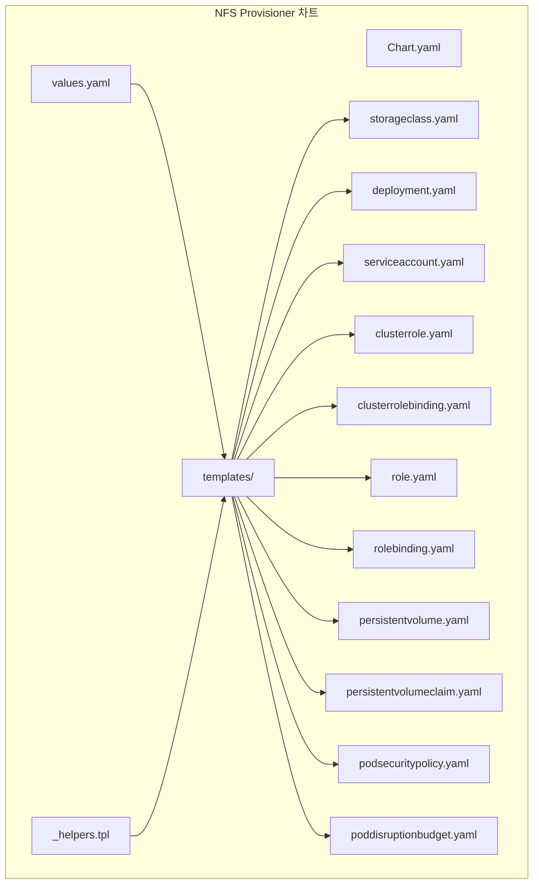
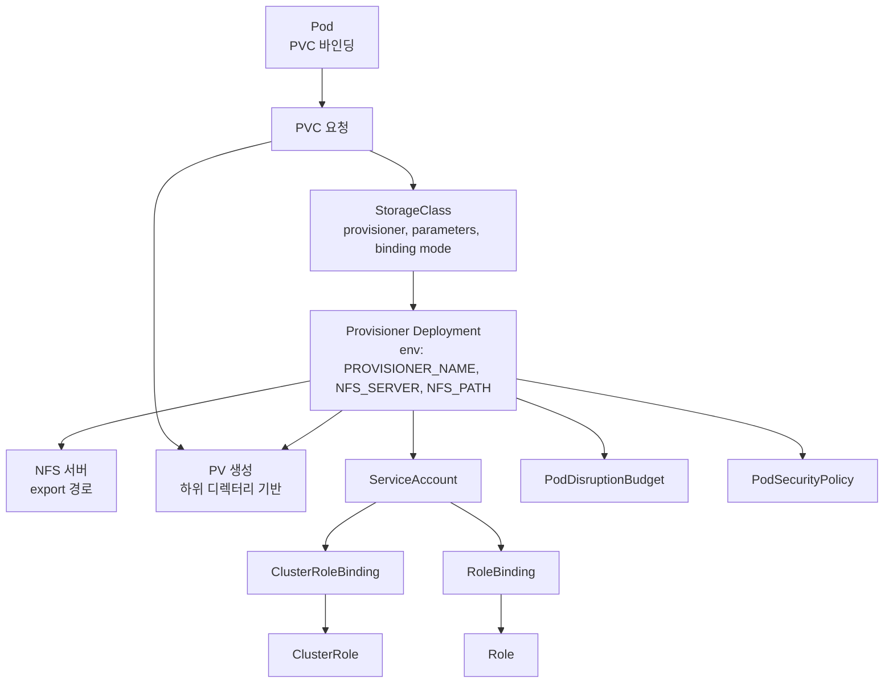
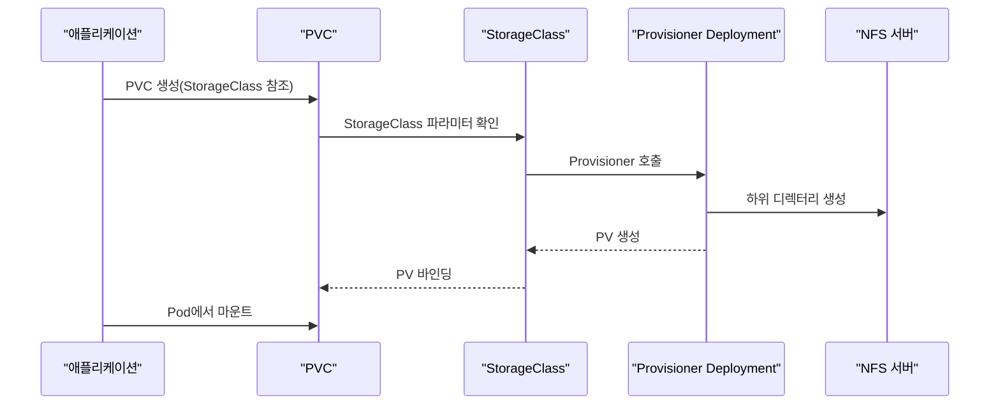
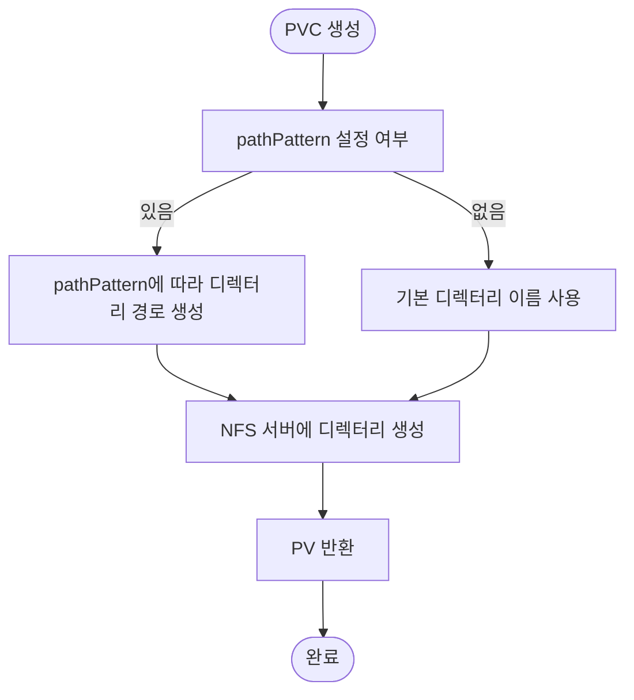
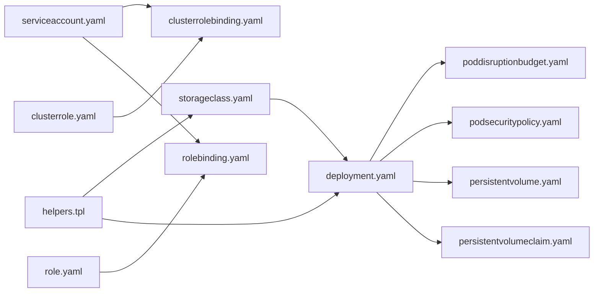

# NFS Provisioner

<cite>
**이 문서에서 참조된 파일**
- [Chart.yaml](file://helm/cluster-services/nfs-provisioner/Chart.yaml)
- [values.yaml](file://helm/cluster-services/nfs-provisioner/values.yaml)
- [README.md](file://helm/cluster-services/nfs-provisioner/README.md)
- [_helpers.tpl](file://helm/cluster-services/nfs-provisioner/templates/_helpers.tpl)
- [storageclass.yaml](file://helm/cluster-services/nfs-provisioner/templates/storageclass.yaml)
- [deployment.yaml](file://helm/cluster-services/nfs-provisioner/templates/deployment.yaml)
- [serviceaccount.yaml](file://helm/cluster-services/nfs-provisioner/templates/serviceaccount.yaml)
- [clusterrole.yaml](file://helm/cluster-services/nfs-provisioner/templates/clusterrole.yaml)
- [clusterrolebinding.yaml](file://helm/cluster-services/nfs-provisioner/templates/clusterrolebinding.yaml)
- [role.yaml](file://helm/cluster-services/nfs-provisioner/templates/role.yaml)
- [rolebinding.yaml](file://helm/cluster-services/nfs-provisioner/templates/rolebinding.yaml)
- [persistentvolume.yaml](file://helm/cluster-services/nfs-provisioner/templates/persistentvolume.yaml)
- [persistentvolumeclaim.yaml](file://helm/cluster-services/nfs-provisioner/templates/persistentvolumeclaim.yaml)
- [podsecuritypolicy.yaml](file://helm/cluster-services/nfs-provisioner/templates/podsecuritypolicy.yaml)
- [poddisruptionbudget.yaml](file://helm/cluster-services/nfs-provisioner/templates/poddisruptionbudget.yaml)
</cite>

## 목차
1. [소개](#소개)
2. [프로젝트 구조](#프로젝트-구조)
3. [핵심 컴포넌트](#핵심-컴포넌트)
4. [아키텍처 개요](#아키텍처-개요)
5. [상세 컴포넌트 분석](#상세-컴포넌트-분석)
6. [의존성 분석](#의존성-분석)
7. [성능 고려사항](#성능-고려사항)
8. [장애 대응 가이드](#장애-대응-가이드)
9. [결론](#결론)
10. [부록](#부록)

## 소개
NFS Provisioner는 Kubernetes 클러스터 내에서 기존 NFS 서버를 활용해 PersistentVolume(PV)을 자동으로 생성하는 동적 스토리지 프로비저닝 솔루션입니다. 본 차트는 NFS 기반 하위 디렉터리를 사용하여 PVC에 대한 PV를 생성하고, StorageClass, RBAC, ServiceAccount, ClusterRole/Role, ClusterRoleBinding/RoleBinding, PV/PVC, PodDisruptionBudget, PodSecurityPolicy 등을 함께 설치합니다. values.yaml을 통한 사용자 정의 설정(예: NFS 내보내기 경로, 접근 모드, 마운트 옵션)과 고가용성/복제 구성, PVC와 PV의 동적 바인딩 프로세스, stateful 애플리케이션에 대한 스토리지 제공 방식, 백업 및 복구 전략, 성능 최적화 방법(예: 마운트 옵션 조정), 그리고 클러스터 내 다양한 애플리케이션과의 통합 사례를 다룹니다.

## 프로젝트 구조
NFS Provisioner Helm 차트는 다음과 같은 구조로 구성되어 있습니다:
- Chart.yaml: 차트 버전, 설명, 소스 정보
- values.yaml: 기본 설정(이미지, NFS 서버/경로, StorageClass, RBAC, 리소스 제약 등)
- templates/: Kubernetes 리소스 템플릿들
  - _helpers.tpl: 헬퍼 템플릿(이름, 라벨, provisioner 이름, PDB/PSP API 버전 등)
  - storageclass.yaml: StorageClass 정의
  - deployment.yaml: Provisioner Deployment
  - serviceaccount.yaml, clusterrole.yaml, clusterrolebinding.yaml, role.yaml, rolebinding.yaml: RBAC 리소스
  - persistentvolume.yaml, persistentvolumeclaim.yaml: PV/PVC(마운트 옵션 사용 시)
  - podsecuritypolicy.yaml, poddisruptionbudget.yaml: 보안 및 가용성 관련 리소스

**도표 출처**
- [Chart.yaml](file://helm/cluster-services/nfs-provisioner/Chart.yaml#L1-L14)
- [values.yaml](file://helm/cluster-services/nfs-provisioner/values.yaml#L1-L115)
- [_helpers.tpl](file://helm/cluster-services/nfs-provisioner/templates/_helpers.tpl#L1-L104)
- [storageclass.yaml](file://helm/cluster-services/nfs-provisioner/templates/storageclass.yaml#L1-L34)
- [deployment.yaml](file://helm/cluster-services/nfs-provisioner/templates/deployment.yaml#L1-L84)
- [serviceaccount.yaml](file://helm/cluster-services/nfs-provisioner/templates/serviceaccount.yaml#L1-L13)
- [clusterrole.yaml](file://helm/cluster-services/nfs-provisioner/templates/clusterrole.yaml#L1-L31)
- [clusterrolebinding.yaml](file://helm/cluster-services/nfs-provisioner/templates/clusterrolebinding.yaml#L1-L17)
- [role.yaml](file://helm/cluster-services/nfs-provisioner/templates/role.yaml#L1-L19)
- [rolebinding.yaml](file://helm/cluster-services/nfs-provisioner/templates/rolebinding.yaml#L1-L17)
- [persistentvolume.yaml](file://helm/cluster-services/nfs-provisioner/templates/persistentvolume.yaml#L1-L27)
- [persistentvolumeclaim.yaml](file://helm/cluster-services/nfs-provisioner/templates/persistentvolumeclaim.yaml#L1-L20)
- [podsecuritypolicy.yaml](file://helm/cluster-services/nfs-provisioner/templates/podsecuritypolicy.yaml#L1-L29)
- [poddisruptionbudget.yaml](file://helm/cluster-services/nfs-provisioner/templates/poddisruptionbudget.yaml#L1-L13)

**섹션 출처**
- [Chart.yaml](file://helm/cluster-services/nfs-provisioner/Chart.yaml#L1-L14)
- [values.yaml](file://helm/cluster-services/nfs-provisioner/values.yaml#L1-L115)
- [_helpers.tpl](file://helm/cluster-services/nfs-provisioner/templates/_helpers.tpl#L1-L104)

## 핵심 컴포넌트
- StorageClass: 동적 PV 생성을 위한 Provisioner 이름, 볼륨 확장 가능 여부, 재활용 정책, 볼륨 바인딩 모드, 파라미터(archiveOnDelete, pathPattern, onDelete) 등을 정의합니다.
- Deployment: Provisioner 컨테이너 이미지, 환경 변수(NFS_SERVER, NFS_PATH, PROVISIONER_NAME), 리더 선거 비활성화 여부, 볼륨 마운트(/persistentvolumes), 리소스 제약 등을 설정합니다.
- RBAC: ClusterRole/ClusterRoleBinding은 클러스터 전체 리소스에 대한 권한 부여, Role/RoleBinding은 네임스페이스 내 Lock Endpoint 관리를 위한 권한 부여를 담당합니다.
- PV/PVC: 마운트 옵션을 사용할 경우, 미리 생성되는 PV/PVC를 통해 NFS 서버에 대한 하위 디렉터리 구조를 관리합니다.
- ServiceAccount: Provisioner Pod 실행에 필요한 계정을 제공합니다.
- PodDisruptionBudget: Pod 중단 예산을 통해 운영 중단을 최소화합니다.
- PodSecurityPolicy: Pod 보안 정책 활성화 시 NFS, PVC 등의 볼륨 유형을 허용합니다.

**섹션 출처**
- [storageclass.yaml](file://helm/cluster-services/nfs-provisioner/templates/storageclass.yaml#L1-L34)
- [deployment.yaml](file://helm/cluster-services/nfs-provisioner/templates/deployment.yaml#L1-L84)
- [clusterrole.yaml](file://helm/cluster-services/nfs-provisioner/templates/clusterrole.yaml#L1-L31)
- [clusterrolebinding.yaml](file://helm/cluster-services/nfs-provisioner/templates/clusterrolebinding.yaml#L1-L17)
- [role.yaml](file://helm/cluster-services/nfs-provisioner/templates/role.yaml#L1-L19)
- [rolebinding.yaml](file://helm/cluster-services/nfs-provisioner/templates/rolebinding.yaml#L1-L17)
- [persistentvolume.yaml](file://helm/cluster-services/nfs-provisioner/templates/persistentvolume.yaml#L1-L27)
- [persistentvolumeclaim.yaml](file://helm/cluster-services/nfs-provisioner/templates/persistentvolumeclaim.yaml#L1-L20)
- [serviceaccount.yaml](file://helm/cluster-services/nfs-provisioner/templates/serviceaccount.yaml#L1-L13)
- [poddisruptionbudget.yaml](file://helm/cluster-services/nfs-provisioner/templates/poddisruptionbudget.yaml#L1-L13)
- [podsecuritypolicy.yaml](file://helm/cluster-services/nfs-provisioner/templates/podsecuritypolicy.yaml#L1-L29)

## 아키텍처 개요
NFS Provisioner는 StorageClass를 통해 PVC 요청을 수신하고, Provisioner가 NFS 서버에 하위 디렉터리를 생성하여 PV를 동적으로 생성합니다. PVC가 생성되면 StorageClass의 volumeBindingMode에 따라 즉시 바인딩되거나 첫 번째 파드 스케줄링 시 지연 바인딩됩니다. RBAC, ServiceAccount, PDB, PSP를 통해 보안과 가용성을 보장합니다.

**도표 출처**
- [storageclass.yaml](file://helm/cluster-services/nfs-provisioner/templates/storageclass.yaml#L1-L34)
- [deployment.yaml](file://helm/cluster-services/nfs-provisioner/templates/deployment.yaml#L1-L84)
- [serviceaccount.yaml](file://helm/cluster-services/nfs-provisioner/templates/serviceaccount.yaml#L1-L13)
- [clusterrole.yaml](file://helm/cluster-services/nfs-provisioner/templates/clusterrole.yaml#L1-L31)
- [clusterrolebinding.yaml](file://helm/cluster-services/nfs-provisioner/templates/clusterrolebinding.yaml#L1-L17)
- [role.yaml](file://helm/cluster-services/nfs-provisioner/templates/role.yaml#L1-L19)
- [rolebinding.yaml](file://helm/cluster-services/nfs-provisioner/templates/rolebinding.yaml#L1-L17)
- [poddisruptionbudget.yaml](file://helm/cluster-services/nfs-provisioner/templates/poddisruptionbudget.yaml#L1-L13)
- [podsecuritypolicy.yaml](file://helm/cluster-services/nfs-provisioner/templates/podsecuritypolicy.yaml#L1-L29)

## 상세 컴포넌트 분석

### StorageClass
- Provisioner 이름: _helpers.tpl에 정의된 provisionerName 템플릿을 사용합니다.
- 파라미터:
  - archiveOnDelete: PVC 삭제 시 디렉터리 보관 여부
  - pathPattern: PVC 메타데이터를 기반으로 하위 디렉터리 경로 템플릿
  - onDelete: 'delete' 또는 'retain'으로 PVC 삭제 시 행동 결정
- 볼륨 확장: allowVolumeExpansion
- 재활용 정책: reclaimPolicy
- 볼륨 바인딩 모드: volumeBindingMode
- 마운트 옵션: nfs.mountOptions가 설정된 경우 StorageClass parameters에 mountOptions 전달

**섹션 출처**
- [storageclass.yaml](file://helm/cluster-services/nfs-provisioner/templates/storageclass.yaml#L1-L34)
- [_helpers.tpl](file://helm/cluster-services/nfs-provisioner/templates/_helpers.tpl#L34-L40)
- [values.yaml](file://helm/cluster-services/nfs-provisioner/values.yaml#L19-L60)

### Deployment
- 컨테이너 이미지: values.yaml에서 repository/tag/pullPolicy 설정
- 환경 변수:
  - PROVISIONER_NAME: _helpers.tpl에 의해 생성된 provisionerName
  - NFS_SERVER, NFS_PATH: values.yaml의 nfs.server, nfs.path
  - ENABLE_LEADER_ELECTION: leaderElection.enabled=false일 경우 비활성화
- 볼륨:
  - nfs.volumeName으로 /persistentvolumes 마운트
  - nfs.mountOptions이 없으면 직접 NFS 볼륨 사용
  - nfs.mountOptions이 있으면 PVC를 통해 볼륨 사용
- 리소스 제약: resources
- 노드/어피니티/투명: nodeSelector, affinity, tolerations
- 우선순위: priorityClassName

**섹션 출처**
- [deployment.yaml](file://helm/cluster-services/nfs-provisioner/templates/deployment.yaml#L1-L84)
- [values.yaml](file://helm/cluster-services/nfs-provisioner/values.yaml#L1-L115)
- [_helpers.tpl](file://helm/cluster-services/nfs-provisioner/templates/_helpers.tpl#L34-L40)

### RBAC 및 보안
- ServiceAccount: serviceAccount.create=true일 경우 생성
- ClusterRole/ClusterRoleBinding: 클러스터 리소스에 대한 PV/PVC/StorageClass/Event 관리 권한 부여
- Role/RoleBinding: 네임스페이스 내 Endpoints 관리 권한 부여
- PodSecurityPolicy: podSecurityPolicy.enabled=true일 경우 NFS, PVC 볼륨 허용

**섹션 출처**
- [serviceaccount.yaml](file://helm/cluster-services/nfs-provisioner/templates/serviceaccount.yaml#L1-L13)
- [clusterrole.yaml](file://helm/cluster-services/nfs-provisioner/templates/clusterrole.yaml#L1-L31)
- [clusterrolebinding.yaml](file://helm/cluster-services/nfs-provisioner/templates/clusterrolebinding.yaml#L1-L17)
- [role.yaml](file://helm/cluster-services/nfs-provisioner/templates/role.yaml#L1-L19)
- [rolebinding.yaml](file://helm/cluster-services/nfs-provisioner/templates/rolebinding.yaml#L1-L17)
- [podsecuritypolicy.yaml](file://helm/cluster-services/nfs-provisioner/templates/podsecuritypolicy.yaml#L1-L29)

### PV/PVC(하위 디렉터리 기반)
- nfs.mountOptions이 설정된 경우에만 PV/PVC 템플릿이 활성화됩니다.
- PV: nfs.server, nfs.path, mountOptions, persistentVolumeReclaimPolicy, accessModes
- PVC: storageClassName을 비워두고, selector로 PV와 연계

**섹션 출처**
- [persistentvolume.yaml](file://helm/cluster-services/nfs-provisioner/templates/persistentvolume.yaml#L1-L27)
- [persistentvolumeclaim.yaml](file://helm/cluster-services/nfs-provisioner/templates/persistentvolumeclaim.yaml#L1-L20)

### PodDisruptionBudget 및 보안
- podDisruptionBudget.enabled=true일 경우 PDB 생성
- podSecurityPolicy.enabled=true일 경우 PSP 생성

**섹션 출처**
- [poddisruptionbudget.yaml](file://helm/cluster-services/nfs-provisioner/templates/poddisruptionbudget.yaml#L1-L13)
- [podsecuritypolicy.yaml](file://helm/cluster-services/nfs-provisioner/templates/podsecuritypolicy.yaml#L1-L29)

### 동적 바인딩 프로세스

**도표 출처**
- [storageclass.yaml](file://helm/cluster-services/nfs-provisioner/templates/storageclass.yaml#L1-L34)
- [deployment.yaml](file://helm/cluster-services/nfs-provisioner/templates/deployment.yaml#L1-L84)

### PVC 생성 시 하위 디렉터리 템플릿

**도표 출처**
- [storageclass.yaml](file://helm/cluster-services/nfs-provisioner/templates/storageclass.yaml#L19-L26)
- [values.yaml](file://helm/cluster-services/nfs-provisioner/values.yaml#L47-L50)

## 의존성 분석
- 헬퍼 템플릿(_helpers.tpl): 모든 템플릿이 공통적으로 사용하는 이름, 라벨, provisionerName, PDB/PSM API 버전 생성
- StorageClass는 Provisioner 이름(_helpers.tpl)에 의존
- Deployment는 ServiceAccount, ClusterRole/Role, ClusterRoleBinding/RoleBinding, PVC/PV(옵션), PDB, PSP에 영향 받음
- PVC는 PV에 의해 바인딩되며, pathPattern에 따라 NFS 서버 내 디렉터리 구조가 결정됨

**도표 출처**
- [_helpers.tpl](file://helm/cluster-services/nfs-provisioner/templates/_helpers.tpl#L1-L104)
- [storageclass.yaml](file://helm/cluster-services/nfs-provisioner/templates/storageclass.yaml#L1-L34)
- [deployment.yaml](file://helm/cluster-services/nfs-provisioner/templates/deployment.yaml#L1-L84)
- [serviceaccount.yaml](file://helm/cluster-services/nfs-provisioner/templates/serviceaccount.yaml#L1-L13)
- [clusterrole.yaml](file://helm/cluster-services/nfs-provisioner/templates/clusterrole.yaml#L1-L31)
- [clusterrolebinding.yaml](file://helm/cluster-services/nfs-provisioner/templates/clusterrolebinding.yaml#L1-L17)
- [role.yaml](file://helm/cluster-services/nfs-provisioner/templates/role.yaml#L1-L19)
- [rolebinding.yaml](file://helm/cluster-services/nfs-provisioner/templates/rolebinding.yaml#L1-L17)
- [poddisruptionbudget.yaml](file://helm/cluster-services/nfs-provisioner/templates/poddisruptionbudget.yaml#L1-L13)
- [podsecuritypolicy.yaml](file://helm/cluster-services/nfs-provisioner/templates/podsecuritypolicy.yaml#L1-L29)
- [persistentvolume.yaml](file://helm/cluster-services/nfs-provisioner/templates/persistentvolume.yaml#L1-L27)
- [persistentvolumeclaim.yaml](file://helm/cluster-services/nfs-provisioner/templates/persistentvolumeclaim.yaml#L1-L20)

**섹션 출처**
- [_helpers.tpl](file://helm/cluster-services/nfs-provisioner/templates/_helpers.tpl#L1-L104)

## 성능 고려사항
- 마운트 옵션 조정: nfs.mountOptions을 통해 NFS 버전, sync/async, rsize/wsize 등을 조절하여 성능 최적화 가능
- 볼륨 확장: storageClass.allowVolumeExpansion=true로 설정하여 PVC 확장 가능
- 볼륨 바인딩 모드: volumeBindingMode를 Immediate 또는 WaitForFirstConsumer로 선택하여 스케줄링 및 성능 균형 맞춤
- 리더 선거: leaderElection.enabled=false로 설정하면 단일 인스턴스로 동작하여 리소스 절감 가능
- PDB: podDisruptionBudget.enabled=true로 설정하여 운영 중단 최소화

**섹션 출처**
- [values.yaml](file://helm/cluster-services/nfs-provisioner/values.yaml#L19-L60)
- [deployment.yaml](file://helm/cluster-services/nfs-provisioner/templates/deployment.yaml#L1-L84)
- [poddisruptionbudget.yaml](file://helm/cluster-services/nfs-provisioner/templates/poddisruptionbudget.yaml#L1-L13)

## 장애 대응 가이드
- PVC 삭제 시 디렉터리 처리: storageClass.onDelete='delete' 또는 'retain'으로 설정하여 PVC 삭제 시 디렉터리 보관 여부 결정
- archiveOnDelete: PVC 삭제 시 디렉터리 보관 여부를 제어
- 리더 선거 비활성화: leaderElection.enabled=false로 설정하여 단일 인스턴스 운영 시 안정성 확보
- RBAC 검토: ClusterRole/Role 및 Binding이 정상적으로 적용되었는지 확인
- PDB/PSM: PDB나 PSP가 필요할 경우 각각 활성화하여 운영 안정성 확보

**섹션 출처**
- [storageclass.yaml](file://helm/cluster-services/nfs-provisioner/templates/storageclass.yaml#L19-L26)
- [values.yaml](file://helm/cluster-services/nfs-provisioner/values.yaml#L33-L60)
- [deployment.yaml](file://helm/cluster-services/nfs-provisioner/templates/deployment.yaml#L1-L84)
- [clusterrole.yaml](file://helm/cluster-services/nfs-provisioner/templates/clusterrole.yaml#L1-L31)
- [role.yaml](file://helm/cluster-services/nfs-provisioner/templates/role.yaml#L1-L19)
- [poddisruptionbudget.yaml](file://helm/cluster-services/nfs-provisioner/templates/poddisruptionbudget.yaml#L1-L13)
- [podsecuritypolicy.yaml](file://helm/cluster-services/nfs-provisioner/templates/podsecuritypolicy.yaml#L1-L29)

## 결론
NFS Provisioner 차트는 기존 NFS 서버를 활용한 동적 PV 생성을 지원하며, StorageClass, RBAC, ServiceAccount, PV/PVC, PDB, PSP를 통한 보안과 가용성을 강화합니다. values.yaml을 통해 NFS 경로, 접근 모드, 볼륨 확장, 마운트 옵션 등을 유연하게 설정할 수 있으며, PVC 생성 시 pathPattern을 통해 하위 디렉터리 구조를 관리할 수 있습니다. stateful 애플리케이션에 대한 스토리지 제공, 백업 및 복구 전략, 성능 최적화 방법을 함께 고려하면 안정적인 클러스터 스토리지 운영이 가능합니다.

## 부록
- 설치 및 업데이트 가이드: README.md에 명시된 설치/삭제 명령어를 참고하여 진행
- 다중 Provisioner 설치: 서로 다른 nfs.server/nfs.path와 storageClass.name/provisionerName을 사용하여 여러 Provisioner를 병행 설치 가능

**섹션 출처**
- [README.md](file://helm/cluster-services/nfs-provisioner/README.md#L1-L102)