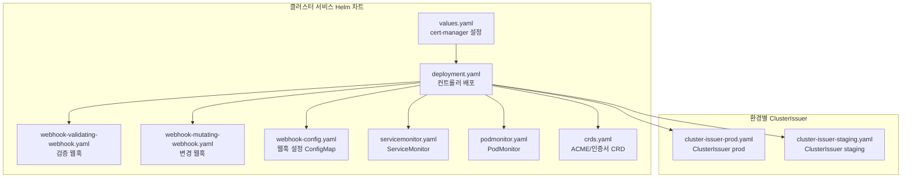
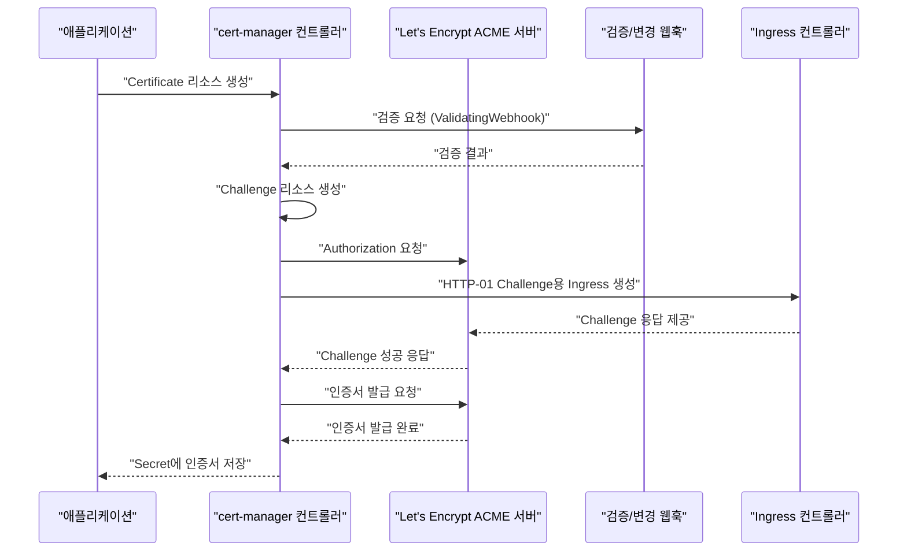
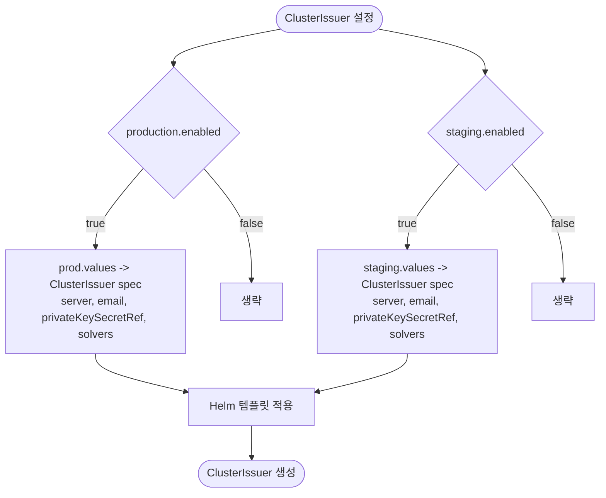
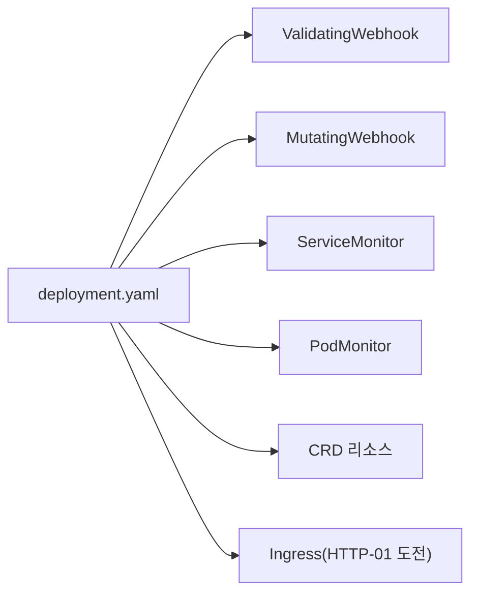

# cert-manager

<cite>
**문서에 참조된 파일 목록**
- [values.yaml](file://helm/cluster-services/cert-manager/values.yaml)
- [cluster-issuer-prod.yaml](file://helm/cluster-services/cert-manager/templates/cluster-issuer-prod.yaml)
- [cluster-issuer-staging.yaml](file://helm/cluster-services/cert-manager/templates/cluster-issuer-staging.yaml)
- [values.yaml](file://helm/development-tools/kubernetes-dashboard/charts/cert-manager/values.yaml)
- [deployment.yaml](file://helm/development-tools/kubernetes-dashboard/charts/cert-manager/templates/deployment.yaml)
- [webhook-validating-webhook.yaml](file://helm/development-tools/kubernetes-dashboard/charts/cert-manager/templates/webhook-validating-webhook.yaml)
- [webhook-mutating-webhook.yaml](file://helm/development-tools/kubernetes-dashboard/charts/cert-manager/templates/webhook-mutating-webhook.yaml)
- [webhook-config.yaml](file://helm/development-tools/kubernetes-dashboard/charts/cert-manager/templates/webhook-config.yaml)
- [servicemonitor.yaml](file://helm/development-tools/kubernetes-dashboard/charts/cert-manager/templates/servicemonitor.yaml)
- [podmonitor.yaml](file://helm/development-tools/kubernetes-dashboard/charts/cert-manager/templates/podmonitor.yaml)
- [crds.yaml](file://helm/development-tools/kubernetes-dashboard/charts/cert-manager/templates/crds.yaml)
- [_helpers.tpl](file://helm/development-tools/kubernetes-dashboard/charts/cert-manager/templates/_helpers.tpl)
- [README.md](file://helm/development-tools/kubernetes-dashboard/charts/cert-manager/README.md)
- [ingress-nginx Admission Webhook 인증서 생성 템플릿](file://helm/development-tools/kubernetes-dashboard/charts/ingress-nginx/templates/admission-webhooks/cert-manager.yaml)
</cite>

## 목차
1. [소개](#소개)
2. [프로젝트 구조](#프로젝트-구조)
3. [핵심 구성 요소](#핵심-구성-요소)
4. [아키텍처 개요](#아키텍처-개요)
5. [상세 구성 요소 분석](#상세-구성-요소-분석)
6. [의존성 분석](#의존성-분석)
7. [성능 고려사항](#성능-고려사항)
8. [장애 대응 가이드](#장애-대응-가이드)
9. [결론](#결론)
10. [부록](#부록)

## 소개
이 문서는 Kubernetes 클러스터 내에서 SSL/TLS 인증서를 자동으로 발급하고 갱신하는 핵심 보안 서비스인 cert-manager를 다룹니다. 본 문서에서는 cert-manager의 아키텍처와 주요 구성 요소(예: ClusterIssuer, Certificate 리소스)를 설명하고, Let's Encrypt와의 통합을 통한 인증서 자동 관리 프로세스를 중심으로 Helm 차트 values.yaml 설정 방법, 프로덕션 및 스테이징 환경별 ClusterIssuer 설정 차이, 웹훅 및 CA 기반 인증서 발급 방식을 포함한 구현 세부 사항을 설명합니다. 또한, 인증서 갱신 실패 시 문제 해결 방법, ACME 도전(challenge) 유형별 설정 가이드, 보안 모범 사례 및 인증서 만료 모니터링 전략을 제공합니다. 이 서비스는 Ingress 컨트롤러와 긴밀히 연동되어 클러스터 전체의 암호화 통신을 보장합니다.

## 프로젝트 구조
cert-manager는 두 부분으로 구성됩니다:
- 클러스터 레벨에서 운영되는 Helm 차트: cert-manager 컨트롤러, 웹훅, CRD 설치, Prometheus 모니터링 설정 등
- 환경별 ClusterIssuer 설정: 프로덕션과 스테이징 환경에 따라 Let's Encrypt ACME 서버를 다르게 사용

**도표 출처**
- [values.yaml](file://helm/cluster-services/cert-manager/values.yaml#L1-L35)
- [cluster-issuer-prod.yaml](file://helm/cluster-services/cert-manager/templates/cluster-issuer-prod.yaml#L1-L20)
- [cluster-issuer-staging.yaml](file://helm/cluster-services/cert-manager/templates/cluster-issuer-staging.yaml#L1-L20)
- [deployment.yaml](file://helm/development-tools/kubernetes-dashboard/charts/cert-manager/templates/deployment.yaml#L1-L231)
- [webhook-validating-webhook.yaml](file://helm/development-tools/kubernetes-dashboard/charts/cert-manager/templates/webhook-validating-webhook.yaml#L1-L50)
- [webhook-mutating-webhook.yaml](file://helm/development-tools/kubernetes-dashboard/charts/cert-manager/templates/webhook-mutating-webhook.yaml#L1-L48)
- [webhook-config.yaml](file://helm/development-tools/kubernetes-dashboard/charts/cert-manager/templates/webhook-config.yaml#L1-L19)
- [servicemonitor.yaml](file://helm/development-tools/kubernetes-dashboard/charts/cert-manager/templates/servicemonitor.yaml#L1-L64)
- [podmonitor.yaml](file://helm/development-tools/kubernetes-dashboard/charts/cert-manager/templates/podmonitor.yaml#L1-L64)
- [crds.yaml](file://helm/development-tools/kubernetes-dashboard/charts/cert-manager/templates/crds.yaml#L1089-L10126)

**섹션 출처**
- [values.yaml](file://helm/cluster-services/cert-manager/values.yaml#L1-L35)
- [cluster-issuer-prod.yaml](file://helm/cluster-services/cert-manager/templates/cluster-issuer-prod.yaml#L1-L20)
- [cluster-issuer-staging.yaml](file://helm/cluster-services/cert-manager/templates/cluster-issuer-staging.yaml#L1-L20)
- [deployment.yaml](file://helm/development-tools/kubernetes-dashboard/charts/cert-manager/templates/deployment.yaml#L1-L231)

## 핵심 구성 요소
- ClusterIssuer: ACME 서버(예: Let's Encrypt)와 연동하여 인증서 발급을 담당하는 클러스터 레벨 리소스
- ACME Challenge: HTTP-01 또는 DNS-01 방식으로 도메인 소유권 검증
- 웹훅: API 서버에 대한 인증서 검증/변경 검증을 수행
- CRD: Certificate, CertificateRequest, Challenge 등 인증서 관리를 위한 커스텀 리소스
- Prometheus 모니터링: cert-manager 컨트롤러 및 웹훅의 메트릭 노출

**섹션 출처**
- [values.yaml](file://helm/cluster-services/cert-manager/values.yaml#L9-L35)
- [cluster-issuer-prod.yaml](file://helm/cluster-services/cert-manager/templates/cluster-issuer-prod.yaml#L1-L20)
- [cluster-issuer-staging.yaml](file://helm/cluster-services/cert-manager/templates/cluster-issuer-staging.yaml#L1-L20)
- [crds.yaml](file://helm/development-tools/kubernetes-dashboard/charts/cert-manager/templates/crds.yaml#L1089-L10126)

## 아키텍처 개요
cert-manager는 다음과 같은 흐름으로 작동합니다:
- ClusterIssuer를 통해 ACME 서버에 계정 등록
- Certificate 요청 시 Challenge 리소스 생성
- HTTP-01 도전 시 Ingress를 통한 응답 제공
- DNS-01 도전 시 DNS 레코드 관리
- 인증서 발급 후 Secret에 저장
- 웹훅은 API 요청 검증/변경 검증을 통해 안전한 인증서 관리를 보장

**도표 출처**
- [deployment.yaml](file://helm/development-tools/kubernetes-dashboard/charts/cert-manager/templates/deployment.yaml#L82-L130)
- [webhook-validating-webhook.yaml](file://helm/development-tools/kubernetes-dashboard/charts/cert-manager/templates/webhook-validating-webhook.yaml#L1-L50)
- [webhook-mutating-webhook.yaml](file://helm/development-tools/kubernetes-dashboard/charts/cert-manager/templates/webhook-mutating-webhook.yaml#L1-L48)
- [crds.yaml](file://helm/development-tools/kubernetes-dashboard/charts/cert-manager/templates/crds.yaml#L1089-L10126)

**섹션 출처**
- [deployment.yaml](file://helm/development-tools/kubernetes-dashboard/charts/cert-manager/templates/deployment.yaml#L82-L130)
- [webhook-validating-webhook.yaml](file://helm/development-tools/kubernetes-dashboard/charts/cert-manager/templates/webhook-validating-webhook.yaml#L1-L50)
- [webhook-mutating-webhook.yaml](file://helm/development-tools/kubernetes-dashboard/charts/cert-manager/templates/webhook-mutating-webhook.yaml#L1-L48)

## 상세 구성 요소 분석

### ClusterIssuer 설정 (values.yaml 기반)
- 프로덕션: Let's Encrypt v2 운영 서버 사용, 이메일 등록, HTTP-01 도전(Ingress 클래스 지정)
- 스테이징: Let's Encrypt v2 스테이징 서버 사용, 동일한 HTTP-01 도전 설정

**도표 출처**
- [values.yaml](file://helm/cluster-services/cert-manager/values.yaml#L9-L35)
- [cluster-issuer-prod.yaml](file://helm/cluster-services/cert-manager/templates/cluster-issuer-prod.yaml#L1-L20)
- [cluster-issuer-staging.yaml](file://helm/cluster-services/cert-manager/templates/cluster-issuer-staging.yaml#L1-L20)

**섹션 출처**
- [values.yaml](file://helm/cluster-services/cert-manager/values.yaml#L9-L35)
- [cluster-issuer-prod.yaml](file://helm/cluster-services/cert-manager/templates/cluster-issuer-prod.yaml#L1-L20)
- [cluster-issuer-staging.yaml](file://helm/cluster-services/cert-manager/templates/cluster-issuer-staging.yaml#L1-L20)

### ACME HTTP-01 도전 (Ingress 기반)
- HTTP-01 도전을 위해 Ingress 리소스를 생성하고, 해당 Ingress에 대해 Let's Encrypt가 접근할 수 있도록 해야 함
- Ingress 클래스는 values.yaml에 정의된 값이 사용됨

**섹션 출처**
- [values.yaml](file://helm/cluster-services/cert-manager/values.yaml#L19-L23)
- [deployment.yaml](file://helm/development-tools/kubernetes-dashboard/charts/cert-manager/templates/deployment.yaml#L108-L114)

### 웹훅 (Validating/Mutating)
- ValidatingWebhookConfiguration: cert-manager 리소스에 대한 검증
- MutatingWebhookConfiguration: certificaterequests에 대한 변경
- CA 인증서 자동 주입을 위한 ConfigMap 및 어노테이션 설정

**섹션 출처**
- [webhook-validating-webhook.yaml](file://helm/development-tools/kubernetes-dashboard/charts/cert-manager/templates/webhook-validating-webhook.yaml#L1-L50)
- [webhook-mutating-webhook.yaml](file://helm/development-tools/kubernetes-dashboard/charts/cert-manager/templates/webhook-mutating-webhook.yaml#L1-L48)
- [webhook-config.yaml](file://helm/development-tools/kubernetes-dashboard/charts/cert-manager/templates/webhook-config.yaml#L1-L19)

### CRD (인증서 관리 리소스)
- Challenge, CertificateRequest, Certificate 등 CRD를 통해 인증서 발급/갱신/만료 관리
- CRD 스키마에는 상태, 도메인, 이유, 갱신 시간 등 필드 포함

**섹션 출처**
- [crds.yaml](file://helm/development-tools/kubernetes-dashboard/charts/cert-manager/templates/crds.yaml#L1089-L10126)

### Prometheus 모니터링
- ServiceMonitor/PodMonitor를 통해 cert-manager 컨트롤러 및 웹훅 메트릭 노출
- 기본 포트 9402, 경로 /metrics

**섹션 출처**
- [servicemonitor.yaml](file://helm/development-tools/kubernetes-dashboard/charts/cert-manager/templates/servicemonitor.yaml#L1-L64)
- [podmonitor.yaml](file://helm/development-tools/kubernetes-dashboard/charts/cert-manager/templates/podmonitor.yaml#L1-L64)
- [README.md](file://helm/development-tools/kubernetes-dashboard/charts/cert-manager/README.md#L664-L793)

### Ingress 컨트롤러 연동 (CA 기반 인증서 발급)
- Ingress Admission Webhook에 대해 cert-manager를 통한 CA 기반 인증서 발급 예시 템플릿 제공
- SelfSigned -> CA Certificate -> Issuer -> Server Certificate 순서로 발급

**섹션 출처**
- [ingress-nginx Admission Webhook 인증서 생성 템플릿](file://helm/development-tools/kubernetes-dashboard/charts/ingress-nginx/templates/admission-webhooks/cert-manager.yaml#L1-L63)

## 의존성 분석
- cert-manager 컨트롤러는 웹훅 검증/변경 규칙에 의해 API 요청 검증
- HTTP-01 도전은 Ingress 리소스에 의존
- Prometheus Operator를 통한 메트릭 수집을 위한 ServiceMonitor/PodMonitor
- CRD는 cert-manager 컨트롤러가 직접 관리

**도표 출처**
- [deployment.yaml](file://helm/development-tools/kubernetes-dashboard/charts/cert-manager/templates/deployment.yaml#L1-L231)
- [webhook-validating-webhook.yaml](file://helm/development-tools/kubernetes-dashboard/charts/cert-manager/templates/webhook-validating-webhook.yaml#L1-L50)
- [webhook-mutating-webhook.yaml](file://helm/development-tools/kubernetes-dashboard/charts/cert-manager/templates/webhook-mutating-webhook.yaml#L1-L48)
- [servicemonitor.yaml](file://helm/development-tools/kubernetes-dashboard/charts/cert-manager/templates/servicemonitor.yaml#L1-L64)
- [podmonitor.yaml](file://helm/development-tools/kubernetes-dashboard/charts/cert-manager/templates/podmonitor.yaml#L1-L64)
- [crds.yaml](file://helm/development-tools/kubernetes-dashboard/charts/cert-manager/templates/crds.yaml#L1089-L10126)

**섹션 출처**
- [deployment.yaml](file://helm/development-tools/kubernetes-dashboard/charts/cert-manager/templates/deployment.yaml#L1-L231)
- [servicemonitor.yaml](file://helm/development-tools/kubernetes-dashboard/charts/cert-manager/templates/servicemonitor.yaml#L1-L64)
- [podmonitor.yaml](file://helm/development-tools/kubernetes-dashboard/charts/cert-manager/templates/podmonitor.yaml#L1-L64)

## 성능 고려사항
- 복수 인스턴스 운영: controller/webhook replicaCount를 2~3으로 설정하고 PDB 활성화 권장
- 동시 Challenge 제한: maxConcurrentChallenges 조절
- 로그 레벨: global.logLevel 조절
- 리소스 요청/제한: resources 설정
- 네트워크 정책: 웹훅 네트워크 정책 허용 범위 조정

**섹션 출처**
- [values.yaml](file://helm/development-tools/kubernetes-dashboard/charts/cert-manager/values.yaml#L86-L139)
- [deployment.yaml](file://helm/development-tools/kubernetes-dashboard/charts/cert-manager/templates/deployment.yaml#L1-L231)
- [README.md](file://helm/development-tools/kubernetes-dashboard/charts/cert-manager/README.md#L1277-L1348)

## 장애 대응 가이드
- ACME 도전 실패
  - HTTP-01: Ingress 노출 여부, DNS 레코드 확인, 네트워크 정책 검토
  - DNS-01: DNS Provider 자격 증명, Recursive Nameserver 설정 검토
- 웹훅 검증 실패
  - Validating/Mutating Webhook 규칙 확인, CA 인증서 자동 주입 여부 확인
- 인증서 만료
  - Prometheus 메트릭 확인, renewalTime 확인, Certificate 리소스 상태 점검
- 로깅
  - global.logLevel 조정, 컨트롤러/웹훅 로그 확인

**섹션 출처**
- [deployment.yaml](file://helm/development-tools/kubernetes-dashboard/charts/cert-manager/templates/deployment.yaml#L131-L140)
- [webhook-validating-webhook.yaml](file://helm/development-tools/kubernetes-dashboard/charts/cert-manager/templates/webhook-validating-webhook.yaml#L1-L50)
- [webhook-mutating-webhook.yaml](file://helm/development-tools/kubernetes-dashboard/charts/cert-manager/templates/webhook-mutating-webhook.yaml#L1-L48)
- [crds.yaml](file://helm/development-tools/kubernetes-dashboard/charts/cert-manager/templates/crds.yaml#L1051-L1087)

## 결론
cert-manager는 ACME 기반 인증서 자동 관리를 통해 Kubernetes 클러스터의 암호화 통신을 강력하게 보장합니다. ClusterIssuer를 통한 Let's Encrypt 연동, HTTP-01 도전을 통한 Ingress 기반 인증서 발급, 웹훅 검증/변경을 통한 안전한 API 통제, 그리고 Prometheus 기반 모니터링이 핵심입니다. 프로덕션/스테이징 환경별 ClusterIssuer 설정 차이와 DNS-01 도전 설정, 보안 모범 사례, 인증서 만료 모니터링 전략을 함께 고려하면 신뢰성 있는 인증서 관리가 가능합니다.

## 부록

### Helm 차트 values.yaml 설정 요약
- cert-manager.install, installCRDs: cert-manager 설치 및 CRD 설치 여부
- clusterIssuer.production/staging: ACME 서버, 이메일, 비공개키 시크릿, 도전 솔버(Ingress 클래스)

**섹션 출처**
- [values.yaml](file://helm/cluster-services/cert-manager/values.yaml#L1-L35)

### ACME 도전 유형별 설정 가이드
- HTTP-01: Ingress 클래스 지정, 도메인 DNS가 Ingress로 라우팅되도록 설정
- DNS-01: DNS Provider 자격 증명, Recursive Nameserver 설정, TXT 레코드 자동 관리

**섹션 출처**
- [values.yaml](file://helm/cluster-services/cert-manager/values.yaml#L19-L35)
- [deployment.yaml](file://helm/development-tools/kubernetes-dashboard/charts/cert-manager/templates/deployment.yaml#L131-L139)

### 보안 모범 사례
- PodSecurityPolicy/보안 컨텍스트 적용
- 최소 권한 RBAC
- 웹훅 네트워크 정책 제한
- 로그 레벨 조절

**섹션 출처**
- [values.yaml](file://helm/development-tools/kubernetes-dashboard/charts/cert-manager/values.yaml#L305-L346)
- [README.md](file://helm/development-tools/kubernetes-dashboard/charts/cert-manager/README.md#L1277-L1348)

### 인증서 만료 모니터링 전략
- ServiceMonitor/PodMonitor 활성화
- renewalTime 필드 확인
- Prometheus 경고 규칙 설정

**섹션 출처**
- [servicemonitor.yaml](file://helm/development-tools/kubernetes-dashboard/charts/cert-manager/templates/servicemonitor.yaml#L1-L64)
- [podmonitor.yaml](file://helm/development-tools/kubernetes-dashboard/charts/cert-manager/templates/podmonitor.yaml#L1-L64)
- [crds.yaml](file://helm/development-tools/kubernetes-dashboard/charts/cert-manager/templates/crds.yaml#L1051-L1087)