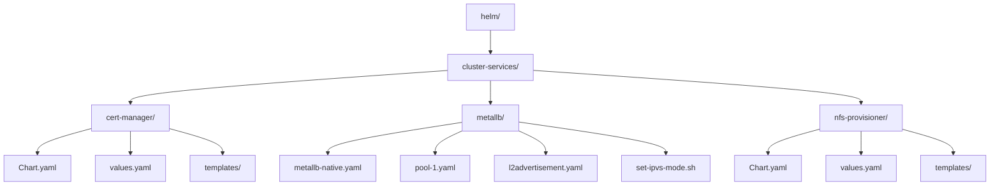
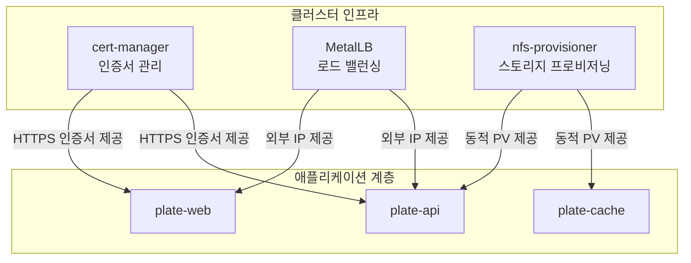
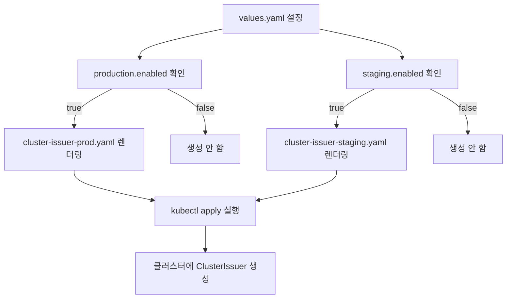
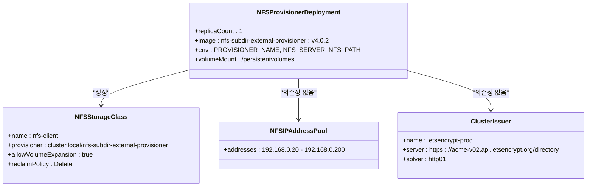
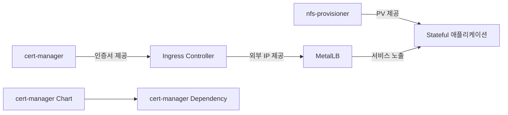

# 클러스터 서비스

<cite>
**이 문서에서 참조한 파일**  
- [cert-manager/Chart.yaml](file://helm/cluster-services/cert-manager/Chart.yaml)
- [cert-manager/values.yaml](file://helm/cluster-services/cert-manager/values.yaml)
- [cert-manager/templates/cluster-issuer-prod.yaml](file://helm/cluster-services/cert-manager/templates/cluster-issuer-prod.yaml)
- [cert-manager/templates/cluster-issuer-staging.yaml](file://helm/cluster-services/cert-manager/templates/cluster-issuer-staging.yaml)
- [metallb/metallb-native.yaml](file://helm/cluster-services/metallb/metallb-native.yaml)
- [metallb/pool-1.yaml](file://helm/cluster-services/metallb/pool-1.yaml)
- [metallb/l2advertisement.yaml](file://helm/cluster-services/metallb/l2advertisement.yaml)
- [metallb/set-ipvs-mode.sh](file://helm/cluster-services/metallb/set-ipvs-mode.sh)
- [nfs-provisioner/Chart.yaml](file://helm/cluster-services/nfs-provisioner/Chart.yaml)
- [nfs-provisioner/values.yaml](file://helm/cluster-services/nfs-provisioner/values.yaml)
- [nfs-provisioner/templates/deployment.yaml](file://helm/cluster-services/nfs-provisioner/templates/deployment.yaml)
- [nfs-provisioner/templates/storageclass.yaml](file://helm/cluster-services/nfs-provisioner/templates/storageclass.yaml)
- [nfs-provisioner/templates/clusterrole.yaml](file://helm/cluster-services/nfs-provisioner/templates/clusterrole.yaml)
- [nfs-provisioner/templates/clusterrolebinding.yaml](file://helm/cluster-services/nfs-provisioner/templates/clusterrolebinding.yaml)
- [nfs-provisioner/templates/serviceaccount.yaml](file://helm/cluster-services/nfs-provisioner/templates/serviceaccount.yaml)
- [nfs-provisioner/templates/persistentvolume.yaml](file://helm/cluster-services/nfs-provisioner/templates/persistentvolume.yaml)
- [nfs-provisioner/templates/persistentvolumeclaim.yaml](file://helm/cluster-services/nfs-provisioner/templates/persistentvolumeclaim.yaml)
</cite>

## 목차
1. [소개](#소개)
2. [프로젝트 구조](#프로젝트-구조)
3. [핵심 구성 요소](#핵심-구성-요소)
4. [아키텍처 개요](#아키텍처-개요)
5. [상세 구성 요소 분석](#상세-구성-요소-분석)
6. [의존성 분석](#의존성-분석)
7. [성능 고려사항](#성능-고려사항)
8. [문제 해결 가이드](#문제-해결-가이드)
9. [결론](#결론)

## 소개
이 문서는 쿠버네티스 클러스터 레벨에서 제공되는 핵심 인프라 서비스인 cert-manager, MetalLB, nfs-provisioner의 구조와 기능을 설명합니다. 각 서비스는 클러스터의 보안, 네트워킹, 스토리지 관리라는 핵심 영역을 담당하며, Helm 차트를 통해 일관되고 자동화된 방식으로 배포 및 관리됩니다. 이 문서는 각 서비스의 Helm 차트 구조, 주요 설정 방식, 템플릿의 역할, 운영 환경 구성 예시 및 주의사항을 포함하여, 실제 운영 환경에서의 통합적인 역할과 상호작용을 다룹니다.

## 프로젝트 구조
제공된 프로젝트 구조는 `helm/cluster-services` 디렉터리 하위에 각 클러스터 서비스를 위한 독립적인 Helm 차트가 위치하고 있음을 보여줍니다. 이는 클러스터 수준의 인프라 서비스를 모듈화하여 관리하는 전략을 반영합니다. 각 서비스는 자체 `Chart.yaml`, `values.yaml`, 그리고 `templates/` 디렉터리 내의 쿠버네티스 매니페스트 템플릿을 포함합니다. 이러한 구조는 서비스 간의 관심사 분리(Separation of Concerns)를 가능하게 하며, 개별 서비스의 업데이트와 관리를 독립적으로 수행할 수 있도록 합니다.

**Diagram sources**
- [helm/cluster-services/cert-manager/Chart.yaml](file://helm/cluster-services/cert-manager/Chart.yaml)
- [helm/cluster-services/metallb/metallb-native.yaml](file://helm/cluster-services/metallb/metallb-native.yaml)
- [helm/cluster-services/nfs-provisioner/Chart.yaml](file://helm/cluster-services/nfs-provisioner/Chart.yaml)

**Section sources**
- [helm/cluster-services/cert-manager/Chart.yaml](file://helm/cluster-services/cert-manager/Chart.yaml)
- [helm/cluster-services/metallb/metallb-native.yaml](file://helm/cluster-services/metallb/metallb-native.yaml)
- [helm/cluster-services/nfs-provisioner/Chart.yaml](file://helm/cluster-services/nfs-provisioner/Chart.yaml)

## 핵심 구성 요소

### cert-manager
cert-manager는 쿠버네티스 클러스터 내에서 SSL/TLS 인증서의 자동 발급 및 갱신을 담당하는 핵심 보안 서비스입니다. 이 서비스는 Let's Encrypt와 같은 외부 인증 기관(CA)과 통합되어, 클러스터 내의 Ingress 리소스에 대한 인증서를 자동으로 관리합니다. 제공된 Helm 차트는 cert-manager 자체의 설치를 포함하며, 주로 `ClusterIssuer` 리소스를 통해 프로덕션 및 스테이징 환경을 위한 ACME 인증서 발급 구성을 제공합니다.

**Section sources**
- [helm/cluster-services/cert-manager/Chart.yaml](file://helm/cluster-services/cert-manager/Chart.yaml)
- [helm/cluster-services/cert-manager/values.yaml](file://helm/cluster-services/cert-manager/values.yaml)

### MetalLB
MetalLB는 온프레미스 또는 클라우드 공급자가 제공하지 않는 환경에서 쿠버네티스의 `LoadBalancer` 타입 서비스를 가능하게 하는 네트워크 솔루션입니다. BGP 또는 레이어 2(Layer 2) 모드로 동작하며, 클러스터 외부에서 클러스터 내 서비스에 접근할 수 있도록 외부 IP 주소를 할당합니다. 제공된 구성은 레이어 2 모드를 사용하며, IP 주소 풀과 광고 전략을 정의합니다.

**Section sources**
- [helm/cluster-services/metallb/pool-1.yaml](file://helm/cluster-services/metallb/pool-1.yaml)
- [helm/cluster-services/metallb/l2advertisement.yaml](file://helm/cluster-services/metallb/l2advertisement.yaml)

### nfs-provisioner
nfs-provisioner는 동적 영구 볼륨(PV) 프로비저닝을 통해 스토리지 관리를 자동화하는 서비스입니다. 기존에 구성된 NFS 서버를 백엔드 스토리지로 사용하여, 사용자가 `PersistentVolumeClaim`(PVC)을 생성할 때마다 자동으로 PV를 생성하고 바인딩합니다. 이는 스토리지 관리의 복잡성을 크게 줄이며, 애플리케이션 개발자에게 편리한 스토리지 사용 경험을 제공합니다.

**Section sources**
- [helm/cluster-services/nfs-provisioner/Chart.yaml](file://helm/cluster-services/nfs-provisioner/Chart.yaml)
- [helm/cluster-services/nfs-provisioner/values.yaml](file://helm/cluster-services/nfs-provisioner/values.yaml)

## 아키텍처 개요
세 가지 핵심 서비스는 클러스터의 핵심 기능을 서로 보완하며 제공합니다. cert-manager는 클러스터 내 모든 서비스의 보안 통신을 보장하고, MetalLB는 외부에서의 접근성을 제공하며, nfs-provisioner는 지속적인 데이터 저장소를 자동으로 제공합니다. 이들 서비스는 모두 Helm을 통해 선언적으로 관리되며, 클러스터의 기본 인프라를 구성합니다.

**Diagram sources**
- [helm/cluster-services/cert-manager/Chart.yaml](file://helm/cluster-services/cert-manager/Chart.yaml)
- [helm/cluster-services/metallb/metallb-native.yaml](file://helm/cluster-services/metallb/metallb-native.yaml)
- [helm/cluster-services/nfs-provisioner/Chart.yaml](file://helm/cluster-services/nfs-provisioner/Chart.yaml)

## 상세 구성 요소 분석

### cert-manager 분석
cert-manager Helm 차트는 두 가지 주요 구성 요소로 나뉩니다. 첫째, `Chart.yaml` 파일의 `dependencies` 섹션을 통해 cert-manager 컨트롤러를 설치합니다. 둘째, `values.yaml`과 `templates/` 디렉터리 내의 템플릿을 통해 `ClusterIssuer` 리소스를 구성합니다. `values.yaml` 파일은 프로덕션과 스테이징 환경을 위한 두 가지 `ClusterIssuer`를 정의하며, 각각 Let's Encrypt의 프로덕션 및 스테이징 서버를 가리킵니다. `http01` 도전 방식과 `nginx` 인그레스 클래스를 사용하여 도메인 소유권을 검증합니다. 템플릿 파일은 `.Values`에서 제공된 설정을 기반으로 `ClusterIssuer` CRD를 동적으로 생성합니다.

**Diagram sources**
- [helm/cluster-services/cert-manager/values.yaml](file://helm/cluster-services/cert-manager/values.yaml)
- [helm/cluster-services/cert-manager/templates/cluster-issuer-prod.yaml](file://helm/cluster-services/cert-manager/templates/cluster-issuer-prod.yaml)
- [helm/cluster-services/cert-manager/templates/cluster-issuer-staging.yaml](file://helm/cluster-services/cert-manager/templates/cluster-issuer-staging.yaml)

**Section sources**
- [helm/cluster-services/cert-manager/Chart.yaml](file://helm/cluster-services/cert-manager/Chart.yaml)
- [helm/cluster-services/cert-manager/values.yaml](file://helm/cluster-services/cert-manager/values.yaml)
- [helm/cluster-services/cert-manager/templates/cluster-issuer-prod.yaml](file://helm/cluster-services/cert-manager/templates/cluster-issuer-prod.yaml)
- [helm/cluster-services/cert-manager/templates/cluster-issuer-staging.yaml](file://helm/cluster-services/cert-manager/templates/cluster-issuer-staging.yaml)

### MetalLB 분석
MetalLB 구성은 주로 세 가지 YAML 파일로 이루어져 있습니다. `metallb-native.yaml`은 MetalLB 컨트롤러와 스피커 컴포넌트를 설치하는 메인 매니페스트입니다. `pool-1.yaml`은 `IPAddressPool` 리소스를 정의하여, MetalLB가 할당할 수 있는 IP 주소 범위(192.168.0.20 - 192.168.0.200)를 지정합니다. `l2advertisement.yaml`은 `L2Advertisement` 리소스를 정의하여, 이 IP 풀이 레이어 2 모드에서 광고되도록 합니다. `set-ipvs-mode.sh` 스크립트는 kube-proxy의 설정을 수정하여 MetalLB와의 호환성을 보장합니다. 이 스크립트는 `strictARP`를 활성화하여 ARP 응답을 올바르게 처리하도록 합니다.

**Section sources**
- [helm/cluster-services/metallb/metallb-native.yaml](file://helm/cluster-services/metallb/metallb-native.yaml)
- [helm/cluster-services/metallb/pool-1.yaml](file://helm/cluster-services/metallb/pool-1.yaml)
- [helm/cluster-services/metallb/l2advertisement.yaml](file://helm/cluster-services/metallb/l2advertisement.yaml)
- [helm/cluster-services/metallb/set-ipvs-mode.sh](file://helm/cluster-services/metallb/set-ipvs-mode.sh)

### nfs-provisioner 분석
nfs-provisioner Helm 차트는 NFS 서버를 기반으로 동적 스토리지 프로비저닝을 설정합니다. `values.yaml` 파일은 NFS 서버의 IP 주소(`192.168.97`)와 내보내기 경로(`/export/k8s`)를 지정합니다. 또한, `storageClass.create: true` 설정을 통해 `nfs-client`라는 이름의 `StorageClass`를 자동으로 생성하도록 합니다. `deployment.yaml` 템플릿은 프로비저너 컨테이너를 배포하며, 이 컨테이너는 PVC 생성 이벤트를 감시하고, 지정된 NFS 서버에 새로운 디렉터리를 생성하여 PV를 바인딩합니다. `clusterrole.yaml`과 `clusterrolebinding.yaml`은 프로비저너가 쿠버네티스 API를 조작하기 위해 필요한 RBAC 권한을 정의합니다. `serviceaccount.yaml`은 이 권한이 부여되는 서비스 어카운트를 생성합니다.

**Diagram sources**
- [helm/cluster-services/nfs-provisioner/values.yaml](file://helm/cluster-services/nfs-provisioner/values.yaml)
- [helm/cluster-services/nfs-provisioner/templates/deployment.yaml](file://helm/cluster-services/nfs-provisioner/templates/deployment.yaml)
- [helm/cluster-services/nfs-provisioner/templates/storageclass.yaml](file://helm/cluster-services/nfs-provisioner/templates/storageclass.yaml)

**Section sources**
- [helm/cluster-services/nfs-provisioner/Chart.yaml](file://helm/cluster-services/nfs-provisioner/Chart.yaml)
- [helm/cluster-services/nfs-provisioner/values.yaml](file://helm/cluster-services/nfs-provisioner/values.yaml)
- [helm/cluster-services/nfs-provisioner/templates/deployment.yaml](file://helm/cluster-services/nfs-provisioner/templates/deployment.yaml)
- [helm/cluster-services/nfs-provisioner/templates/storageclass.yaml](file://helm/cluster-services/nfs-provisioner/templates/storageclass.yaml)
- [helm/cluster-services/nfs-provisioner/templates/clusterrole.yaml](file://helm/cluster-services/nfs-provisioner/templates/clusterrole.yaml)
- [helm/cluster-services/nfs-provisioner/templates/clusterrolebinding.yaml](file://helm/cluster-services/nfs-provisioner/templates/clusterrolebinding.yaml)
- [helm/cluster-services/nfs-provisioner/templates/serviceaccount.yaml](file://helm/cluster-services/nfs-provisioner/templates/serviceaccount.yaml)

## 의존성 분석
세 서비스는 서로 직접적인 의존성은 없지만, 쿠버네티스 클러스터의 핵심 기능을 제공하는 데 있어 상호 보완적인 관계를 가집니다. cert-manager는 MetalLB를 통해 외부에 노출된 Ingress 컨트롤러에 대한 인증서를 발급합니다. nfs-provisioner는 애플리케이션의 상태 저장을 위해 사용되며, 이 애플리케이션은 MetalLB를 통해 외부에 노출될 수 있습니다. Helm 차트 내부적으로는 cert-manager 차트가 공식 cert-manager 차트에 의존하고 있으며, 이는 `Chart.yaml`의 `dependencies` 섹션에 명시되어 있습니다.

**Diagram sources**
- [helm/cluster-services/cert-manager/Chart.yaml](file://helm/cluster-services/cert-manager/Chart.yaml)

**Section sources**
- [helm/cluster-services/cert-manager/Chart.yaml](file://helm/cluster-services/cert-manager/Chart.yaml)

## 성능 고려사항
- **cert-manager**: ACME 도전 방식은 네트워크 지연에 민감합니다. `http01` 도전은 외부에서 도메인에 접근할 수 있어야 하며, MetalLB 구성이 올바르게 되어 있어야 합니다. 인증서 갱신은 일반적으로 문제 없이 작동하지만, 네트워크 장애 시 실패할 수 있습니다.
- **MetalLB**: 레이어 2 모드는 BGP 모드보다 성능은 낮지만, 구성이 간단합니다. IP 충돌을 피하기 위해 `pool-1.yaml`에서 지정한 IP 범위가 네트워크 내에서 사용되지 않는지 확인해야 합니다.
- **nfs-provisioner**: 단일 포인트 오브 패일리어(SPOF)가 될 수 있습니다. NFS 서버의 성능과 네트워크 대역폭이 프로비저닝 속도에 직접적인 영향을 미칩니다. `replicaCount: 1` 설정은 고가용성을 제공하지 않으므로, 중요한 환경에서는 고려가 필요합니다.

## 문제 해결 가이드
- **cert-manager 인증서 발급 실패**: `kubectl describe certificate` 및 `kubectl describe certificaterequest` 명령을 사용하여 실패 원인을 진단합니다. 일반적인 원인으로는 도메인 DNS 레코드 문제, Ingress 컨트롤러 오류, 네트워크 방화벽 문제 등이 있습니다.
- **MetalLB IP 할당 실패**: `kubectl get events -n metallb-system` 명령을 사용하여 이벤트를 확인합니다. `pool-1.yaml`의 IP 범위가 올바른지, `l2advertisement.yaml`이 올바른 풀을 참조하는지 확인합니다. `set-ipvs-mode.sh` 스크립트가 실행되었는지 확인합니다.
- **nfs-provisioner PVC 바인딩 실패**: `kubectl describe pvc` 명령을 사용하여 이벤트를 확인합니다. NFS 서버의 IP 주소와 경로가 `values.yaml`에 올바르게 설정되었는지, NFS 서버가 클러스터 노드에서 접근 가능한지 확인합니다. 프로비저너 파드의 로그를 확인하여 연결 오류를 찾습니다.

**Section sources**
- [helm/cluster-services/cert-manager/values.yaml](file://helm/cluster-services/cert-manager/values.yaml)
- [helm/cluster-services/metallb/pool-1.yaml](file://helm/cluster-services/metallb/pool-1.yaml)
- [helm/cluster-services/nfs-provisioner/values.yaml](file://helm/cluster-services/nfs-provisioner/values.yaml)

## 결론
cert-manager, MetalLB, nfs-provisioner는 쿠버네티스 클러스터를 운영하기 위한 필수적인 세 가지 기둥입니다. 이 문서는 각 서비스의 Helm 기반 구조와 구성 방식을 분석함으로써, 안정적이고 자동화된 클러스터 인프라를 구축하는 데 필요한 지침을 제공합니다. 이러한 서비스들을 효과적으로 통합하고 관리함으로써, 개발 팀은 애플리케이션 개발에 집중할 수 있는 견고한 기반을 마련할 수 있습니다.