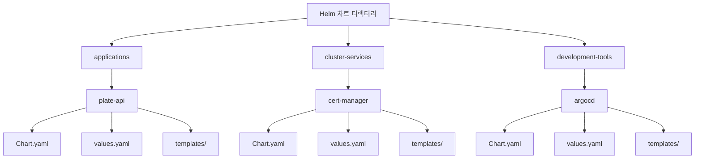
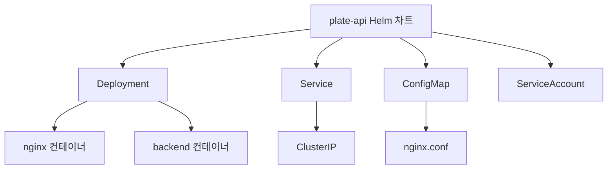
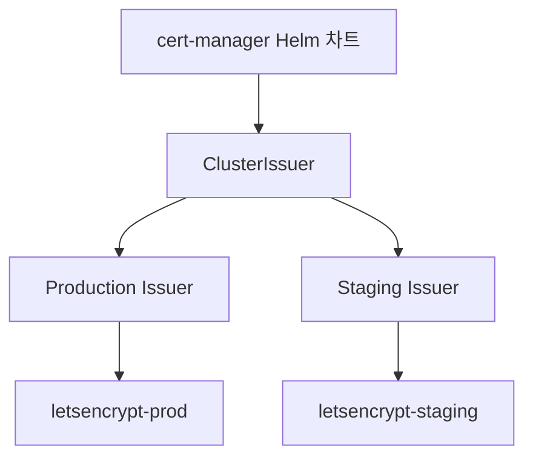
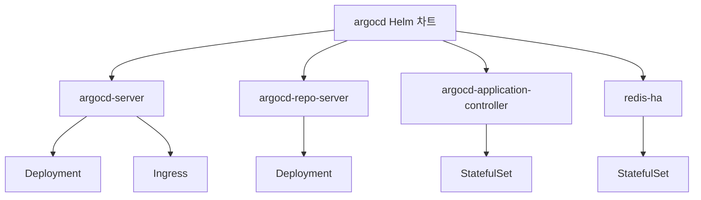
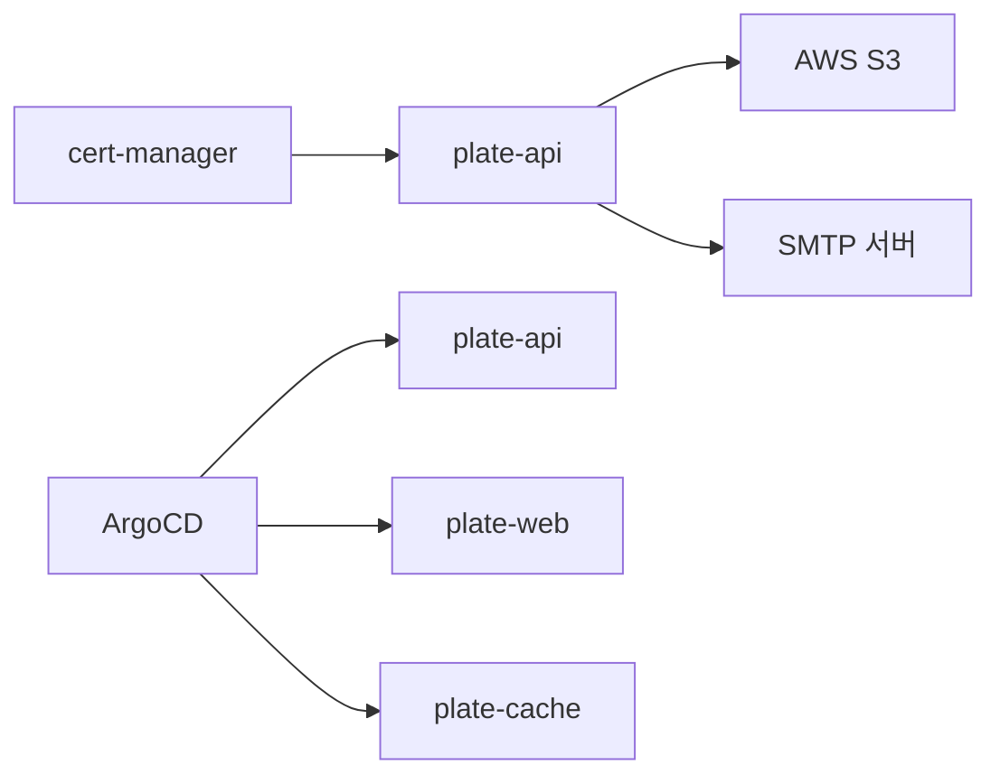

# 핵심 모듈

<cite>
**이 문서에서 참조한 파일**  
- [plate-api/Chart.yaml](file://helm/applications/plate-api/Chart.yaml)
- [plate-api/values.yaml](file://helm/applications/plate-api/values.yaml)
- [plate-api/values-stg.yaml](file://helm/applications/plate-api/values-stg.yaml)
- [plate-api/values-prod.yaml](file://helm/applications/plate-api/values-prod.yaml)
- [plate-api/templates/deployment.yaml](file://helm/applications/plate-api/templates/deployment.yaml)
- [plate-api/templates/service.yaml](file://helm/applications/plate-api/templates/service.yaml)
- [plate-api/templates/configmap.yaml](file://helm/applications/plate-api/templates/configmap.yaml)
- [cert-manager/Chart.yaml](file://helm/cluster-services/cert-manager/Chart.yaml)
- [cert-manager/values.yaml](file://helm/cluster-services/cert-manager/values.yaml)
- [cert-manager/templates/cluster-issuer-prod.yaml](file://helm/cluster-services/cert-manager/templates/cluster-issuer-prod.yaml)
- [cert-manager/templates/cluster-issuer-staging.yaml](file://helm/cluster-services/cert-manager/templates/cluster-issuer-staging.yaml)
- [argocd/Chart.yaml](file://helm/development-tools/argocd/Chart.yaml)
- [argocd/values.yaml](file://helm/development-tools/argocd/values.yaml)
- [argocd/templates/argocd-server/deployment.yaml](file://helm/development-tools/argocd/templates/argocd-server/deployment.yaml)
- [argocd/templates/argocd-server/ingress.yaml](file://helm/development-tools/argocd/templates/argocd-server/ingress.yaml)
</cite>

## 목차
1. [소개](#소개)
2. [Helm 차트 디렉터리 구조](#helm-차트-디렉터리-구조)
3. [핵심 모듈 구성 분석](#핵심-모듈-구성-분석)
4. [values.yaml 구성 방식](#valuesyaml-구성-방식)
5. [템플릿 구현 방식](#템플릿-구현-방식)
6. [모듈 간 의존성 및 설계 원칙](#모듈-간-의존성-및-설계-원칙)
7. [결론](#결론)

## 소개

이 문서는 Helm 기반의 핵심 모듈인 클러스터 서비스(cert-manager), 개발 도구(ArgoCD), 애플리케이션(plate-api)의 구조와 구성 방식을 설명합니다. 각 Helm 차트의 디렉터리 구조, values.yaml 구성 방식, 템플릿 구현 방식을 분석하고, 모듈 간 의존성 관계와 재사용성을 높이기 위한 설계 원칙을 제시합니다. 이를 통해 Helm 차트의 주요 기능과 아키텍처를 이해하고, 실제 운영 환경에서의 적용 가능성을 검토할 수 있습니다.

## Helm 차트 디렉터리 구조

프로젝트의 Helm 차트는 `helm/` 디렉터리 하위에 모듈별로 분류되어 있습니다. 주요 디렉터리 구조는 다음과 같습니다:

- `helm/applications/`: 애플리케이션 서비스 (예: plate-api, plate-web)
- `helm/cluster-services/`: 클러스터 수준 서비스 (예: cert-manager, metallb)
- `helm/development-tools/`: 개발 및 운영 도구 (예: argocd, grafana)

각 Helm 차트는 표준 디렉터리 구조를 따르며, 다음과 같은 구성 요소를 포함합니다:
- `Chart.yaml`: 차트의 메타데이터 정의
- `values.yaml`: 기본 설정 값
- `values-*.yaml`: 환경별 오버라이드 값 (예: stg, prod)
- `templates/`: Kubernetes 리소스 템플릿 파일
- `templates/*.yaml`: 실제 배포되는 Kubernetes 매니페스트 템플릿

**다이어그램 출처**
- [helm/applications/plate-api](file://helm/applications/plate-api)
- [helm/cluster-services/cert-manager](file://helm/cluster-services/cert-manager)
- [helm/development-tools/argocd](file://helm/development-tools/argocd)

## 핵심 모듈 구성 분석

### plate-api 애플리케이션

`plate-api`는 백엔드 애플리케이션을 위한 Helm 차트로, Nginx 프록시와 실제 애플리케이션 컨테이너로 구성된 서버 레이어를 배포합니다. 이 차트는 환경별로 다른 설정을 적용할 수 있도록 `values-stg.yaml`과 `values-prod.yaml`을 제공합니다.

**주요 특징:**
- Nginx 리버스 프록시를 통한 트래픽 라우팅
- 환경변수를 Secret으로 관리하여 보안 강화
- Ingress를 통해 외부 접근 가능 (프로덕션 환경에서 TLS 적용)

**다이어그램 출처**
- [plate-api/Chart.yaml](file://helm/applications/plate-api/Chart.yaml)
- [plate-api/templates/deployment.yaml](file://helm/applications/plate-api/templates/deployment.yaml)
- [plate-api/templates/service.yaml](file://helm/applications/plate-api/templates/service.yaml)
- [plate-api/templates/configmap.yaml](file://helm/applications/plate-api/templates/configmap.yaml)

**섹션 출처**
- [plate-api/Chart.yaml](file://helm/applications/plate-api/Chart.yaml)
- [plate-api/values.yaml](file://helm/applications/plate-api/values.yaml)
- [plate-api/templates/deployment.yaml](file://helm/applications/plate-api/templates/deployment.yaml)

### cert-manager 클러스터 서비스

`cert-manager`는 Let's Encrypt를 통한 SSL 인증서 자동 발급을 위한 클러스터 서비스입니다. 이 차트는 ACME 프로토콜을 사용하여 `ClusterIssuer` 리소스를 생성하고, Ingress 리소스에 자동으로 TLS 인증서를 적용합니다.

**주요 특징:**
- 프로덕션 및 스테이징 환경을 위한 별도의 `ClusterIssuer`
- HTTP-01 챌린지를 통한 도메인 소유권 검증
- cert-manager 외부 종속성으로 관리

**다이어그램 출처**
- [cert-manager/Chart.yaml](file://helm/cluster-services/cert-manager/Chart.yaml)
- [cert-manager/values.yaml](file://helm/cluster-services/cert-manager/values.yaml)
- [cert-manager/templates/cluster-issuer-prod.yaml](file://helm/cluster-services/cert-manager/templates/cluster-issuer-prod.yaml)
- [cert-manager/templates/cluster-issuer-staging.yaml](file://helm/cluster-services/cert-manager/templates/cluster-issuer-staging.yaml)

**섹션 출처**
- [cert-manager/Chart.yaml](file://helm/cluster-services/cert-manager/Chart.yaml)
- [cert-manager/values.yaml](file://helm/cluster-services/cert-manager/values.yaml)

### ArgoCD 개발 도구

`argocd`는 GitOps 기반의 지속적 배포 도구로, Kubernetes 애플리케이션을 선언적으로 관리합니다. 이 차트는 Argo CD의 핵심 컴포넌트들을 배포하며, RBAC, Ingress, Redis HA 등 다양한 기능을 포함합니다.

**주요 특징:**
- 다중 컴포넌트 구조 (server, repo-server, application-controller 등)
- 환경 변수 및 설정을 ConfigMap과 Secret으로 관리
- Ingress를 통한 외부 접근 및 TLS 지원

**다이어그램 출처**
- [argocd/Chart.yaml](file://helm/development-tools/argocd/Chart.yaml)
- [argocd/values.yaml](file://helm/development-tools/argocd/values.yaml)
- [argocd/templates/argocd-server/deployment.yaml](file://helm/development-tools/argocd/templates/argocd-server/deployment.yaml)
- [argocd/templates/argocd-server/ingress.yaml](file://helm/development-tools/argocd/templates/argocd-server/ingress.yaml)

**섹션 출처**
- [argocd/Chart.yaml](file://helm/development-tools/argocd/Chart.yaml)
- [argocd/values.yaml](file://helm/development-tools/argocd/values.yaml)

## values.yaml 구성 방식

Helm 차트의 `values.yaml` 파일은 기본 설정 값을 정의하며, 환경별로 오버라이드할 수 있는 구조를 제공합니다. 각 모듈의 values.yaml 구성 방식은 다음과 같습니다.

### plate-api의 values.yaml

`plate-api`의 `values.yaml`은 다음과 같은 주요 섹션으로 구성되어 있습니다:

- **replicaCount**: 복제본 수
- **image**: Nginx 이미지 정보
- **backend**: 백엔드 애플리케이션 이미지 및 리소스 설정
- **appSecrets**: Secret을 통한 환경변수 주입 설정
- **service**: Service 타입 및 포트 설정
- **ingress**: Ingress 활성화 여부 및 TLS 설정
- **resources**: Nginx 컨테이너의 리소스 요청 및 제한

환경별 오버라이드 파일(`values-stg.yaml`, `values-prod.yaml`)을 통해 개발 및 운영 환경에 맞는 설정을 적용할 수 있습니다.

**섹션 출처**
- [plate-api/values.yaml](file://helm/applications/plate-api/values.yaml)
- [plate-api/values-stg.yaml](file://helm/applications/plate-api/values-stg.yaml)
- [plate-api/values-prod.yaml](file://helm/applications/plate-api/values-prod.yaml)

### cert-manager의 values.yaml

`cert-manager`의 `values.yaml`은 클러스터 전반에 적용되는 `ClusterIssuer` 설정을 포함합니다:

- **cert-manager.install**: cert-manager 종속성 설치 여부
- **clusterIssuer.production**: 프로덕션용 Let's Encrypt Issuer 설정
- **clusterIssuer.staging**: 스테이징용 Let's Encrypt Issuer 설정

이 설정을 통해 모든 애플리케이션에서 동일한 인증서 발급 정책을 일관되게 적용할 수 있습니다.

**섹션 출처**
- [cert-manager/values.yaml](file://helm/cluster-services/cert-manager/values.yaml)

### argocd의 values.yaml

`argocd`의 `values.yaml`은 매우 복잡한 구조를 가지며, 다음과 같은 주요 섹션으로 구성됩니다:

- **global**: 모든 컴포넌트에 적용되는 전역 설정
- **configs**: Argo CD의 다양한 설정 (RBAC, SSO, 로깅 등)
- **server**: argocd-server 컴포넌트 설정
- **repoServer**: argocd-repo-server 설정
- **applicationController**: 애플리케이션 컨트롤러 설정
- **redis**: 내장 Redis 또는 외부 Redis 설정

이 구조는 높은 수준의 커스터마이징을 가능하게 하며, 다양한 운영 환경에 유연하게 대응할 수 있습니다.

**섹션 출처**
- [argocd/values.yaml](file://helm/development-tools/argocd/values.yaml)

## 템플릿 구현 방식

Helm 템플릿은 Go 템플릿 언어를 기반으로 하며, Kubernetes 리소스를 동적으로 생성합니다. 각 모듈의 템플릿 구현 방식은 다음과 같습니다.

### plate-api 템플릿

`plate-api`의 템플릿은 다음과 같은 특징을 가집니다:

- **Deployment**: Nginx와 백엔드 컨테이너를 하나의 Pod에 함께 배포
- **ConfigMap**: Nginx 설정을 `nginx.conf`로 정의
- **Service**: ClusterIP 타입의 서비스 생성
- **ServiceAccount**: 서비스 어카운트 생성

특히, `deployment.yaml`에서는 `appSecrets` 설정을 기반으로 환경변수를 동적으로 주입하며, `configmap.yaml`에서는 Nginx 설정을 템플릿화하여 다양한 라우팅 규칙을 지원합니다.

**섹션 출처**
- [plate-api/templates/deployment.yaml](file://helm/applications/plate-api/templates/deployment.yaml)
- [plate-api/templates/service.yaml](file://helm/applications/plate-api/templates/service.yaml)
- [plate-api/templates/configmap.yaml](file://helm/applications/plate-api/templates/configmap.yaml)

### cert-manager 템플릿

`cert-manager`의 템플릿은 조건부 렌더링을 적극 활용합니다:

- **cluster-issuer-prod.yaml**: `.Values.clusterIssuer.production.enabled` 조건에 따라 프로덕션 Issuer 생성
- **cluster-issuer-staging.yaml**: `.Values.clusterIssuer.staging.enabled` 조건에 따라 스테이징 Issuer 생성

이 방식을 통해 필요할 때만 리소스를 생성함으로써 불필요한 리소스 생성을 방지합니다.

**섹션 출처**
- [cert-manager/templates/cluster-issuer-prod.yaml](file://helm/cluster-services/cert-manager/templates/cluster-issuer-prod.yaml)
- [cert-manager/templates/cluster-issuer-staging.yaml](file://helm/cluster-services/cert-manager/templates/cluster-issuer-staging.yaml)

### argocd 템플릿

`argocd`의 템플릿은 고급 기능을 활용한 복잡한 구조를 가집니다:

- **mergeOverwrite**: 전역 설정과 컴포넌트별 설정을 병합
- **sha256sum**: ConfigMap 변경 감지를 위한 체크섬 생성
- **tpl**: 중첩된 템플릿 처리
- **ternary**: 조건부 값 선택

예를 들어, `argocd-server/deployment.yaml`에서는 전역 설정과 서버 전용 설정을 병합하여 최종 배포 설정을 생성하며, `ingress.yaml`에서는 HTTP/HTTPS 포트를 조건부로 선택합니다.

**섹션 출처**
- [argocd/templates/argocd-server/deployment.yaml](file://helm/development-tools/argocd/templates/argocd-server/deployment.yaml)
- [argocd/templates/argocd-server/ingress.yaml](file://helm/development-tools/argocd/templates/argocd-server/ingress.yaml)

## 모듈 간 의존성 및 설계 원칙

### 모듈 간 의존성 관계

각 Helm 모듈은 다음과 같은 의존성 관계를 가집니다:

- **cert-manager** → **plate-api**: plate-api의 Ingress 리소스가 cert-manager를 통해 TLS 인증서를 자동으로 발급받음
- **argocd** → **모든 애플리케이션**: ArgoCD가 모든 애플리케이션의 배포를 관리
- **plate-api** → **외부 서비스**: AWS S3, SMTP 등 외부 서비스에 대한 의존성

이러한 의존성은 Helm 차트의 `dependencies` 섹션 또는 애플리케이션 설정을 통해 명시됩니다.

**다이어그램 출처**
- [cert-manager/Chart.yaml](file://helm/cluster-services/cert-manager/Chart.yaml)
- [argocd/Chart.yaml](file://helm/development-tools/argocd/Chart.yaml)
- [plate-api/values.yaml](file://helm/applications/plate-api/values.yaml)

### 재사용성을 위한 설계 원칙

이 Helm 차트들은 다음과 같은 설계 원칙을 따릅니다:

1. **환경 분리**: `values-stg.yaml`, `values-prod.yaml`을 통해 개발 및 운영 환경을 분리
2. **모듈화**: 각 서비스를 독립적인 Helm 차트로 분리하여 재사용성 향상
3. **기본값 제공**: `values.yaml`에 합리적인 기본값을 제공하여 사용 편의성 확보
4. **조건부 렌더링**: `.Values`의 부울 값에 따라 리소스 생성 여부를 결정
5. **보안 고려**: 민감 정보는 Secret으로 관리하고, RBAC를 통해 접근 제어

이러한 원칙들은 Helm 차트의 유지보수성과 안정성을 높이며, 다양한 환경에서의 재사용을 가능하게 합니다.

**섹션 출처**
- [plate-api/values.yaml](file://helm/applications/plate-api/values.yaml)
- [cert-manager/values.yaml](file://helm/cluster-services/cert-manager/values.yaml)
- [argocd/values.yaml](file://helm/development-tools/argocd/values.yaml)

## 결론

이 문서는 Helm 기반의 핵심 모듈들인 cert-manager, ArgoCD, plate-api의 구조와 구성 방식을 분석하였습니다. 각 Helm 차트는 표준화된 디렉터리 구조를 따르며, `values.yaml`을 통한 설정 관리와 Go 템플릿을 활용한 동적 리소스 생성 기능을 제공합니다. 모듈 간 의존성은 명확하게 정의되어 있으며, 환경 분리, 모듈화, 보안 고려 등의 설계 원칙을 통해 재사용성과 유지보수성을 극대화하고 있습니다. 이러한 구조는 Kubernetes 기반의 애플리케이션을 효율적으로 관리하고 배포할 수 있는 기반을 제공합니다.