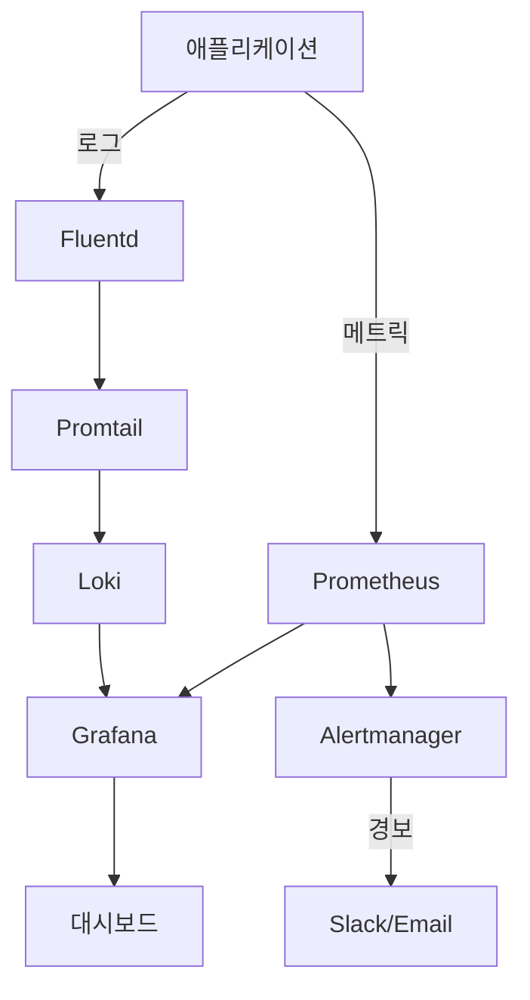

# 향후 개선 로드맵

<cite>
**이 문서에서 참조한 파일**  
- [README.md](file://README.md#L410-L417)
- [app-of-apps.yaml](file://environments/argocd/app-of-apps.yaml)
- [prometheus/Chart.yaml](file://helm/development-tools/prometheus/Chart.yaml)
- [grafana/Chart.yaml](file://helm/development-tools/grafana/Chart.yaml)
- [fluentd/Chart.yaml](file://helm/development-tools/fluentd/Chart.yaml)
- [promtail/Chart.yaml](file://helm/development-tools/promtail/Chart.yaml)
- [openbao-secrets-manager/Chart.yaml](file://helm/shared-configs/openbao-secrets-manager/Chart.yaml)
- [deploy-all.sh](file://scripts/deploy-all.sh)
- [deploy-libraries.sh](file://scripts/deploy-libraries.sh)
- [deploy-stg.sh](file://scripts/deploy-stg.sh)
- [deploy-prod.sh](file://scripts/deploy-prod.sh)
</cite>

## 목차
1. [소개](#소개)
2. [현재의 한계점과 개선 필요 영역](#현재의-한계점과-개선-필요-영역)
3. [향후 추가 기능 계획](#향후-추가-기능-계획)
4. [기술 스택 업그레이드 계획](#기술-스택-업그레이드-계획)
5. [보안 강화 계획](#보안-강화-계획)
6. [배포 자동화 수준 향상](#배포-자동화-수준-향상)
7. [모니터링 및 로깅 통합](#모니터링-및-로깅-통합)
8. [백업 및 복구 전략](#백업-및-복구-전략)
9. [운영 Runbook 및 장애 대응 절차](#운영-runbook-및-장애-대응-절차)
10. [결론](#결론)

## 소개

이 문서는 `prj-devops` 프로젝트의 향후 개선 로드맵을 설명합니다. 현재의 한계점과 개선이 필요한 부분, 향후 추가될 기능, 기술 스택의 업그레이드 계획 등을 소개합니다. 사용자와 기여자가 프로젝트의 방향성을 이해하고, 향후 개발에 참여할 수 있도록 돕는 것을 목표로 합니다.

**Section sources**
- [README.md](file://README.md#L410-L417)

## 현재의 한계점과 개선 필요 영역

현재 프로젝트는 GitOps 기반의 Helm 차트를 활용하여 Kubernetes 환경에 애플리케이션을 배포하는 구조를 갖추고 있으며, ArgoCD를 통해 App-of-Apps 패턴으로 다계층 배포를 구현하고 있습니다. 그러나 다음과 같은 한계점이 존재합니다:

1. **CI/CD 파이프라인 부재**: 현재는 수동 또는 반자동 스크립트 기반의 배포만 지원하며, 코드 변경 시 자동 빌드, 테스트, 이미지 스캔, 배포까지의 완전한 CI/CD 파이프라인이 구축되어 있지 않습니다.
2. **모니터링 및 로깅 미흡**: Prometheus, Grafana, Fluentd, Promtail 등의 구성 요소가 Helm 차트로 포함되어 있지만, 아직 실제 통합 및 운영이 이루어지지 않았습니다.
3. **백업 및 재해 복구 전략 미정립**: Velero 또는 스토리지 스냅샷 기반의 백업/복구 전략이 정의되어 있지 않아, 재해 발생 시 복구가 어려운 상태입니다.
4. **운영 문서 부족**: 장애 대응 절차, 운영 Runbook, 주요 메트릭 기준 등이 문서화되어 있지 않아, 운영 효율성이 낮습니다.

이러한 한계점들은 프로덕션 환경에서의 안정성과 신뢰성을 저하시킬 수 있으므로, 단계적으로 개선할 필요가 있습니다.

**Section sources**
- [README.md](file://README.md#L410-L417)

## 향후 추가 기능 계획

향후 프로젝트에 추가될 주요 기능은 다음과 같습니다:

1. **통합 CI/CD 파이프라인 도입**: Jenkins 또는 GitLab CI를 활용하여 코드 커밋 → 빌드 → 테스트 → 보안 스캔 → 이미지 푸시 → Helm 배포까지의 자동화된 파이프라인을 구축할 예정입니다.
2. **통합 테스트 및 부하 테스트 자동화**: 단위 테스트, 통합 테스트, 성능 테스트를 CI/CD 파이프라인에 통합하여, 배포 전 품질을 자동 검증할 수 있도록 합니다.
3. **환경 확장 및 관리 자동화**: 개발, 스테이징, 프로덕션 외에 QA, UAT 등 추가 환경을 지원하고, 각 환경에 대한 자동 생성 및 정책 적용을 도입할 계획입니다.
4. **서비스 메시 통합**: Istio 또는 Linkerd를 도입하여 트래픽 제어, 서비스 간 인증, 분산 추적 등의 고급 네트워킹 기능을 제공할 예정입니다.

이러한 기능들은 DevOps 프로세스의 자동화와 신뢰성을 크게 향상시킬 것입니다.

**Section sources**
- [README.md](file://README.md#L410-L417)

## 기술 스택 업그레이드 계획

현재 사용 중인 기술 스택은 안정적이지만, 지속적인 업그레이드가 필요합니다. 주요 업그레이드 계획은 다음과 같습니다:

1. **Helm 차트 버전 관리**: `helm/development-tools/` 디렉터리 내의 모든 Helm 차트를 최신 안정 버전으로 정기적으로 업데이트할 예정입니다. 예를 들어, Prometheus, Grafana, Fluentd 등은 주기적으로 보안 패치 및 기능 업데이트가 제공되므로, 이를 반영할 계획입니다.
2. **Kubernetes 버전 호환성 확보**: 클러스터 버전이 업그레이드될 경우, 모든 Helm 차트가 호환되도록 사전 검증 및 조정을 수행합니다.
3. **OpenBao 및 External Secrets 통합 강화**: `openbao-secrets-manager` 차트를 통해 외부 비밀 관리 시스템과의 통합을 강화하고, 다양한 백엔드(예: Hashicorp Vault, AWS Secrets Manager)를 지원할 수 있도록 확장할 예정입니다.

이러한 기술 스택의 지속적인 업그레이는 보안과 성능을 유지하는 데 필수적입니다.

**Section sources**
- [prometheus/Chart.yaml](file://helm/development-tools/prometheus/Chart.yaml)
- [grafana/Chart.yaml](file://helm/development-tools/grafana/Chart.yaml)
- [fluentd/Chart.yaml](file://helm/development-tools/fluentd/Chart.yaml)
- [promtail/Chart.yaml](file://helm/development-tools/promtail/Chart.yaml)
- [openbao-secrets-manager/Chart.yaml](file://helm/shared-configs/openbao-secrets-manager/Chart.yaml)

## 보안 강화 계획

보안은 프로덕션 환경에서 가장 중요한 요소 중 하나입니다. 현재는 비루트 컨테이너 실행, 리소스 제한, SSL 강제 등의 기본 보안 정책이 적용되어 있지만, 다음과 같은 추가 조치를 계획하고 있습니다:

1. **네트워크 정책 강화**: NetworkPolicy를 도입하여 Pod 간 트래픽을 세밀하게 제어하고, 불필요한 통신을 차단할 예정입니다.
2. **이미지 스캔 자동화**: CI/CD 파이프라인 내에서 Trivy 또는 Clair를 활용하여 컨테이너 이미지의 취약점을 자동 스캔하고, 취약성이 있는 이미지는 배포되지 않도록 차단합니다.
3. **RBAC 및 접근 제어 정책 강화**: 역할 기반 접근 제어(RBAC)를 더욱 세분화하고, 관리자 인터페이스에 대한 IP 제한을 적용하여 보안을 강화합니다.
4. **정기적인 보안 감사**: 주기적인 보안 감사를 통해 구성 오류, 노출된 비밀 정보, 권한 과다 부여 등을 점검하고 개선합니다.

이러한 조치들은 시스템의 전반적인 보안 수준을 크게 향상시킬 것입니다.

**Section sources**
- [README.md](file://README.md#L248-L258)

## 배포 자동화 수준 향상

현재는 `deploy-all.sh`, `deploy-stg.sh`, `deploy-prod.sh` 등의 스크립트를 통해 배포를 오케스트레이션하고 있으며, 프로덕션 배포 시 사용자 확인, 백업 생성, 헬스 체크 등의 안전장치를 포함하고 있습니다. 그러나 다음과 같은 자동화 수준 향상을 계획하고 있습니다:

1. **ArgoCD 기반 GitOps 완전 자동화**: 현재는 일부 컴포넌트가 Helm CLI 기반으로 배포되지만, 향후 모든 컴포넌트를 ArgoCD를 통해 GitOps 방식으로 자동 동기화되도록 전환할 예정입니다.
2. **Canary 및 Blue-Green 배포 도입**: Argo Rollouts를 활용하여 카나리 배포 및 블루-그린 배포를 지원하여, 배포 중 장애 발생 시 영향을 최소화할 수 있도록 합니다.
3. **자동 롤백 기능 강화**: 모니터링 시스템과 연동하여, 배포 후 메트릭 기반으로 이상 감지 시 자동 롤백이 가능하도록 구현할 계획입니다.

이러한 자동화는 배포의 신뢰성과 속도를 동시에 향상시킵니다.

**Section sources**
- [deploy-all.sh](file://scripts/deploy-all.sh)
- [deploy-libraries.sh](file://scripts/deploy-libraries.sh)
- [deploy-stg.sh](file://scripts/deploy-stg.sh)
- [deploy-prod.sh](file://scripts/deploy-prod.sh)

## 모니터링 및 로깅 통합

현재 Helm 차트로 포함된 모니터링 도구들을 실제 운영 환경에 통합하는 것이 주요 목표입니다. 구체적인 계획은 다음과 같습니다:

**Diagram sources**
- [prometheus/Chart.yaml](file://helm/development-tools/prometheus/Chart.yaml)
- [grafana/Chart.yaml](file://helm/development-tools/grafana/Chart.yaml)
- [fluentd/Chart.yaml](file://helm/development-tools/fluentd/Chart.yaml)
- [promtail/Chart.yaml](file://helm/development-tools/promtail/Chart.yaml)

- **Prometheus**: 애플리케이션 및 클러스터 메트릭 수집
- **Grafana**: 통합 대시보드를 통한 시각화
- **Fluentd/Promtail/Loki**: 중앙 집중식 로깅 시스템 구축
- **Alertmanager**: 임계값 기반 경보 및 알림 전송

이러한 통합은 시스템 가시성과 장애 대응 속도를 크게 향상시킵니다.

**Section sources**
- [README.md](file://README.md#L413)
- [prometheus/Chart.yaml](file://helm/development-tools/prometheus/Chart.yaml)
- [grafana/Chart.yaml](file://helm/development-tools/grafana/Chart.yaml)
- [fluentd/Chart.yaml](file://helm/development-tools/fluentd/Chart.yaml)
- [promtail/Chart.yaml](file://helm/development-tools/promtail/Chart.yaml)

## 백업 및 복구 전략

재해 복구를 위한 백업 전략은 다음과 같이 구현될 예정입니다:

1. **Velero 도입**: 클러스터 전체의 리소스 및 영구 볼륨(PV)을 정기적으로 백업하고, 재해 발생 시 빠르게 복구할 수 있도록 합니다.
2. **스냅샷 기반 백업**: 스토리지 프로비저너(NFS, OpenEBS 등)를 활용하여 볼륨 수준의 스냅샷을 주기적으로 생성합니다.
3. **백업 검증 자동화**: 백업된 데이터의 무결성을 주기적으로 검증하고, 복구 테스트를 자동으로 수행하여 신뢰성을 확보합니다.

이러한 전략은 데이터 손실 위험을 최소화하고, 비즈니스 연속성을 보장합니다.

**Section sources**
- [README.md](file://README.md#L414)

## 운영 Runbook 및 장애 대응 절차

운영 효율성을 높이기 위해 다음과 같은 문서화 작업을 진행할 예정입니다:

1. **운영 Runbook 작성**: 일반적인 운영 작업(예: 배포, 롤백, 확장, 모니터링 확인)에 대한 표준 절차를 문서화합니다.
2. **장애 대응 매뉴얼**: 주요 장애 유형(예: 인증서 문제, Ingress 오류, Pod 크래시)에 대한 진단 및 해결 절차를 체계적으로 정리합니다.
3. **점검 항목 목록**: 배포 전/후 점검 항목, 정기 점검 항목 등을 리스트 형태로 제공하여 누락을 방지합니다.

이러한 문서들은 신규 운영자 교육 및 장애 대응 속도 향상에 큰 도움이 됩니다.

**Section sources**
- [README.md](file://README.md#L416)
- [README.md](file://README.md#L337-L354)

## 결론

`prj-devops` 프로젝트는 현재 안정적인 GitOps 기반 배포 구조를 갖추고 있으며, 향후 CI/CD 자동화, 모니터링 통합, 보안 강화, 백업 전략 수립 등의 개선을 통해 프로덕션 환경에서의 신뢰성과 운영 효율성을 더욱 강화할 계획입니다. 이러한 로드맵은 사용자와 기여자가 프로젝트의 방향성을 이해하고, 함께 개선에 참여할 수 있도록 돕는 데 목적이 있습니다.