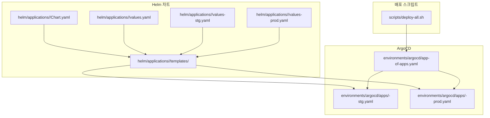
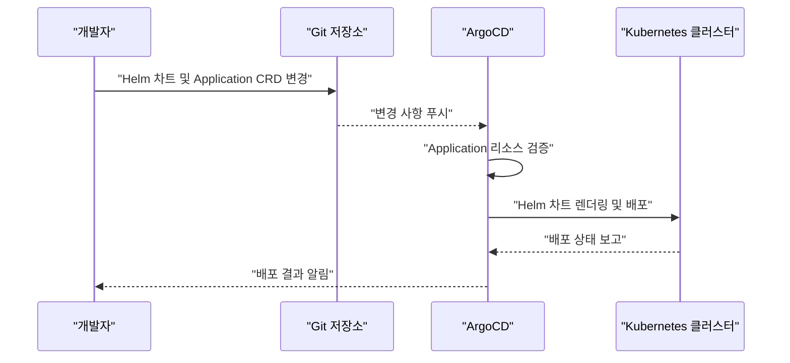
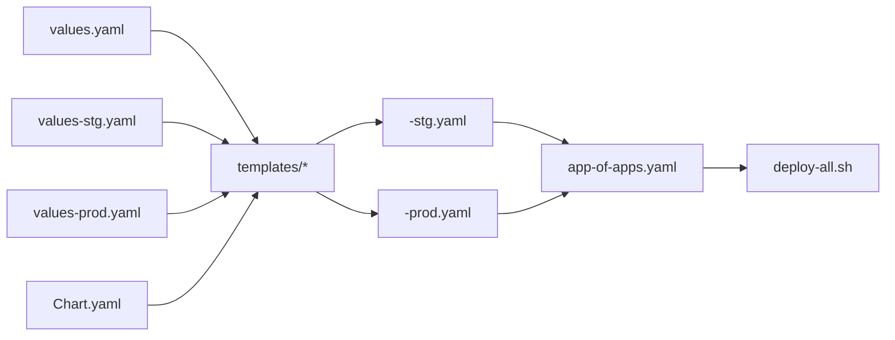

# 새 애플리케이션 추가 절차

<cite>
**이 문서에서 참조하는 파일**
- [helm/applications/plate-api/Chart.yaml](file://helm/applications/plate-api/Chart.yaml)
- [helm/applications/plate-api/values.yaml](file://helm/applications/plate-api/values.yaml)
- [helm/applications/plate-api/values-stg.yaml](file://helm/applications/plate-api/values-stg.yaml)
- [helm/applications/plate-api/values-prod.yaml](file://helm/applications/plate-api/values-prod.yaml)
- [helm/applications/plate-api/templates/deployment.yaml](file://helm/applications/plate-api/templates/deployment.yaml)
- [helm/applications/plate-api/templates/service.yaml](file://helm/applications/plate-api/templates/service.yaml)
- [helm/applications/plate-api/templates/configmap.yaml](file://helm/applications/plate-api/templates/configmap.yaml)
- [helm/applications/plate-api/templates/serviceaccount.yaml](file://helm/applications/plate-api/templates/serviceaccount.yaml)
- [environments/argocd/apps/plate-api-stg.yaml](file://environments/argocd/apps/plate-api-stg.yaml)
- [environments/argocd/apps/plate-api-prod.yaml](file://environments/argocd/apps/plate-api-prod.yaml)
- [environments/argocd/app-of-apps.yaml](file://environments/argocd/app-of-apps.yaml)
- [scripts/deploy-all.sh](file://scripts/deploy-all.sh)
</cite>

## 목차
1. [소개](#소개)
2. [프로젝트 구조](#프로젝트-구조)
3. [핵심 구성 요소](#핵심-구성-요소)
4. [아키텍처 개요](#아키텍처-개요)
5. [상세 구성 요소 분석](#상세-구성-요소-분석)
6. [의존성 분석](#의존성-분석)
7. [성능 고려사항](#성능-고려사항)
8. [장애 진단 가이드](#장애-진단-가이드)
9. [결론](#결론)
10. [부록](#부록)

## 소개
이 문서는 기존 애플리케이션(예: plate-web, plate-api 등) 외에 새로운 애플리케이션을 시스템에 통합하는 절차를 단계별로 안내합니다. 새 애플리케이션을 위한 Helm 차트를 helm/applications/ 디렉토리에 생성하고, Chart.yaml과 values.yaml 파일의 구조를 설명하며, Kubernetes 리소스(Templates)를 정의하는 방법을 제시합니다. 이후 environments/argocd/apps/ 디렉토리에 스테이징 및 프로덕션 환경을 위한 ArgoCD Application CRD 파일(예: myapp-stg.yaml, myapp-prod.yaml)을 생성하고, environments/argocd/app-of-apps.yaml의 애플리케이션 목록에 추가하는 과정을 안내합니다. 마지막으로, 새 애플리케션이 기존 deploy-all.sh 스크립트를 통해 자동 배포되도록 하는 통합 방법을 포함합니다. 실제 코드 예시로 plate-api 차트의 구조를 참조하여 설명합니다.

## 프로젝트 구조
새 애플리케이션 통합은 다음과 같은 디렉토리 구조를 따릅니다:
- Helm 차트: helm/applications/<your-app>/
- ArgoCD Application CRD: environments/argocd/apps/<your-app>-<env>.yaml
- App of Apps: environments/argocd/app-of-apps.yaml
- 배포 스크립트: scripts/deploy-all.sh

**도표 출처**
- [helm/applications/plate-api/Chart.yaml](file://helm/applications/plate-api/Chart.yaml#L1-L16)
- [helm/applications/plate-api/values.yaml](file://helm/applications/plate-api/values.yaml#L1-L116)
- [helm/applications/plate-api/values-stg.yaml](file://helm/applications/plate-api/values-stg.yaml#L1-L30)
- [helm/applications/plate-api/values-prod.yaml](file://helm/applications/plate-api/values-prod.yaml#L1-L31)
- [helm/applications/plate-api/templates/deployment.yaml](file://helm/applications/plate-api/templates/deployment.yaml#L1-L61)
- [helm/applications/plate-api/templates/service.yaml](file://helm/applications/plate-api/templates/service.yaml#L1-L15)
- [helm/applications/plate-api/templates/configmap.yaml](file://helm/applications/plate-api/templates/configmap.yaml#L1-L83)
- [helm/applications/plate-api/templates/serviceaccount.yaml](file://helm/applications/plate-api/templates/serviceaccount.yaml#L1-L6)
- [environments/argocd/apps/plate-api-stg.yaml](file://environments/argocd/apps/plate-api-stg.yaml#L1-L62)
- [environments/argocd/apps/plate-api-prod.yaml](file://environments/argocd/apps/plate-api-prod.yaml#L1-L62)
- [environments/argocd/app-of-apps.yaml](file://environments/argocd/app-of-apps.yaml#L1-L35)
- [scripts/deploy-all.sh](file://scripts/deploy-all.sh#L1-L279)

**섹션 출처**
- [helm/applications/plate-api/Chart.yaml](file://helm/applications/plate-api/Chart.yaml#L1-L16)
- [helm/applications/plate-api/values.yaml](file://helm/applications/plate-api/values.yaml#L1-L116)
- [helm/applications/plate-api/values-stg.yaml](file://helm/applications/plate-api/values-stg.yaml#L1-L30)
- [helm/applications/plate-api/values-prod.yaml](file://helm/applications/plate-api/values-prod.yaml#L1-L31)
- [helm/applications/plate-api/templates/deployment.yaml](file://helm/applications/plate-api/templates/deployment.yaml#L1-L61)
- [helm/applications/plate-api/templates/service.yaml](file://helm/applications/plate-api/templates/service.yaml#L1-L15)
- [helm/applications/plate-api/templates/configmap.yaml](file://helm/applications/plate-api/templates/configmap.yaml#L1-L83)
- [helm/applications/plate-api/templates/serviceaccount.yaml](file://helm/applications/plate-api/templates/serviceaccount.yaml#L1-L6)
- [environments/argocd/apps/plate-api-stg.yaml](file://environments/argocd/apps/plate-api-stg.yaml#L1-L62)
- [environments/argocd/apps/plate-api-prod.yaml](file://environments/argocd/apps/plate-api-prod.yaml#L1-L62)
- [environments/argocd/app-of-apps.yaml](file://environments/argocd/app-of-apps.yaml#L1-L35)
- [scripts/deploy-all.sh](file://scripts/deploy-all.sh#L1-L279)

## 핵심 구성 요소
- Helm 차트: 애플리케이션의 버전, 이름, 의존성, 앱 버전 정보를 정의하는 Chart.yaml과, 기본값/환경별 오버라이드를 담당하는 values.yaml, values-<env>.yaml입니다.
- Kubernetes 리소스 템플릿: Deployment, Service, ConfigMap, ServiceAccount 등이 정의되어 있으며, 템플릿은 values를 통해 동적으로 생성됩니다.
- ArgoCD Application CRD: Git 저장소의 특정 경로를 추적하고, 환경별 values 파일을 사용하여 배포하는 Application 리소스입니다.
- App of Apps: environments/argocd/apps/ 디렉토리에 있는 모든 Application을 한 번에 관리하는 메인 Application입니다.
- 배포 스크립트: deploy-all.sh는 라이브러리 배포 후 애플리케이션 배포를 오케스트레이션하며, 스테이징/프로덕션 환경에 따라 다른 배포 스크립트를 호출합니다.

**섹션 출처**
- [helm/applications/plate-api/Chart.yaml](file://helm/applications/plate-api/Chart.yaml#L1-L16)
- [helm/applications/plate-api/values.yaml](file://helm/applications/plate-api/values.yaml#L1-L116)
- [helm/applications/plate-api/values-stg.yaml](file://helm/applications/plate-api/values-stg.yaml#L1-L30)
- [helm/applications/plate-api/values-prod.yaml](file://helm/applications/plate-api/values-prod.yaml#L1-L31)
- [helm/applications/plate-api/templates/deployment.yaml](file://helm/applications/plate-api/templates/deployment.yaml#L1-L61)
- [helm/applications/plate-api/templates/service.yaml](file://helm/applications/plate-api/templates/service.yaml#L1-L15)
- [helm/applications/plate-api/templates/configmap.yaml](file://helm/applications/plate-api/templates/configmap.yaml#L1-L83)
- [helm/applications/plate-api/templates/serviceaccount.yaml](file://helm/applications/plate-api/templates/serviceaccount.yaml#L1-L6)
- [environments/argocd/apps/plate-api-stg.yaml](file://environments/argocd/apps/plate-api-stg.yaml#L1-L62)
- [environments/argocd/apps/plate-api-prod.yaml](file://environments/argocd/apps/plate-api-prod.yaml#L1-L62)
- [environments/argocd/app-of-apps.yaml](file://environments/argocd/app-of-apps.yaml#L1-L35)
- [scripts/deploy-all.sh](file://scripts/deploy-all.sh#L1-L279)

## 아키텍처 개요
새 애플리케이션 통합 절차는 다음과 같은 흐름으로 진행됩니다:
1. Helm 차트 생성: helm/applications/<your-app>/ 하위에 Chart.yaml, values.yaml, values-stg.yaml, values-prod.yaml, templates/를 추가합니다.
2. Kubernetes 리소스 정의: templates/에 Deployment, Service, ConfigMap, ServiceAccount 등을 정의합니다.
3. ArgoCD Application 생성: environments/argocd/apps/<your-app>-stg.yaml, <your-app>-prod.yaml을 생성하고, 각각 차트 경로와 환경별 values 파일을 지정합니다.
4. App of Apps에 추가: environments/argocd/app-of-apps.yaml에 <your-app> 관련 Application을 추가합니다.
5. 배포 자동화: deploy-all.sh를 통해 라이브러리 배포 후 애플리케이션 배포가 자동화되며, 스테이징/프로덕션 환경에 따라 다른 배포 스크립트가 실행됩니다.

**도표 출처**
- [environments/argocd/apps/plate-api-stg.yaml](file://environments/argocd/apps/plate-api-stg.yaml#L1-L62)
- [environments/argocd/apps/plate-api-prod.yaml](file://environments/argocd/apps/plate-api-prod.yaml#L1-L62)
- [environments/argocd/app-of-apps.yaml](file://environments/argocd/app-of-apps.yaml#L1-L35)
- [scripts/deploy-all.sh](file://scripts/deploy-all.sh#L1-L279)

## 상세 구성 요소 분석

### Helm 차트 생성 절차
- 디렉토리 구조
  - helm/applications/<your-app>/Chart.yaml: 차트 이름, 버전, 앱 버전, 키워드, 소스, 메인테이너 정보를 정의합니다.
  - helm/applications/<your-app>/values.yaml: 기본값을 정의합니다. replicaCount, image, backend, appSecrets, service, ingress, resources 등의 키를 포함합니다.
  - helm/applications/<your-app>/values-stg.yaml: 스테이징 환경에 대한 오버라이드 값을 정의합니다. 예: nameOverride, replicaCount, image repository/tag, service type, ingress enable 여부, resources 등.
  - helm/applications/<your-app>/values-prod.yaml: 프로덕션 환경에 대한 오버라이드 값을 정의합니다. 예: replicaCount, image repository/tag, service type, ingress enable 여부, resources 등.
  - helm/applications/<your-app>/templates/: Deployment, Service, ConfigMap, ServiceAccount 등의 Kubernetes 리소스 템플릿을 포함합니다.

- Chart.yaml 구조
  - 필수 필드: apiVersion, name, description, type, version, appVersion, keywords, home, sources, maintainers.
  - 참고: plate-api 차트의 구조를 참조하여 작성합니다.

- values.yaml 구조
  - 기본값: replicaCount, image, backend(image, port, resources), appSecrets(enabled, secretName, envVars), service(type, port, targetPort), ingress(enabled, className, annotations, hosts, tls), resources(limits, requests).
  - 환경별 오버라이드: values-stg.yaml, values-prod.yaml은 차트 루트 기준 상대 경로로 지정됩니다.

- Kubernetes 리소스 템플릿
  - Deployment: replicas, selector, template(spec), containers(image, ports, env, resources), imagePullSecrets 사용 여부에 따라 설정됩니다.
  - Service: type, ports, selector를 정의합니다.
  - ConfigMap: Nginx 설정(conf)을 제공하며, backend 포트와 엔드포인트(/health, /backend-health, /)를 포함합니다.
  - ServiceAccount: 기본 ServiceAccount를 생성합니다.

**섹션 출처**
- [helm/applications/plate-api/Chart.yaml](file://helm/applications/plate-api/Chart.yaml#L1-L16)
- [helm/applications/plate-api/values.yaml](file://helm/applications/plate-api/values.yaml#L1-L116)
- [helm/applications/plate-api/values-stg.yaml](file://helm/applications/plate-api/values-stg.yaml#L1-L30)
- [helm/applications/plate-api/values-prod.yaml](file://helm/applications/plate-api/values-prod.yaml#L1-L31)
- [helm/applications/plate-api/templates/deployment.yaml](file://helm/applications/plate-api/templates/deployment.yaml#L1-L61)
- [helm/applications/plate-api/templates/service.yaml](file://helm/applications/plate-api/templates/service.yaml#L1-L15)
- [helm/applications/plate-api/templates/configmap.yaml](file://helm/applications/plate-api/templates/configmap.yaml#L1-L83)
- [helm/applications/plate-api/templates/serviceaccount.yaml](file://helm/applications/plate-api/templates/serviceaccount.yaml#L1-L6)

### ArgoCD Application CRD 생성 절차
- 스테이징/프로덕션 Application CRD
  - environments/argocd/apps/<your-app>-stg.yaml: repoURL, path(helm/applications/<your-app>), targetRevision(main), helm.valueFiles(values-stg.yaml), destination(namespace: <your-app>-stg), syncPolicy(automated, prune, selfHeal, syncOptions, retry)를 정의합니다.
  - environments/argocd/apps/<your-app>-prod.yaml: repoURL, path(helm/applications/<your-app>), targetRevision(main), helm.valueFiles(values-prod.yaml), destination(namespace: <your-app>-prod), syncPolicy(automated, prune, selfHeal, syncOptions, retry)를 정의합니다.

- App of Apps 패턴
  - environments/argocd/app-of-apps.yaml: environments/argocd/apps 디렉토리를 추적하며, automated, prune, selfHeal, syncOptions(CreateNamespace=true)를 설정합니다. 이 파일은 모든 환경의 Application을 한 번에 관리합니다.

**섹션 출처**
- [environments/argocd/apps/plate-api-stg.yaml](file://environments/argocd/apps/plate-api-stg.yaml#L1-L62)
- [environments/argocd/apps/plate-api-prod.yaml](file://environments/argocd/apps/plate-api-prod.yaml#L1-L62)
- [environments/argocd/app-of-apps.yaml](file://environments/argocd/app-of-apps.yaml#L1-L35)

### 배포 자동화 통합 절차
- deploy-all.sh
  - 환경 파라미터(staging/production)를 받아 라이브러리 배포 후 애플리케이션 배포를 오케스트레이션합니다.
  - 스테이징/프로덕션 환경에 따라 deploy-stg.sh/deploy-prod.sh를 호출합니다.
  - 건강 상태 확인(health check)을 수행하고, 배포 요약을 출력합니다.

- 통합 방법
  - deploy-all.sh는 environments/argocd/app-of-apps.yaml을 통해 App of Apps를 관리하므로, 새 Application CRD를 environments/argocd/apps/에 추가하면 자동으로 배포 대상에 포함됩니다.
  - deploy-all.sh는 라이브러리 배포 후 애플리케이션 배포를 수행하므로, 새 애플리케이션도 해당 흐름에 맞게 배포됩니다.

**섹션 출처**
- [scripts/deploy-all.sh](file://scripts/deploy-all.sh#L1-L279)
- [environments/argocd/app-of-apps.yaml](file://environments/argocd/app-of-apps.yaml#L1-L35)

## 의존성 분석
- Helm 차트 ↔ Kubernetes 리소스 템플릿: values.yaml에 정의된 키를 템플릿에서 사용하여 리소스를 동적으로 생성합니다.
- ArgoCD Application ↔ Helm 차트: Application CRD는 Chart.yaml의 path를 기반으로 차트를 추적하고, values-stg.yaml/values-prod.yaml을 사용하여 렌더링합니다.
- App of Apps ↔ Application CRD: app-of-apps.yaml은 environments/argocd/apps/ 디렉토리에 있는 모든 Application을 관리합니다.
- 배포 스크립트 ↔ App of Apps: deploy-all.sh는 app-of-apps.yaml을 통해 모든 Application을 배포 대상으로 인식합니다.

**도표 출처**
- [helm/applications/plate-api/values.yaml](file://helm/applications/plate-api/values.yaml#L1-L116)
- [helm/applications/plate-api/values-stg.yaml](file://helm/applications/plate-api/values-stg.yaml#L1-L30)
- [helm/applications/plate-api/values-prod.yaml](file://helm/applications/plate-api/values-prod.yaml#L1-L31)
- [helm/applications/plate-api/Chart.yaml](file://helm/applications/plate-api/Chart.yaml#L1-L16)
- [helm/applications/plate-api/templates/deployment.yaml](file://helm/applications/plate-api/templates/deployment.yaml#L1-L61)
- [helm/applications/plate-api/templates/service.yaml](file://helm/applications/plate-api/templates/service.yaml#L1-L15)
- [helm/applications/plate-api/templates/configmap.yaml](file://helm/applications/plate-api/templates/configmap.yaml#L1-L83)
- [helm/applications/plate-api/templates/serviceaccount.yaml](file://helm/applications/plate-api/templates/serviceaccount.yaml#L1-L6)
- [environments/argocd/apps/plate-api-stg.yaml](file://environments/argocd/apps/plate-api-stg.yaml#L1-L62)
- [environments/argocd/apps/plate-api-prod.yaml](file://environments/argocd/apps/plate-api-prod.yaml#L1-L62)
- [environments/argocd/app-of-apps.yaml](file://environments/argocd/app-of-apps.yaml#L1-L35)
- [scripts/deploy-all.sh](file://scripts/deploy-all.sh#L1-L279)

**섹션 출처**
- [helm/applications/plate-api/values.yaml](file://helm/applications/plate-api/values.yaml#L1-L116)
- [helm/applications/plate-api/values-stg.yaml](file://helm/applications/plate-api/values-stg.yaml#L1-L30)
- [helm/applications/plate-api/values-prod.yaml](file://helm/applications/plate-api/values-prod.yaml#L1-L31)
- [helm/applications/plate-api/Chart.yaml](file://helm/applications/plate-api/Chart.yaml#L1-L16)
- [helm/applications/plate-api/templates/deployment.yaml](file://helm/applications/plate-api/templates/deployment.yaml#L1-L61)
- [helm/applications/plate-api/templates/service.yaml](file://helm/applications/plate-api/templates/service.yaml#L1-L15)
- [helm/applications/plate-api/templates/configmap.yaml](file://helm/applications/plate-api/templates/configmap.yaml#L1-L83)
- [helm/applications/plate-api/templates/serviceaccount.yaml](file://helm/applications/plate-api/templates/serviceaccount.yaml#L1-L6)
- [environments/argocd/apps/plate-api-stg.yaml](file://environments/argocd/apps/plate-api-stg.yaml#L1-L62)
- [environments/argocd/apps/plate-api-prod.yaml](file://environments/argocd/apps/plate-api-prod.yaml#L1-L62)
- [environments/argocd/app-of-apps.yaml](file://environments/argocd/app-of-apps.yaml#L1-L35)
- [scripts/deploy-all.sh](file://scripts/deploy-all.sh#L1-L279)

## 성능 고려사항
- 자동 동기화(syncPolicy.automated)는 Git 변경 시 즉시 클러스터에 반영되며, prune/selfHeal 설정은 불필요한 리소스 제거 및 수동 변경 복구에 도움이 됩니다.
- syncOptions.ApplyOutOfSyncOnly는 변경된 리소스만 적용하여 배포 성능을 최적화합니다.
- retry.backoff는 배포 실패 시 점진적인 대기 시간을 두어 재시도합니다.
- App of Apps는 모든 Application을 한 번에 관리하므로, 배포 시 전체 흐름을 파악하고 필요한 경우 개별 Application을 분리하거나 순서를 조정할 수 있습니다.

**섹션 출처**
- [environments/argocd/apps/plate-api-stg.yaml](file://environments/argocd/apps/plate-api-stg.yaml#L32-L62)
- [environments/argocd/apps/plate-api-prod.yaml](file://environments/argocd/apps/plate-api-prod.yaml#L32-L62)
- [environments/argocd/app-of-apps.yaml](file://environments/argocd/app-of-apps.yaml#L1-L35)

## 장애 진단 가이드
- ArgoCD Application 상태 확인
  - Application 리소스의 syncPolicy, destination, source 정보를 확인하여 Git 경로와 values 파일이 올바르게 지정되었는지 검토합니다.
  - Automated, prune, selfHeal, syncOptions, retry 설정이 의도에 맞게 적용되었는지 확인합니다.

- 배포 스크립트 실행
  - deploy-all.sh는 라이브러리 배포 후 애플리케이션 배포를 오케스트레이션합니다. 환경 파라미터(staging/production)에 따라 다른 배포 스크립트를 호출하므로, 올바른 환경을 선택했는지 확인합니다.
  - 건강 상태 확인(health check)을 통해 cert-manager, 애플리케이션 Pod 상태를 점검합니다.

- Helm 차트 및 템플릿 검토
  - values-stg.yaml/values-prod.yaml의 오버라이드 값이 템플릿에 올바르게 반영되는지 확인합니다.
  - Deployment, Service, ConfigMap, ServiceAccount 템플릿이 values에 정의된 키를 사용하고 있는지 검토합니다.

**섹션 출처**
- [environments/argocd/apps/plate-api-stg.yaml](file://environments/argocd/apps/plate-api-stg.yaml#L1-L62)
- [environments/argocd/apps/plate-api-prod.yaml](file://environments/argocd/apps/plate-api-prod.yaml#L1-L62)
- [scripts/deploy-all.sh](file://scripts/deploy-all.sh#L183-L215)
- [helm/applications/plate-api/values-stg.yaml](file://helm/applications/plate-api/values-stg.yaml#L1-L30)
- [helm/applications/plate-api/values-prod.yaml](file://helm/applications/plate-api/values-prod.yaml#L1-L31)
- [helm/applications/plate-api/templates/deployment.yaml](file://helm/applications/plate-api/templates/deployment.yaml#L1-L61)
- [helm/applications/plate-api/templates/service.yaml](file://helm/applications/plate-api/templates/service.yaml#L1-L15)
- [helm/applications/plate-api/templates/configmap.yaml](file://helm/applications/plate-api/templates/configmap.yaml#L1-L83)
- [helm/applications/plate-api/templates/serviceaccount.yaml](file://helm/applications/plate-api/templates/serviceaccount.yaml#L1-L6)

## 결론
새 애플리케이션을 통합하기 위해서는 Helm 차트를 생성하고, Kubernetes 리소스 템플릿을 정의한 후, ArgoCD Application CRD를 통해 Git 경로와 환경별 values 파일을 지정해야 합니다. environments/argocd/app-of-apps.yaml에 Application을 추가하면 자동 배포 대상에 포함되며, deploy-all.sh를 통해 라이브러리 배포 후 애플리케이션 배포가 오케스트레이션됩니다. plate-api 차트 구조를 참고하여 새 애플리케이션을 일관되게 구성하면, 배포 흐름과 운영 효율성을 높일 수 있습니다.

## 부록
- 실습 가이드 요약
  - Helm 차트 생성: helm/applications/<your-app>/Chart.yaml, values.yaml, values-stg.yaml, values-prod.yaml, templates/ 디렉토리 생성
  - Kubernetes 리소스 템플릿: Deployment, Service, ConfigMap, ServiceAccount 템플릿 작성
  - ArgoCD Application CRD: environments/argocd/apps/<your-app>-stg.yaml, <your-app>-prod.yaml 생성
  - App of Apps: environments/argocd/app-of-apps.yaml에 Application 추가
  - 배포 자동화: deploy-all.sh 실행

[이 섹션은 개념적 내용을 포함하므로 출처 없음]