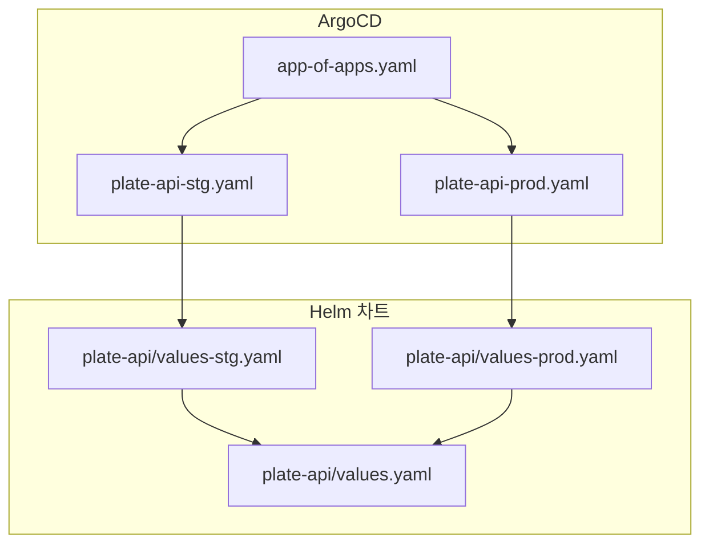
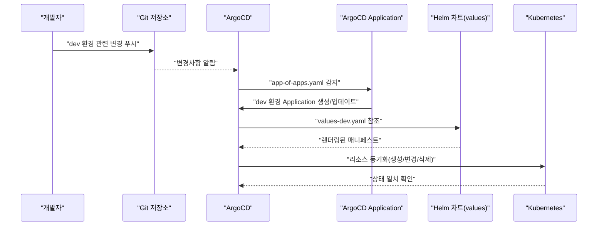
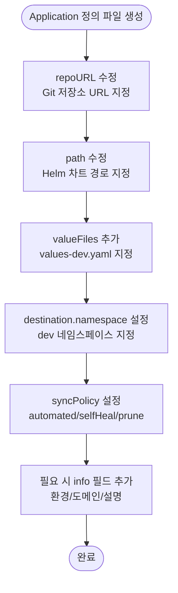
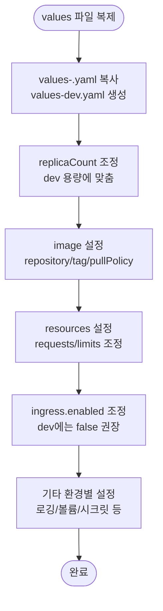
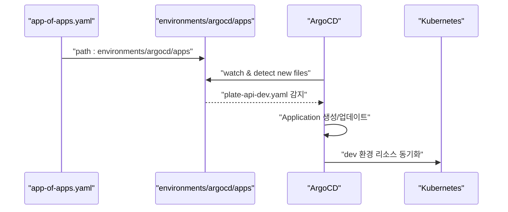
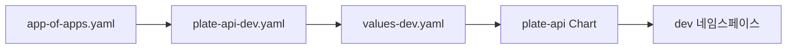

# 새 환경 추가 방법

<cite>
**이 문서에서 참조하는 파일들**
- [environments/argocd/README.md](file://environments/argocd/README.md)
- [environments/argocd/app-of-apps.yaml](file://environments/argocd/app-of-apps.yaml)
- [environments/argocd/apps/plate-api-stg.yaml](file://environments/argocd/apps/plate-api-stg.yaml)
- [environments/argocd/apps/plate-api-prod.yaml](file://environments/argocd/apps/plate-api-prod.yaml)
- [helm/applications/plate-server/values.yaml](file://helm/applications/plate-server/values.yaml)
- [helm/applications/plate-server/values-stg.yaml](file://helm/applications/plate-server/values-stg.yaml)
- [helm/applications/plate-server/values-prod.yaml](file://helm/applications/plate-server/values-prod.yaml)
- [helm/applications/plate-web/values-stg.yaml](file://helm/applications/plate-web/values-stg.yaml)
- [helm/applications/plate-web/values-prod.yaml](file://helm/applications/plate-web/values-prod.yaml)
</cite>

## 목차
1. [소개](#소개)
2. [프로젝트 구조](#프로젝트-구조)
3. [핵심 구성 요소](#핵심-구성-요소)
4. [아키텍처 개요](#아키텍처-개요)
5. [상세 구성 요소 분석](#상세-구성-요소-분석)
6. [의존성 분석](#의존성-분석)
7. [성능 고려사항](#성능-고려사항)
8. [장애 진단 가이드](#장애-진단-가이드)
9. [결론](#결론)
10. [부록](#부록)

## 소개
본 문서는 prj-devops에 새로운 환경(예: dev)을 추가하는 절차를 상세히 설명합니다. 기존의 staging과 production 환경 구조를 기반으로, ArgoCD Application 정의 파일 생성 방법, Helm 차트의 values 파일 복제 및 커스터마이징, app-of-apps 패턴에의 통합 방법을 단계별로 안내합니다. 또한, 환경별로 다른 리소스 요청/제한, 복제본 수, 로깅 수준 등을 values 파일을 통해 설정하는 방법과, ArgoCD를 통한 자동 동기화되는 GitOps 워크플로우를 포함합니다.

## 프로젝트 구조
- environments/argocd/: ArgoCD Application 정의 파일과 app-of-apps 패턴을 위한 메인 Application이 위치합니다.
- environments/argocd/apps/: 각 환경별 Application 정의 파일이 있습니다. 예: plate-api-stg.yaml, plate-api-prod.yaml 등.
- helm/applications/: 각 애플리케이션(Helm 차트)의 values-*.yaml 파일이 있으며, 여기에 환경별 설정이 정의되어 있습니다.

**도표 출처**
- [environments/argocd/app-of-apps.yaml](file://environments/argocd/app-of-apps.yaml#L1-L35)
- [environments/argocd/apps/plate-api-stg.yaml](file://environments/argocd/apps/plate-api-stg.yaml#L1-L62)
- [environments/argocd/apps/plate-api-prod.yaml](file://environments/argocd/apps/plate-api-prod.yaml#L1-L62)
- [helm/applications/plate-server/values-stg.yaml](file://helm/applications/plate-server/values-stg.yaml#L1-L30)
- [helm/applications/plate-server/values-prod.yaml](file://helm/applications/plate-server/values-prod.yaml#L1-L31)
- [helm/applications/plate-server/values.yaml](file://helm/applications/plate-server/values.yaml#L1-L116)

**섹션 출처**
- [environments/argocd/README.md](file://environments/argocd/README.md#L1-L107)
- [environments/argocd/app-of-apps.yaml](file://environments/argocd/app-of-apps.yaml#L1-L35)

## 핵심 구성 요소
- app-of-apps 패턴: environments/argocd/app-of-apps.yaml이 모든 환경(Application)을 한 곳에서 관리합니다.
- 환경별 ArgoCD Application: environments/argocd/apps/에 위치하며, 각 환경별 Helm values 파일을 참조합니다.
- Helm values 파일: helm/applications/<chart>/values-<env>.yaml이 환경별 설정을 담당합니다.

**섹션 출처**
- [environments/argocd/README.md](file://environments/argocd/README.md#L1-L107)
- [environments/argocd/app-of-apps.yaml](file://environments/argocd/app-of-apps.yaml#L1-L35)
- [environments/argocd/apps/plate-api-stg.yaml](file://environments/argocd/apps/plate-api-stg.yaml#L1-L62)
- [environments/argocd/apps/plate-api-prod.yaml](file://environments/argocd/apps/plate-api-prod.yaml#L1-L62)

## 아키텍처 개요
새 환경(dev)을 추가할 때의 GitOps 흐름은 다음과 같습니다:
1. Git에 코드 변경(예: Helm values 또는 ArgoCD Application)을 푸시합니다.
2. ArgoCD가 3분 이내에 변경사항을 감지합니다.
3. ArgoCD는 app-of-apps 패턴에 따라 하위 Application들을 자동으로 생성/동기화합니다.
4. 각 Application은 지정된 Helm values 파일을 기반으로 Kubernetes 리소스를 배포합니다.

**도표 출처**
- [environments/argocd/README.md](file://environments/argocd/README.md#L59-L66)
- [environments/argocd/app-of-apps.yaml](file://environments/argocd/app-of-apps.yaml#L1-L35)
- [environments/argocd/apps/plate-api-stg.yaml](file://environments/argocd/apps/plate-api-stg.yaml#L1-L62)
- [helm/applications/plate-server/values-stg.yaml](file://helm/applications/plate-server/values-stg.yaml#L1-L30)

## 상세 구성 요소 분석

### 1단계: ArgoCD Application 정의 파일 생성
- environments/argocd/apps/ 디렉토리에 새로운 환경(Application) 정의 파일을 생성합니다.
  - 예: plate-api-dev.yaml
- 이 파일은 Helm 차트 경로(path)와 환경별 values 파일(valueFiles)을 지정해야 합니다.
- destination.namespace는 새로 추가할 네임스페이스를 지정합니다.
- syncPolicy는 자동 동기화, 자기 치유, 네임스페이스 생성 등의 정책을 설정합니다.

**도표 출처**
- [environments/argocd/apps/plate-api-stg.yaml](file://environments/argocd/apps/plate-api-stg.yaml#L1-L62)
- [environments/argocd/apps/plate-api-prod.yaml](file://environments/argocd/apps/plate-api-prod.yaml#L1-L62)

**섹션 출처**
- [environments/argocd/apps/plate-api-stg.yaml](file://environments/argocd/apps/plate-api-stg.yaml#L1-L62)
- [environments/argocd/apps/plate-api-prod.yaml](file://environments/argocd/apps/plate-api-prod.yaml#L1-L62)

### 2단계: Helm values 파일 복제 및 커스터마이징
- 기존 values-stg.yaml 또는 values-prod.yaml을 복사하여 values-dev.yaml을 생성합니다.
- 다음 항목을 환경별로 조정합니다:
  - replicaCount: dev 환경에서는 일반적으로 낮은 수치로 설정
  - image.repository/tag/pullPolicy: dev 환경에서는 최신 이미지를 사용할 수 있도록 설정
  - resources.requests/limits: dev 환경에서는 격리 및 안정성을 위해 제한된 리소스 사용
  - ingress.enabled: dev 환경에서는 외부 노출이 필요 없는 경우 false로 유지
  - 기타 환경별 특성(예: 로깅 수준, 볼륨 설정 등)

**도표 출처**
- [helm/applications/plate-server/values-stg.yaml](file://helm/applications/plate-server/values-stg.yaml#L1-L30)
- [helm/applications/plate-server/values-prod.yaml](file://helm/applications/plate-server/values-prod.yaml#L1-L31)
- [helm/applications/plate-web/values-stg.yaml](file://helm/applications/plate-web/values-stg.yaml#L1-L38)
- [helm/applications/plate-web/values-prod.yaml](file://helm/applications/plate-web/values-prod.yaml#L1-L39)

**섹션 출처**
- [helm/applications/plate-server/values-stg.yaml](file://helm/applications/plate-server/values-stg.yaml#L1-L30)
- [helm/applications/plate-server/values-prod.yaml](file://helm/applications/plate-server/values-prod.yaml#L1-L31)
- [helm/applications/plate-web/values-stg.yaml](file://helm/applications/plate-web/values-stg.yaml#L1-L38)
- [helm/applications/plate-web/values-prod.yaml](file://helm/applications/plate-web/values-prod.yaml#L1-L39)

### 3단계: app-of-apps 패턴에 통합
- environments/argocd/app-of-apps.yaml의 source.path는 environments/argocd/apps로 설정되어 있어야 하며, 이 디렉토리에 새로 생성한 Application 정의 파일이 포함되면 자동으로 감지됩니다.
- app-of-apps는 automated, prune, selfHeal, CreateNamespace=true 등의 정책을 사용하여 자동 배포를 지원합니다.

**도표 출처**
- [environments/argocd/app-of-apps.yaml](file://environments/argocd/app-of-apps.yaml#L1-L35)
- [environments/argocd/apps/plate-api-stg.yaml](file://environments/argocd/apps/plate-api-stg.yaml#L1-L62)

**섹션 출처**
- [environments/argocd/app-of-apps.yaml](file://environments/argocd/app-of-apps.yaml#L1-L35)
- [environments/argocd/README.md](file://environments/argocd/README.md#L27-L39)

### 4단계: GitOps 워크플로우 검증
- 변경 사항을 Git에 푸시하면 ArgoCD가 3분 이내에 감지하고 자동 동기화를 시작합니다.
- ArgoCD UI에서 각 Application 상태를 확인하고, 필요한 경우 수동 동기화를 실행할 수 있습니다.

**섹션 출처**
- [environments/argocd/README.md](file://environments/argocd/README.md#L59-L66)

## 의존성 분석
- ArgoCD Application은 Helm values 파일에 의존합니다. values-dev.yaml이 존재하지 않으면 배포가 실패할 수 있습니다.
- app-of-apps는 environments/argocd/apps 디렉토리의 모든 Application을 감시하므로, 새로 생성한 Application 정의 파일은 이 디렉토리에 위치해야 합니다.
- destination.namespace는 Kubernetes 클러스터 내 네임스페이스와 일치해야 하며, CreateNamespace=true 설정 시 자동 생성됩니다.

**도표 출처**
- [environments/argocd/app-of-apps.yaml](file://environments/argocd/app-of-apps.yaml#L1-L35)
- [environments/argocd/apps/plate-api-stg.yaml](file://environments/argocd/apps/plate-api-stg.yaml#L1-L62)
- [helm/applications/plate-server/values-stg.yaml](file://helm/applications/plate-server/values-stg.yaml#L1-L30)

**섹션 출처**
- [environments/argocd/app-of-apps.yaml](file://environments/argocd/app-of-apps.yaml#L1-L35)
- [environments/argocd/apps/plate-api-stg.yaml](file://environments/argocd/apps/plate-api-stg.yaml#L1-L62)

## 성능 고려사항
- Automated 동기화 시 ApplyOutOfSyncOnly=true 설정은 변경된 리소스만 적용하여 성능을 최적화합니다.
- 네임스페이스 자동 생성(CreateNamespace=true)은 배포 편의성을 높이지만, 권한이 있는 사용자만 접근하도록 제한하는 것이 좋습니다.
- retry.backoff.maxDuration은 장애 상황에서 과도한 재시도를 방지합니다.

**섹션 출처**
- [environments/argocd/apps/plate-api-stg.yaml](file://environments/argocd/apps/plate-api-stg.yaml#L38-L50)
- [environments/argocd/apps/plate-api-prod.yaml](file://environments/argocd/apps/plate-api-prod.yaml#L43-L50)

## 장애 진단 가이드
- ArgoCD가 Application을 감지하지 못하는 경우:
  - repoURL이 올바르게 수정되었는지 확인합니다.
  - app-of-apps.yaml의 path가 environments/argocd/apps인지 확인합니다.
- values 파일이 누락된 경우:
  - values-dev.yaml이 존재하는지 확인하고, 필요 시 복제합니다.
- 네임스페이스 문제가 발생하는 경우:
  - destination.namespace가 유효한지 확인하고, CreateNamespace=true 설정 여부를 점검합니다.
- 동기화 실패 시:
  - retry 설정과 log를 확인하고, 필요한 경우 수동 동기화를 진행합니다.

**섹션 출처**
- [environments/argocd/README.md](file://environments/argocd/README.md#L18-L31)
- [environments/argocd/app-of-apps.yaml](file://environments/argocd/app-of-apps.yaml#L1-L35)
- [environments/argocd/apps/plate-api-stg.yaml](file://environments/argocd/apps/plate-api-stg.yaml#L26-L31)

## 결론
새 환경(dev)을 추가하는 것은 단순한 파일 복제와 Application 정의 작성, 그리고 app-of-apps 통합으로 완료됩니다. values-dev.yaml을 통해 리소스 요청/제한, 복제본 수, 이미지 버전 등을 환경별로 세밀하게 조정하고, ArgoCD의 자동 동기화를 통해 GitOps 워크플로우를 효율적으로 운영할 수 있습니다.

## 부록
- 실습 시 참고할 수 있는 파일 경로:
  - environments/argocd/apps/plate-api-dev.yaml (새로 생성)
  - helm/applications/plate-server/values-dev.yaml (복제 후 커스터마이징)
  - environments/argocd/app-of-apps.yaml (감시 대상 디렉토리 확인)