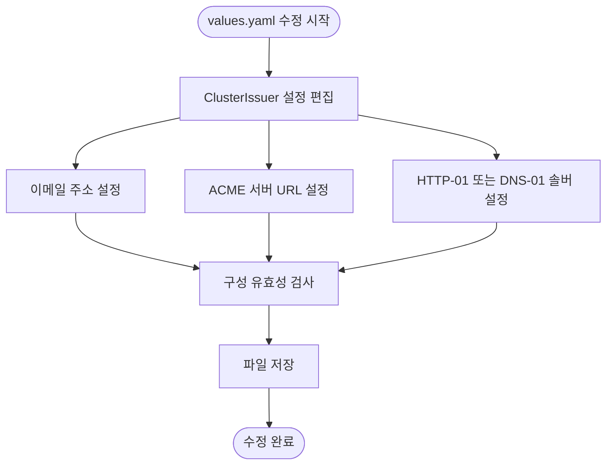
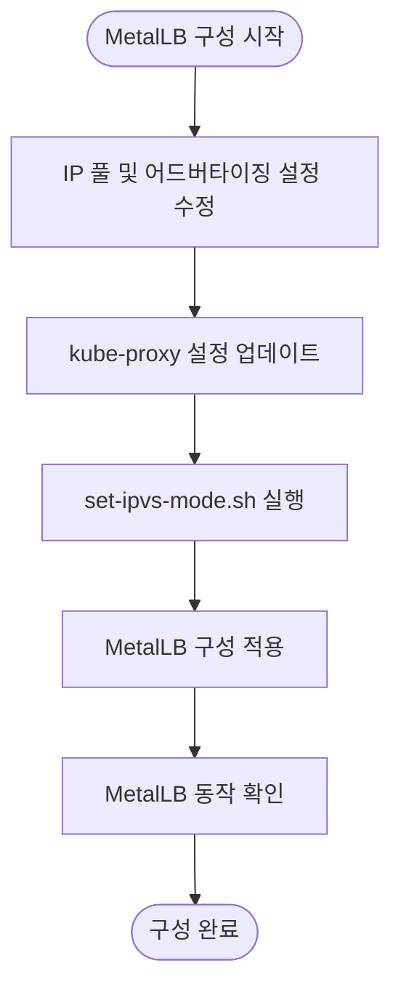
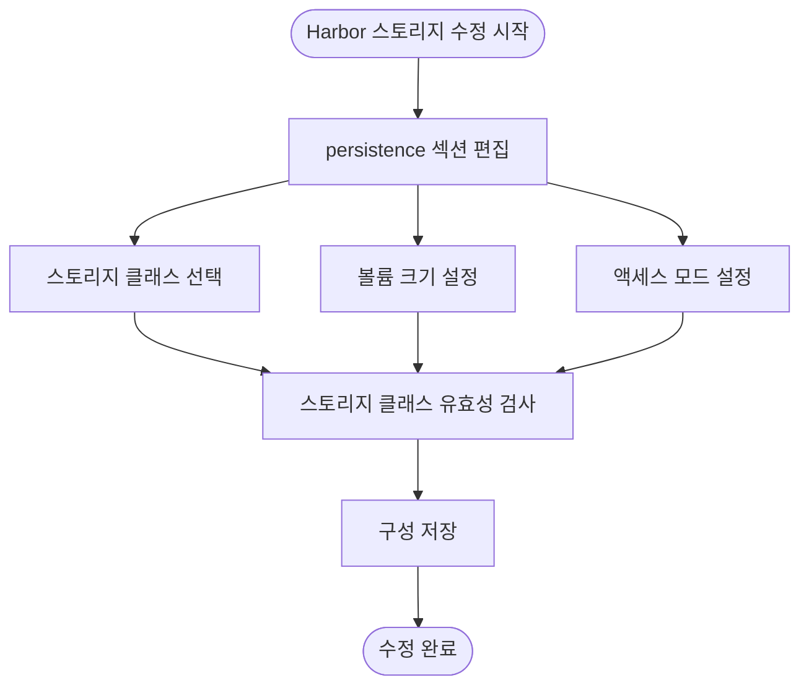
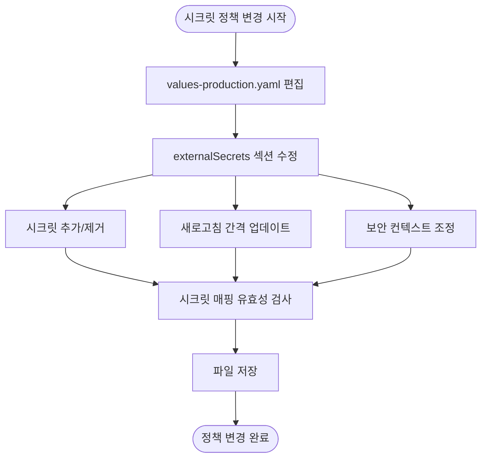
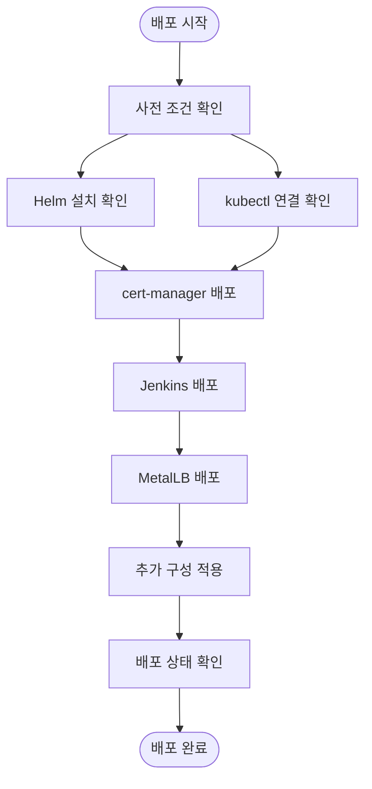

# 인프라 수정 절차

<cite>
**이 문서에서 참조한 파일**   
- [deploy-libraries.sh](file://scripts/deploy-libraries.sh)
- [values.yaml](file://helm/cluster-services/cert-manager/values.yaml)
- [values.yaml](file://helm/development-tools/harbor/values.yaml)
- [values.yaml](file://helm/development-tools/grafana/values.yaml)
- [values-production.yaml](file://helm/shared-configs/openbao-secrets-manager/values-production.yaml)
- [set-ipvs-mode.sh](file://helm/cluster-services/metallb/set-ipvs-mode.sh)
</cite>

## 목차
1. [소개](#소개)
2. [클러스터 서비스 수정](#클러스터-서비스-수정)
3. [개발 도구 수정](#개발-도구-수정)
4. [공유 구성 수정](#공유-구성-수정)
5. [배포 및 검증 절차](#배포-및-검증-절차)
6. [롤백 절차](#롤백-절차)

## 소개
이 문서는 Kubernetes 클러스터의 핵심 인프라 서비스 및 개발 도구를 수정하는 절차를 설명합니다. cert-manager, MetalLB, nfs-provisioner와 같은 클러스터 레벨의 인프라 서비스와 ArgoCD, Harbor, Grafana와 같은 개발 도구의 구성 변경 방법을 다룹니다. 각 Helm 차트의 values.yaml 파일을 통해 구성 옵션을 오버라이드하는 방법과, shared-configs/openbao-secrets-manager와 같은 공유 구성의 values-production.yaml을 수정하여 프로덕션 환경의 시크릿 관리 정책을 변경하는 절차를 포함합니다. 이러한 인프라 변경은 scripts/deploy-libraries.sh 스크립트를 통해 안전하게 재배포되어야 하며, 변경 전후의 상태 확인 방법과 롤백 절차를 안내합니다.

## 클러스터 서비스 수정

### cert-manager 구성 변경
cert-manager의 ClusterIssuer 설정을 변경하려면 `helm/cluster-services/cert-manager/values.yaml` 파일을 수정합니다. 이 파일은 프로덕션 및 스테이징 환경을 위한 Let's Encrypt ClusterIssuer를 구성합니다. 이메일 주소, ACME 서버 URL, 솔버 설정 등을 조정할 수 있습니다.

**Diagram sources**
- [values.yaml](file://helm/cluster-services/cert-manager/values.yaml#L10-L35)

**Section sources**
- [values.yaml](file://helm/cluster-services/cert-manager/values.yaml#L1-L35)

### MetalLB 구성 변경
MetalLB의 구성은 `helm/cluster-services/metallb/` 디렉터리 내의 YAML 파일들로 관리됩니다. IP 풀 설정, L2 어드버타이징, BGP 설정 등을 수정할 수 있습니다. 특히 `set-ipvs-mode.sh` 스크립트는 kube-proxy의 strictARP 설정을 활성화하여 MetalLB가 올바르게 작동하도록 합니다.

**Diagram sources**
- [set-ipvs-mode.sh](file://helm/cluster-services/metallb/set-ipvs-mode.sh#L1-L10)
- [pool-1.yaml](file://helm/cluster-services/metallb/pool-1.yaml)
- [l2advertisement.yaml](file://helm/cluster-services/metallb/l2advertisement.yaml)

**Section sources**
- [set-ipvs-mode.sh](file://helm/cluster-services/metallb/set-ipvs-mode.sh#L1-L10)

### nfs-provisioner 구성 변경
nfs-provisioner의 구성은 `helm/cluster-services/nfs-provisioner/values.yaml` 파일을 통해 관리됩니다. NFS 서버 주소, 경로, 마운트 옵션, 스토리지 클래스 이름 등을 설정할 수 있습니다. 이 설정을 통해 동적 프로비저닝된 PVC들이 지정된 NFS 서버에 저장되도록 할 수 있습니다.

**Section sources**
- [values.yaml](file://helm/cluster-services/nfs-provisioner/values.yaml#L1-L115)

## 개발 도구 수정

### Harbor 스토리지 클래스 조정
Harbor의 스토리지 클래스를 조정하려면 `helm/development-tools/harbor/values.yaml` 파일의 persistence 섹션을 수정합니다. registry, jobservice, database, trivy 등의 각 컴포넌트에 대해 다른 스토리지 클래스를 지정할 수 있습니다. 이 설정은 Harbor가 이미지와 차트를 저장하는 방식에 직접적인 영향을 미칩니다.

**Diagram sources**
- [values.yaml](file://helm/development-tools/harbor/values.yaml#L122-L174)

**Section sources**
- [values.yaml](file://helm/development-tools/harbor/values.yaml#L1-L800)

### Grafana 구성 변경
Grafana의 구성은 `helm/development-tools/grafana/values.yaml` 파일을 통해 관리됩니다. 관리자 비밀번호, 플러그인, 데이터 소스, 대시보드, 보안 컨텍스트 등을 설정할 수 있습니다. 특히 persistence 섹션을 통해 Grafana의 설정과 대시보드를 영구적으로 저장할 수 있는 스토리지 클래스를 지정할 수 있습니다.

**Section sources**
- [values.yaml](file://helm/development-tools/grafana/values.yaml#L1-L1671)

## 공유 구성 수정

### 프로덕션 시크릿 관리 정책 변경
프로덕션 환경의 시크릿 관리 정책을 변경하려면 `helm/shared-configs/openbao-secrets-manager/values-production.yaml` 파일을 수정합니다. 이 파일은 프로덕션 환경에서 사용되는 모든 시크릿의 매핑과 리소스 제한, 보안 컨텍스트, 노드 셀렉터 등을 정의합니다. externalSecrets 섹션을 통해 OpenBao에서 가져올 시크릿의 키와 속성을 지정할 수 있습니다.

**Diagram sources**
- [values-production.yaml](file://helm/shared-configs/openbao-secrets-manager/values-production.yaml#L17-L141)

**Section sources**
- [values-production.yaml](file://helm/shared-configs/openbao-secrets-manager/values-production.yaml#L1-L195)

## 배포 및 검증 절차
모든 구성 변경은 `scripts/deploy-libraries.sh` 스크립트를 통해 안전하게 재배포되어야 합니다. 이 스크립트는 Helm을 사용하여 cert-manager, Jenkins, MetalLB 등의 라이브러리 컴포넌트를 순차적으로 배포하며, 각 단계에서 상태를 확인합니다.

**Diagram sources**
- [deploy-libraries.sh](file://scripts/deploy-libraries.sh#L27-L128)

**Section sources**
- [deploy-libraries.sh](file://scripts/deploy-libraries.sh#L1-L128)

## 롤백 절차
구성 변경 후 문제가 발생할 경우, 이전의 안정적인 상태로 롤백해야 합니다. 이를 위해 변경 전의 values.yaml 파일 백업을 유지하고, `helm rollback` 명령을 사용하여 이전 릴리스로 되돌릴 수 있습니다. 또한, GitOps 워크플로우를 사용하는 경우 이전 커밋으로 되돌려 배포 상태를 복원할 수 있습니다.

**Section sources**
- [deploy-libraries.sh](file://scripts/deploy-libraries.sh#L119-L124)