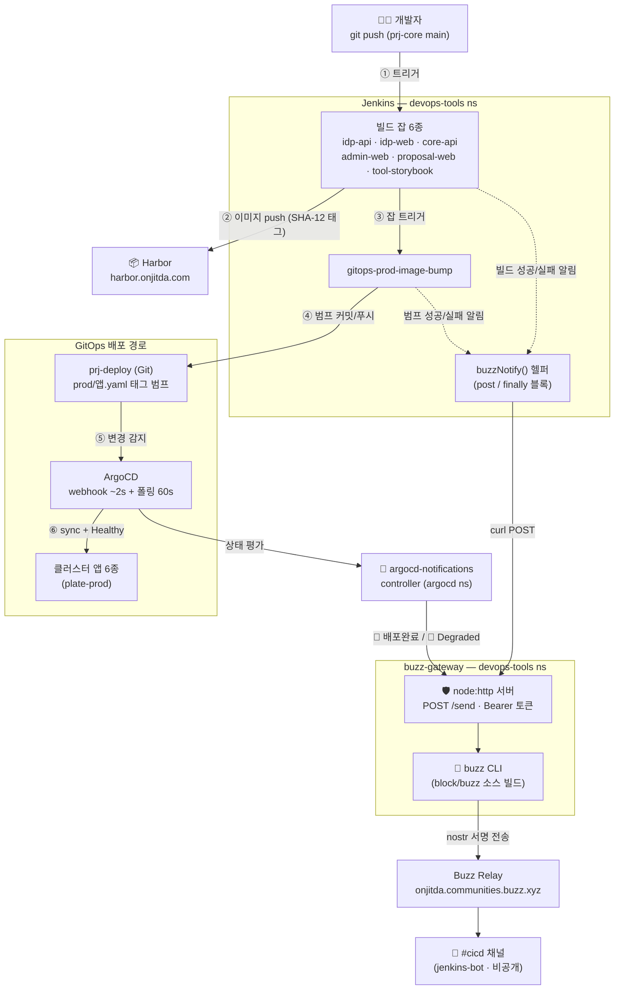
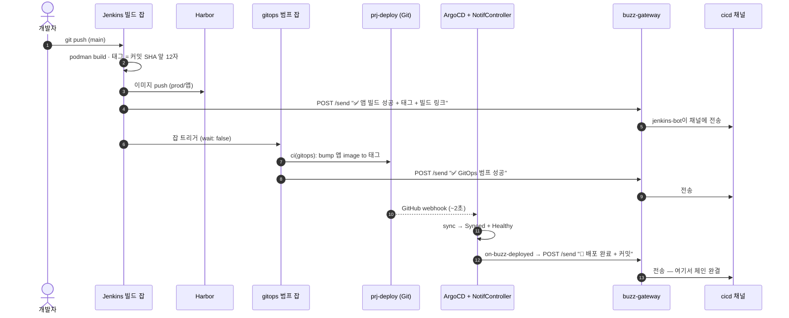
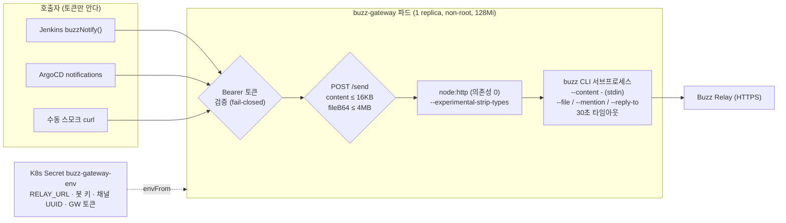
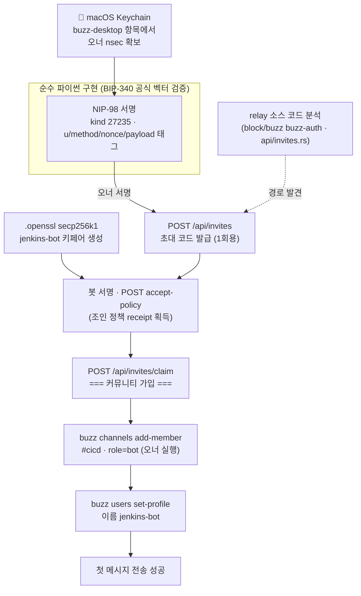
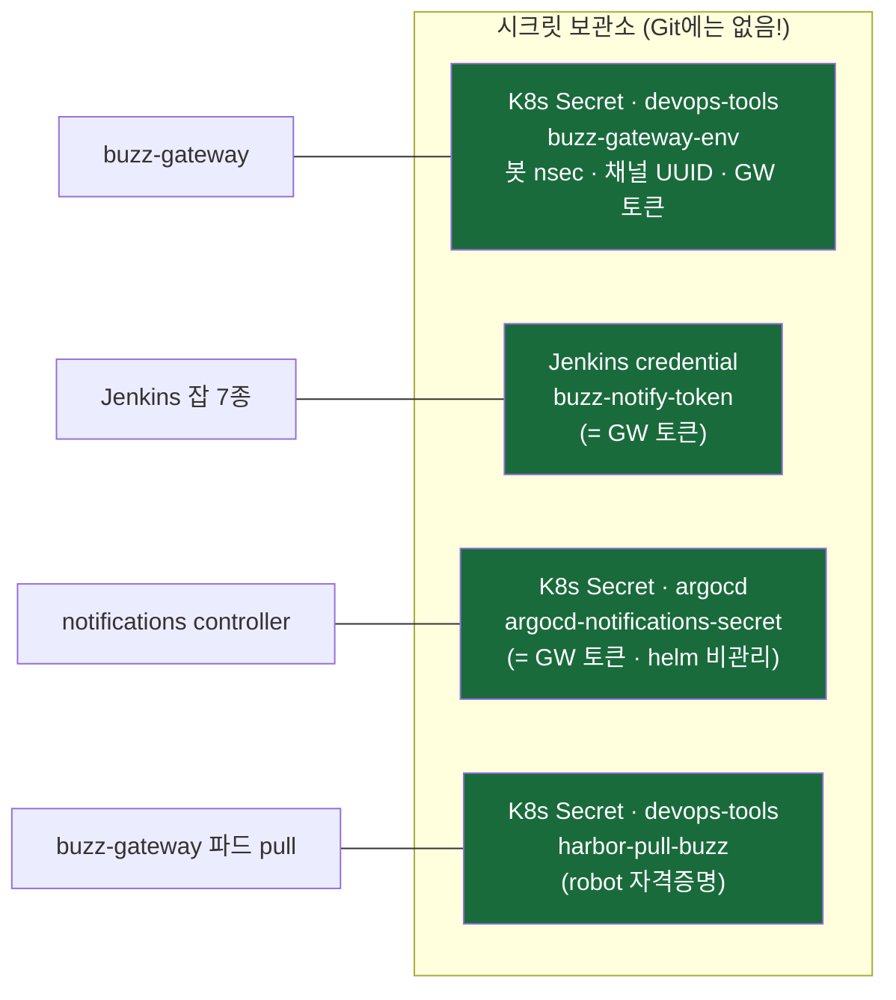
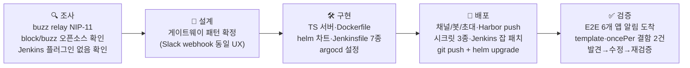
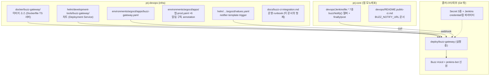

# Buzz CI/CD 알림 연동 — 비주얼 아키텍처 가이드

> 운영 절차·시크릿 로테이션·트러블슈팅은 [`docs/buzz-ci-integration.md`](buzz-ci-integration.md) 참조.
> 이 문서는 **무엇을 만들었고 어떻게 흐르는지**를 그림으로 보여준다. (구축: 2026-10-03)

---

## 1. 한눈에 보기 — 전체 아키텍처



**핵심 원칙 한 줄**: Jenkins와 ArgoCD는 **"사실"만 게이트웨이에 POST**하고,
nostr 서명 키는 **buzz-gateway 파드 한 곳에만** 존재한다. 게이트웨이가 죽어도
빌드/배포 자체에는 영향이 없다(알림만 유실, 모든 호출부는 `|| true` best-effort).

---

## 2. 이벤트 흐름 — 정상 배포 체인 (시퀀스)



### 빌드/배포 실패 경로

| 어디서 실패 | 알림 | 누가 보내나 |
|---|---|---|
| 이미지 빌드/Push | `❌ 앱 빌드 실패` + Jenkins 콘솔 링크 | 빌드 잡의 `finally` 블록 |
| 태그 범프(git push 충돌 등) | `❌ GitOps 범프 실패` | 범프 잡의 `post always` |
| 배포 후 헬스 불량 | `🔴 앱-prod 헬스 Degraded — 즉시 확인 필요` | ArgoCD `on-buzz-degraded` |

빌드 시작 알림은 의도적으로 넣지 않았다(노이즈 최소화).

---

## 3. buzz-gateway 내부 구조



- 이미지: `harbor.onjitda.com/devops/buzz-gateway:0.1.0` (188MB) —
  1단계 `rust:1-alpine`에서 [block/buzz](https://github.com/block/buzz) `desktop-v0.5.26`의
  `buzz-cli`를 musl 정적 빌드(rustls라 openssl 불필요), 2단계 `node:22-alpine`에 탑재.
  공식 릴리스에 Linux CLI 바이너리가 없어 **소스 빌드가 유일한 경로**였다.
- 종료 코드 매핑: buzz 2(relay/네트워크)→502, 3(auth)→500, 1(입력)→400, 타임아웃→504.

---

## 4. jenkins-bot 온보딩 — relay 멤버십을 뚫은 과정

relay는 **커뮤니티 멤버십 게이트**(채널 초대만으론 부족, 403 `relay_membership_required`)가
있었다. Desktop UI 없이 CLI/API로 다음 경로로 뚫었다:



최종 신원: 공개키 `540f6e07…724a` / npub `npub12s8ku…3y85` — 키 원본은 K8s Secret에만 존재.

---

## 5. 보안 구조 — 키와 토큰은 어디에 사나



- 호출자(Jenkins/ArgoCD)는 **Bearer 토큰 하나만** 알고, nostr 개인키와는 완전히 분리된다.
- `notifications.secret.create: false` — helm이 시크릿을 지우지 못하게 비관리로 전환.
- 게이트웨이는 ClusterIP (클러스터 내부 전용, 외부 노출 없음), 파드는 non-root + readOnly FS.

---

## 6. 구축 타임라인 — 무엇을 했나



### 검증 중 발견해 고친 결함 (실제 교훈)

| 결함 | 증상 | 수정 |
|---|---|---|
| multi-source 앱의 `sync.revision` 빈 값 | 메시지에 `커밋: <no value>` | 템플릿에서 `revisions[0]` 우선 |
| `oncePer` 빈 revision 중복제거 | **1회 알림 후 전 앱 봉쇄** | `oncePer: app.status.sync.revisions` |
| helm secret 소유권 | upgrade마다 토큰 삭제 위험 | `create: false` + 수동 관리 |
| Jenkins config POST 500 | 한글(UTF-8 0x8b) 파싱 실패 | `Content-Type: …; charset=utf-8` |

---

## 7. #cicd 채널 실제 모습 (2026-10-03 검증 스냅샷)

```text
💬 #cicd  (비공개 · jenkins-bot)
──────────────────────────────────────────────────────────────
🐝 jenkins-bot   jenkins-bot 온보딩 완료 🐝 — 이 채널로 빌드/범프/
                 배포 알림이 옵니다. (buzz-gateway 시스템 메시지)

✅ jenkins-bot   buzz-gateway 클러스터 배포 스모크 테스트 ✅
                 — Jenkins/ArgoCD 알림 경로 정상

🚀 jenkins-bot   idp-api-prod 배포 완료 — Synced/Healthy
                 커밋: 2942582e69109bbc4ea1548f24bbe0090c58eff7
                 ArgoCD: https://argocd.onjitda.com/applications/idp-api-prod

🚀 jenkins-bot   core-api-prod 배포 완료 — Synced/Healthy
                 커밋: b530693bab3dec898f67b46782348fcfb6c07256
                 동기화 소요: 1m57s
                 ArgoCD: https://argocd.onjitda.com/applications/core-api-prod

🔴 jenkins-bot   (예시) idp-api-prod 헬스 Degraded — 즉시 확인 필요
──────────────────────────────────────────────────────────────
```

> 채널이 비공개이므로 **사람/에이전트(ZCode 등)는 오너가 초대**해야 알림이 보인다.

---

## 8. 무엇이 어디에 — 형상 맵



### 알림 on/off 스위치

| 범위 | 방법 |
|---|---|
| 특정 앱 배포 알림만 끄기 | 해당 `앱-prod.yaml`의 subscribe annotation 2줄 제거 |
| 배포 알림 전체 끄기 | argocd values의 `service.webhook.buzz-gateway` 제거 |
| 빌드 알림만 끄기 | Jenkins 잡의 `BUZZ_NOTIFY_URL` 값을 비우기 |

---

*작성: 2026-10-03 · 전체 구축 세션 기준 · 이미지 태그 0.1.0 · block/buzz `desktop-v0.5.26`*
